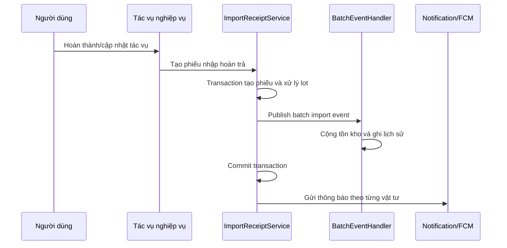
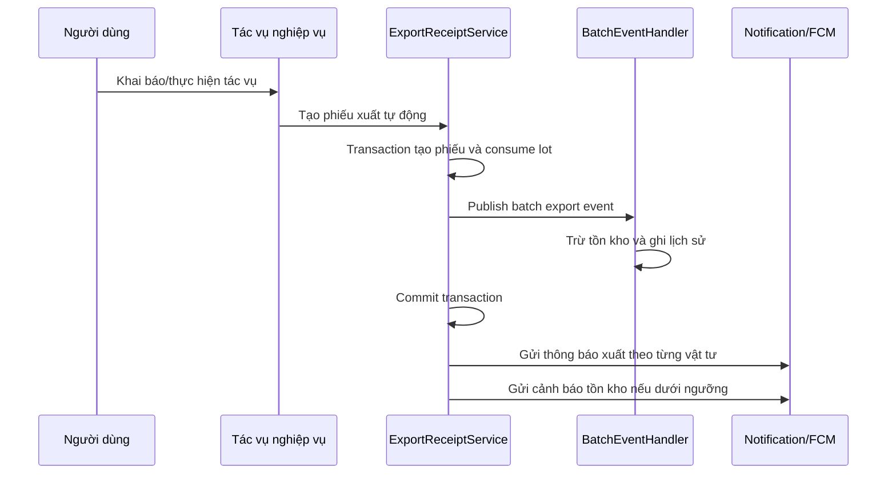
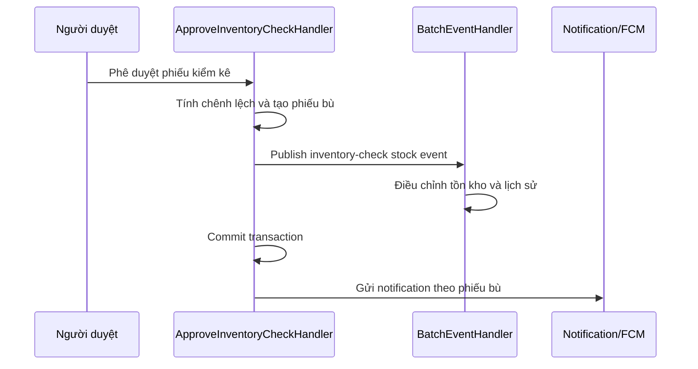

# Báo cáo workflow Notification cho Phiếu Nhập/Xuất Kho Tự Động

**Ngày cập nhật:** 27/05/2026<br>
**Phạm vi:** Backend API - Warehouse Receipt, Inventory Check, FCM Notification<br>
**Trạng thái:** <span style="color:#15803d"><strong>ĐÃ TRIỂN KHAI VÀ BUILD THÀNH CÔNG</strong></span>

> [!IMPORTANT]
> Hệ thống có **4 loại thông báo gắn với phiếu nhập/xuất do hệ thống tự tạo**. Điểm quyết định nội dung thông báo là **nguồn nghiệp vụ tạo phiếu (origin)**, không phải chỉ là phiếu `Import` hay `Export`.

---

## 1. Tổng quan nghiệp vụ

### 1.1. Bốn loại thông báo phiếu hệ thống tự tạo

| STT | Loại thông báo | Điều kiện phát sinh | Tiêu đề | Nội dung thông báo | Điều hướng |
| --- | --- | --- | --- | --- | --- |
| 1 | **Nhập kho từ kiểm kê** | Thực tế lớn hơn số lượng hệ thống | `Nhập kho` | `Hệ thống tự tạo phiếu nhập #{Mã NK} từ kết quả kiểm kê {Mã KK} \| {Người tạo KK}` | Chi tiết phiếu nhập |
| 2 | **Xuất kho từ kiểm kê** | Thực tế nhỏ hơn số lượng hệ thống | `Xuất kho` | `Hệ thống tự tạo phiếu xuất #{Mã XK} từ kết quả kiểm kê {Mã KK} \| {Người tạo KK}` | Chi tiết phiếu xuất |
| 3 | **Xuất kho tự động theo tác vụ** | Tác vụ khai báo lượng vật tư sử dụng, hệ thống tạo phiếu và trừ kho | `Xuất kho` | `Hệ thống ghi nhận xuất kho {SL} {ĐVT} {Vật tư} \| {Người thực hiện}` | Chi tiết phiếu xuất |
| 4 | **Nhập kho tự động hoàn trả phần dư** | Hoàn thành/cập nhật tác vụ, lượng thực dùng nhỏ hơn lượng đã lấy | `Nhập kho` | `Hệ thống ghi nhận nhập kho {SL} {ĐVT} {Vật tư} \| {Người thực hiện}` | Chi tiết phiếu nhập |

> [!NOTE]
> Thông báo **Tồn kho** không phải loại phiếu tự động thứ năm. Đây là cảnh báo bổ sung sau khi một thao tác xuất kho thành công làm số lượng tồn xuống dưới `AlertQty`.

### 1.2. Thông báo phiếu thủ công có liên quan

| Nghiệp vụ | Trigger | Nội dung | Điều hướng |
| --- | --- | --- | --- |
| Nhập kho thủ công | Phiếu chuyển sang `Pending` qua create-auto-submit, submit hoặc update-auto-submit | `{Nhân viên} tạo phiếu nhập #{Mã phiếu}. Vui lòng phê duyệt.` | Màn phê duyệt phiếu nhập |
| Xuất kho thủ công | Phiếu chuyển sang `Pending` qua create-auto-submit, submit hoặc update-auto-submit | `{Nhân viên} tạo phiếu xuất #{Mã phiếu}. Vui lòng phê duyệt.` | Màn phê duyệt phiếu xuất |

**Người nhận:** giữ chính sách resolver warehouse hiện hành gồm `MANAGER`, `EMPLOYEE_MANAGER`, `EMPLOYEE_WAREHOUSE`, `ADMIN` trong zone của kho.

---

## 2. Các vấn đề đã xử lý theo mức độ

### <span style="color:#b91c1c"><strong>P1 - BLOCKER: Event kho không biết origin của phiếu</strong></span>

> [!CAUTION]
> Một event `Import` hoặc `Export` không đủ để kết luận phiếu phát sinh từ tác vụ tự động, kết quả kiểm kê hay việc duyệt phiếu thủ công.

#### Vấn đề gặp phải là gì?

`CentralWarehouseEvent` và `CentralWarehouseBatchEvent` phục vụ biến động kho. Event có thể biết:

- Kho và vật tư bị thay đổi.
- Số lượng thay đổi.
- Loại biến động `Import`, `Export` hoặc `InventoryCheck`.
- `ReferenceId` và `ReceiptId`.

Nhưng event **không biết**:

- Phiếu được tạo từ tác vụ sử dụng vật tư hay từ kết quả kiểm kê.
- Phiếu là hệ thống tự tạo hay phiếu thủ công vừa được duyệt.
- Thông báo cần gửi theo từng vật tư hay theo từng phiếu.
- Với kiểm kê, mã phiếu kiểm kê và người tạo phiếu cần ghi trong message là ai.

#### Vì sao đây là lỗi nghiêm trọng?

| Event nhìn thấy | Origin thật | Hành vi đúng |
| --- | --- | --- |
| `Import` | Hoàn trả phần dư từ tác vụ | Gửi `Hệ thống ghi nhận nhập kho {SL}...` |
| `Import` | Duyệt phiếu nhập thủ công | **Không** gửi thông báo nhập tự động |
| `Export` | Xuất tự động từ tác vụ | Gửi `Hệ thống ghi nhận xuất kho {SL}...` |
| `Export` | Duyệt phiếu xuất thủ công | **Không** gửi thông báo xuất tự động; chỉ xét cảnh báo tồn kho |
| Phát sinh phiếu bù khi kiểm kê | Kiểm kê | Gửi `Hệ thống tự tạo phiếu... từ kết quả kiểm kê...` |

Nếu gửi notification generic tại event handler, hệ thống có thể hiển thị **sai bản chất nghiệp vụ** cho người dùng.

#### Giải quyết bằng cách nào?

Quyền tạo notification được chuyển về đúng workflow biết rõ origin:

| Workflow sở hữu nghiệp vụ | Thông báo chịu trách nhiệm |
| --- | --- |
| `ApproveInventoryCheckCommandHandler` | Nhập/xuất bù từ kiểm kê |
| `ImportReceiptService.CreateAutoImportReceiptAsync` | Nhập kho hoàn trả phần dư từ tác vụ |
| `ExportReceiptService.CreateAutoExportReceiptAsync` | Xuất kho tự động từ tác vụ và cảnh báo tồn kho liên quan |
| Handler submit/update phiếu thủ công | Yêu cầu phê duyệt phiếu nhập/xuất |

### <span style="color:#b91c1c"><strong>P1 - BLOCKER: Notification/FCM có thể phát trước khi transaction thành công</strong></span>

#### Vấn đề gặp phải là gì?

Tạo phiếu tự động không chỉ là thao tác insert phiếu. Luồng còn bao gồm:

1. Tạo phiếu và item.
2. Xử lý lot nhập/xuất.
3. Publish batch event để cộng/trừ tồn kho.
4. Cập nhật expected quantity liên quan kiểm kê.
5. Lưu và commit transaction.

Nếu event handler phát FCM ở bước 3, người dùng có thể nhận push trong khi các bước sau vẫn có thể lỗi.

#### Hậu quả có thể xảy ra

- Push điều hướng vào một phiếu đã rollback hoặc không còn tồn tại.
- Notification thông báo xuất/nhập nhưng tồn kho cuối cùng không được commit.
- FCM là side effect bên ngoài database, không thể rollback cùng transaction.

#### Giải quyết bằng cách nào?

- `ImportReceiptService` và `ExportReceiptService` thu thập context từng dòng phiếu trong transaction.
- Chỉ gọi notification sau khi `ExecuteInTransactionAsync(...)` trả về thành công.
- `ApproveInventoryCheckCommandHandler` gửi thông báo phiếu bù sau transaction phê duyệt.
- `ApproveExportReceiptCommandHandler` gửi cảnh báo tồn kho sau transaction duyệt xuất.

> [!WARNING]
> Cơ chế này ngăn thông báo được phát trước một transaction thất bại. Tuy nhiên, nếu lỗi xảy ra **sau commit** trong bước lưu notification hoặc gửi FCM, nghiệp vụ kho vẫn thành công nhưng thông báo có thể thiếu. Muốn bảo đảm delivery bền vững cần một task riêng về outbox/retry.

### <span style="color:#c2410c"><strong>P1 - HIGH: Phiếu tự động từ tác vụ được tạo nhưng không có thông báo</strong></span>

#### Vấn đề gặp phải là gì?

Các feature hiện có đã gọi `CreateAutoImportReceiptAsync` hoặc `CreateAutoExportReceiptAsync` để sinh phiếu thành công, nhưng hai service trước đó không sở hữu bước phát notification nghiệp vụ sau khi hoàn tất.

#### Giải quyết bằng cách nào?

- Thêm `SendAutoImportNotificationsAsync(...)` vào `ImportReceiptService`.
- Thêm `SendAutoExportNotificationsAsync(...)` vào `ExportReceiptService`.
- Gửi thông báo **theo từng dòng vật tư** của phiếu tự động.
- Link notification trỏ vào đúng chi tiết phiếu vừa được lưu.

### <span style="color:#c2410c"><strong>P1 - HIGH: Chuyển phiếu thủ công sang Pending nhưng không thông báo duyệt</strong></span>

#### Vấn đề gặp phải là gì?

Luồng create với `AutoSubmit=true` đã có thông báo, nhưng các đường thao tác tương đương khác bị thiếu:

- `SubmitImportReceipt` / `SubmitExportReceipt`.
- `UpdateImportReceipt(AutoSubmit=true)` / `UpdateExportReceipt(AutoSubmit=true)`.

#### Giải quyết bằng cách nào?

- Bổ sung `SendApprovalNotificationAsync(...)` vào bốn handler trên.
- Notification chỉ gửi sau khi phiếu đã lưu thành trạng thái `Pending`.
- Message và target URL đồng nhất với đường create-auto-submit hiện có.

> [!INFO]
> Việc bổ sung đường `Update(..., AutoSubmit=true)` là cần thiết vì đây cũng là hành vi người dùng **Hoàn tất và gửi duyệt**, không chỉ riêng endpoint submit.

### <span style="color:#c2410c"><strong>P1 - HIGH: Cảnh báo tồn kho có thể phát quá sớm</strong></span>

#### Vấn đề gặp phải là gì?

Cảnh báo tồn kho chỉ đúng khi số lượng cuối cùng sau xuất đã commit. Nếu gửi ở event handler trong quá trình xử lý kho, cảnh báo có thể không phản ánh kết quả thực.

#### Giải quyết bằng cách nào?

- Với xuất tự động: kiểm tra `AlertQty` và phát cảnh báo tại `ExportReceiptService` sau transaction.
- Với xuất thủ công: kiểm tra và phát cảnh báo tại `ApproveExportReceiptCommandHandler` sau khi phê duyệt xuất thành công.
- Chỉ kiểm tra vật tư bị tác động bởi lần xuất đó.

### <span style="color:#1d4ed8"><strong>P2 - MEDIUM: Template kiểm kê chưa đầy đủ theo đặc tả</strong></span>

#### Vấn đề gặp phải là gì?

Thông báo phiếu bù từ kiểm kê đã được gọi ở đúng thời điểm sau transaction, nhưng nội dung cũ thiếu ý nghĩa đầy đủ:

- Chưa dùng cụm `từ kết quả kiểm kê`.
- Chưa thể hiện tên người tạo phiếu kiểm kê ở cuối message.

#### Giải quyết bằng cách nào?

- Chuẩn hóa nội dung tại `ApproveInventoryCheckCommandHandler`.
- Lấy người tạo từ `CreatedBy` của phiếu kiểm kê.
- Giữ quy tắc kiểm kê: **một notification cho một phiếu bù**, không tách theo item.

### <span style="color:#6b7280"><strong>P2 - NGOÀI SCOPE: Nghiệp vụ tôm chưa tạo receipt tự động</strong></span>

> [!INFO]
> `Harvest` và `StockTransfer/Sang ao` chưa đi qua service tạo phiếu nhập/xuất tự động trong phạm vi code hiện tại. Task này không tự sinh thêm phiếu hoặc notification cho các nghiệp vụ đó.

---

## 3. Thông báo sau khi điều chỉnh: gọi khi nào và dùng trong trường hợp nào?

### 3.1. Nhập kho tự động hoàn trả phần dư

| Nội dung | Chi tiết |
| --- | --- |
| Workflow sở hữu | `ImportReceiptService.CreateAutoImportReceiptAsync` |
| Khi gọi notification | Sau khi transaction tạo phiếu nhập, cộng tồn kho và cập nhật dữ liệu liên quan thành công |
| Người nhận | Manager/Employee theo warehouse resolver |
| Số notification | Theo từng dòng vật tư/phần lot tạo thành phiếu |
| Link | `NotificationTargetUrls.ImportReceiptView(receiptId, zoneId)` |
| Message | `Hệ thống ghi nhận nhập kho {SL} {ĐVT} {Vật tư} \| {Người thực hiện}` |

**Sử dụng trong trường hợp:**

- Hoàn thành tác vụ nhưng lượng thực dùng nhỏ hơn lượng vật tư đã lấy.
- Chỉnh sửa tác vụ làm giảm lượng sử dụng, cần hoàn trả phần chênh lệch về kho.

**Ví dụ hiển thị:**

```text
Nhập kho
Hệ thống ghi nhận nhập kho 5 kg Thức ăn viên 3mm | Nguyễn Văn A
```

### 3.2. Xuất kho tự động theo số lượng khai báo

| Nội dung | Chi tiết |
| --- | --- |
| Workflow sở hữu | `ExportReceiptService.CreateAutoExportReceiptAsync` |
| Khi gọi notification | Sau khi transaction tạo phiếu xuất, trừ tồn kho và cập nhật dữ liệu liên quan thành công |
| Người nhận | Manager/Employee theo warehouse resolver |
| Số notification | Theo từng dòng vật tư |
| Link | `NotificationTargetUrls.ExportReceiptView(receiptId, zoneId)` |
| Message | `Hệ thống ghi nhận xuất kho {SL} {ĐVT} {Vật tư} \| {Người thực hiện}` |

**Sử dụng trong trường hợp:**

- Tác vụ khai báo lượng vật tư sử dụng và hệ thống tự trừ kho.
- Các nghiệp vụ hiện đã gọi auto export service như feeding, cycle, water treatment, water change, renovation, incident, siphon.

**Ví dụ hiển thị:**

```text
Xuất kho
Hệ thống ghi nhận xuất kho 8 kg Thức ăn viên 5mm | Nguyễn Văn A
```

### 3.3. Nhập kho tự động từ kết quả kiểm kê

| Nội dung | Chi tiết |
| --- | --- |
| Workflow sở hữu | `ApproveInventoryCheckCommandHandler` |
| Điều kiện | `ActualQty > ExpectedQty` |
| Khi gọi notification | Sau khi transaction phê duyệt kiểm kê và tạo phiếu nhập bù thành công |
| Số notification | Một notification cho phiếu nhập bù |
| Link | `NotificationTargetUrls.ImportReceiptView(receiptId, zoneId)` |
| Message | `Hệ thống tự tạo phiếu nhập #{Mã NK} từ kết quả kiểm kê {Mã KK} \| {Người tạo KK}` |

**Ví dụ hiển thị:**

```text
Nhập kho
Hệ thống tự tạo phiếu nhập #NK-2024-102 từ kết quả kiểm kê KK-2024-012 | Nguyễn Thị E
```

### 3.4. Xuất kho tự động từ kết quả kiểm kê

| Nội dung | Chi tiết |
| --- | --- |
| Workflow sở hữu | `ApproveInventoryCheckCommandHandler` |
| Điều kiện | `ActualQty < ExpectedQty` |
| Khi gọi notification | Sau khi transaction phê duyệt kiểm kê và tạo phiếu xuất bù thành công |
| Số notification | Một notification cho phiếu xuất bù |
| Link | `NotificationTargetUrls.ExportReceiptView(receiptId, zoneId)` |
| Message | `Hệ thống tự tạo phiếu xuất #{Mã XK} từ kết quả kiểm kê {Mã KK} \| {Người tạo KK}` |

**Ví dụ hiển thị:**

```text
Xuất kho
Hệ thống tự tạo phiếu xuất #XK-2024-055 từ kết quả kiểm kê KK-2024-012 | Nguyễn Thị E
```

### 3.5. Cảnh báo tồn kho thấp

| Nội dung | Chi tiết |
| --- | --- |
| Workflow sở hữu | `ExportReceiptService` cho xuất tự động; `ApproveExportReceiptCommandHandler` cho xuất thủ công |
| Điều kiện | Xuất kho thành công và tồn sau xuất nhỏ hơn `AlertQty` |
| Khi gọi notification | Sau transaction xuất/phê duyệt xuất thành công |
| Link | `NotificationTargetUrls.FarmMaterialsStock(zoneId)` |
| Message | `Vật tư {Tên vật tư} đang có số lượng tồn kho dưới mức cảnh báo.` |

### 3.6. Thông báo gửi duyệt phiếu thủ công

| Loại | Vị trí gọi | Khi gọi | Message | Link |
| --- | --- | --- | --- | --- |
| Nhập kho | Create có `AutoSubmit`, `SubmitImportReceipt`, `UpdateImportReceipt(AutoSubmit=true)` | Sau khi lưu phiếu thành `Pending` | `{Nhân viên} tạo phiếu nhập #{Mã phiếu}. Vui lòng phê duyệt.` | Approve import |
| Xuất kho | Create có `AutoSubmit`, `SubmitExportReceipt`, `UpdateExportReceipt(AutoSubmit=true)` | Sau khi lưu phiếu thành `Pending` | `{Nhân viên} tạo phiếu xuất #{Mã phiếu}. Vui lòng phê duyệt.` | Approve export |

---

## 4. Vì sao không dùng `CentralWarehouseEventHandler` và `CentralWarehouseBatchEvent` để gửi thông báo nữa?

### 4.1. Trả lời ngắn gọn

> [!IMPORTANT]
> `CentralWarehouseEventHandler` và `CentralWarehouseBatchEvent` là cơ chế **cập nhật tồn kho/lịch sử kho**. Chúng không phải nơi quyết định **ngữ cảnh nghiệp vụ** và **thời điểm an toàn** để gửi notification.

### 4.2. `CentralWarehouseBatchEvent` thiếu thông tin để chọn đúng message

Event batch biết vật tư và biến động, nhưng không thể phân biệt đầy đủ:

| Trường hợp | Cùng thông tin event có thể thấy | Message cần gửi |
| --- | --- | --- |
| Hoàn trả phần dư từ tác vụ | `Import` | `Hệ thống ghi nhận nhập kho {SL}...` |
| Duyệt phiếu nhập thủ công | `Import` | Không gửi message nhập tự động |
| Xuất theo tác vụ | `Export` | `Hệ thống ghi nhận xuất kho {SL}...` |
| Duyệt phiếu xuất thủ công | `Export` | Không gửi message xuất tự động; chỉ xét tồn kho |
| Phiếu bù từ kiểm kê | `InventoryCheck` và receipt được tạo trong workflow kiểm kê | Message theo mã phiếu kiểm kê/người tạo |

`ReceiptId` chỉ giúp điều hướng tới phiếu; nó **không xác định** được message nghiệp vụ đúng.

### 4.3. Event handler chạy trong quá trình transaction

Các workflow tạo hoặc duyệt phiếu publish batch event trước khi toàn bộ nghiệp vụ kết thúc:

- Auto import/export publish event để cập nhật kho trong transaction.
- Duyệt phiếu thủ công publish event để cập nhật kho trong transaction.
- Duyệt kiểm kê publish event trước khi tạo/commit các phiếu bù.

Nếu FCM được gửi ở event handler, push có thể xuất hiện trước khi workflow cha commit thành công.

### 4.4. Ranh giới trách nhiệm sau điều chỉnh

| Thành phần | Trách nhiệm |
| --- | --- |
| `CentralWarehouseEventHandler` | Cập nhật kho/lịch sử nếu event đơn được publish; không gửi notification nghiệp vụ |
| `CentralWarehouseBatchEventHandler` | Cập nhật kho/lịch sử theo batch; không gửi notification nghiệp vụ |
| Workflow tạo phiếu tự động | Gửi notification sau commit dựa trên đúng origin |
| Workflow kiểm kê | Gửi notification phiếu bù sau commit kiểm kê |
| Workflow submit manual | Gửi yêu cầu phê duyệt sau khi lưu `Pending` |

> [!WARNING]
> Không nên thêm lại notification generic vào event handler chỉ vì handler có `ReceiptId`. Làm vậy sẽ tái tạo lỗi sai message và rủi ro gửi trước commit.

---

## 5. Sơ đồ luồng sau khi sửa

### 5.1. Nhập kho tự động hoàn trả phần dư



### 5.2. Xuất kho tự động theo tác vụ



### 5.3. Nhập/xuất bù từ kiểm kê



---

## 6. Các file và thay đổi đã thực hiện

| File | Thay đổi chính | Lý do |
| --- | --- | --- |
| `Core/Ecom.Application/Features/CentralWarehouse/Events/CentralWarehouse/CentralWarehouseEventHandler.cs` | Loại bỏ notification generic và low-stock tại event handler | Không biết origin và có rủi ro phát trước commit |
| `Core/Ecom.Application/Features/CentralWarehouse/Events/CentralWarehouseBatch/CentralWarehouseBatchEventHandler.cs` | Giữ handler thuần cập nhật kho/lịch sử | Không suy luận notification từ `ReferenceType` |
| `Infrastructure/Ecom.Infrastructure/Services/ImportReceiptService.cs` | Gửi auto import notification sau transaction | Sở hữu origin hoàn trả phần dư |
| `Infrastructure/Ecom.Infrastructure/Services/ExportReceiptService.cs` | Gửi auto export và low-stock sau transaction | Sở hữu origin xuất tự động |
| `Core/Ecom.Application/Features/InventoryCheck/Commands/ApproveInventoryCheck/ApproveInventoryCheckCommandHandler.cs` | Chuẩn hóa message phiếu bù từ kiểm kê | Sở hữu origin kiểm kê |
| `Core/Ecom.Application/Features/ImportReceipt/Command/SubmitImportReceipt/SubmitImportReceiptCommandHandler.cs` | Gửi thông báo duyệt khi submit | Bổ sung trigger manual bị thiếu |
| `Core/Ecom.Application/Features/ImportReceipt/Command/UpdateImportReceipt/UpdateImportReceiptCommandHandler.cs` | Gửi thông báo duyệt khi update kèm auto submit | Bao phủ cùng hành vi chuyển `Pending` |
| `Core/Ecom.Application/Features/ExportReceipt/Commands/SubmitExportReceipt/SubmitExportReceiptCommandHandler.cs` | Gửi thông báo duyệt khi submit | Bổ sung trigger manual bị thiếu |
| `Core/Ecom.Application/Features/ExportReceipt/Commands/UpdateExportReceipt/UpdateExportReceiptCommandHandler.cs` | Gửi thông báo duyệt khi update kèm auto submit | Bao phủ cùng hành vi chuyển `Pending` |
| `Core/Ecom.Application/Features/ExportReceipt/Commands/ApproveExportReceipt/ApproveExportReceiptCommandHandler.cs` | Gửi low-stock sau phê duyệt xuất thành công | Cảnh báo dựa trên tồn kho đã commit |

---

## 7. Kịch bản kiểm tra thông báo

### 7.1. Ma trận kiểm thử

| ID | Kịch bản | Ưu tiên | Kết quả cần kiểm tra chính |
| --- | --- | --- | --- |
| TC-AI-01 | Auto import hoàn trả phần dư một vật tư | P1 | Message nhập tự động và link view |
| TC-AI-02 | Auto import tách thành nhiều phiếu theo lot | P1 | Notification theo từng phiếu/dòng |
| TC-AE-01 | Auto export một vật tư | P1 | Message xuất tự động và link view |
| TC-AE-02 | Auto export nhiều vật tư | P1 | Notification theo từng vật tư |
| TC-IC-01 | Kiểm kê dư tạo phiếu nhập bù | P1 | Message theo phiếu kiểm kê |
| TC-IC-02 | Kiểm kê thiếu tạo phiếu xuất bù | P1 | Message theo phiếu kiểm kê |
| TC-MI-01 | Submit phiếu nhập thủ công | P1 | Message duyệt và link approve |
| TC-ME-01 | Submit phiếu xuất thủ công | P1 | Message duyệt và link approve |
| TC-MU-01 | Update phiếu với `AutoSubmit=true` | P1 | Có notification duyệt đúng một lần |
| TC-LS-01 | Auto export làm tồn dưới ngưỡng | P1 | Thêm notification `Tồn kho` |
| TC-LS-02 | Duyệt xuất thủ công làm tồn dưới ngưỡng | P1 | Chỉ warning tồn kho sau duyệt |
| TC-RB-01 | Transaction auto receipt thất bại | P1 | Không có notification/FCM |
| TC-ND-01 | Click điều hướng notification | P1 | Mở đúng phiếu/mode |
| TC-ER-01 | FCM lỗi sau commit | P2 | Phiếu vẫn thành công, log an toàn |

### 7.2. TC-AI-01 - Nhập kho tự động hoàn trả phần dư

**Tiền điều kiện**

- Một tác vụ đã lấy vật tư từ kho.
- Có lot hợp lệ để hệ thống hoàn trả.

**Thao tác**

1. Hoàn thành hoặc chỉnh sửa tác vụ để lượng thực dùng nhỏ hơn lượng đã lấy.
2. Kiểm tra phiếu nhập tự động được tạo.

**Kết quả mong đợi**

- Tồn kho tăng đúng phần dư.
- Có notification:

```text
Nhập kho
Hệ thống ghi nhận nhập kho {SL} {ĐVT} {Tên vật tư} | {Người thực hiện}
```

- Click notification mở đúng phiếu nhập tự động.
- Không xuất hiện message dạng `từ kết quả kiểm kê`.

### 7.3. TC-AI-02 - Auto import được tách theo nhiều lot

**Thao tác**

1. Tạo tình huống lượng hoàn trả phải refill vào nhiều lot.
2. Hoàn thành tác vụ.

**Kết quả mong đợi**

- Hệ thống tạo các phiếu nhập theo cơ chế tách lot hiện có.
- Mỗi dòng/phần phiếu được tạo có notification riêng.
- Mỗi link mở đúng phiếu chứa số lượng tương ứng.

> [!NOTE]
> Đây là hành vi đã chọn: auto import tác vụ gửi theo từng dòng vật tư/phần lot, không gộp thành một notification tổng.

### 7.4. TC-AE-01 - Xuất kho tự động một vật tư

**Thao tác**

1. Tạo tác vụ sử dụng một vật tư, ví dụ cho ăn.
2. Thực hiện thao tác làm hệ thống tạo phiếu xuất tự động.

**Kết quả mong đợi**

- Tồn kho giảm đúng số lượng khai báo.
- Có notification:

```text
Xuất kho
Hệ thống ghi nhận xuất kho {SL} {ĐVT} {Tên vật tư} | {Người thực hiện}
```

- Link mở chi tiết phiếu xuất.

### 7.5. TC-AE-02 - Xuất kho tự động nhiều vật tư

**Thao tác**

1. Tạo tác vụ gồm từ hai vật tư trở lên.
2. Thực hiện tác vụ để tạo phiếu xuất.

**Kết quả mong đợi**

- Phiếu xuất chứa các dòng vật tư đúng dữ liệu.
- Có một notification cho từng dòng vật tư.
- Các notification cùng trỏ về chi tiết phiếu xuất liên quan.

### 7.6. TC-IC-01 - Kiểm kê dư, tạo phiếu nhập bù

**Thao tác**

1. Tạo phiếu kiểm kê với `ActualQty > ExpectedQty`.
2. Gửi duyệt và phê duyệt phiếu kiểm kê.

**Kết quả mong đợi**

- Hệ thống tạo phiếu nhập bù.
- Có đúng một notification theo phiếu:

```text
Nhập kho
Hệ thống tự tạo phiếu nhập #{Mã NK} từ kết quả kiểm kê {Mã KK} | {Người tạo KK}
```

- Không gửi message `Hệ thống ghi nhận nhập kho {SL}...`.

### 7.7. TC-IC-02 - Kiểm kê thiếu, tạo phiếu xuất bù

**Thao tác**

1. Tạo phiếu kiểm kê với `ActualQty < ExpectedQty`.
2. Phê duyệt phiếu kiểm kê.

**Kết quả mong đợi**

- Hệ thống tạo phiếu xuất bù.
- Có đúng một notification theo phiếu:

```text
Xuất kho
Hệ thống tự tạo phiếu xuất #{Mã XK} từ kết quả kiểm kê {Mã KK} | {Người tạo KK}
```

- Không gửi message xuất tự động theo vật tư.

### 7.8. TC-MI-01 - Submit phiếu nhập thủ công

**Thao tác**

1. Tạo phiếu nhập `Draft` có item.
2. Thực hiện `SubmitImportReceipt`.

**Kết quả mong đợi**

- Phiếu chuyển sang `Pending`.
- Có notification:

```text
Nhập kho
{Tên nhân viên} tạo phiếu nhập #{Mã phiếu}. Vui lòng phê duyệt.
```

- Link mở màn approve phiếu nhập.
- Tồn kho chưa thay đổi trước khi phiếu được duyệt.

### 7.9. TC-ME-01 - Submit phiếu xuất thủ công

**Thao tác**

1. Tạo phiếu xuất `Draft` có vật tư đủ tồn.
2. Thực hiện `SubmitExportReceipt`.

**Kết quả mong đợi**

- Phiếu chuyển sang `Pending`.
- Có notification yêu cầu phê duyệt phiếu xuất.
- Link mở màn approve phiếu xuất.
- Không gửi message `Hệ thống ghi nhận xuất kho...` tại bước submit.

### 7.10. TC-MU-01 - Update kèm `AutoSubmit=true`

**Thao tác**

1. Sửa một phiếu nhập hoặc xuất đang `Draft`/`Rejected`.
2. Gửi request update với `AutoSubmit=true`.

**Kết quả mong đợi**

- Phiếu chuyển sang `Pending`.
- Notification yêu cầu duyệt được gửi một lần.
- Message và target URL giống luồng submit riêng.

### 7.11. TC-LS-01 - Tồn kho thấp sau xuất tự động

**Tiền điều kiện**

- `WarehouseItem.AlertQty > 0`.
- Số lượng sau xuất tự động nhỏ hơn `AlertQty`.

**Thao tác**

1. Thực hiện tác vụ tạo phiếu xuất tự động.

**Kết quả mong đợi**

- Có notification xuất kho theo vật tư.
- Có thêm notification:

```text
Tồn kho
Vật tư {Tên vật tư} đang có số lượng tồn kho dưới mức cảnh báo.
```

- Cảnh báo chỉ được tạo sau khi xuất kho thành công.

### 7.12. TC-LS-02 - Tồn kho thấp sau duyệt xuất thủ công

**Thao tác**

1. Tạo và submit phiếu xuất thủ công.
2. Duyệt phiếu trong điều kiện tồn sau xuất thấp hơn ngưỡng.

**Kết quả mong đợi**

- Khi submit: chỉ có notification yêu cầu phê duyệt.
- Khi duyệt thành công: kho bị trừ và có notification `Tồn kho`.
- Không có notification `Hệ thống ghi nhận xuất kho...` vì đây là phiếu thủ công.

### 7.13. TC-RB-01 - Transaction auto receipt thất bại

**Mục đích:** xác nhận notification không phát trước commit.

**Thao tác gợi ý**

1. Tạo input khiến auto receipt thất bại trong transaction, ví dụ lot/số lượng không đủ xử lý.
2. Theo dõi database notification và log FCM.

**Kết quả mong đợi**

- Không có phiếu tự động commit.
- Không có notification nhập/xuất tự động.
- Không có FCM push cho nghiệp vụ thất bại.

### 7.14. TC-ND-01 - Điều hướng từ notification

| Thông báo | Kết quả khi click |
| --- | --- |
| Auto import / nhập từ kiểm kê | Mở view chi tiết phiếu nhập đúng `ReceiptId` |
| Auto export / xuất từ kiểm kê | Mở view chi tiết phiếu xuất đúng `ReceiptId` |
| Submit nhập thủ công | Mở approve phiếu nhập đúng `ReceiptId` |
| Submit xuất thủ công | Mở approve phiếu xuất đúng `ReceiptId` |
| Tồn kho | Mở danh sách tồn kho vật tư đúng zone |

### 7.15. TC-ER-01 - FCM lỗi sau commit

**Thao tác**

1. Mô phỏng token/FCM không gửi được sau khi phiếu đã tạo thành công.

**Kết quả mong đợi**

- Phiếu và biến động tồn kho vẫn thành công.
- Có log báo lỗi notification dispatch.
- Không log raw FCM token, refresh token hay credential.

---

## 8. Kiểm tra dữ liệu và log khi test

### 8.1. Kiểm tra notification lưu trong hệ thống/UI

- `Title` đúng loại: `Nhập kho`, `Xuất kho`, `Tồn kho`.
- `Message` đúng origin.
- `TargetUrl` đúng mode:
  - Phiếu tự động hoặc phiếu bù kiểm kê: `mode=view`.
  - Phiếu thủ công gửi duyệt: `mode=approve`.
- Số lượng notification đúng quy tắc:
  - Kiểm kê: theo phiếu.
  - Tác vụ tự động: theo từng dòng vật tư.

### 8.2. Kiểm tra log an toàn

```text
NOTIFICATION_BULK_PUBLISH
FCM_NO_ACTIVE_TOKEN
FCM_TOKEN_RESOLVED
FCM_SEND_RESULT
FCM_BATCH_EXCEPTION
FCM_TOKEN_STATE_UPDATED
```

> [!WARNING]
> Không đưa raw token, credential, connection string hoặc payload nhạy cảm vào báo cáo bug hay ảnh chụp log.

---

## 9. Verification kỹ thuật đã thực hiện

| Lệnh | Kết quả |
| --- | --- |
| `dotnet build Core\Ecom.Application\Ecom.Application.csproj --no-restore` | <span style="color:#15803d"><strong>PASS</strong></span> - chỉ còn warning có sẵn ngoài patch |
| `dotnet build Infrastructure\Ecom.Infrastructure\Ecom.Infrastructure.csproj --no-restore` | <span style="color:#15803d"><strong>PASS</strong></span> - chỉ còn warning có sẵn ngoài patch |
| `git diff --check` | <span style="color:#15803d"><strong>PASS</strong></span> |
| `powershell -NoProfile -ExecutionPolicy Bypass -File ".\.agents\scripts\verify-skill-docs.ps1"` | <span style="color:#15803d"><strong>PASS</strong></span> |

---

## 10. Rủi ro còn lại và hướng phát triển

| Mức độ | Nội dung | Hướng xử lý tiếp theo |
| --- | --- | --- |
| P2 | Notification gửi sau commit nhưng chưa có outbox/retry | Thiết kế outbox event và background retry |
| P2 | `Harvest` chưa tạo auto receipt | Task nghiệp vụ riêng để xác định phiếu/notification |
| P2 | `StockTransfer/Sang ao` chưa tạo auto receipt | Task nghiệp vụ riêng để xác định phiếu/notification |
| P2 | Hiển thị thời gian `Hôm nay/Hôm qua/dd/mm/yyyy` | Thực hiện phía frontend khi render `CreatedAt` |

> [!TIP]
> Nguyên tắc mở rộng về sau: mỗi workflow mới tạo phiếu tự động phải tự xác định origin, commit thành công, sau đó mới phát notification. Không đưa business notification trở lại central warehouse event handler.

