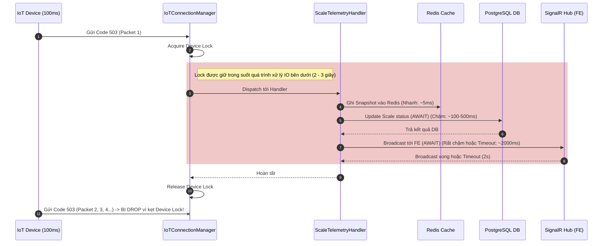
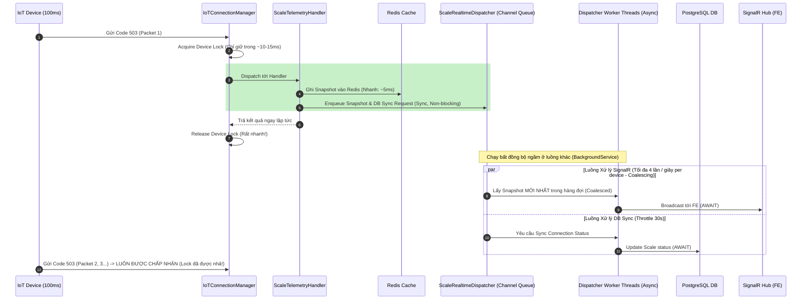

# Phân tích Luồng Dữ liệu Cân (Scale Realtime Flow)

Tài liệu này giải thích chi tiết luồng xử lý dữ liệu cân thời gian thực (Code 503), phân tích nguyên nhân nghẽn 3 giây trước đây và cách hệ thống tự động xử lý sau khi tối ưu.

---

## 1. Trước khi tối ưu: Mô hình Synchronous & Blocking (Bị nghẽn 2-3s)

Ở mô hình cũ, toàn bộ các tác vụ xử lý IO nặng (Database, SignalR) đều bị gộp chung vào luồng chính của Handler và chạy tuần tự bên trong khóa thiết bị (`Device Lock`).

### Sơ đồ luồng cũ

### Phân tích điểm nghẽn
1. **Device Lock bị giam**: Lock bị giữ từ lúc nhận packet cho đến khi SignalR broadcast xong. Với tần suất gửi của thiết bị là 100ms, hầu hết các packet đến sau đều rơi vào trạng thái lock bận và bị drop.
2. **SignalR Blocking & Timeout**: SignalR thực hiện broadcast qua các group và có thể bị block bởi Redis Backplane hoặc mạng của client chậm. Khi timeout 2s xảy ra, luồng mới được nhả nhưng task cũ chạy ngầm vẫn có thể về đích muộn hơn, làm số cân trên UI bị giật ngược.
3. **DB Coupling**: Ghi nhận trạng thái kết nối lên DB (PostgreSQL) nằm trên Hot Path truyền dữ liệu cân. Chỉ cần DB bị khóa bảng hoặc chậm, luồng cân thời gian thực sẽ đứng im.

---

## 2. Sau khi tối ưu: Mô hình Asynchronous & Decoupled (Hết nghẽn, p95 ≤ 500ms)

Hệ thống đưa vào `ScaleRealtimeDispatcher` làm trung gian, tách biệt hoàn toàn luồng ghi Redis (Hot Path) khỏi các luồng IO chậm (SignalR, DB). Luồng chính nhả Lock chỉ trong vài mili-giây.

### Sơ đồ luồng mới

### Các điểm khắc phục then chốt
1. **Nhả Lock thần tốc**: Thời gian giữ Device Lock giảm từ **2.000ms - 3.000ms** xuống còn **10ms - 15ms**. Luồng nhận không còn bị nghẽn, loại bỏ hoàn toàn việc rớt gói tin hàng loạt.
2. **Cơ chế Gộp gói (Coalescing)**: Bằng cách lưu snapshot mới nhất vào Dictionary trong `ScaleRealtimeDispatcher` trước khi đẩy đi, các packet 100ms gửi dồn dập sẽ tự động đè lên nhau. Worker chỉ lấy gói mới nhất để broadcast với cadence 250ms. FE không bị quá tải.
3. **Cách ly lỗi DB & SignalR**: Database và SignalR chạy trên các hàng đợi `Channel` riêng biệt. Nếu Database bị đơ hoặc SignalR bị timeout, lock thiết bị vẫn được nhả đúng hạn, dữ liệu Redis vẫn được cập nhật liên tục và các thiết bị cân khác không bị ảnh hưởng chéo (Nhờ cấu hình 8 Workers chạy song song).
