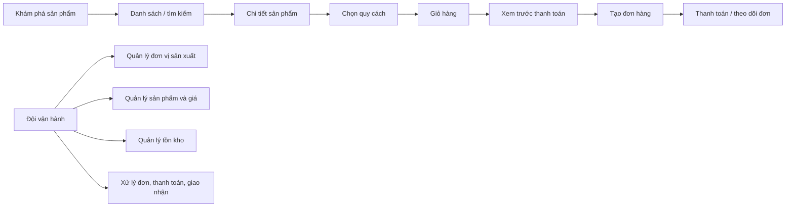

# Thanh Hoa Commerce — Brief sản phẩm, trải nghiệm và nhận diện thương hiệu

> **Đối tượng sử dụng:** Frontend Engineer, Product Designer, UX Writer và AI Agent hỗ trợ Frontend.
>
> **Mục tiêu:** Giúp toàn đội hiểu cùng một sản phẩm, thiết kế giao diện nhất quán và triển khai đúng dữ liệu/nghiệp vụ đã có.
> **Nguồn đối chiếu:** phạm vi dự án, UI/UX contract, API Catalog và controller/feature Commerce trong repository, rà soát ngày 06/09/2026. Đây là brief định hướng giao diện; không thay thế API contract hoặc bằng chứng chạy production.

---

## 1. Tóm tắt một câu

**Thanh Hoa Commerce là nền tảng thương mại điện tử đáng tin cậy để khám phá, hiểu và mua sản phẩm địa phương Thanh Hóa — với thông tin rõ ràng, trải nghiệm mua hàng đơn giản và dữ liệu vận hành có kiểm soát.**

Sản phẩm không chỉ là một trang bán hàng. Đây là “cửa hàng số có chọn lọc” kết nối người mua với sản phẩm, đơn vị sản xuất và đội ngũ vận hành địa phương. Mỗi màn hình phải tạo cảm giác: **gần gũi địa phương, minh bạch, gọn gàng và chuyên nghiệp**.

## 2. Những điều cần hiểu trước khi thiết kế

### 2.1. Mô hình sản phẩm hiện tại

- Đây là **storefront được quản trị tập trung**, không phải chợ nhiều gian hàng tự vận hành.
- Khách hàng có thể duyệt sản phẩm, chọn quy cách, thêm giỏ, xem trước thanh toán, tạo đơn và theo dõi đơn.
- Đội vận hành quản lý đơn vị sản xuất, sản phẩm, giá, hình ảnh, tồn kho, đơn hàng, thanh toán và giao nhận.
- Sản phẩm chỉ nên xuất hiện công khai khi đã thỏa điều kiện nghiệp vụ. Giá, tồn kho, tổng tiền và trạng thái thanh toán luôn do máy chủ quyết định.

### 2.2. Sự thật nghiệp vụ cần phản ánh đúng trong UI

| Khái niệm trong hệ thống | Cách hiểu cho UI | Không được làm |
| --- | --- | --- |
| Sản phẩm và quy cách | Một sản phẩm có thể có nhiều quy cách mua; khách chọn quy cách trước khi thêm giỏ. | Không dùng tên sản phẩm thay cho quy cách mua thực tế. |
| Giá bán | Giá hiển thị là giá do hệ thống trả về; trang danh sách có thể là “Từ … đồng”. | Không tự tính lại giá/tổng tiền bằng số thực JavaScript. |
| Tình trạng hàng | Chỉ dùng `Còn hàng`, `Tạm hết hàng`, `Chưa khả dụng`. | Không hiển thị số lượng tồn kho nội bộ cho khách. |
| Đơn hàng | Đơn lưu ảnh chụp thông tin tại thời điểm đặt hàng. | Không thay tên, giá hoặc ảnh trong đơn cũ theo catalog mới. |
| Thanh toán trực tuyến | Chuyển hướng, mã QR hoặc trang thanh toán chỉ là bước thanh toán. | Không tự ghi “Đã thanh toán” chỉ vì khách quay lại từ cổng thanh toán. |
| Đơn vị sản xuất | Là thông tin tạo niềm tin cho sản phẩm. | Không gọi là “người bán”, “gian hàng” hoặc tạo trang seller portal khi chưa có scope. |

### 2.3. Ranh giới chức năng

**Có cơ sở mã nguồn để thiết kế ngay**

- Danh mục và chi tiết sản phẩm; tìm kiếm, gợi ý, lọc, sắp xếp, phân trang.
- Sản phẩm, nhóm hàng, đơn vị sản xuất, hình ảnh, quy cách, giá và tình trạng hàng.
- Giỏ hàng của khách/khách vãng lai, địa chỉ giao hàng, xem trước thanh toán, tạo và xem đơn.
- Thanh toán khi nhận hàng, chuyển khoản, cổng thanh toán trực tuyến SePay và mã VietQR.
- Khu vực quản trị: tổng quan, đơn vị sản xuất, danh mục sản phẩm, tồn kho, đơn hàng, thanh toán, giao nhận, phương tiện và cài đặt/an toàn.

**Chưa được coi là tính năng đã hoàn chỉnh**

- Chứng nhận, truy xuất nguồn gốc, đánh giá, yêu thích, hỏi đáp sản phẩm.
- Trang nội dung, banner, điều hướng CMS, SEO vận hành.
- Mã giảm giá/khuyến mại, báo giá B2B, tiếp nhận đối tác, thông báo đa kênh và phân tích hành vi.
- Đa người bán, hoa hồng, đối soát hoặc chi trả cho người bán.

> Không thiết kế badge “OCOP”, “VietGAP”, “đã xác minh”, truy xuất hay điểm đánh giá nếu API chưa trả dữ liệu đã được xác minh. Không dùng dữ liệu mẫu để tạo cảm giác đây là thông tin thật.

---

## 3. Nền tảng thương hiệu

### 3.1. Định vị

| Thành phần | Nội dung |
| --- | --- |
| **Vai trò** | Điểm đến số tin cậy cho sản phẩm địa phương Thanh Hóa. |
| **Lời hứa** | Dễ tìm, dễ hiểu, dễ mua; thông tin sản phẩm và giao dịch rõ ràng. |
| **Khác biệt cần thể hiện** | Sự chỉn chu của một nền tảng hiện đại nhưng vẫn có chất liệu văn hóa, con người và sản vật địa phương. |
| **Tính cách** | Ấm áp, mộc mạc có chọn lọc, đáng tin, chủ động và không phô trương. |
| **Cảm xúc mong muốn** | “Tôi biết mình đang mua gì, từ đâu, và giao dịch này được chăm sóc cẩn thận.” |

### 3.2. Giá trị cốt lõi chuyển thành quyết định thiết kế

1. **Minh bạch:** giá, quy cách, trạng thái đơn và thông tin giao nhận phải dễ tìm, không giấu trong giao diện.
2. **Tôn trọng sản vật:** ảnh sản phẩm là trung tâm; ưu tiên câu chuyện ngắn, dữ liệu thật và khoảng thở rộng.
3. **Tin cậy:** trạng thái rõ ràng, CTA nhất quán, thông báo lỗi có hướng dẫn; không tạo cảm giác “mua theo cảm tính”.
4. **Dễ tiếp cận:** tiếng Việt tự nhiên, cỡ chữ dễ đọc, thao tác một tay trên điện thoại, tương phản đạt chuẩn.
5. **Kỷ luật vận hành:** backoffice ưu tiên tốc độ, độ rõ và ngăn lỗi hơn hiệu ứng thị giác.

### 3.3. Giọng điệu nội dung

- Viết ngắn, chủ động, tôn trọng và dễ hiểu: “Chọn quy cách”, “Thêm vào giỏ”, “Theo dõi đơn hàng”.
- Gọi đúng sự vật: “đơn vị sản xuất”, “quy cách sản phẩm”, “đợt giao hàng”, “cổng thanh toán trực tuyến”.
- Ưu tiên tiếng Việt trong UI. Tên thương hiệu/dịch vụ chỉ giữ khi cần nhận diện nhà cung cấp, ví dụ “cổng thanh toán trực tuyến do SePay cung cấp”.
- Tránh từ có sắc thái kỹ thuật hoặc nội bộ: `OrderItem`, `ShipmentItem`, `Hosted Checkout`, `ProductVariant`, `Catalog`, `Producer`, `Dashboard`.
- Không hứa quá mức: tránh “cam kết chính hãng”, “đã chứng nhận”, “giao siêu tốc”, “còn X sản phẩm” nếu dữ liệu chưa chứng minh.

| Từ kỹ thuật | Cách gọi trong giao diện/tài liệu người dùng |
| --- | --- |
| Product / ProductVariant | Sản phẩm / Quy cách sản phẩm |
| Producer | Đơn vị sản xuất |
| Catalog | Danh mục sản phẩm |
| OrderItem | Sản phẩm trong đơn hàng |
| ShipmentItem | Sản phẩm thuộc đợt giao hàng |
| Hosted Checkout | Trang thanh toán trực tuyến |
| Dashboard | Bảng tổng hợp điều hành |
| Webhook, IPN, callback | Thông báo kết quả thanh toán |
| Inventory reservation | Lượng hàng tạm giữ |

---

## 4. Hướng nhận diện thị giác đề xuất

> Đây là hệ nhận diện đề xuất cho sản phẩm số; cần được Designer chốt thành Figma library trước khi triển khai diện rộng. Không phải logo/nhãn hiệu đã đăng ký.

### 4.1. Ý tưởng chủ đạo: “Đất lành, sản vật thật, giao dịch tin cậy”

Kết hợp chất liệu **xanh của vùng đất và cây trái**, **vàng mật/đồng của nông sản**, **đất nung ấm** cùng nền trung tính sáng. Kết quả phải hiện đại, sạch, có chiều sâu; không dùng phong cách chợ quê, clip-art hoặc trang trí dân gian dày đặc.

### 4.2. Bảng màu và token

| Token | Màu | Công dụng |
| --- | --- | --- |
| `brand-700` | `#0F5B4C` | Màu chủ đạo: logo chữ, CTA chính, liên kết quan trọng. |
| `brand-600` | `#17725E` | Hover, trạng thái hoạt động, biểu đồ tích cực. |
| `brand-100` | `#E6F2EE` | Nền thông tin, chip lọc, trạng thái nhẹ. |
| `accent-600` | `#B86B25` | Điểm nhấn nông sản/khuyến nghị; dùng tiết chế. |
| `accent-100` | `#F8EBD9` | Nền điểm nhấn, tag phụ. |
| `ink-900` | `#1B2421` | Nội dung chính. |
| `ink-600` | `#5E6864` | Nội dung phụ. |
| `surface-50` | `#FAFBF9` | Nền trang. |
| `surface-0` | `#FFFFFF` | Thẻ, biểu mẫu, modal. |
| `danger-600` | `#B42318` | Lỗi/hủy; không dùng làm màu thương hiệu. |
| `warning-600` | `#9A6700` | Chờ xử lý/cảnh báo. |
| `success-600` | `#157347` | Hoàn tất/xác nhận. |

Quy tắc: văn bản chính đạt tương phản tối thiểu **4.5:1** trên nền; CTA chính chỉ dùng một màu chủ đạo; không dùng đỏ/xanh lá đơn thuần để truyền đạt trạng thái.

### 4.3. Chữ, khoảng cách và hình khối

- **Font đề xuất:** `Be Vietnam Pro` cho toàn bộ UI; fallback `Arial, sans-serif`. Nếu cần nhấn tiêu đề biên tập, dùng cùng family với weight 600/700 thay vì trộn nhiều font.
- **Cỡ chữ cơ sở:** 16 px cho nội dung; 14 px chỉ cho nhãn phụ; line-height 1.5–1.65 cho tiếng Việt.
- **Thang khoảng cách:** 4, 8, 12, 16, 24, 32, 48, 64 px.
- **Bo góc:** 8 px cho input/chip; 12 px cho card; 16 px cho khối nổi lớn. Tránh bo tròn quá mức kiểu ứng dụng trẻ em.
- **Bóng:** rất nhẹ, ưu tiên viền `ink-900` opacity thấp. Card không nên nổi quá nền.
- **Icon:** nét đơn giản 1.5–2 px, đầu nét tròn vừa phải; dùng một bộ icon nhất quán.

### 4.4. Ảnh và minh họa

- Ưu tiên ảnh thật: sản phẩm rõ nét, ánh sáng tự nhiên, nền sạch; ảnh bìa có thể thấy bối cảnh vùng nguyên liệu hoặc con người nhưng không lấn át sản phẩm.
- Tỷ lệ ảnh sản phẩm: 1:1 trên card, tối thiểu 4:5 ở trang chi tiết; xử lý crop an toàn, không làm méo ảnh.
- Không dùng ảnh stock “nông nghiệp chung chung” cho ảnh chính của sản phẩm.
- Placeholder phải trung tính, có biểu tượng ảnh và câu “Hình ảnh đang được cập nhật”; không giả ảnh hàng hóa.

---

## 5. Kiến trúc trải nghiệm

### 5.1. Storefront — thứ tự ưu tiên màn hình

| Khu vực | Mục tiêu trải nghiệm | Thành phần bắt buộc |
| --- | --- | --- |
| Trang chủ/khám phá | Dẫn khách tới sản phẩm, không làm landing page nặng nội dung chưa có API. | Tìm kiếm, nhóm hàng, sản phẩm nổi bật theo dữ liệu thực, CTA xem tất cả. |
| Danh sách sản phẩm | Tìm nhanh, so sánh dễ, không che ảnh/giá bằng hiệu ứng. | Bộ lọc, sắp xếp, phân trang, card sản phẩm, trạng thái hàng, empty state. |
| Tìm kiếm | Hỗ trợ ý định rõ ràng. | Gợi ý sau 2 ký tự, debounce, hủy request cũ, facets do server trả về. |
| Chi tiết sản phẩm | Trả lời: sản phẩm gì, quy cách nào, giá bao nhiêu, do ai sản xuất, có thể mua không. | Gallery, tên, mô tả ngắn, đơn vị sản xuất, chọn quy cách, giá, trạng thái hàng, CTA giỏ hàng. |
| Giỏ hàng | Kiểm tra lựa chọn trước khi đặt. | Danh sách sản phẩm, tăng/giảm số lượng, xóa, tổng tiền server trả về, xử lý hàng không còn phù hợp. |
| Thanh toán | Hoàn thành đơn với ít bất ngờ. | Người nhận, địa chỉ, phương thức thanh toán, bản xem trước, tổng tiền, điều khoản cần thiết. |
| Đơn hàng | Tạo sự yên tâm sau mua. | Mã đơn, timeline, trạng thái thanh toán/giao nhận, snapshot sản phẩm, hướng dẫn khi có lỗi. |

### 5.2. Backoffice — nguyên tắc khác storefront

Backoffice là không gian làm việc; ưu tiên **quét nhanh, lọc tốt, giảm sai thao tác và hiển thị lịch sử**. Không dùng lại ngôn ngữ hình ảnh “đặt mua” của storefront.

| Workspace | Trọng tâm UI | Thao tác cần bảo vệ |
| --- | --- | --- |
| Bảng tổng hợp điều hành | KPI, khoảng thời gian, cảnh báo nghiệp vụ. | Không tự tính KPI từ trang đang phân trang. |
| Đơn vị sản xuất | Danh sách, hồ sơ, liên hệ/cơ sở, xác minh và công khai/ẩn. | Xác nhận trước khi thay đổi trạng thái công khai. |
| Sản phẩm | Editor theo bước: thông tin → nhóm hàng → quy cách → giá → hình ảnh → rà soát/công khai. | Mỗi bước lấy `concurrencyStamp` mới; khi xung đột phải tải lại. |
| Tồn kho | Vị trí, mức tồn, lịch sử biến động. | Điều chỉnh tồn cần lý do, xác nhận và làm mới dữ liệu. |
| Đơn hàng | Hàng đợi, chi tiết, thanh toán, giao nhận, ghi chú. | Nút chuyển trạng thái phụ thuộc trạng thái hiện tại và có hộp xác nhận. |

---

## 6. Quy tắc triển khai cho FE và AI Agent

### 6.1. Dữ liệu và trạng thái

1. Dùng **public DTO** cho storefront và **management DTO** cho backoffice; không trộn hai loại dữ liệu.
2. `Available` → “Còn hàng”; `OutOfStock` → “Tạm hết hàng”; `Unavailable` → “Chưa khả dụng”. Đây là gợi ý UI, không thay cho kiểm tra lúc thêm giỏ/đặt hàng.
3. Mọi thay đổi Catalog tuần tự theo lifecycle và dùng `concurrencyStamp` mới nhất. Khi `409`, tải lại dữ liệu và để người dùng quyết định áp dụng lại.
4. Sau thay đổi sản phẩm/giá/hình ảnh/trạng thái, làm mới cache của chi tiết quản trị, danh sách và truy vấn công khai có liên quan.
5. Checkout phải hiển thị kết quả xem trước do server trả về; tạo đơn dùng quote/fingerprint hiện tại.
6. Sau thanh toán trực tuyến, đọc lại đơn hàng để hiển thị trạng thái thật. Không suy luận từ redirect, QR hay thông báo trên trình duyệt.

### 6.2. Trạng thái bắt buộc cho mỗi màn hình

| Trạng thái | Cách thể hiện |
| --- | --- |
| Đang tải | Skeleton giữ bố cục; không xóa dữ liệu cũ khi đang làm mới. |
| Không có dữ liệu | Phân biệt “chưa có dữ liệu” với “bộ lọc không có kết quả”; kèm CTA phù hợp. |
| Lỗi nhập liệu | Hiển thị ngay cạnh trường; giữ nguyên dữ liệu đã nhập. |
| Thiếu quyền | Nói rõ “Bạn không có quyền thực hiện thao tác này”, không giả thành không tìm thấy. |
| Xung đột dữ liệu | Giải thích dữ liệu đã được thay đổi; cho tải lại và so sánh. |
| Lỗi phụ thuộc tạm thời | Giữ dữ liệu nhập, nút thử lại có chủ đích; không tự gửi lại thao tác ghi. |
| Thành công | Cập nhật ID, trạng thái, dấu thời gian và dữ liệu server trả về. |

### 6.3. Khả năng tiếp cận và responsive

- Thiết kế mobile-first; thanh CTA đặt hàng cố định chỉ khi không che nội dung/keyboard.
- Mọi trường có `label`, trợ giúp và lỗi liên kết bằng semantic HTML; focus chuyển đến lỗi đầu tiên khi submit thất bại.
- Mục tiêu chạm tối thiểu 44 × 44 px; không chỉ dựa vào hover.
- Hỗ trợ bàn phím hoàn toàn cho lọc, gallery, modal, stepper số lượng và bảng quản trị.
- Bảng lớn ở quản trị cần chiến lược responsive rõ: cột ưu tiên, drawer chi tiết hoặc bảng cuộn ngang có chỉ dẫn.
- Tiền hiển thị theo VND; thời gian hiển thị theo múi giờ người dùng từ dữ liệu UTC. Không dùng float ở client để tính tiền.

---

## 7. Bộ thành phần cần thiết trong Design System

### 7.1. Foundation

- Token màu, typography, spacing, radius, elevation, breakpoint, z-index, motion.
- Icon set, trạng thái focus/disabled/loading/error, và semantic color (`success`, `warning`, `danger`, `info`).
- Grid: container storefront rộng tối đa 1.200 px; backoffice ưu tiên không gian dữ liệu và sidebar thu gọn.

### 7.2. Storefront components

- Header, mobile navigation, ô tìm kiếm có gợi ý, breadcrumb.
- Product card, price block, availability badge, producer block, gallery, variant picker.
- Filter drawer, sort menu, pagination, empty search state.
- Cart line, quantity stepper, order summary, address card, payment method selector.
- Order timeline, payment status, shipment status, toast/banner thông tin.

### 7.3. Backoffice components

- Sidebar, top bar, date-range filter, KPI card, data table, filter bar, bulk-action bar.
- Status badge theo domain, activity timeline, internal-note panel, audit-friendly confirmation modal.
- Stepper Product editor, media upload state, price editor, availability/readiness checklist.
- Conflict dialog và pattern “tải lại dữ liệu”; không tự ghi đè.

### 7.4. Motion

- Motion nhanh và có mục đích: 120–200 ms cho hover/expand; 200–300 ms cho modal/drawer.
- Không animate con số tiền/tình trạng theo cách gây hiểu nhầm.
- Tôn trọng `prefers-reduced-motion`.

---

## 8. Checklist bàn giao trước khi FE triển khai

### Designer

- [ ] Chốt logo usage, token, font, grid, icon và component states trong một Figma library.
- [ ] Có desktop và mobile cho danh sách, chi tiết sản phẩm, giỏ, thanh toán, theo dõi đơn và các workspace quản trị cốt lõi.
- [ ] Mỗi CTA có đủ default, hover, focus, disabled, loading và error/success state.
- [ ] Nội dung dùng tiếng Việt nhất quán theo glossary; không còn nhãn kỹ thuật hoặc nhãn marketplace.
- [ ] Không dùng badge/chứng nhận/đánh giá chưa có nguồn dữ liệu.

### Frontend Engineer / AI Agent

- [ ] Đọc API contract tương ứng trước khi dựng screen; không bịa endpoint hay field.
- [ ] Tạo type tách public và management; tiền dùng decimal/string-safe handling, không tính bằng float.
- [ ] Xử lý 301 slug cũ, 400/401/403/404/409/422/429/503 và trạng thái trống.
- [ ] Không đánh dấu đã thanh toán từ URL redirect hoặc QR; poll/đọc Order từ server.
- [ ] Sau mutation, invalidate đúng cache và dùng dữ liệu response mới nhất.
- [ ] Không đưa số tồn, private URL, token/cookie hoặc log nhạy cảm vào UI/client storage.
- [ ] Kiểm tra keyboard, mobile, contrast, loading/empty/error và dữ liệu dài trước khi bàn giao.

## 9. Tiêu chí thành công của nhận diện

Một người lần đầu mở website cần nhận ra trong vài giây rằng đây là nơi mua sản phẩm địa phương Thanh Hóa **có chọn lọc và đáng tin**, không phải một website bán hàng chung chung. Một nhân viên vận hành cần xử lý được sản phẩm/đơn/tồn nhanh mà không nhầm trạng thái. Một AI agent cần có đủ ranh giới để tạo đúng màn hình và không tự thêm nghiệp vụ chưa được xác nhận.

## 10. Tài liệu kỹ thuật phải đọc kèm

- [Phạm vi sản phẩm](PRODUCT-SCOPE.md)
- [UI/UX contract](../domains/ui-ux.md)
- [Catalog Core + Discovery FE contract](../04-api/CATALOG-CORE-DISCOVERY-FE-CONTRACT.md)
- [Luồng Commerce](../06-codegraphs/COMMERCE-FLOWS.md)
- [API Catalog](../04-api/API-CATALOG.md)
- [Trạng thái mã nguồn và roadmap](../reference/source-status.md)
