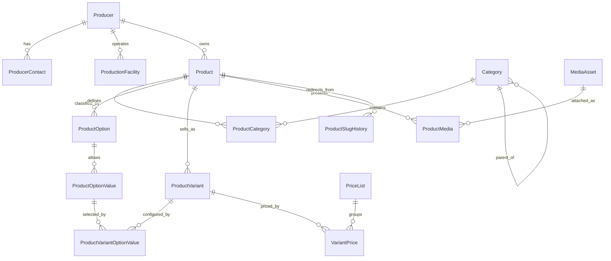
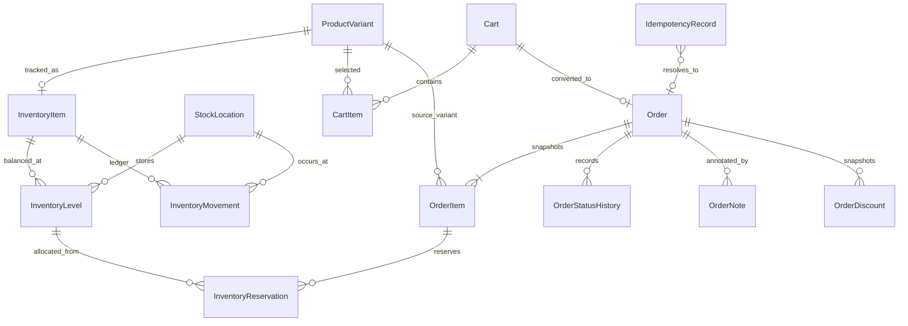
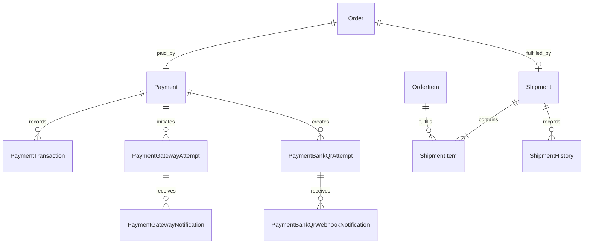
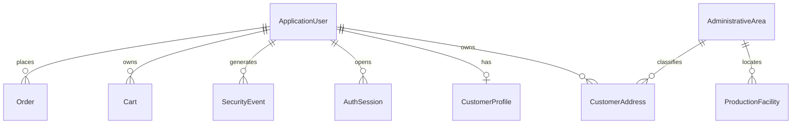
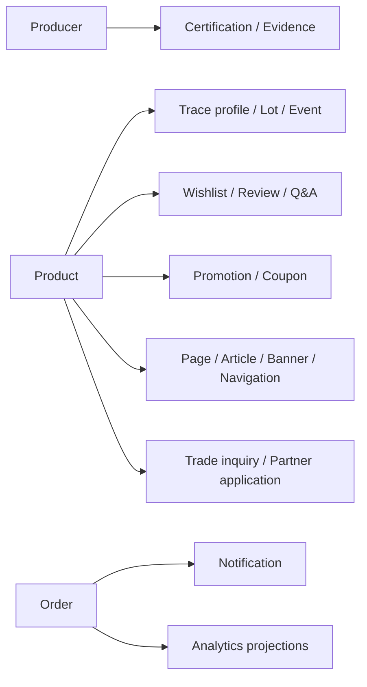

# Entity graphs theo bounded context

Tài liệu này là bản đồ quan hệ dành cho AI Agent không đọc source. Mỗi hộp là một entity lưu trữ; mũi tên mô tả quan hệ nghiệp vụ, không ngụ ý mọi navigation đều được khai báo hai chiều trong ORM.

## Producer, Catalog, Pricing và Media

- `Product` giữ nội dung và lifecycle; `ProductVariant` mới là đơn vị mua hàng và sở hữu SKU.
- Giá là bản ghi `VariantPrice` theo khoảng hiệu lực, currency, loại giá và minimum quantity; không nhận giá từ client khi mua.
- `MediaAsset` đi qua scan/process độc lập. `ProductMedia` chỉ là liên kết, thứ tự, caption và primary.
- Publish Product cần Producer public, category/media chính hợp lệ, ít nhất một active variant và effective public price. Tồn dương không phải publish gate.

## Inventory, Cart và Order

- `InventoryLevel` là balance theo cặp item-location; available được server tính từ stocked/reserved, không lưu theo số client gửi.
- `InventoryMovement` là ledger append-only. Adjust, Allocate, Release, Ship và Return phải để lại dấu vết phù hợp.
- `CartItem.Id` chọn line checkout; `ProductVariantId` chọn hàng hóa. Hai ID không thay thế nhau.
- `OrderItem` giữ snapshot tên/SKU/đơn giá/số lượng tại thời điểm mua; lịch sử đơn không đọc lại catalog hiện tại.
- Preview chỉ báo giá. Create Order mới khóa, kiểm quote và tạo reservation trong transaction.

## Payment và Shipment

- Hosted redirect/VietQR attempt chỉ là ý định thanh toán, không chứng minh `Paid`.
- IPN/webhook phải xác thực, đối chiếu reference/order/amount/currency và deduplicate trước khi đổi trạng thái.
- Refund chỉ tác động payment ledger. Hoàn tồn là nghiệp vụ Return riêng sau khi hàng thực sự được nhận và chấp nhận.

## Identity, customer và ownership

Guest Cart/Order dùng guest principal được bảo vệ, không tạo `ApplicationUser` giả. Sau login, merge guest cart khóa và hợp nhất vào user cart; chỉ clear guest ownership sau khi transaction thành công.

## Foundation graph — chưa phải live API

Các entity này có thể tồn tại trong model/DbContext nhưng mặc định là `Foundation/ROADMAP`. Không được sáng tạo endpoint, UI action hoặc cam kết runtime nếu [API Catalog](../04-api/API-CATALOG.md) chưa công bố capability tương ứng.

## Quy tắc dùng graph

1. Thiết kế mua hàng bắt đầu từ `ProductVariant`, rồi resolve effective price và inventory.
2. Thiết kế lịch sử giao dịch dùng snapshot/ledger, không join ngược để lấy giá hoặc tên hiện tại.
3. Cross-aggregate mutation phải qua use case/domain invariant; không sửa status/balance trực tiếp.
4. Quan hệ vật lý, delete behavior, index và concurrency cuối cùng phải được xác nhận bằng migration PostgreSQL khi thay schema.

