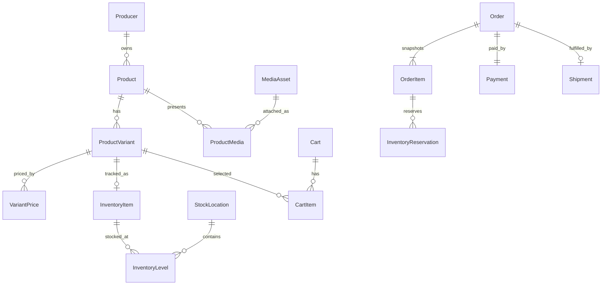

# Entity và mô hình quan hệ

## Core Commerce graph

## Ownership quan trọng

- Product không sở hữu SKU/price/stock. ProductVariant sở hữu SKU; VariantPrice giữ giá theo hiệu lực; InventoryLevel giữ balance theo StockLocation.
- OrderItem là snapshot giao dịch, không đọc lại tên/giá hiện tại để dựng lịch sử đơn.
- Payment, attempt/notification/transaction lưu tiến trình và audit provider. Shipment có items/history riêng.
- MediaAsset độc lập với ProductMedia; upload không đồng nghĩa attached/public.

## Bounded groups trong DbContext

Producer; Catalog/Pricing; Inventory; Cart/Ordering/Payment/Shipment; Customer; Trust/Trace/Reviews; Content/CMS; Promotion; B2B; Notification; Analytics; System/Outbox.

## Entity dictionary

### Producer và địa điểm

| Entity | Trách nhiệm | Quan hệ chính |
| --- | --- | --- |
| Producer | Hồ sơ đơn vị sản xuất, code/name, public status, verification và concurrency | 1-n Product, ProducerContact, ProductionFacility |
| ProducerContact | Phone/Email/Zalo/Website, public/private và display order | thuộc một Producer |
| ProductionFacility | Cơ sở sản xuất, địa chỉ, tọa độ, mô tả | thuộc Producer, optional AdministrativeArea |
| PointOfSale | Điểm bán vật lý | n-n Product qua PointOfSaleProduct |

### Catalog, pricing và media

| Entity | Trách nhiệm | Không được nhầm với |
| --- | --- | --- |
| Category | Cây danh mục và public lifecycle | ProductCategory assignment |
| Product | Nội dung root, slug, SEO, producer, publish lifecycle | SKU/price/stock |
| ProductCategory | Liên kết Product-Category, primary và display order | Category root |
| ProductOption | Trục tùy chọn như trọng lượng/quy cách | Variant cụ thể |
| ProductOptionValue | Giá trị như 500g/1kg | mapping vào variant |
| ProductVariant | SKU và quy cách có thể bán | Product content |
| ProductVariantOptionValue | n-n Variant-OptionValue | price |
| PriceList | Nhóm/chính sách giá tùy chọn | price period cụ thể |
| VariantPrice | amount/currency/type/min quantity/effective window | Product field |
| MediaAsset | file, visibility, scan status, storage metadata | ProductMedia link |
| ProductMedia | attach asset, primary, caption, display order | physical storage |
| ProductSlugHistory | bảo toàn lịch sử slug/redirect | current Product slug |

### Inventory

| Entity | Các quantity | Quy tắc |
| --- | --- | --- |
| StockLocation | code/name/address/active/stamp | code ổn định; inactive không nhận operation mới |
| InventoryItem | item theo ProductVariant, requires shipping | tracked variant mới cần item |
| InventoryLevel | stocked, reserved, incoming tại location | available = server-derived; không nhận balance từ FE |
| InventoryMovement | quantity delta/type/reason/order item/time | append-only ledger |
| InventoryReservation | quantity giữ cho OrderItem và expiry | Active → Consumed/Released/Expired |

### Customer, cart và order

| Entity | Trách nhiệm |
| --- | --- |
| CustomerProfile | hồ sơ commerce của user |
| CustomerAddress | sổ địa chỉ, người nhận, phone, default |
| Cart | owner là UserId hoặc hashed guest token; Active/Converted/Expired |
| CartItem | ProductVariantId + quantity; ID này được checkout chọn |
| IdempotencyRecord | scope/key/request fingerprint/result order, chống duplicate create |
| Order | customer/guest ownership, recipient snapshot, totals và status |
| OrderItem | immutable commercial snapshot và liên kết reservation/shipment item |
| OrderStatusHistory | timeline state/reason/actor/time |
| OrderNote | Internal/Customer/System; management note hiện bị force Internal |
| OrderDiscount | snapshot discount đã áp dụng |

### Payment và shipment

| Entity | Trách nhiệm |
| --- | --- |
| Payment | một payment chính của Order: method/status/amount/due/paid |
| PaymentTransaction | Initiate/Capture/Verify/Refund record |
| PaymentGatewayAttempt | Hosted Checkout attempt và provider state |
| PaymentGatewayNotification | IPN đã nhận, disposition Accepted/Duplicate/NeedsReconciliation |
| PaymentBankQrAttempt | VietQR intent, QR/VA facts và state |
| PaymentBankQrWebhookNotification | bank webhook audit/idempotency |
| Shipment | fulfillment state, carrier/tracking |
| ShipmentItem | quantity được giao theo OrderItem |
| ShipmentHistory | shipment timeline |

### Foundation chưa có API hoàn chỉnh

Trust gồm Certification, evidence, Product/Producer/Facility certification, TraceProfile/Lot/Event/Evidence, Wishlist, ProductReview/Q&A. Content gồm Page/Section/Article/Category/Campaign/Banner/Navigation/SeoRedirect. B2B gồm TradeInquiry, items, status history, PartnerApplication và attachment. Promotion gồm Promotion/Coupon/redemption. Những entity này mô tả hướng dữ liệu, không tự tạo capability live.

## Cardinality và delete semantics

- Product → Variant → Price là dependency chain; không xóa Product bằng cascade vì cart/order/inventory/history có thể tham chiếu.
- Order/OrderItem/Payment/Shipment/history là dữ liệu giao dịch phải bảo toàn.
- Product media có unique primary constraint theo Product; asset đang được sử dụng không được xóa tùy ý.
- InventoryItem/Level/Reservation/Movement giữ ledger; không sửa/xóa movement để “sửa tồn”.
- Cross-aggregate reference dùng ID, không xây navigation graph hai chiều lớn.

## Quy ước vật lý

EF configurations dùng PostgreSQL và tên bảng `Tbl_*`. Quan hệ, unique/filter index, delete behavior, soft-delete filter và concurrency được định nghĩa trong configuration/migration. Đối với Agent bên ngoài, dictionary trên là contract khái niệm đủ để thiết kế flow. Khi thực hiện migration mới, cần kiểm thêm schema vật lý và PostgreSQL; không dùng EF InMemory để chứng minh constraint/concurrency.
