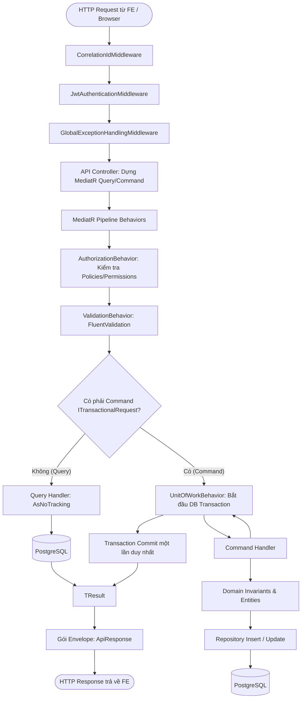
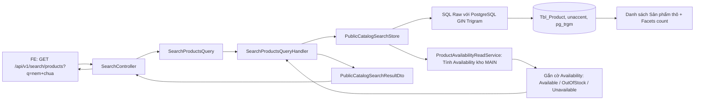
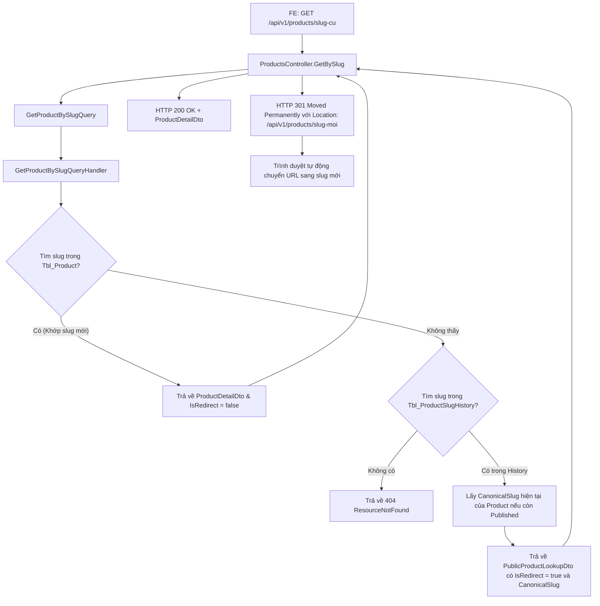
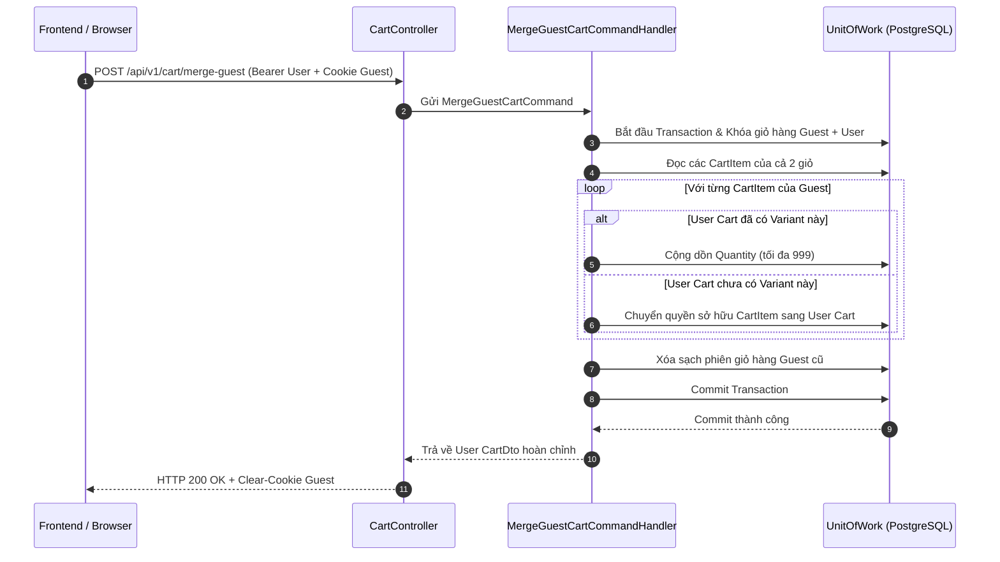
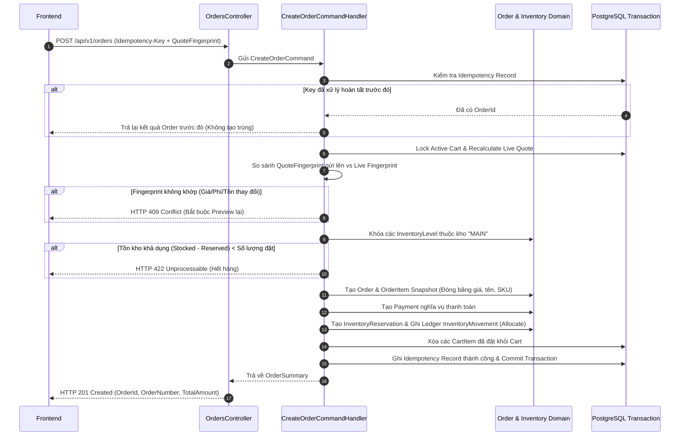
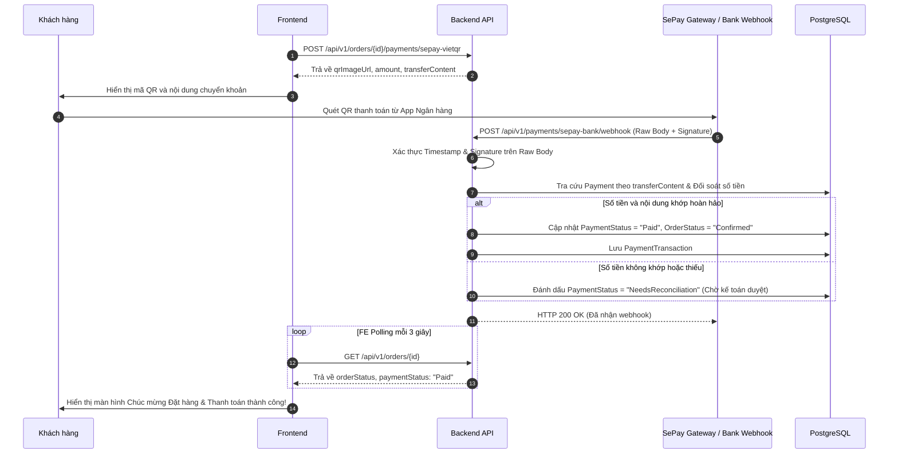
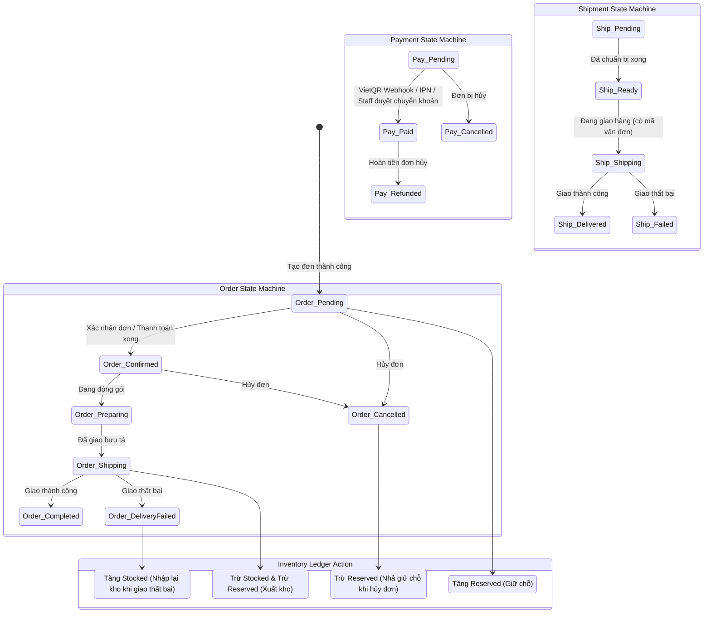
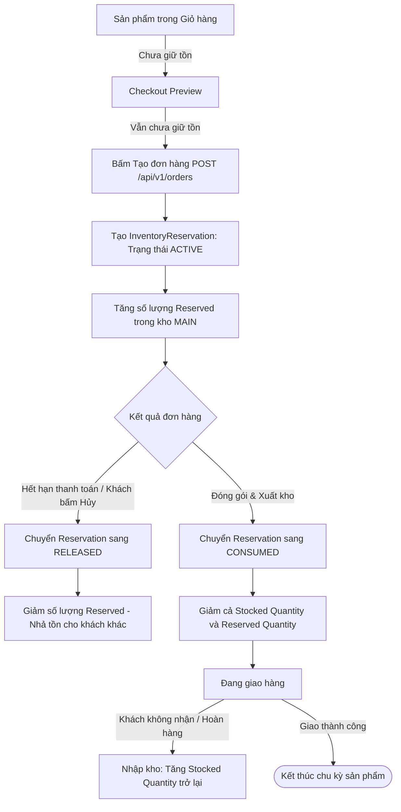

# Hướng dẫn Tích hợp Frontend: Đặc tả API, Codegraph và Flowgraph

Tài liệu này được thiết kế riêng cho đội ngũ Frontend (Storefront & Backoffice) và các AI Agent phát triển giao diện. Tài liệu chuẩn hóa toàn bộ **API Contracts**, **Codegraph (Đường đi dữ liệu)**, **Flowgraph (Quy trình tương tác)** và các **Quy tắc bất biến (Invariants)** của mã nguồn Backend mới nhất.

---

## MỤC LỤC
1. [Chuẩn giao tiếp chung (Conventions & Envelope)](#1-chuẩn-giao-tiếp-chung)
2. [Đặc tả chi tiết các API trọng yếu](#2-đặc-tả-chi-tiết-các-api-trọng-yếu)
   - 2.1. Xác thực & Phiên làm việc (Auth V1 & V2)
   - 2.2. Khám phá & Tìm kiếm (Search & Discovery)
   - 2.3. Catalog công khai & Điều hướng SEO 301
   - 2.4. Giỏ hàng & Hợp nhất giỏ (Cart & Guest Merge)
   - 2.5. Sổ địa chỉ khách hàng (Addresses)
   - 2.6. Báo giá & Đặt hàng nguyên tử (Checkout & Order)
   - 2.7. Thanh toán VietQR & SePay Hosted
   - 2.8. Kiểm tra điều kiện mở bán (Product Readiness)
3. [Codegraph chi tiết các luồng xử lý Backend](#3-codegraph-chi-tiết-các-luồng-xử-lý-backend)
   - 3.1. Request Pipeline Architecture
   - 3.2. Codegraph: Tìm kiếm Tiếng Việt không dấu (Trigram GIN)
   - 3.3. Codegraph: SEO Slug Redirect 301
   - 3.4. Codegraph: Hợp nhất giỏ hàng (Guest Cart Merge)
   - 3.5. Codegraph: Tạo đơn hàng nguyên tử & Giữ tồn kho (Atomic Order Creation)
   - 3.6. Codegraph: Thanh toán SePay VietQR Webhook
4. [Flowgraph chi tiết toàn trình (End-to-End User & System Flows)](#4-flowgraph-chi-tiết-toàn-trình)
   - 4.1. Hành trình mua hàng Storefront (Discovery -> Checkout)
   - 4.2. Đồng bộ 4 Cỗ máy trạng thái (Order, Payment, Shipment, Inventory)
   - 4.3. Vòng đời Giữ chỗ tồn kho (Inventory Reservation)
5. [Bảng kiểm tra tích hợp & Bẫy lỗi thường gặp (FE Checklist & Pitfalls)](#5-bảng-kiểm-tra-tích-hợp--bẫy-lỗi-thường-gặp)

---

## 1. CHUẨN GIAO TIẾP CHUNG

### 1.1. Cấu trúc phản hồi chuẩn (Response Envelope)
Mọi phản hồi từ API đều được bọc trong `ApiResponse<T>`:

```json
{
  "success": true,
  "message": "Thao tác thành công",
  "messageKey": "OPERATION_SUCCESS",
  "data": { ... },
  "errors": []
}
```

Khi có lỗi (`success = false`):
```json
{
  "success": false,
  "message": "Không tìm thấy tài nguyên yêu cầu",
  "messageKey": "RESOURCE_NOT_FOUND",
  "data": null,
  "errors": [
    {
      "code": "NOT_FOUND",
      "message": "Không tìm thấy sản phẩm với slug tương ứng."
    }
  ]
}
```

### 1.2. Các HTTP Header bắt buộc theo ngữ cảnh

| Header | Khi nào bắt buộc? | Giá trị / Ý nghĩa |
| :--- | :--- | :--- |
| `Authorization` | Các API yêu cầu xác thực | `Bearer <access_token>` |
| `X-CSRF-TOKEN` | Tất cả mutation từ trình duyệt (`POST`, `PUT`, `PATCH`, `DELETE`) cho Cart, Customer, Management | Token bảo vệ CSRF lấy từ cookie/auth session |
| `Idempotency-Key` | **Bắt buộc** khi gọi `POST /api/v1/orders` | Chuỗi định danh duy nhất (UUID v4 hoặc `checkout-<timestamp>-<hash>`) để chống đặt trùng đơn |
| `Cookie` | Khách vãng lai thao tác giỏ hàng | Chứa cookie phiên giỏ hàng (`ecom_guest_cart`) do server cấp |

### 1.3. Bảng mã lỗi HTTP & Ứng xử chuẩn của Frontend

| HTTP Code | Mã lỗi kinh doanh | Ứng xử bắt buộc của Frontend |
| :---: | :--- | :--- |
| **200 OK** | Thành công | Render dữ liệu từ trường `data`. |
| **201 Created** | Tạo tài nguyên mới | Cập nhật state, điều hướng theo ID trả về. |
| **301 Moved** | SEO Permanent Redirect | Trình duyệt tự chuyển hướng sang `Location` mới (Slug mới). |
| **400 Bad Request** | `VALIDATION_FAILED` | Hiển thị lỗi form trực tiếp dưới từng input của người dùng. |
| **401 Unauthorized** | `TOKEN_EXPIRED`, `UNAUTHORIZED` | Xóa session, gọi refresh token hoặc mở modal đăng nhập. |
| **403 Forbidden** | `FORBIDDEN` | Người dùng thiếu quyền/policy. Ẩn nút hoặc báo không có quyền. |
| **404 Not Found** | `RESOURCE_NOT_FOUND` | Hiển thị trang 404 hoặc thông báo không tìm thấy. |
| **409 Conflict** | `CONCURRENCY_CONFLICT`, `QUOTE_STALE` | Dữ liệu hoặc giá/tồn đã thay đổi: **FE phải refetch lại dữ liệu mới nhất (không retry mù)**. |
| **422 Unprocessable** | `INSUFFICIENT_STOCK`, `INVARIANT_VIOLATION` | Vi phạm nghiệp vụ (hết hàng, trạng thái không cho phép hủy). Hiển thị modal cảnh báo cho khách. |
| **503 Unavailable** | `SERVICE_UNAVAILABLE` | Thiếu cấu hình hệ thống (ví dụ phí ship). Báo khách thử lại sau ít phút. |

---

## 2. ĐẶC TẢ CHI TIẾT CÁC API TRỌNG YẾU

### 2.1. Xác thực & Phiên làm việc (Auth V1 & V2)

Hệ thống cung cấp 2 cơ chế: **OTP V1 (Phone-first)** và **Password V2 (Email/Username + Password)**.

#### Gửi mã OTP (Phone-first)
* **Endpoint**: `POST /api/v1/auth/send-otp`
* **Request**:
  ```json
  { "phoneNumber": "0912345678" }
  ```
* **Response (200)**:
  ```json
  {
    "success": true,
    "data": {
      "expiresAt": "2026-09-09T22:00:00Z",
      "retryAfterSeconds": 60
    }
  }
  ```

#### Xác thực OTP & Đăng nhập
* **Endpoint**: `POST /api/v1/auth/verify-otp`
* **Request**:
  ```json
  { "phoneNumber": "0912345678", "otpCode": "123456" }
  ```
* **Response (200)**:
  ```json
  {
    "success": true,
    "data": {
      "accessToken": "eyJhbG...",
      "refreshToken": "d8f9...",
      "expiresIn": 3600,
      "user": {
        "id": "3fa85f64-5717-4562-b3fc-2c963f66afa6",
        "phoneNumber": "0912345678",
        "fullName": "Nguyễn Văn A",
        "isProfileComplete": true
      }
    }
  }
  ```

---

### 2.2. Khám phá & Tìm kiếm (Search & Discovery)

#### Tìm kiếm sản phẩm công khai
* **Endpoint**: `GET /api/v1/search/products`
* **Query Params**:
  * `q`: Từ khóa tìm kiếm (tiếng Việt có dấu hoặc không dấu, ví dụ: `nem chua`, `chè lam`).
  * `categorySlug`: Lọc theo danh mục.
  * `minPrice`, `maxPrice`: Khoảng giá.
  * `sort`: `relevance` (mặc định), `newest`, `price-asc`, `price-desc`.
  * `page`, `pageSize`: Phân trang.
* **Response (200)**:
  ```json
  {
    "success": true,
    "data": {
      "items": [
        {
          "id": "e4b2d184-b5a9-4674-8b63-bb4adcb2a981",
          "slug": "nem-chua-thanh-hoa-dac-san",
          "name": "Nem chua Thanh Hóa gia truyền",
          "shortDescription": "Nem chua lên men tự nhiên từ thịt lợn sạch và lá ổi",
          "producer": {
            "id": "9921b0dc-0d6c-4ff6-91e6-2bebe53b3b24",
            "name": "Cơ sở sản xuất Nem An Phú",
            "code": "PROD-ANPHU"
          },
          "primaryCategory": {
            "id": "11223344-5566-7788-99aa-bbccddeeff00",
            "name": "Đặc sản Thanh Hóa",
            "slug": "dac-san-thanh-hoa"
          },
          "primaryMedia": {
            "url": "https://storage.ecom.vn/media/nem-chua.jpg",
            "altText": "Nem chua Thanh Hóa"
          },
          "fromPrice": 50000,
          "currencyCode": "VND",
          "hasEffectivePrice": true,
          "availability": "Available",
          "publishedAt": "2026-08-25T10:00:00Z"
        }
      ],
      "categories": [
        { "id": "11223344-5566-7788-99aa-bbccddeeff00", "name": "Đặc sản Thanh Hóa", "slug": "dac-san-thanh-hoa", "count": 12 }
      ],
      "availability": [
        { "availability": "Available", "count": 10 },
        { "availability": "OutOfStock", "count": 2 }
      ],
      "totalCount": 12,
      "page": 1,
      "pageSize": 20,
      "totalPages": 1
    }
  }
  ```

#### Gợi ý từ khóa tìm kiếm (Auto-suggestions)
* **Endpoint**: `GET /api/v1/search/suggestions?q=nem`
* **Response (200)**:
  ```json
  {
    "success": true,
    "data": [
      {
        "id": "e4b2d184-b5a9-4674-8b63-bb4adcb2a981",
        "name": "Nem chua Thanh Hóa gia truyền",
        "slug": "nem-chua-thanh-hoa-dac-san",
        "categoryName": "Đặc sản Thanh Hóa"
      }
    ]
  }
  ```

---

### 2.3. Catalog công khai & Điều hướng SEO 301

#### Chi tiết sản phẩm theo Slug
* **Endpoint**: `GET /api/v1/products/{slug}`
* **Lưu ý SEO**: Nếu người dùng hoặc bot Google truy cập slug cũ đã từng đổi tên, Backend sẽ trả mã **`HTTP 301 Moved Permanently`** cùng header `Location: /api/v1/products/{new-slug}`. FE phải giữ nguyên cơ chế redirect này.
* **Response (200)**:
  ```json
  {
    "success": true,
    "data": {
      "id": "e4b2d184-b5a9-4674-8b63-bb4adcb2a981",
      "slug": "nem-chua-thanh-hoa-dac-san",
      "name": "Nem chua Thanh Hóa gia truyền",
      "shortDescription": "Nem chua lên men tự nhiên",
      "description": "Chi tiết sản phẩm và câu chuyện làng nghề...",
      "usageInstructions": "Bóc vỏ ăn trực tiếp kèm tỏi ớt",
      "storageInstructions": "Bảo quản ngăn mát 5-10 độ C",
      "warningText": "Không dùng cho người dị ứng men thịt",
      "metaTitle": "Nem chua Thanh Hóa chính hiệu",
      "metaDescription": "Mua nem chua Thanh Hóa OCOP 4 sao...",
      "producer": {
        "id": "9921b0dc-0d6c-4ff6-91e6-2bebe53b3b24",
        "name": "Cơ sở sản xuất Nem An Phú",
        "code": "PROD-ANPHU",
        "description": "Hợp tác xã 20 năm tuổi nghề",
        "websiteUrl": "https://anphufood.vn"
      },
      "categories": [
        { "id": "11223344-5566-7788-99aa-bbccddeeff00", "name": "Đặc sản", "slug": "dac-san", "isPrimary": true, "displayOrder": 0 }
      ],
      "media": [
        { "id": "a1b2c3d4-...", "url": "https://...", "isPrimary": true, "displayOrder": 0, "caption": "Mặt trước gói nem" }
      ],
      "variants": [
        {
          "id": "778899aa-bbcc-ddeeff001122",
          "sku": "NEM-BO-10",
          "name": "Bó 10 chiếc (400g)",
          "price": 55000,
          "currencyCode": "VND",
          "priceType": "Public",
          "weightGrams": 400,
          "availability": "Available",
          "options": [
            { "optionId": "...", "code": "QUY_CACH", "name": "Quy cách", "valueId": "...", "value": "Bó 10 chiếc" }
          ]
        }
      ],
      "hasPurchasableVariants": true,
      "availability": "Available",
      "publishedAt": "2026-08-25T10:00:00Z"
    }
  }
  ```

---

### 2.4. Giỏ hàng & Hợp nhất giỏ (Cart & Guest Merge)

#### Lấy giỏ hàng hiện tại
* **Endpoint**: `GET /api/v1/cart`
* **Response (200)**:
  ```json
  {
    "success": true,
    "data": {
      "id": "c1a2b3c4-d5e6-4f7a-8b9c-0d1e2f3a4b5c",
      "status": "Active",
      "items": [
        {
          "id": "f5e4d3c2-b1a0-4987-8765-43210fedcba9",
          "productVariantId": "778899aa-bbcc-ddeeff001122",
          "productId": "e4b2d184-b5a9-4674-8b63-bb4adcb2a981",
          "productName": "Nem chua Thanh Hóa gia truyền",
          "productSlug": "nem-chua-thanh-hoa-dac-san",
          "variantName": "Bó 10 chiếc (400g)",
          "sku": "NEM-BO-10",
          "quantity": 2,
          "unitPrice": 55000,
          "lineTotal": 110000,
          "currencyCode": "VND",
          "availability": "Available"
        }
      ],
      "subtotalAmount": 110000,
      "currencyCode": "VND"
    }
  }
  ```

#### Thêm sản phẩm vào giỏ
* **Endpoint**: `POST /api/v1/cart/items`
* **Headers**: `X-CSRF-TOKEN: <token>`
* **Request**:
  ```json
  {
    "productVariantId": "778899aa-bbcc-ddeeff001122",
    "quantity": 2
  }
  ```

#### Cập nhật số lượng mặt hàng trong giỏ
* **Endpoint**: `PATCH /api/v1/cart/items/{cartItemId}`
* **Lưu ý**: Dùng **`cartItemId`** (ID dòng giỏ hàng), **KHÔNG** dùng `productVariantId`.
* **Request**:
  ```json
  { "quantity": 3 }
  ```

#### Hợp nhất giỏ hàng sau khi đăng nhập (Merge Guest Cart)
* **Endpoint**: `POST /api/v1/cart/merge-guest`
* **Headers**: `Authorization: Bearer <token>`, `X-CSRF-TOKEN: <token>`, `Cookie: ecom_guest_cart=...`
* **Lưu ý**: Sau khi gọi thành công, FE phải tải lại giỏ hàng (`GET /api/v1/cart`) để nhận trạng thái giỏ đã gộp.

---

### 2.5. Báo giá & Đặt hàng nguyên tử (Checkout & Order)

#### Bước 1: Xem trước báo giá (Checkout Preview)
* **Endpoint**: `POST /api/v1/checkout/preview`
* **Request**:
  ```json
  {
    "cartItemIds": ["f5e4d3c2-b1a0-4987-8765-43210fedcba9"],
    "recipientName": "Trần Văn B",
    "recipientPhone": "0987654321",
    "shippingAddress": "Số 12 đường Hạc Thành, TP Thanh Hóa",
    "administrativeAreaId": null,
    "customerEmail": "tranvanb@gmail.com",
    "paymentMethod": "SePayVietQr",
    "shippingMethodCode": "standard"
  }
  ```
* **Response (200)**:
  ```json
  {
    "success": true,
    "data": {
      "lines": [
        {
          "cartItemId": "f5e4d3c2-b1a0-4987-8765-43210fedcba9",
          "productVariantId": "778899aa-bbcc-ddeeff001122",
          "productName": "Nem chua Thanh Hóa gia truyền",
          "variantName": "Bó 10 chiếc (400g)",
          "sku": "NEM-BO-10",
          "unitPrice": 55000,
          "quantity": 2,
          "lineTotal": 110000,
          "isAvailable": true
        }
      ],
      "subtotalAmount": 110000,
      "shippingAmount": 25000,
      "grandTotalAmount": 135000,
      "currencyCode": "VND",
      "quoteFingerprint": "9f86d081884c7d659a2feaa0c55ad015a3bf4f1b2b0b822cd15d6c15b0f00a08"
    }
  }
  ```

#### Bước 2: Tạo đơn hàng nguyên tử (Create Order)
* **Endpoint**: `POST /api/v1/orders`
* **Headers bắt buộc**:
  * `Idempotency-Key`: `order-preview-uuid-or-timestamp`
  * `X-CSRF-TOKEN`: `<token>`
* **Request Body**:
  ```json
  {
    "cartItemIds": ["f5e4d3c2-b1a0-4987-8765-43210fedcba9"],
    "recipientName": "Trần Văn B",
    "recipientPhone": "0987654321",
    "shippingAddress": "Số 12 đường Hạc Thành, TP Thanh Hóa",
    "administrativeAreaId": null,
    "customerEmail": "tranvanb@gmail.com",
    "paymentMethod": "SePayVietQr",
    "shippingMethodCode": "standard",
    "quoteFingerprint": "9f86d081884c7d659a2feaa0c55ad015a3bf4f1b2b0b822cd15d6c15b0f00a08"
  }
  ```
* **Response (201 Created)**:
  ```json
  {
    "success": true,
    "data": {
      "orderId": "b8a9c0d1-e2f3-4a5b-6c7d-8e9f0a1b2c3d",
      "orderNumber": "ORD-20260909-0012",
      "orderStatus": "Pending",
      "paymentStatus": "Pending",
      "totalAmount": 135000,
      "placedAt": "2026-09-09T21:55:00Z"
    }
  }
  ```

---

### 2.6. Thanh toán SePay VietQR

#### Khởi tạo mã VietQR
* **Endpoint**: `POST /api/v1/orders/{orderId}/payments/sepay-vietqr`
* **Headers**: `Authorization: Bearer <token>` (hoặc guest session phù hợp)
* **Response (200)**:
  ```json
  {
    "success": true,
    "data": {
      "orderId": "b8a9c0d1-e2f3-4a5b-6c7d-8e9f0a1b2c3d",
      "qrImageUrl": "https://qr.sepay.vn/assets/img/qr.png?acc=123456&bank=MB&amount=135000&des=ORD0012",
      "bankCode": "MBBank",
      "accountNumber": "09123456789",
      "accountName": "ECOM THANH HOA",
      "amount": 135000,
      "transferContent": "ORD0012",
      "expiresAt": "2026-09-09T22:25:00Z"
    }
  }
  ```
* **Ứng xử FE**: Hiển thị ảnh QR, số tiền và nội dung chuyển khoản. Thực hiện polling trạng thái đơn hàng (`GET /api/v1/orders/{id}`) mỗi 3-5 giây cho đến khi `paymentStatus = "Paid"`.

---

### 2.7. Kiểm tra điều kiện mở bán (Product Readiness)

Dành cho màn hình Backoffice quản trị sản phẩm:
* **Endpoint**: `GET /api/v1/catalog/products/{productId}/readiness`
* **Permissions yêu cầu**: `CatalogProducts.Read` **VÀ** `Inventory.Read`.
* **Response (200)**:
  ```json
  {
    "success": true,
    "data": {
      "productId": "e4b2d184-b5a9-4674-8b63-bb4adcb2a981",
      "canPublish": true,
      "canSell": true,
      "checks": [
        { "code": "PRODUCER_NOT_PUBLIC_OR_VERIFIED", "passed": true },
        { "code": "PRIMARY_CATEGORY_MISSING_OR_NOT_PUBLIC", "passed": true },
        { "code": "PRIMARY_MEDIA_MISSING_OR_NOT_PUBLIC", "passed": true },
        { "code": "ACTIVE_VARIANT_MISSING", "passed": true },
        { "code": "EFFECTIVE_PRICE_MISSING", "passed": true },
        { "code": "TRACKED_VARIANT_MAIN_LEVEL_MISSING", "passed": true }
      ]
    }
  }
  ```

---

## 3. CODEGRAPH CHI TIẾT CÁC LUỒNG XỬ LÝ BACKEND

### 3.1. Request Pipeline Architecture
Mọi request đều đi qua luồng chuẩn hóa Clean Architecture và CQRS MediatR:



---

### 3.2. Codegraph: Tìm kiếm Tiếng Việt không dấu (Trigram GIN)



---

### 3.3. Codegraph: SEO Slug Redirect 301



---

### 3.4. Codegraph: Hợp nhất giỏ hàng (Guest Cart Merge)



---

### 3.5. Codegraph: Tạo đơn hàng nguyên tử & Giữ tồn kho



---

### 3.6. Codegraph: Thanh toán SePay VietQR Webhook



---

## 4. FLOWGRAPH CHI TIẾT TOÀN TRÌNH

### 4.1. Hành trình mua hàng Storefront (Discovery -> Checkout)

```mermaid
flowchart TD
  START([Khách hàng truy cập Storefront]) --> SEARCH[Tìm kiếm từ khóa / Duyệt danh mục]
  SEARCH --> SUGGEST{Gõ phím tìm kiếm?}
  SUGGEST -- Có --> GET_SUG[GET /api/v1/search/suggestions]
  GET_SUG --> CHOOSE_PROD[Chọn sản phẩm]
  SUGGEST -- Duyệt danh sách --> PROD_LIST[GET /api/v1/search/products hoặc /products]
  PROD_LIST --> CHOOSE_PROD
  
  CHOOSE_PROD --> DETAIL[GET /api/v1/products/slug]
  DETAIL --> REDIR_CHECK{Backend trả HTTP 301?}
  REDIR_CHECK -- Có --> GO_CANONICAL[Chuyển hướng sang slug mới]
  GO_CANONICAL --> DETAIL
  
  REDIR_CHECK -- Không --> VIEW_DETAIL[Hiển thị: Ảnh, Mô tả, Quy cách Variant, Availability]
  VIEW_DETAIL --> CHECK_STOCK{Availability == Available?}
  CHECK_STOCK -- Không --> OUT_STOCK[Vô hiệu hóa nút Mua, báo Hết hàng]
  
  CHECK_STOCK -- Có --> ADD_CART[Chọn Variant & Quantity -> Bấm Thêm giỏ hàng]
  ADD_CART --> POST_CART[POST /api/v1/cart/items kèm CSRF]
  
  POST_CART --> LOGIN_CHECK{Khách đã đăng nhập chưa?}
  LOGIN_CHECK -- Chưa --> PROMPT_LOGIN[Đăng nhập hoặc Tiếp tục dạng Guest]
  PROMPT_LOGIN -- Đăng nhập --> DO_LOGIN[POST /api/v1/auth/verify-otp hoặc password login]
  DO_LOGIN --> MERGE[POST /api/v1/cart/merge-guest]
  MERGE --> GO_CART[Xem Giỏ hàng]
  LOGIN_CHECK -- Đã đăng nhập --> GO_CART
  PROMPT_LOGIN -- Mua dạng Guest --> GO_CART
  
  GO_CART --> PREVIEW[Nhập địa chỉ giao hàng -> Bấm Tiếp tục]
  PREVIEW --> POST_PREVIEW[POST /api/v1/checkout/preview]
  POST_PREVIEW --> SHOW_QUOTE[Hiển thị chi tiết tiền hàng, tiền ship, tổng tiền và Fingerprint]
  
  SHOW_QUOTE --> CONFIRM_ORDER[Khách bấm Đặt hàng]
  CONFIRM_ORDER --> POST_ORDER[POST /api/v1/orders + Idempotency-Key + QuoteFingerprint]
  
  POST_ORDER --> ORDER_RESULT{Tạo đơn thành công?}
  ORDER_RESULT -- 409 Conflict --> QUOTE_ERR[Báo giá hoặc tồn đã đổi -> Tự động gọi lại Preview]
  QUOTE_ERR --> SHOW_QUOTE
  
  ORDER_RESULT -- 201 Created --> PAY_CHOICE{Phương thức thanh toán?}
  PAY_CHOICE -- COD --> FINISH_COD[Hiển thị Đơn hàng thành công - Chờ giao hàng]
  PAY_CHOICE -- SePay VietQR --> GEN_QR[POST /payments/sepay-vietqr]
  GEN_QR --> SHOW_QR[Hiển thị mã QR động -> Polling trạng thái đơn -> Hoàn tất khi Paid]
```



---

### 4.2. Đồng bộ 4 Cỗ máy trạng thái (Order, Payment, Shipment, Inventory)



---

### 4.3. Vòng đời Giữ chỗ tồn kho (Inventory Reservation)



---

## 5. BẢNG KIỂM TRA TÍCH HỢP & BẪY LỖI THƯỜNG GẶP (FE CHECKLIST & PITFALLS)

| STT | Vấn đề | Bẫy lỗi thường gặp của Frontend | Cách thực hiện đúng theo Source Code mới |
| :---: | :--- | :--- | :--- |
| **1** | **Xử lý số lượng tồn kho** | Cố tìm trường `quantity` hoặc `stockedQuantity` ở API public để render thanh tồn kho. | **Public API không trả `quantity`**. Chỉ dùng trường enum `availability` (`Available`, `OutOfStock`, `Unavailable`) để hiển thị badge và bật/tắt nút mua. |
| **2** | **Quản lý dòng giỏ hàng** | Truyền `productVariantId` lên URL `PATCH /api/v1/cart/items/{id}` khi sửa số lượng. | Phải truyền **`cartItemId`** (lấy từ trường `id` của mảng `items` trong `CartDto`). |
| **3** | **Tạo đơn hàng chống trùng** | Gửi request `POST /api/v1/orders` mà không có header `Idempotency-Key`. | **Bắt buộc** sinh UUID v4 gán vào header `Idempotency-Key`. Khi người dùng bấm đúp hoặc mạng lag, server trả lại đơn hàng cũ chứ không tạo đơn mới. |
| **4** | **Xử lý Báo giá & Khóa giá** | Client tự cộng dồn tiền hàng và tự tính phí ship để gửi lên API đặt hàng. | Phải gọi `POST /api/v1/checkout/preview` trước, lấy mã **`quoteFingerprint` (chuỗi hex 64 ký tự)** rồi gửi kèm nguyên vẹn vào `POST /api/v1/orders`. |
| **5** | **Xử lý 409 Conflict** | Bị lỗi 409 khi đặt hàng do giá đổi thì tự động retry ngay lập tức. | Khi nhận 409, FE **phải gọi lại Preview** để cập nhật bảng giá mới cho khách xác nhận lại, sau đó mới cho đặt tiếp. |
| **6** | **Chuyển hướng SEO 301** | Bỏ qua hoặc nuốt mất header redirect 301 khi truy cập link sản phẩm cũ. | Đảm bảo router của FE (Next.js / Nuxt / React Router) cập nhật thanh địa chỉ URL sang `Location` mới khi Backend trả về mã 301. |
| **7** | **Đăng nhập và gộp giỏ hàng** | Sau khi đăng nhập thành công, chỉ gọi lấy giỏ hàng mà quên gọi Merge Giỏ. | Sau khi login thành công, phải gọi ngay `POST /api/v1/cart/merge-guest` (kèm CSRF và Cookie guest), sau đó mới reload giỏ hàng. |
| **8** | **Thanh toán VietQR** | Coi việc sinh mã VietQR thành công là đơn hàng đã thanh toán. | Mã QR chỉ là ý định thanh toán. Phải polling API `GET /api/v1/orders/{id}` để đợi Webhook ngân hàng xác nhận sang `paymentStatus = "Paid"`. |
| **9** | **CSRF Protection** | Quên đính kèm header `X-CSRF-TOKEN` cho các request thay đổi trạng thái (`POST`, `PUT`, `DELETE`). | Luôn gửi token CSRF lấy từ cookie/phiên bảo mật cho toàn bộ mutation API. |
