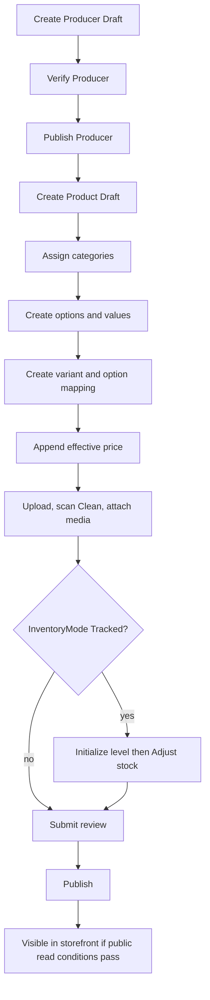
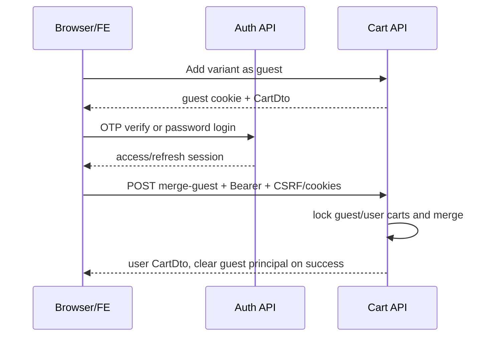
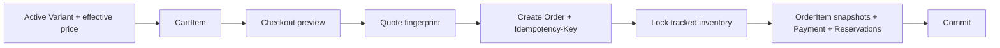
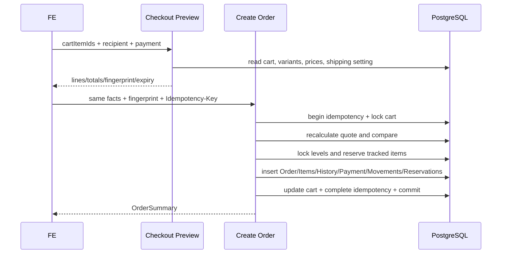
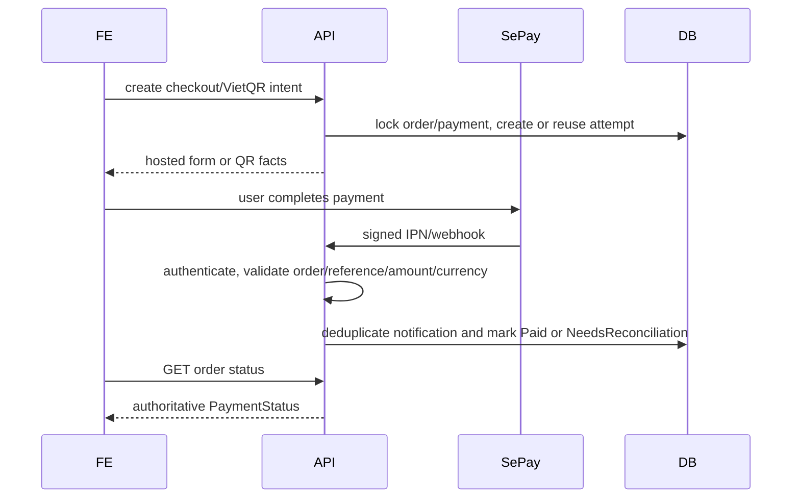
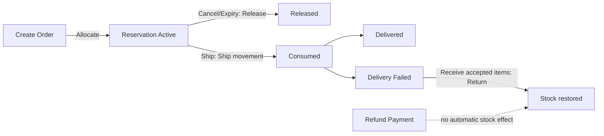

# Commerce end-to-end flows

## Product publish

Producer hợp lệ → Product Draft → categories/options → variants → effective prices → upload/scan/attach media → inventory setup nếu tracked → submit review → publish. Mỗi mutation dùng stamp mới; sửa nội dung/giá có thể đưa Published về Review theo domain rule.

Failure gates: Producer chưa verified/published; category hierarchy không public; không có active variant; không có effective public price; primary media chưa Clean/Public; stale stamp. Tracked inventory chưa setup có thể khiến variant chưa sẵn sàng mua/fulfill nhưng không phải Product publish gate. Không bỏ qua gate bằng cách sửa trực tiếp status trong database.

## Authentication và cart ownership

Nếu login thành công nhưng merge thất bại, guest cart cookie không được clear trước commit. FE hiển thị user session vẫn hợp lệ và cho retry merge có kiểm soát/refetch.

## Cart đến Order

Preview không reserve. CreateOrder khóa/kiểm lại quote, tạo snapshot và Allocate reservation trong transaction.

Nếu quote/fingerprint/availability đổi, toàn transaction thất bại và FE preview lại. Nếu response mất sau commit, retry cùng key/payload trả kết quả trước đó thay vì tạo order thứ hai.

## Payment/fulfillment

Order Pending → COD/BankTransfer/SePay/SePayVietQr. Hosted redirect hoặc QR chỉ khởi tạo attempt. Validated IPN/webhook/manual verification mới thay đổi payment theo invariant. Management xác nhận order → prepare/start/complete shipment; cancel/expiry release reservation; ship consume stock; receive return tạo Return movement. Refund không tự restock.

## Fulfillment và inventory ledger

## Producer và Product dependency

Producer phải được verify trước publish. Published Product phụ thuộc Producer public state; hide Producer có thể bị chặn khi còn published dependencies. Staff xử lý Product dependencies trước, không bypass bằng client flag.

## Media flow

Upload multipart → Pending asset → worker validates/scans/processes → Clean/Public hoặc Rejected/Failed → attach vào Product bằng stamp → set primary/order/caption → Product public reader chỉ trả usable media. Failed có thể retry; Rejected không attach; asset in-use không delete.

## Management reporting flow

Order/Payment/Shipment/Inventory facts được aggregate thành dashboard/analytics theo range. Analytics là read model; nó không điều khiển state và không thay thế transactional tables. Filter/paging trong UI không được dùng để tự tính KPI tổng hệ thống.
