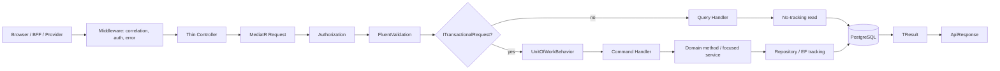
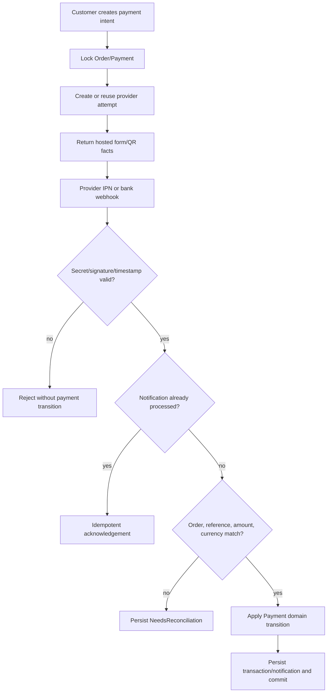
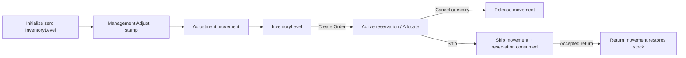
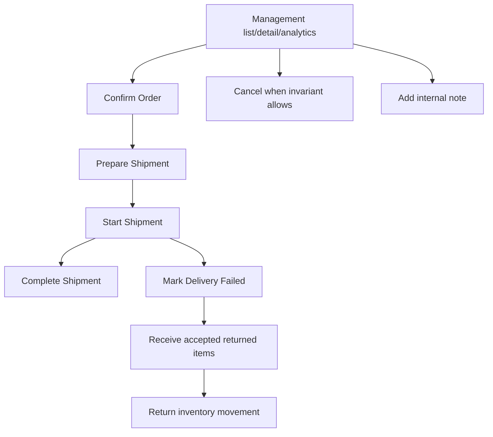
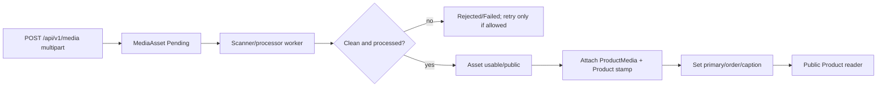
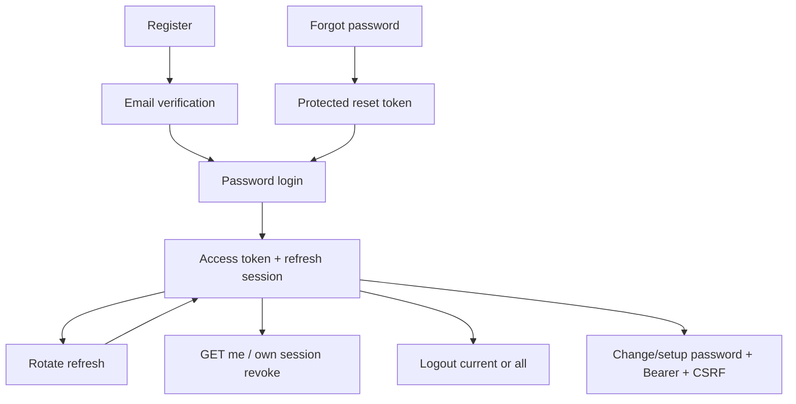

# Codegraph các luồng đã triển khai

Codegraph mô tả đường đi từ API đến dữ liệu và state change. Tên controller/request/handler là provenance để người sửa code định vị nhanh; phần diễn giải và contract đủ cho Agent không có source.

## Khung xử lý chung



Command mới chỉ có một commit point do UnitOfWork behavior sở hữu. Handler không tự commit và không gọi provider khi DB transaction đang mở.

## Public Product list/detail

```mermaid
flowchart LR
  R[GET /api/v1/products or /{slug}] --> PC[ProductsController]
  PC --> Q[GetProductList/GetProductDetail query]
  Q --> READ[Public catalog read model]
  READ --> JOIN[Product + Producer + Category + Active Variant + Effective Price + Usable Media]
  JOIN --> DTO[Product list/detail DTO]
  DTO --> API[ApiResponse with paging/detail]
```

Chỉ public Product thỏa điều kiện đọc mới xuất hiện. Filter/sort/paging chạy phía server; UI không tự suy ra price/availability từ Product root.

## Publish Product

```mermaid
flowchart TD
  R[POST /catalog/products/{id}/publish + concurrencyStamp] --> C[CatalogProductsController]
  C --> CMD[PublishProductCommand]
  CMD --> P[Load Product and dependencies]
  P --> ST{Stamp current?}
  ST -- no --> CON[409 concurrency conflict]
  ST -- yes --> G{Producer public; primary category/media; active variant; effective price?}
  G -- no --> BAD[Business validation error]
  G -- yes --> D[Product.Publish]
  D --> COMMIT[Single transaction commit]
  COMMIT --> OK[New status and concurrency stamp]
```

Tracked inventory setup là readiness để bán/fulfill, không phải điều kiện publish. Client không được bypass gate bằng cách ghi status trực tiếp.

## Add Cart item và merge guest

```mermaid
sequenceDiagram
  participant FE
  participant CART as CartController
  participant H as Cart Handler
  participant DB as PostgreSQL
  FE->>CART: POST /cart/items {productVariantId, quantity} + CSRF
  CART->>H: AddCartItemCommand
  H->>DB: resolve guest/user cart, active variant, effective price facts
  H->>DB: insert or combine line and commit
  H-->>FE: authoritative CartDto
  FE->>CART: POST /cart/merge-guest after login
  CART->>H: MergeGuestCartCommand
  H->>DB: lock guest and user carts; merge deterministically
  H->>DB: commit, then clear guest principal
  H-->>FE: merged CartDto
```

Server trả `CartItemDto.Id`; checkout phải dùng ID line này. Nếu merge rollback, guest cart vẫn còn để retry/refetch.

## Checkout preview và Create Order

```mermaid
sequenceDiagram
  participant FE
  participant PRE as CheckoutController
  participant ORD as OrdersController
  participant DB as PostgreSQL
  FE->>PRE: preview(cartItemIds, recipient/address, paymentMethod)
  PRE->>DB: read cart + current price + shipping setting + availability
  PRE-->>FE: lines, totals, quoteFingerprint, expiresAt
  FE->>ORD: POST /orders + same facts + Idempotency-Key
  ORD->>DB: lock idempotency scope and cart
  ORD->>DB: recalculate and compare fingerprint
  ORD->>DB: lock tracked levels; create order snapshots/reservations/payment
  ORD->>DB: convert selected cart lines and commit
  ORD-->>FE: existing or newly created OrderSummary
```

Fingerprint/giá/tồn đổi làm toàn bộ create thất bại; FE phải preview lại. Retry cùng idempotency key và cùng payload trả kết quả đã tạo; cùng key khác payload là conflict.

## SePay Hosted Checkout và VietQR



Management có reconciliation view/manual verification theo quyền. Redirect của browser không bao giờ là nguồn sự thật cho `Paid`.

## Inventory adjust, reserve, ship và return



Mỗi operation kiểm quantity và concurrency. Không sửa balance hoặc movement cũ để “sửa tồn”; refund không nối tự động sang Return.

## Management Order và Shipment



Order, Payment và Shipment có state machine riêng. Không cung cấp generic status patch; action chỉ hợp lệ khi current state và permission cho phép.

## Media upload đến Product



Upload không đồng nghĩa public hoặc attached. Asset đang được tham chiếu không được xóa tùy ý.

## Password V2 và session



Refresh rotation và revoke là server-side session facts. Không log token; Password V2 còn phụ thuộc effective feature/config và email delivery của môi trường.

