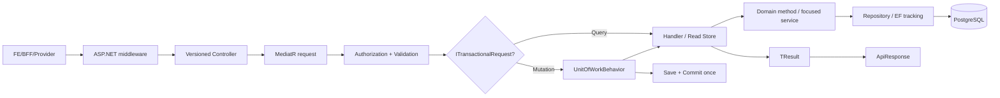

# Request Pipeline Codegraph

External side effect không được chen vào transaction mở. Khi cần durable delivery: persist domain/outbox fact → commit → worker/post-commit dispatcher → external system.

## Trace template

`METHOD route` → Controller action → Command/Query → Validator → Handler → Domain methods → Repository/read store → tables → response DTO → tests. Đây là format chuẩn khi AI Agent viết codegraph mới.
