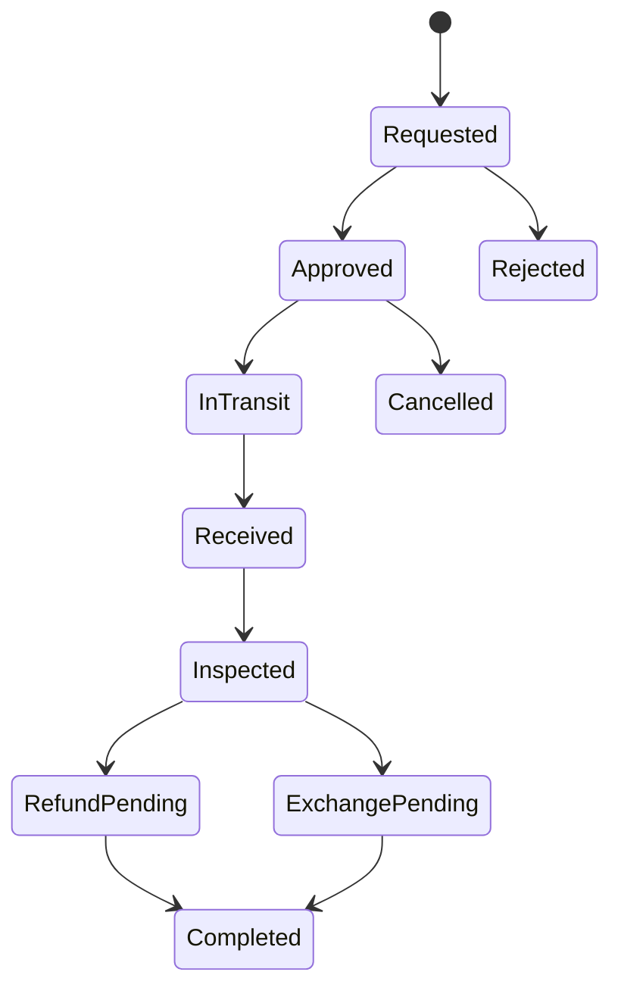
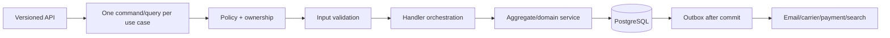

# Báo cáo phân tích khoảng trống nghiệp vụ và roadmap ưu tiên

> Snapshot source: commit `56f0fa6634569f71107e9f6e1334ae41bba0388c`, đối chiếu ngày 2026-08-22. Đây là báo cáo đề xuất; endpoint ghi `PROPOSED` chưa phải API hiện có.

## 1. Mục tiêu và phương pháp

Báo cáo trả lời bốn câu hỏi:

1. Database hiện có những miền dữ liệu nào?
2. API/handler/service hiện khai thác được bao nhiêu?
3. Những nghiệp vụ phổ biến và cần thiết nào còn thiếu?
4. Nên phát triển theo thứ tự nào để tăng giá trị mà không phá luồng đang chạy?

Nguồn đối chiếu gồm current entity/configuration, Application feature, controller, test, tài liệu dự án và tài liệu chính thức của Shopify, Medusa, Stripe, Google, GS1 và Bộ Công Thương. Việc một entity tồn tại không được tính là capability live; phải có use case, authorization, validation, transaction, API/read model và test phù hợp.

## 2. Tóm tắt điều hành

Hệ thống đã có một lõi Commerce đáng kể: Auth, Catalog, Producer cơ bản, Media, Cart, Address, Checkout preview, Create Order idempotent, SePay, Inventory reservation, Shipment và Management read model. Vấn đề không phải “thiếu toàn bộ backend”, mà là **mô hình dữ liệu rộng hơn nhiều so với bề mặt nghiệp vụ đang khai thác**.

- Có **85 entity Commerce** và **85 EF configuration**.
- Application tập trung vào 7 feature group: Auth, AuthV2, Catalog, Commerce, Demo, Identity và Media.
- Có 40 entity thuộc `Promotion` (5), `Trust` (16), `Content` (10), `B2B` (5), `Notification` (2) và `Analytics` (2): khoảng **47% mô hình Commerce** nhưng chưa có API nghiệp vụ hoàn chỉnh tương ứng.
- Ngay trong miền đã chạy, các khoảng trống vận hành còn lớn: receiving/PO/transfer/stocktake; shipping methods/carrier; RMA/return/exchange; discount calculation; customer communication; consent/compliance; comprehensive audit.
- Vì vậy không nên tiếp tục mở rộng entity hàng loạt. Nên ưu tiên theo thứ tự: **làm lõi hiện tại vận hành được → hậu mãi và fulfillment → promotion/notification → trust/content/engagement → B2B/analytics → marketplace nâng cao**.

## 3. Bản đồ khai thác database hiện tại

| Miền DB | Entity | Mức khai thác hiện tại | Nhận định |
| --- | ---: | --- | --- |
| Catalog | 11 | Cao | public/backoffice Product, Category, Variant, Option, Media đã có |
| Pricing | 2 | Trung bình-cao | effective VariantPrice đã dùng; chưa có price book/segment đầy đủ |
| Ordering | 17 | Cao ở happy path | Cart→Order→Payment→Shipment có; hậu mãi/partial fulfillment còn thiếu |
| Inventory | 5 | Trung bình | level/reservation/movement chạy; inbound/transfer/stocktake thiếu |
| Producer | 5 | Trung bình | Producer/contact/facility cơ bản; PointOfSale chưa thành capability |
| Customer | 3 | Thấp-trung bình | Address chạy; CustomerProfile chưa trở thành customer 360 |
| System | 2 | Thấp-trung bình | typed shipping setting và audit query; audit coverage chưa toàn diện |
| Promotion | 5 | Chưa khai thác | có model Coupon/Promotion/Redemption nhưng không có calculator/API |
| Trust | 16 | Chưa khai thác | certification, trace, wishlist, review, Q&A đang là foundation |
| Content | 10 | Chưa khai thác | CMS/navigation/banner/SEO model có nhưng gần như chưa có API |
| B2B | 5 | Chưa khai thác | TradeInquiry domain có nền nhưng chưa có Application/API |
| Notification | 2 | Chưa thành Commerce flow | chưa có orchestration/template/channel/preferences hoàn chỉnh |
| Analytics | 2 | Chưa khai thác | VisitorSession/Event chưa có ingestion và reporting pipeline |

### 3.1 Những gì database đã thiết kế đúng hướng

- Product tách Variant, Price, Inventory; OrderItem giữ snapshot.
- Inventory có level, movement và reservation thay vì một cột stock đơn giản.
- Payment có attempt, transaction và provider notification để audit/deduplicate.
- Trust/Trace, Content, Promotion và B2B đã được tách thành bounded group.
- Soft delete, concurrency stamp, filtered index và PostgreSQL configuration đã có nền.

### 3.2 Những điểm mô hình có nhưng chưa tạo ra giá trị

- `CouponRedemption` không có service tính eligibility/budget và không đi vào Preview/CreateOrder.
- `ProductReview`, `Wishlist`, `ProductQuestion` không có customer/public/moderation API.
- `Certification`, `TraceProfile/Lot/Event` chưa xuất hiện trong public Product/Producer journey.
- `Page`, `Article`, `Banner`, `NavigationItem`, `SeoRedirect` chưa điều khiển storefront.
- `TradeInquiry`, `PartnerApplication` chưa có intake/assignment/status workflow.
- `Notification/UserNotification` chưa nhận domain event từ Order/Payment/Shipment.
- `VisitorSession/AnalyticsEvent` chưa có consent-aware ingestion/read model.

### 3.3 Khoảng trống chưa có đủ model

- Return Merchandise Authorization: ReturnRequest, ReturnItem, ReturnHistory, disposition, reverse shipment.
- Shipping option/rate quote và carrier/provider integration.
- Warehouse inbound: PurchaseOrder/Receipt; transfer; stocktake/count/variance.
- Customer complaint/support case và privacy/consent request record.
- Nếu đi marketplace thật: seller account, commission, settlement, payout và ledger.

## 4. Nguyên tắc xếp ưu tiên

Mỗi capability được chấm theo năm tiêu chí, thang 1–5:

- `N`: cần thiết để bán hàng/vận hành đúng.
- `P`: phổ biến trong hệ thống Commerce trưởng thành.
- `I`: tác động doanh thu, chuyển đổi hoặc niềm tin.
- `R`: mức tái sử dụng model hiện có.
- `K`: chi phí/rủi ro; điểm cao nghĩa khó hơn.

Điểm định hướng: `2N + P + 2I + R - K`. Điểm không thay thế quyết định sản phẩm; compliance, mất tiền hoặc sai tồn luôn được nâng ưu tiên dù effort cao.

| Priority | Ý nghĩa |
| --- | --- |
| P0 | phải hoàn thành để lõi hiện tại an toàn và vận hành được |
| P1 | capability Commerce phổ biến, tác động trực tiếp conversion/operations |
| P2 | tạo khác biệt, tăng retention/growth sau khi P0/P1 ổn định |
| P3 | nâng cao hoặc chỉ cần khi mô hình kinh doanh mở rộng |

## 5. Roadmap ưu tiên tổng thể

| # | Capability | Priority | N/P/I/R/K | Lý do |
| ---: | --- | --- | --- | --- |
| 1 | Production acceptance, audit, outbox, observability | P0 | 5/5/5/4/3 | feature mới không có ý nghĩa nếu commit/provider/DB không được chứng minh |
| 2 | Return/RMA/refund/reverse logistics | P0 | 5/5/5/2/4 | hiện chỉ có return stock operation; thiếu request→approve→receive→refund |
| 3 | Shipping method/rate/carrier/tracking | P0 | 5/5/5/2/4 | một standard fee không đủ cho vận hành giao hàng thực tế |
| 4 | Consumer/compliance/privacy operations | P0 | 5/5/5/3/4 | cần policy, seller disclosure, complaint và data handling có bằng chứng |
| 5 | Commerce notification orchestration | P0 | 5/5/4/5/3 | Order/Payment/Shipment cần thông báo bền vững và retry được |
| 6 | Promotion/coupon engine | P1 | 4/5/5/5/4 | model đã có, tác động conversion; phải tính server-side và snapshot |
| 7 | Warehouse receiving/transfer/stocktake | P1 | 5/5/4/3/4 | không thể duy trì tồn chính xác chỉ bằng manual adjustment |
| 8 | Review/rating/Q&A/wishlist | P1 | 4/5/5/5/3 | tăng trust/discovery; model gần như đã có đầy đủ |
| 9 | Trust/certification/traceability | P1 | 4/4/5/5/4 | khác biệt cốt lõi cho đặc sản/nhà sản xuất địa phương |
| 10 | CMS/navigation/banner/SEO/product feed | P1 | 4/5/5/5/3 | biến model content thành merchandising và organic acquisition |
| 11 | Search/facet/autocomplete | P1 | 4/5/5/3/3 | catalog lớn cần discovery tốt hơn filter DB cơ bản |
| 12 | B2B inquiry/partner onboarding | P2 | 3/4/4/5/3 | phù hợp định hướng thương mại địa phương, tận dụng 5 entity sẵn có |
| 13 | Customer 360/support | P2 | 4/5/4/3/4 | hỗ trợ order issue, address, consent, interaction và segmentation |
| 14 | Consent-aware analytics/funnel | P2 | 3/5/4/5/4 | cần để tối ưu conversion nhưng không được vượt privacy boundary |
| 15 | Producer portal/Point of Sale | P2 | 3/4/4/3/4 | chỉ làm sau khi ownership và permission model được khóa |
| 16 | Loyalty/store credit/referral | P3 | 2/4/4/1/4 | hữu ích cho retention nhưng chưa cần trước promotion/review |
| 17 | Advanced recommendations/personalization | P3 | 2/4/4/2/5 | cần event quality và catalog scale trước |
| 18 | Marketplace commission/settlement/payout | P3 | 3/4/5/1/5 | thay đổi mô hình tiền và pháp lý; không suy ra từ Producer hiện tại |

## 6. Thiết kế đề xuất chi tiết

### P0.1 — Production acceptance và operational truth

**Vấn đề:** source có luồng tốt nhưng build/test không chứng minh PostgreSQL, SePay, worker, BFF hay production. AuditLog là read projection, chưa bảo đảm mọi mutation có audit.

**Nghiệp vụ nên có**

- Operation ID/correlation xuyên HTTP→handler→outbox→provider.
- Audit actor/action/resource/before-after an toàn cho mutation quan trọng.
- Outbox retry/dead-letter/metrics; reconciliation job cho Payment và Reservation.
- Health/readiness riêng cho DB, worker, media scanner và provider configuration.
- Runbook và acceptance test: create order rollback, oversell, duplicate webhook, timeout-after-commit, shipment/return.

**Blueprint**

- API: `GET /management/operations/health`, `/outbox`, `/reconciliation` (`PROPOSED`, không lộ secret).
- Handlers: `GetOperationalHealthQuery`, `RetryDeadLetterOutboxCommand`, `RunCommerceReconciliationCommand`.
- Services: `IAuditWriter`, `ICommerceReconciliationService`, `IOutboxDispatcher`, metrics/tracing abstraction.
- DB: ưu tiên khai thác `AuditLog`, `OutboxMessage`, payment notifications, idempotency records; chỉ thêm dead-letter/attempt metadata khi migration được duyệt.

### P0.2 — Return/RMA, refund và reverse logistics

**Vấn đề:** `ReceiveReturnedOrderItems` xử lý khâu nhận hàng sau delivery failure, còn thiếu customer return request, eligibility, approval, return shipping, inspection, damaged quantity, refund decision và timeline.

**State đề xuất**

**Model**

- Mới: `ReturnRequest`, `ReturnItem`, `ReturnStatusHistory`, optional `ReverseShipment`.
- `ReturnItem`: requested, received, restockable, damaged, rejected quantities và reason/disposition.
- Tái sử dụng: Order/OrderItem, Shipment, PaymentTransaction, InventoryMovement `Return`, MediaAsset làm evidence.

**API/handler/service đề xuất**

- Customer: `POST /api/v1/orders/{id}/returns`, `GET /api/v1/returns/{id}`, `POST /returns/{id}/cancel`.
- Management: list/detail, approve/reject, mark-received, inspect, issue-refund/create-exchange.
- Commands: `RequestReturn`, `ApproveReturn`, `ReceiveReturn`, `InspectReturn`, `CompleteReturnRefund`.
- Services: `IReturnEligibilityService`, `IReturnRefundCalculator`, `IReverseShippingService`.
- Gate: refund và restock là hai quyết định riêng; chỉ restock quantity đã nhận và được đánh dấu resellable.

Mô hình này phù hợp với cách Shopify coi Return là intent có line/status và Medusa tách `received_quantity` khỏi `damaged_quantity`: [Shopify Return](https://shopify.dev/docs/api/admin-graphql/latest/queries/return), [Medusa Order Return](https://docs.medusajs.com/resources/commerce-modules/order/return).

### P0.3 — Shipping options, rate quote và carrier

**Vấn đề:** checkout hiện dùng một typed setting `standardFeeVnd`; Shipment lifecycle chưa biểu diễn nhiều service level, carrier quote, tracking event, partial shipment hoặc reverse shipment.

**Model đề xuất**

- `ShippingZone`, `ShippingMethod`, `ShippingRate`, `ShippingQuote`, `CarrierAccount`/provider reference.
- Nếu cần partial shipment, chuyển quan hệ Order→Shipment từ tối đa một sang nhiều, giữ ShipmentItem quantity.
- Snapshot shipping method/name/fee/ETA vào Order; quote có expiry/fingerprint.

**API/handler/service**

- `POST /api/v1/checkout/shipping-options` hoặc tích hợp vào Preview.
- Management CRUD shipping zone/method/rate; shipment label/tracking refresh.
- `GetShippingOptionsQuery`, `SelectShippingMethodCommand`, `CreateShipmentLabelCommand`, `ProcessCarrierWebhookCommand`.
- `IShippingRateService`, `ICarrierProvider`, `IShipmentTrackingService`.
- External call chạy ngoài DB transaction; persist intent, dispatch post-commit, callback idempotent.

Shopify tách Fulfillment Order (công việc cần thực hiện) khỏi Fulfillment (công việc đã/đang thực hiện), còn Medusa gắn fulfillment với provider và shipping option: [Shopify Fulfillment](https://shopify.dev/docs/api/admin-graphql/latest/objects/Fulfillment), [Medusa Fulfillment concepts](https://docs.medusajs.com/resources/commerce-modules/fulfillment/item-fulfillment).

### P0.4 — Consumer, compliance và privacy operations

**Phạm vi sản phẩm, không phải tư vấn pháp lý:** cần legal review riêng trước release.

**Nghiệp vụ**

- Công khai producer/seller facts, giá/tổng phí, shipping, return/refund, privacy, terms và complaint process.
- Version hóa policy và ghi nhận consent/acceptance khi cần.
- Customer request: access/correct/delete/restrict dữ liệu; retention/anonymization workflow.
- Complaint/support case gắn Order/Payment/Shipment, SLA, evidence và resolution.
- Moderation/takedown cho seller/product/content có dấu hiệu vi phạm.

**Tái sử dụng/mở rộng**

- Dùng `Page`, `Producer`, `AuditLog`, `MediaAsset`; thêm `PolicyVersion`, `ConsentRecord`, `ConsumerCase`, `DataSubjectRequest` nếu requirements xác nhận.
- API public policy/seller disclosure; customer case/data request; management queue/assignment/resolution.

Luật và quy định Commerce tại Việt Nam đã thay đổi trong năm 2026; Bộ Công Thương nêu trách nhiệm về thông tin người bán, quy chế, phản ánh, lưu giữ và xử lý gian hàng/sản phẩm vi phạm. Phải xác nhận phạm vi pháp lý cụ thể trước triển khai: [Bộ Công Thương — Luật TMĐT và Nghị định 248/2026/NĐ-CP](https://moit.gov.vn/tin-tuc/bo-cong-thuong-pho-bien-luat-thuong-mai-dien-tu-va-nghi-dinh-so-248-2026-nd-cp.html).

### P0.5 — Notification orchestration

**Model sẵn có:** `Notification`, `UserNotification`, `OutboxMessage`, UserDeviceToken và security/event infrastructure.

**Nghiệp vụ**

- Template version theo event/channel/language.
- Preferences và transactional-vs-marketing consent.
- Recipient expansion, dedupe, schedule, retry, failure/dead-letter.
- In-app inbox/read; email/push/SMS adapter; delivery history.
- Trigger từ OrderConfirmed, PaymentPaid/Failed, ShipmentStarted/Delivered/Failed, Return status.

**API/handler/service**

- Customer: `GET /api/v1/notifications`, unread count, mark read, preferences.
- Management: templates, delivery diagnostics và retry có quyền.
- `CreateNotificationFromDomainEventHandler`, `MarkNotificationReadCommand`, `UpdateNotificationPreferencesCommand`.
- `INotificationTemplateRenderer`, `INotificationDispatcher`, channel adapters.
- Domain event chỉ enqueue outbox trong transaction; provider delivery xảy ra post-commit.

### P1.1 — Promotion và coupon engine

**Model sẵn có:** Promotion, Coupon, CouponProduct, CouponCategory, CouponRedemption, OrderDiscount.

**Thiếu:** eligibility engine, allocation/stacking/priority, budget/usage concurrency, cart apply/remove, preview snapshot và management lifecycle.

**Rule tối thiểu**

- Fixed/percentage/free shipping; target order/item/category/product.
- Minimum subtotal/quantity; active window; global/per-user limit.
- Code/automatic promotion; stackability/exclusivity/priority.
- Discount cap, currency, deterministic allocation theo line.
- Reservation/redemption chống vượt limit khi nhiều checkout đồng thời.

**API/handler/service**

- Cart: `POST /api/v1/cart/coupons`, `DELETE /cart/coupons/{code}`; Preview tự re-evaluate.
- Management CRUD/activate/pause promotion/coupon và usage report.
- `ApplyCouponCommand`, `RemoveCouponCommand`, `CreatePromotionCommand`, `ActivatePromotionCommand`.
- `IPromotionEligibilityService`, `IDiscountCalculator`, `IDiscountAllocator`, `ICouponRedemptionService`.
- CreateOrder phải tính lại, snapshot `OrderDiscount`, ghi redemption atomically; không tin discount client.

Shopify và Medusa đều hỗ trợ fixed/percentage/free-shipping/Buy-X-Get-Y, target và rule/usage budget; đây là pattern phổ biến nhưng bản đầu nên giữ rule set nhỏ: [Shopify Discount](https://shopify.dev/docs/api/admin-graphql/latest/unions/Discount), [Medusa Promotion](https://docs.medusajs.com/resources/commerce-modules/promotion), [Medusa Campaign budgets](https://docs.medusajs.com/resources/commerce-modules/promotion/campaign).

### P1.2 — Warehouse receiving, transfer và stocktake

**Vấn đề:** initialize chỉ tạo level 0; positive stock hiện chủ yếu vào bằng Adjust. Điều này không đủ để phân biệt mua vào, nhận hàng, chuyển kho, hư hỏng và chênh lệch kiểm kê.

**Model/API đề xuất theo từng batch**

1. `InventoryReceipt`/`ReceiptLine`: draft→posted; POST tạo/confirm receipt; movement `Receive`.
2. `StockTransfer`/lines: draft→dispatched→received/cancelled; hai đầu ledger.
3. `Stocktake`/count lines: open→counted→approved→posted; movement `Correction` với reason.
4. Sau đó mới cân nhắc `PurchaseOrder` nếu dự án quản lý procurement.

Services: `IInventoryPostingService`, `IStockAllocationService`, `IInventoryAvailabilityService`. Mọi posting phải idempotent, lock level theo thứ tự ổn định, append movement và commit một lần.

Reservation hiện tại tương đồng pattern phổ biến `available = stocked - reserved`; Medusa cũng tạo reservation khi hoàn tất cart và release/consume theo cancel/fulfillment: [Medusa reservation lifecycle](https://docs.medusajs.com/resources/commerce-modules/inventory/reservations-lifecycle).

### P1.3 — Review, Q&A và Wishlist

**Model gần đủ:** ProductReview/Media, ProductQuestion/Answer, Wishlist/Item.

**Nghiệp vụ**

- Verified purchase review dựa trên delivered OrderItem; một review/line hoặc policy rõ ràng.
- Moderation queue, approve/reject/hide, reason và abuse report.
- Aggregate rating server-derived, cập nhật transactionally hoặc projection.
- Public review paging/filter; seller/staff answer Q&A; guest question có anti-spam.
- Default wishlist, add/remove/move; availability/price-change read projection.

**API/handler/service**

- Public Product reviews/questions; customer create/edit/delete; wishlist CRUD.
- Management moderation queues/actions.
- `IReviewEligibilityService`, `IReviewModerationService`, `IRatingProjectionService`.

Google Product structured data có price, availability, rating/review, shipping và return information; API public nên trả facts đủ để FE sinh markup đúng: [Google Product structured data](https://developers.google.com/search/docs/appearance/structured-data/product).

### P1.4 — Certification và traceability

**Model sẵn có:** Certification/evidence và links Product/Producer/Facility; TraceProfile/Lot/Event/Evidence.

**Nghiệp vụ**

- Certification definition; submit evidence; verify/reject/revoke; expiry alert.
- Gắn chứng nhận theo đúng scope Product/Producer/Facility.
- Trace profile public; lot create/activate/close/recall; event append/verify.
- QR/public code resolve; evidence visibility và PII redaction.
- Product detail trả trust summary; management queue cho verifier.

**API/handler/service**

- Public: `/api/v1/trace/{publicCode}`, Product trust summary.
- Management: certification/evidence review; trace lot/event lifecycle.
- `ICertificationEligibilityService`, `ITracePublicationService`, `ITraceCodeService`.
- TraceEvent ưu tiên append-only; correction bằng superseding event, không sửa lịch sử tùy ý.

GS1 khuyến nghị định danh chuẩn hóa product/location và capture/share trace data bằng ngôn ngữ chung; dự án không bắt buộc triển khai toàn bộ GS1 ngay nhưng nên giữ khả năng mapping identifier: [GS1 Global Traceability Standard](https://www.gs1.org/docs/traceability/Global_Traceability_Standard.pdf).

### P1.5 — CMS, merchandising, SEO và product feed

**Model sẵn có:** Page/Section/Product, Article/Category, Campaign/Banner, NavigationItem, SeoRedirect.

**Nghiệp vụ/API**

- Draft→review→publish→archive; preview token và scheduled publish.
- Page composition với whitelist section schema; navigation tree; banner schedule/placement.
- Article/category; redirect conflict/loop validation.
- Public page/article/navigation endpoints; management CRUD/lifecycle.
- Product sitemap/feed và server-renderable `Product`, `ProductGroup`, `BreadcrumbList`, `Organization` JSON-LD facts.

Handlers: `PublishPageCommand`, `ScheduleContentCommand`, `GetPublicPageBySlugQuery`, `GetNavigationTreeQuery`. Services: `IContentSchemaValidator`, `ISeoProjectionService`, `ISitemapService`.

Google khuyến nghị cấu trúc Product/ProductGroup, Review, Organization, LocalBusiness, breadcrumb và merchant return policy cho ecommerce: [Google ecommerce structured data](https://developers.google.com/search/docs/specialty/ecommerce/include-structured-data-relevant-to-ecommerce).

### P1.6 — Search và discovery

**Bản đầu không cần search cluster.** Mở rộng PostgreSQL query bằng normalized search document, trigram/full-text index, facet category/producer/price/availability, sort whitelist và query analytics. Chỉ chuyển sang dedicated engine khi đo được volume/latency/relevance không đạt.

- API: `/api/v1/search/suggestions`, `/products` thêm facets và stable cursor/page contract.
- Handler/service: `SearchProductsQuery`, `GetSearchSuggestionsQuery`, `IProductSearchService`.
- Acceptance: typo, Vietnamese normalization, no-result, inactive product exclusion, price/availability freshness.

### P2.1 — B2B inquiry và partner onboarding

Tận dụng `TradeInquiry`, items/history, `PartnerApplication`, attachment.

- Public/auth intake; product/variant/quantity requirement; attachment scan.
- Management assign, qualify, request-info, quote externally/in-system, close/lost; immutable timeline.
- Notification và SLA; customer status view.
- Commands/queries tách theo action, không generic status patch.
- Chưa biến inquiry thành Order tự động trước khi pricing/tax/approval B2B được định nghĩa.

### P2.2 — Customer 360 và support

- CustomerProfile read/update, order/payment/return/complaint timeline, communication preferences.
- Management customer search/detail với permission và field masking.
- Segment chỉ là projection/rule, không ghi đè source facts.
- Không trả PII rộng cho dashboard; audit mọi access nhạy cảm.

### P2.3 — Analytics/funnel có consent

Tận dụng VisitorSession/AnalyticsEvent nhưng chỉ sau khi consent taxonomy và retention được khóa.

- Events: product_view, search, add_to_cart, checkout_started, order_created, payment_succeeded.
- Server accepts allowlisted schema, generated event ID, occurred/received timestamps; rate limit và dedupe.
- Dashboard funnel/cohort/product conversion từ projection; không dùng analytics table làm Order/Payment truth.
- Không lưu raw PII/search secrets; consent withdrawal dẫn tới stop/anonymize theo policy.

### P2.4 — Producer portal và Point of Sale

- Trước tiên định nghĩa rõ platform là single merchant, managed catalog hay marketplace.
- Nếu producer được tự quản lý: resource ownership, approval workflow, field-level permission, impersonation audit.
- PointOfSale/Product mapping có thể cấp “mua ở đâu”, không đồng nghĩa inventory hoặc settlement tại điểm bán.

### P3 — Chỉ mở sau decision gate

- Loyalty/store credit/referral cần monetary ledger và fraud rules.
- Recommendation cần event quality, catalog scale và evaluation metrics.
- Multi-seller commission/settlement/payout cần ledger, KYC/tax, refund allocation và reconciliation mới.
- Bundle/kit cần variant-to-multiple-inventory-item mapping và reservation multiplier.
- Subscription/pre-order/backorder cần lifecycle riêng; không ép vào Order hiện tại.

## 7. Pattern API, handler và service cần thống nhất

### Command

- Mutation implement `ITransactionalRequest`.
- Request chỉ chứa intent và identifier/stamp; không nhận price, totals, stock balance, paid result.
- Handler load database facts/ownership, gọi domain method/focused service, không sửa property trực tiếp.
- `UnitOfWorkBehavior` sở hữu transaction và commit duy nhất.

### Query

- `QueryNoTracking`, DTO public tách management DTO.
- Filter/sort/page allowlist; tenant/owner/public status luôn server-side.
- Aggregate rating, availability, totals và KPI là server-derived.

### External integration

- Persist intent/outbox trước, gọi provider sau commit.
- Callback verify signature/secret/timestamp/raw body, dedupe event, reconcile amount/reference/state.
- Mọi create external có idempotency/correlation key. Stripe cũng khuyến nghị idempotency cho mutation và webhook duplicate handling/asynchronous processing: [Stripe idempotent requests](https://docs.stripe.com/api/idempotent_requests), [Stripe webhook practices](https://docs.stripe.com/webhooks).

### Error contract

- Stable error code + message key + field errors + trace ID.
- Phân biệt validation, forbidden, not found, concurrency conflict, stale quote, duplicate/idempotent replay, provider unavailable và reconciliation required.
- Không retry mù unknown mutation, 409 hoặc webhook processing.

## 8. Kế hoạch triển khai theo wave

### Wave 0 — Chứng minh lõi hiện tại

- PostgreSQL integration cho rollback, constraint, reservation, concurrent order và webhook dedupe.
- Staging migration review/apply; SePay sandbox/public callback; media worker; BFF CSRF/cookie acceptance.
- Audit/outbox/metrics/runbook và reconciliation.

**Gate:** không oversell; retry không tạo duplicate; payment redirect không tự Paid; failure rollback sạch.

### Wave 1 — Hoàn thiện vận hành đơn hàng

- RMA/Return.
- Shipping method/rate/carrier.
- Transactional notifications.
- Compliance/policy/support minimum.
- Receiving trước; transfer/stocktake sau.

**Gate:** một order đi được toàn vòng purchase→ship→deliver→return/refund với ledger và notification đầy đủ.

### Wave 2 — Conversion và trust

- Promotion/coupon.
- Reviews/Q&A/Wishlist.
- Certification/Trace.
- CMS/SEO/search.

**Gate:** checkout snapshot discount đúng; moderation/trace public an toàn; storefront có indexable product/content facts.

### Wave 3 — Growth

- B2B/partner.
- Customer 360/support nâng cao.
- Consent-aware analytics.
- Producer/POS capability sau ownership decision.

### Wave 4 — Marketplace/advanced

Chỉ bắt đầu sau business ADR về merchant-of-record, seller ownership, commission, settlement, tax, dispute và support responsibility.

## 9. Những việc không nên làm

- Không tạo thêm nhiều entity khi 40 entity foundation chưa có use case.
- Không triển khai Promotion chỉ bằng `discountAmount` client gửi.
- Không gộp Return, Refund và Restock thành một nút/status.
- Không dùng manual inventory adjustment thay cho receiving/transfer/stocktake lâu dài.
- Không biến Producer thành seller marketplace nếu chưa có ownership/settlement/legal model.
- Không gọi email/carrier/payment trong DB transaction.
- Không dùng AnalyticsEvent làm nguồn sự thật tài chính.
- Không công bố Trust/Certification/Review trước moderation, visibility và evidence policy.
- Không gọi capability “production-ready” chỉ vì build pass hoặc entity/controller tồn tại.

## 10. Quyết định đề xuất ngay

1. Chốt product model: single merchant managed platform hay marketplace nhiều seller.
2. Chọn Wave 0 làm gate bắt buộc trước feature expansion.
3. Duyệt P0 domain đầu tiên: Return/RMA hoặc Shipping; khuyến nghị Return/RMA nếu luồng bán đã có đơn thật, Shipping nếu chưa thể quote/fulfill thực tế.
4. Cho phép khai thác entity hiện có theo vertical slice; migration chỉ khi aggregate thật sự thiếu model.
5. Mỗi slice phải bàn giao: business state machine, API contract, permissions, DB constraints, handler/service graph, tests, FE workflow, observability và rollout gate.

## 11. Kết luận

Repository đang ở trạng thái **core transactional commerce đã hình thành nhưng breadth nghiệp vụ chưa được kích hoạt**. Giá trị nhanh nhất không nằm ở việc tiếp tục mở rộng schema, mà ở:

1. chứng minh và vận hành chắc luồng tiền–đơn–tồn;
2. bổ sung hậu mãi, shipping, notification và compliance;
3. kích hoạt Promotion/Trust/Content/Engagement đã có model;
4. sau đó mới phát triển B2B, analytics, producer portal và marketplace finance.

Cách đi này tận dụng database hiện tại, giảm migration không cần thiết và giữ ranh giới rõ giữa capability live, capability đang xây và ý tưởng roadmap.

