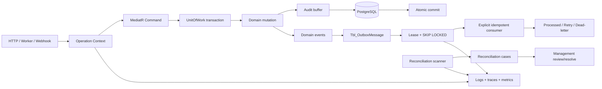
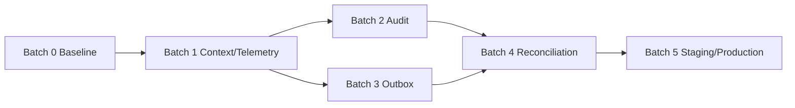

# P0 Execution Plan — Production Stability, Audit, Outbox và Reconciliation

> Trạng thái: `PLAN ONLY` — chưa phê duyệt implementation.
> Source baseline: commit `56f0fa6634569f71107e9f6e1334ae41bba0388c`, đối chiếu ngày 2026-08-22.
> Phạm vi: backend API, PostgreSQL integration tests, worker, telemetry, management operations và staging acceptance.

## 1. Mục tiêu

Đưa lõi Commerce hiện tại từ trạng thái “source đã có” sang trạng thái có thể vận hành và kiểm chứng được:

1. Mọi mutation quan trọng có audit nghiệp vụ nguyên tử, truy vết được actor và operation.
2. Domain event được lưu và dispatch theo outbox có lease, retry, dead-letter, idempotency và quan sát được.
3. Payment, Order, Inventory, Reservation và Shipment inconsistency được phát hiện, tạo case, phân công và giải quyết có kiểm soát.
4. PostgreSQL, worker và external callback có acceptance evidence; build pass không được dùng thay runtime proof.
5. Có dashboard, alert, runbook và rollback switch đủ để vận hành nhiều instance.

## 2. Ngoài phạm vi

- Không xây Promotion, Return/RMA, CMS hoặc Notification business module mới trong task này.
- Không thay đổi public storefront API.
- Không tự động refund, sửa tồn, mark Payment Paid hoặc đổi Order status bằng heuristic.
- Không triển khai generic admin database editor.
- Không thay đổi secret/payment credential hoặc apply migration khi chưa có approval riêng.
- Không mở rộng legacy aquaculture/IoT.

## 3. Baseline đã xác nhận từ source

### 3.1 Audit

| Thành phần | Hiện trạng |
| --- | --- |
| `AuditLog` | đã có actor, action, entity, before/after JSONB, correlation, occurred time, IP |
| EF configuration/migration | đã có `Tbl_AuditLog` và API query management |
| Writer/factory | **chưa có**; entity chỉ có private constructor |
| Coverage | chưa có cơ chế bắt buộc mutation phải tạo audit |
| Query DTO | chỉ trả metadata; không trả before/after/IP |
| Security event | là luồng riêng; không được thay thế bằng AuditLog |

### 3.2 Outbox

| Thành phần | Hiện trạng |
| --- | --- |
| Capture | `ConvertDomainEventsToOutboxInterceptor`, bật bằng `Outbox:Enabled` |
| Storage | `Tbl_OutboxMessage`, JSONB payload, retry, next attempt, lease, dead-letter |
| Claim | PostgreSQL `FOR UPDATE SKIP LOCKED`, batch và lease token |
| Retry | exponential delay giới hạn 1 giờ, max retry cấu hình |
| Worker | có `OutboxProcessorWorker`; mặc định configuration đang tắt |
| Tests | mới kiểm state transition của `OutboxMessage`; chưa chứng minh processor concurrency/atomicity bằng PostgreSQL |
| Events | `CommerceStateChangedEvent` và `InventoryChangedEvent` được tạo |
| Consumers | chưa tìm thấy `INotificationHandler<T>` cho hai event; publish không tạo business side effect |
| Contract risk | lưu assembly-qualified type name, dễ drift khi rename assembly/type |

### 3.3 Reconciliation

| Thành phần | Hiện trạng |
| --- | --- |
| Hosted IPN | mismatch/late/orphan có thể ghi `NeedsReconciliation` |
| VietQR webhook | cũng có disposition riêng nhưng không nằm trong management reconciliation query hiện tại |
| Management query | chỉ Hosted notification, tối đa 100 record, không paging/claim/resolve/history |
| Manual verification | `VerifyBankTransferCommand` chỉ áp dụng `PaymentMethod.BankTransfer`, không giải quyết SePay case |
| Inventory | có reservation expiry worker mỗi phút và PostgreSQL test tập trung |
| Cross-domain consistency | chưa có scanner/case cho Payment–Order–Reservation–Shipment mismatch |

### 3.4 Observability

| Thành phần | Hiện trạng |
| --- | --- |
| OpenTelemetry | tracing, metrics, OTLP/Prometheus đã có feature config |
| HTTP | structured logging và `X-Trace-Id` ở error boundary |
| MediatR logging | tạo correlation GUID mới cho mỗi request thay vì dùng Activity/HTTP trace xuyên suốt |
| Business metrics | `BusinessMetrics` tồn tại nhưng chưa được đăng ký/sử dụng; một số “Set” dùng UpDownCounter nên không phải absolute gauge |
| Readiness | kiểm DB và media; chưa phản ánh worker heartbeat, outbox backlog/dead-letter hoặc reconciliation backlog |
| Reservation worker | không có heartbeat/last-success/duration/backlog metrics |

## 4. Kiến trúc đích



### Quy tắc bất biến

- Business mutation và AuditLog commit cùng transaction.
- Domain mutation và OutboxMessage commit cùng transaction.
- External call không chạy trong transaction.
- Outbox delivery là at-least-once; consumer bắt buộc idempotent bằng `EventId`.
- Reconciliation scanner chỉ phát hiện/tạo case; không tự sửa tiền, tồn hoặc status.
- Resolution command là action cụ thể, có permission, concurrency stamp, audit và evidence.
- Log/metric không chứa JWT, cookie, secret, raw webhook, bank account, address hoặc PII không cần thiết.

## 5. Chuẩn đầu ra của mỗi batch

Mỗi batch phải giao đủ:

- Source và migration diff được review theo scope.
- Domain/Application/API build sạch.
- Focused unit/integration tests.
- PostgreSQL evidence nếu liên quan transaction, lock, index hoặc migration.
- Contract/permission/CSRF mapping nếu có management API.
- Metrics, structured logs và runbook cho worker/operation mới.
- Tài liệu cập nhật live-vs-roadmap.
- Không gọi `complete` nếu staging gate của batch chưa đạt.

## 6. Kế hoạch triển khai chi tiết

## Batch 0 — Baseline và acceptance harness

### Mục tiêu

Đóng băng facts trước khi thay đổi; tạo bộ kiểm thử/runsheet có thể lặp lại.

### Công việc

1. Ghi nhận Git HEAD, dirty worktree và effective environment target.
2. Inventory migration hiện tại, pending model changes và SQL script; không apply.
3. Chạy build theo layer: Domain → Application → Infrastructure → API.
4. Chạy Domain và non-PostgreSQL integration tests.
5. Chuẩn bị PostgreSQL test database riêng qua `ECOM_TEST_POSTGRES`.
6. Chạy current PostgreSQL suite và ghi rõ pass/skip/fail:
   - UnitOfWork commit/rollback/concurrency;
   - migration/constraints;
   - reservation expiry;
   - SePay IPN atomicity.
7. Tạo acceptance matrix cho các failure boundary:
   - exception trước commit;
   - handled `TResult` failure;
   - timeout/cancellation;
   - response mất sau commit;
   - duplicate webhook;
   - worker crash sau external success nhưng trước `ProcessedAt`;
   - two workers claim cùng backlog.
8. Snapshot operational config chỉ theo key/state, không ghi secret value.

### File/tài liệu dự kiến

- `Tests/Ecom.IntegrationTests/PostgreSql/*`
- `Tests/Ecom.IntegrationTests/Operations/*` mới
- `document/operations/P0-ACCEPTANCE-MATRIX.md` mới
- Không sửa entity/migration trong batch này.

### Gate hoàn thành

- Có baseline command/result reproducible.
- Mọi test bị skip có lý do và owner.
- Không còn câu hỏi “test DB nào” hoặc “worker/config nào đang chạy” trước Batch 1.

---

## Batch 1 — Operation context, telemetry và worker health

### Mục tiêu

Tạo một trace/correlation xuyên HTTP, MediatR, audit, outbox, worker và reconciliation.

### Thiết kế đã chốt

1. Thêm `IOperationContext` ở Application abstraction:
   - `TraceId` string lấy từ `Activity.Current.TraceId` hoặc safe generated ID;
   - optional `CorrelationId` GUID nội bộ cho DB;
   - `CausationId` cho outbox/worker;
   - actor user ID và source `Http|Worker|Webhook`.
2. Infrastructure implementation đọc Activity/HttpContext; worker tạo Activity mới cho mỗi batch/case.
3. Sửa `LoggingBehaviour` dùng operation context, không sinh correlation GUID độc lập.
4. Chuẩn hóa log properties: `TraceId`, `CorrelationId`, `RequestName`, `ActorUserId`, `OperationSource`, `Outcome`, `DurationMs`.
5. Thay `BusinessMetrics` bằng module metrics có semantic đúng:
   - counters: order created/cancelled, payment callback, audit write, outbox processed/retry/dead-letter, reconciliation opened/resolved;
   - histograms: command duration, outbox dispatch duration, reconciliation scan duration;
   - observable gauges: outbox pending/oldest age/dead-letter, reconciliation open count, reservation expired backlog;
   - không dùng user/order/payment ID làm metric label.
6. Thêm scoped worker heartbeat registry:
   - worker name, last started/succeeded/failed, duration, last error type;
   - không lưu raw exception message vào public health payload.
7. Health semantics:
   - `/livez`: chỉ phản ánh process còn sống;
   - `/readyz`: DB và dependency bắt buộc để nhận traffic;
   - `/healthz`: detailed operational checks được bảo vệ/giới hạn output phù hợp;
   - backlog/dead-letter cảnh báo `Degraded`, không gây restart loop mặc định.

### File dự kiến

- `Core/Ecom.Application/Common/Interfaces/IOperationContext.cs`
- `Infrastructure/Ecom.Infrastructure/Telemetry/OperationContext.cs`
- `Core/Ecom.Application/Common/Behaviours/LoggingBehaviour.cs`
- `Infrastructure/Ecom.Infrastructure/Metrics/CommerceOperationalMetrics.cs`
- `Infrastructure/Ecom.Infrastructure/HealthChecks/*WorkerHealthCheck.cs`
- `Infrastructure/Ecom.Infrastructure/Services/*Worker.cs`
- DI và tests tương ứng.

### Tests

- HTTP trace được giữ qua MediatR log scope.
- Worker tạo trace độc lập và gắn causation ID.
- Metric không có high-cardinality tag.
- readiness không lộ exception/connection string.
- degraded backlog không làm `/livez` fail.

### Gate

- Một request và một worker cycle truy được bằng cùng trace/correlation ở log.
- Prometheus/OTLP nhận metrics mới trong test/staging.

---

## Batch 2 — Atomic business audit

### Mục tiêu

Biến `AuditLog` từ read-only table thành audit trail có coverage bắt buộc cho mutation nhạy cảm.

### Kiến trúc đã chốt

Không dùng reflection để serialize toàn bộ ChangeTracker. Audit phải mang ý nghĩa nghiệp vụ và allowlist field.

1. Thêm `AuditLog.Create(...)` với validation/normalization.
2. Thêm `IRequiresBusinessAudit` marker cho command bắt buộc audit.
3. Thêm scoped `IBusinessAuditTrail.Record(AuditRecord)`:
   - handler ghi action/entity/resource và sanitized before/after snapshot;
   - chưa SaveChanges.
4. Thêm `BusinessAuditBehavior` nằm **bên trong** `UnitOfWorkBehavior`:
   - chỉ chạy cho `IRequiresBusinessAudit`;
   - nếu command success mà không có record thì fail closed;
   - materialize AuditLog trước commit;
   - handled failure/exception rollback, không tạo success audit.
5. Authorization failure/security abuse tiếp tục ghi `SecurityEvent`; không ép vào transactional business audit.
6. Before/After JSON chỉ chứa allowlisted operational facts; không ghi recipient address, phone, cookie, token, provider secret hoặc raw payload.

### Coverage P0 bắt buộc

| Domain | Action audit |
| --- | --- |
| Catalog | publish/pause/discontinue/restore/soft-delete Product; Category lifecycle |
| Producer | verify/publish/hide/update |
| Inventory | initialize/adjust/location update/return receipt |
| Order | confirm/cancel/internal note |
| Payment | manual verify/refund/reconciliation resolution |
| Shipment | prepare/start/complete/fail |
| System | typed setting update, management session revoke |
| Operations | outbox replay/dead-letter action, manual reconciliation scan |

### Action vocabulary

Tên ổn định dạng:

```text
catalog.product.publish
inventory.level.adjust
order.confirm
payment.refund
payment.reconciliation.resolve
system.setting.update
operations.outbox.replay
```

Không dùng class name hoặc localized message làm action code.

### Query/API

- Giữ route hiện tại `GET /management/audit-logs`.
- Bổ sung filter `action`, `correlationId`, paging/sort ổn định nếu chưa có.
- Detail chứa before/after chỉ mở bằng permission riêng hoặc `Audit.ReadSensitive`; nếu chưa duyệt permission thì không expose.
- Audit là append-only: không cung cấp PUT/DELETE.

### Tests

- Success mutation và AuditLog commit cùng transaction.
- Handled failure/exception/concurrency không để lại success audit.
- Command có marker nhưng quên `Record` phải fail và rollback.
- Sanitizer loại PII/secret field.
- Worker mutation có actor null nhưng source/correlation hợp lệ.
- Audit query 401/403/200 và không expose payload nhạy cảm.

### Schema impact

Batch có thể dùng cột hiện tại. Chỉ tạo migration nếu review xác nhận cần `Source`, `Outcome` hoặc index mới. Migration là approval gate riêng.

### Gate

- 100% command trong coverage matrix có automated audit assertion.
- Audit row truy ngược được trace và resource.

---

## Batch 3 — Outbox production hardening

### Mục tiêu

Giữ lại cơ chế lease/retry hiện có, bổ sung contract ổn định, test PostgreSQL, consumer rõ ràng và vận hành an toàn.

### 3A. Test cơ chế hiện tại trước khi sửa

- Domain mutation + OutboxMessage atomic commit.
- Rollback không để lại OutboxMessage.
- Hai processor đồng thời không claim cùng message.
- Lease expiry cho phép recovery sau worker crash.
- Retry delay/max retry/dead-letter đúng trên PostgreSQL.
- Cancellation không làm mất lease/message.
- Failure khi deserialize không làm worker loop chết.

### 3B. Tách capture và processor switch

Thay một `Outbox:Enabled` bằng hai gate:

```json
{
  "Outbox": {
    "CaptureEnabled": false,
    "ProcessorEnabled": false
  }
}
```

- Capture bật trước để chứng minh atomic write/backlog.
- Processor bật sau khi consumer và monitoring sẵn sàng.
- `ProcessorEnabled=true` khi `CaptureEnabled=false` phải fail startup validation.
- Đây là runtime configuration change, cần approval.

### 3C. Event envelope ổn định

Không tiếp tục dùng assembly-qualified type làm public persistence contract.

Envelope mục tiêu:

| Field | Ý nghĩa |
| --- | --- |
| EventId | idempotency key |
| EventName | stable code, ví dụ `commerce.order.state-changed` |
| EventVersion | schema version integer |
| OccurredOn | domain time |
| CorrelationId | operation correlation |
| CausationId | request/event gây ra event này |
| AggregateType/Id | routing/diagnostics |
| Payload | sanitized versioned JSON |

- Dùng explicit event registry `EventName + Version → CLR type`.
- Unknown version phải dead-letter với safe reason, không silently processed.
- Nếu thêm cột/migrate data thì cần migration approval và compatibility test với message cũ.

### 3D. Consumer contract

- Dùng explicit `IOutboxEventHandler<TEvent>`; không coi `IPublisher` không có handler là thành công.
- Mỗi persisted event phải có ít nhất một registered consumer hoặc được đánh dấu `RecordOnly` có chủ đích.
- Consumer external dùng `EventId` làm provider idempotency key khi provider hỗ trợ.
- Crash sau external success/trước mark processed phải replay an toàn.
- Consumer nội bộ DB và mark processed cần cùng transaction khi khả thi.
- Không thêm email/carrier/payment action mới ngoài scope; P0 consumer đầu tiên chỉ được chọn từ use case đã phê duyệt.

### 3E. Operations

- Management read: pending age, retry, dead-letter metadata; không trả payload mặc định.
- Replay command yêu cầu permission, CSRF, reason và audit.
- Replay reset state có concurrency/lease guard; không replay message đang leased.
- Purge/retention chỉ áp dụng processed message theo policy; dead-letter không tự xóa.

### Metrics/alerts

- `outbox_pending_count`, `outbox_oldest_pending_age_seconds`.
- `outbox_dispatch_total{event,outcome}` với event name bounded.
- `outbox_retry_total`, `outbox_dead_letter_count`.
- Alert: oldest age vượt SLO, dead-letter > 0, worker heartbeat stale.

### Tests

- PostgreSQL claim/lease/multi-instance.
- Legacy envelope compatibility.
- Handler missing/unknown event version → dead-letter.
- Duplicate replay không tạo duplicate side effect.
- Management read/replay auth, CSRF, audit.

### Gate

- Capture chạy staging tối thiểu một observation window không mất event.
- Processor canary dispatch đúng, duplicate-safe.
- Multi-instance claim test pass trước scale-out.

---

## Batch 4 — Reconciliation case management

### Mục tiêu

Thay danh sách `NeedsReconciliation` rời rạc bằng case có lifecycle, owner, evidence và action rõ ràng.

### Aggregate mới đề xuất

`CommerceReconciliationCase`:

| Field | Mục đích |
| --- | --- |
| Id/CaseNumber | định danh vận hành |
| Domain | Payment, Order, Inventory, Reservation, Shipment |
| CaseType | stable mismatch code |
| Fingerprint | unique dedupe key cho cùng issue |
| Severity | Critical/High/Medium/Low |
| Status | Open/InReview/Resolved/Ignored |
| ResourceType/ResourceId | aggregate chính |
| RelatedResourceIds | sanitized JSON hoặc links chuẩn hóa |
| Evidence | sanitized facts, không raw webhook/PII |
| AssignedToUserId | operator |
| ResolutionCode/Note | kết quả có vocabulary |
| DetectedAt/LastSeenAt/ResolvedAt | timeline |
| ConcurrencyStamp | optimistic concurrency |

Thêm `ReconciliationCaseHistory` append-only cho transition/actor/time/reason.

### Case types P0

**Payment**

- `PAYMENT_AMOUNT_MISMATCH`
- `PAYMENT_REFERENCE_MISMATCH`
- `PAYMENT_ORPHAN_NOTIFICATION`
- `PAYMENT_LATE_AFTER_ORDER_CANCELLED`
- `PAYMENT_PROVIDER_PAID_LOCAL_PENDING`
- `PAYMENT_LOCAL_PAID_PROVIDER_UNCONFIRMED`
- `PAYMENT_DUPLICATE_EXTERNAL_TRANSACTION`

**Order/Inventory**

- `ORDER_PAID_BUT_CANCELLED`
- `ORDER_PENDING_WITH_EXPIRED_RESERVATION`
- `ORDER_TRACKED_ITEM_WITHOUT_ACTIVE_RESERVATION`
- `RESERVATION_ACTIVE_FOR_TERMINAL_ORDER`
- `INVENTORY_AVAILABLE_NEGATIVE`
- `SHIPMENT_SHIPPED_WITHOUT_RESERVATION_CONSUMPTION`

### Scanner design

1. Read-only detector query theo batch/cursor.
2. Dùng PostgreSQL transaction advisory lock theo khóa cố định `commerce-reconciliation-scan` để tránh scan trùng giữa instance.
3. Upsert case theo stable fingerprint; lần thấy lại chỉ cập nhật `LastSeenAt`/evidence safe.
4. Scanner không repair.
5. Existing ReservationExpiryCommand tiếp tục là lifecycle command, không bị thay bằng scanner.

### API đề xuất

```text
GET  /api/v1/management/reconciliation/cases
GET  /api/v1/management/reconciliation/cases/{id}
POST /api/v1/management/reconciliation/cases/{id}/assign
POST /api/v1/management/reconciliation/cases/{id}/resolve
POST /api/v1/management/reconciliation/cases/{id}/ignore
POST /api/v1/management/reconciliation/scans
```

Tất cả mutation: Bearer + dedicated policy + CSRF + concurrency stamp + reason + business audit.

### Resolution actions

Không có generic `set-status`. Chỉ cho action có invariant riêng:

- `ConfirmPaymentFromVerifiedEvidence` — exact order/reference/amount/currency, lock Payment/Order/attempt.
- `MarkRefundRequired` — tạo state/case follow-up, không tự gọi provider trong transaction.
- `LinkNotificationToAttempt` — chỉ khi unique deterministic match.
- `AcknowledgeNoFinancialImpact` — reason bắt buộc.
- `ReleaseStaleReservation` — gọi inventory lifecycle service, không chỉnh balance trực tiếp.
- `EscalateForManualInvestigation` — không đổi business state.

Action chưa có provider evidence đủ phải dừng ở `InReview`, không “force Paid”.

### Hosted + VietQR unification

- Ingest cả `PaymentGatewayNotification` và `PaymentBankQrWebhookNotification`.
- Management list không giới hạn hard-coded 100; dùng paging/filter/sort.
- Preserve source notification ID/type/provider, nhưng response không trả raw signature/account data.
- Giữ compatibility cho `/management/payments/sepay/reconciliation` và chuyển implementation thành filtered projection của case mới; route tổng quát mới cần API approval.

### Tests

- Scanner idempotent/multi-instance.
- Same issue không tạo duplicate case.
- Resolution stale stamp → 409.
- Confirm Paid exact match atomic với PaymentTransaction/attempt/case history/audit.
- Failure rollback toàn bộ.
- Refund-required không tự restock.
- QR và Hosted đều xuất hiện.
- Ownership/policy/CSRF 401/403/400/409/200.
- Evidence serialization không chứa raw payload/PII.

### Schema/permission impact

- Aggregate, configuration, migration, DbContext và permissions mới.
- Đây là protected scope; cần approval trước implementation và approval riêng trước apply migration.

### Gate

- Staging seed được ít nhất mỗi case type trọng yếu.
- Operator xử lý end-to-end và audit được toàn timeline.
- Không có resolution action sửa tiền/tồn ngoài domain invariant.

---

## Batch 5 — Production acceptance, canary và runbook

### 5.1 Staging gates

1. Review migration SQL; xác nhận không DROP/TRUNCATE/data-loss.
2. Apply migration staging sau approval; chạy pending-model check.
3. Enable OpenTelemetry/metrics với secret exporter được quản lý ngoài source.
4. Bật `CaptureEnabled=true`, `ProcessorEnabled=false`.
5. Chạy transaction/outbox load và quan sát backlog.
6. Bật processor trên một instance canary.
7. Test crash/restart/lease recovery và duplicate-safe consumer.
8. Bật reconciliation scanner read-only; so khớp result bằng SQL/read model.
9. Test operator resolution trên dữ liệu staging.
10. Chạy API/BFF CSRF và permission acceptance.

### 5.2 Production rollout

- Deploy schema-compatible code trước.
- Apply forward migration theo change window/backup plan.
- Capture canary → processor canary → multi-instance.
- Reconciliation scanner ban đầu manual, sau đó scheduled khi false-positive rate đạt gate.
- Alert/on-call owner được xác nhận trước enable.

### 5.3 Rollback

- Có thể tắt processor mà vẫn giữ capture để không mất event.
- Có thể tắt scheduled scan mà không xóa open case.
- Không rollback migration bằng destructive Down trong production; deploy forward fix.
- Nếu consumer lỗi: stop processor, giữ lease expiry/backlog, không delete message.
- Nếu reconciliation false-positive: stop scanner; case giữ nguyên, không auto-resolve.

### 5.4 Runbook bắt buộc

- Outbox backlog tăng/worker heartbeat stale.
- Dead-letter inspect/replay.
- Payment late/mismatch/orphan callback.
- Negative inventory/reservation mismatch.
- Reservation expiry worker failure.
- Audit missing/failed transaction.
- OTLP unavailable nhưng API vẫn phục vụ theo policy.

### Go/No-Go

**Go khi:** PostgreSQL tests pass; migration reviewed/applied staging; audit coverage pass; outbox multi-worker/duplicate test pass; dashboards/alerts/runbooks có owner; reconciliation không auto-repair.

**No-Go khi:** PostgreSQL tests skip; worker không có heartbeat; unknown event silently processed; raw payload/secret bị log; duplicate callback tạo duplicate transition; migration chưa review; không có rollback switch.

## 7. Thứ tự phụ thuộc



Batch 2 và 3 có thể phát triển song song sau Batch 1 nhưng không chỉnh cùng DI/UoW/migration file cùng lúc. Integration do một owner thực hiện.

## 8. Work breakdown và phạm vi commit

| Commit đề xuất | Nội dung | Schema/API risk |
| --- | --- | --- |
| `test(operations): establish production acceptance baseline` | harness và current behavior tests | thấp |
| `feat(observability): unify operation context and worker telemetry` | trace/metrics/health | config trung bình |
| `feat(audit): add atomic business audit coverage` | audit factory/buffer/behavior/commands | API/permission tùy detail |
| `test(outbox): verify postgres claim lease and atomicity` | test hiện trạng | thấp |
| `feat(outbox): version envelope and split capture processor gates` | envelope/config/processor | schema/config cao |
| `feat(operations): add outbox dead-letter management` | management query/replay/audit | API/permission cao |
| `feat(reconciliation): add commerce reconciliation cases` | entity/API/scanner/resolution | schema/API/permission cao |
| `docs(operations): add rollout and incident runbooks` | operating docs | thấp |

Không gộp migration, permission, worker behavior và resolution actions vào một commit lớn.

## 9. Verification matrix

| Layer | Verification |
| --- | --- |
| Domain | AuditLog factory; reconciliation state machine; outbox envelope/value invariants |
| Application | marker/audit behavior; resolution handler; failure/rollback; authorization |
| Infrastructure | PostgreSQL claim/lease/index; scanner lock; interceptor atomicity |
| API | 401/403, CSRF, paging/filter, 409 concurrency, safe error contract |
| Worker | cancellation, crash recovery, heartbeat, retry/dead-letter |
| Security | secret/PII redaction, permission seeding, no raw webhook payload |
| Observability | trace propagation, bounded labels, dashboard/alert signal |
| Staging | migration, multi-instance, SePay sandbox callback, restart/replay |

## 10. Acceptance scenarios bắt buộc

1. Inventory adjustment success → level + movement + audit + outbox commit một lần.
2. Inventory adjustment handled failure → không level/movement/audit/outbox nào commit.
3. Create Order response mất sau commit → retry idempotent, không duplicate order/reservation/audit event.
4. Duplicate SePay notification → một financial transition, notification/case dedupe đúng.
5. Late SePay payment sau Order cancel → case Open, không auto Paid/restore stock.
6. Worker A claim rồi chết → sau lease, Worker B xử lý; side effect không duplicate.
7. Unknown event version → dead-letter và alert, không mark processed thành công.
8. Audit-required handler quên record → transaction rollback và test fail.
9. Scanner chạy hai instance → một case/fingerprint.
10. Operator stale concurrency stamp → 409, không resolution/audit partial.
11. OTLP down → behavior theo policy, không log secret và không làm mất DB transaction.
12. Outbox processor disabled → capture vẫn tiếp tục, backlog metric tăng có kiểm soát.

## 11. Approval gates cần người dùng xác nhận

### Gate A — Code-only, không schema/public API

- Batch 0 baseline tests.
- Batch 1 operation context/metrics/health nội bộ.
- Batch 2 audit factory/writer cho existing table nếu không thêm cột/permission.

### Gate B — Protected code/config

- Split `Outbox:CaptureEnabled`/`ProcessorEnabled`.
- Thay đổi permission hoặc management response detail.
- Worker startup/readiness behavior.

### Gate C — Schema/public API

- Outbox version/correlation columns/index.
- `CommerceReconciliationCase` và history tables.
- Management reconciliation/outbox endpoints và permissions.

### Gate D — Environment mutation

- Generate/apply migration staging/production.
- Enable outbox/telemetry/scanner.
- SePay sandbox/production operational test.

Không vượt qua Gate B/C/D chỉ vì kế hoạch này đã được chấp thuận về mặt nội dung.

## 12. Definition of Done toàn task

- Audit coverage matrix tự động pass và audit commit atomic.
- Outbox capture/processor tách gate, PostgreSQL multi-instance tests pass, dead-letter/replay có audit.
- Event contract versioned; missing consumer/unknown version không silently success.
- Hosted + VietQR reconciliation thống nhất thành case, có lifecycle/history/concurrency.
- Scanner không auto-repair; resolution action có invariant cụ thể.
- Trace/log/metric nối được request→transaction→outbox→case.
- PostgreSQL, staging migration, callback, worker restart và multi-instance evidence được lưu.
- Dashboard/alert/runbook có owner và threshold.
- Không lộ secret/PII/raw provider payload.
- Tài liệu Source of Truth cập nhật trạng thái `Implemented` chỉ sau các gate tương ứng.

## 13. Bước triển khai đầu tiên được khuyến nghị

Bắt đầu bằng **Batch 0**, sau đó thực hiện **Batch 1**. Không bắt đầu từ migration reconciliation hoặc bật Outbox ngay. Sau khi baseline và telemetry đạt gate, triển khai Batch 2 và 3; chỉ tạo schema/API reconciliation khi audit và outbox đã đủ khả năng truy vết.
