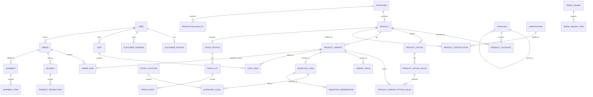
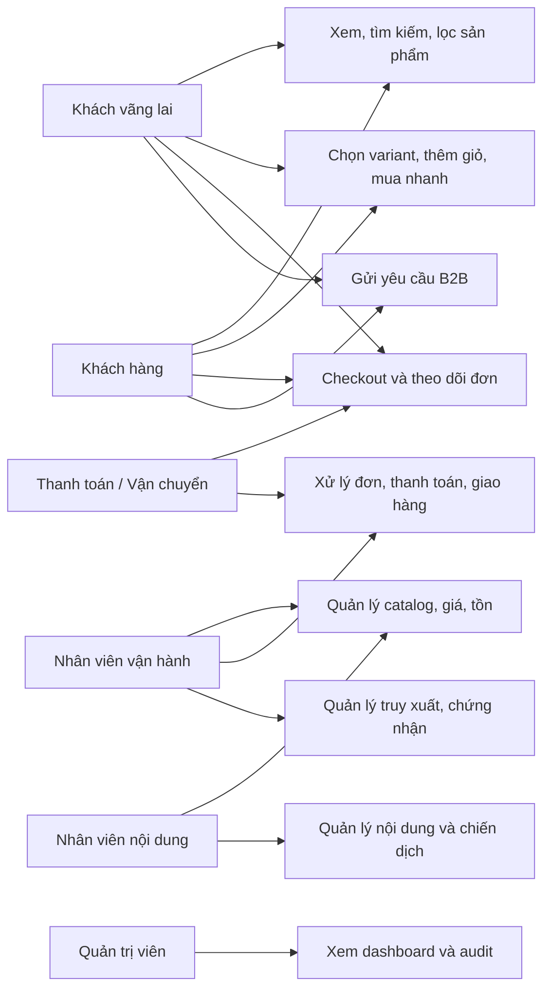

# Báo cáo tổng hợp thiết kế cơ sở dữ liệu quan hệ 3NF

**Dự án:** Thạnh Hóa Digital Commerce Platform  
**Trạng thái:** Phương án thiết kế chờ phê duyệt; không phải migration hoặc hợp đồng API đã hiệu lực  
**Ngày:** 2026-07-16  
**Phạm vi:** Website thương mại điện tử sản phẩm địa phương và công cụ vận hành tập trung ở giai đoạn hiện tại.

## 1. Nguồn, phạm vi và kết luận kiến trúc

Báo cáo tổng hợp từ:

- [Đặc tả nghiệp vụ cho AI Agent](AI-AGENT-DAC-TA-NGHIEP-VU-CHUC-NANG-THANH-HOA.md): phạm vi, quy tắc, câu hỏi mở và các use case.
- [Báo cáo đề xuất chức năng](Bao-cao-de-xuat-chuc-nang.md): lộ trình MVP, mở rộng và định vị sản phẩm địa phương.
- [Decision log Product - Variant - Price - Inventory](THANH-HOA-PRODUCT-VARIANT-PRICE-INVENTORY-DECISION-LOG.md): kết quả đối chiếu Medusa/Vendure và các quyết định PVI-01 đến PVI-09.
- Hiện trạng source: `BaseEntity`, Identity/RBAC và EF Core PostgreSQL đã có sẵn.

Mô hình đề xuất là **single-platform commerce**: đội vận hành trung tâm tạo và kiểm duyệt dữ liệu, quản lý đơn hàng và nội dung. `Producer` là đối tượng nghiệp vụ công khai nhưng **chưa** là seller tự vận hành. Vì vậy không tạo các bảng marketplace như seller account, seller order, commission, payout hoặc settlement trong MVP.

## 2. Quy ước dữ liệu chung

Mỗi thực thể lưu trữ mới kế thừa quy ước đang có trong `BaseEntity`:

| Nhóm trường | Quy tắc |
|---|---|
| Định danh | `Id uuid` là PK; `No` là số nội bộ có thể tăng dần, không dùng làm khóa nghiệp vụ. |
| Audit | `CreatedAt`, `CreatedBy`, `UpdatedAt`, `UpdatedBy`. |
| Xóa | `IsDeleted`, `DeletedAt`, `DeletedBy`; không hard-delete dữ liệu đã phát sinh giao dịch hoặc công khai. |
| Đồng thời | `ConcurrencyStamp` để phát hiện ghi đè; checkout/tồn kho dùng transaction và reservation. |
| Thời gian | PostgreSQL `timestamp with time zone`; thời gian luôn là UTC khi lưu. |
| Tiền | `numeric(18,2)` cho VND; không dùng `float`/`double`. |
| Mã nghiệp vụ | `varchar` có constraint hoặc enum string theo chuẩn đã chốt; trạng thái Order, Payment và Shipment là ba miền độc lập. |
| Quan hệ | FK thật và bảng nối cho many-to-many; không chứa danh sách ID trong một cột hoặc JSONB. JSONB chỉ dùng cho metadata/payload ngoài lõi. |

## 3. Danh mục bảng đề xuất

### 3.1 Identity và khách hàng

| Bảng | Trạng thái | Mục đích và quan hệ chính |
|---|---|---|
| `Tbl_User` | Có sẵn, tái sử dụng | Danh tính đăng nhập; 0..1 `CustomerProfile`, 1..n địa chỉ, giỏ, wishlist, review và notification. |
| `Tbl_Role`, `Tbl_Policy`, `Tbl_RolePolicy`, `Tbl_UserPolicy` | Có sẵn, tái sử dụng | RBAC nội bộ; không tạo role seller cho MVP. |
| `Tbl_JwtRefreshToken`, `Tbl_OtpToken`, `Tbl_UserDeviceToken` | Có sẵn, tái sử dụng | Phiên, OTP và thiết bị thông báo. |
| `Tbl_Permission` | Có sẵn, cần rà soát | Không mở rộng cho commerce trước khi thống nhất với cơ chế Policy/RBAC hiện hữu. |
| `Tbl_CustomerProfile` | Mới | Mở rộng hồ sơ mua hàng 1:1 với `User`; không nhồi thông tin khách hàng vào `User`. |
| `Tbl_AdministrativeArea` | Mới | Danh mục địa giới cha-con (tỉnh/huyện/xã) dùng cho địa chỉ, phí/vùng giao hàng sau này. |
| `Tbl_CustomerAddress` | Mới | Sổ địa chỉ 1:n của User; FK `AdministrativeAreaId`, địa chỉ chi tiết, người nhận, số điện thoại, `IsDefault`. |

`Order.UserId` được phép null để hỗ trợ khách vãng lai. Thông tin người nhận/giao hàng tại thời điểm đặt được snapshot trên Order, không chỉ tham chiếu `CustomerAddress`.

### 3.2 Producer, địa điểm và bản đồ

| Bảng | Mục đích và quan hệ chính |
|---|---|
| `Tbl_Producer` | Đơn vị sản xuất; 1:n Product, Facility, Contact và Certification. |
| `Tbl_ProducerContact` | Nhiều đầu mối theo loại liên hệ; không lưu nhiều số điện thoại/email trong một cột Producer. |
| `Tbl_ProductionFacility` | Cơ sở sản xuất của Producer; địa chỉ, tọa độ, trạng thái công khai; có thể gắn chứng nhận. |
| `Tbl_PointOfSale` | Điểm bán/giới thiệu công khai, có thể độc lập hoặc thuộc Producer. |
| `Tbl_PointOfSaleProduct` | Nối PointOfSale - Product; xác định sản phẩm nào có tại điểm bán. |

### 3.3 Catalog, biến thể và media

| Bảng | Mục đích và quy tắc |
|---|---|
| `Tbl_Category` | Danh mục phân cấp bằng `ParentId`; chỉ danh mục công khai mới xuất hiện ở storefront. |
| `Tbl_Product` | Nội dung catalog: Producer, tên, slug, mô tả, trạng thái xuất bản/ngừng bán. Không có SKU, giá hay tồn kho là nguồn thật. |
| `Tbl_ProductCategory` | Nối Product - Category; unique `(ProductId, CategoryId)`, một category chính cho SEO/điều hướng. |
| `Tbl_ProductSlugHistory` | Giữ slug cũ để redirect URL công khai, tránh mất SEO. |
| `Tbl_ProductOption` | Tùy chọn được định nghĩa cho Product, ví dụ quy cách/khối lượng. |
| `Tbl_ProductOptionValue` | Giá trị cho một option, ví dụ 500g/1kg. |
| `Tbl_ProductVariant` | Đơn vị có thể bán: Product, SKU, trạng thái bán, mode tồn kho, cho phép backorder hay không. |
| `Tbl_ProductVariantOptionValue` | Bảng nối Variant - OptionValue; tạo tổ hợp quy cách rõ ràng. |
| `Tbl_MediaAsset` | Metadata media/file, URL storage, media type, alt text, trạng thái quét/duyệt; không lưu blob trong PostgreSQL. |
| `Tbl_ProductMedia` | Nối Product - MediaAsset, thứ tự hiển thị, cờ ảnh đại diện. |

### 3.4 Giá, khuyến mại và tồn kho

| Bảng | Mục đích và quy tắc |
|---|---|
| `Tbl_PriceList` | Nhóm giá có hiệu lực theo thời gian; để trống trong MVP nếu chỉ có một giá VND công khai. |
| `Tbl_VariantPrice` | Giá của Variant theo currency, hiệu lực, mức số lượng và PriceList tùy chọn. Không cập nhật đè giá đã dùng cho đơn. |
| `Tbl_Promotion` | Quy tắc chương trình khuyến mại do hệ thống vận hành. |
| `Tbl_Coupon` | Mã giảm giá, giới hạn sử dụng, hiệu lực và trạng thái. |
| `Tbl_CouponProduct`, `Tbl_CouponCategory` | Phạm vi coupon bằng FK/bảng nối, không lưu danh sách product/category trong text. |
| `Tbl_CouponRedemption` | Lịch sử một khách/đơn đã dùng coupon; phục vụ giới hạn và audit. |
| `Tbl_StockLocation` | Vị trí tồn kho do platform quản lý; chỉ cần khi đã chốt quản lý số lượng thực. |
| `Tbl_InventoryItem` | Liên kết 1:1 với ProductVariant được theo dõi tồn; có `RequiresShipping`. |
| `Tbl_InventoryLevel` | Tồn theo Item - Location: stocked, reserved, incoming; unique `(InventoryItemId, StockLocationId)`. |
| `Tbl_InventoryReservation` | Số lượng giữ chỗ cho OrderItem, có state và expiry; chống bán vượt tồn. |
| `Tbl_InventoryMovement` | Ledger append-only cho nhập, xuất, điều chỉnh, release reservation và lý do. |

`StockLocation`, `Inventory*` chỉ được tạo khi đội dự án chọn quản lý số lượng thực. Nếu chỉ còn/hết hàng, `ProductVariant.InventoryMode = NotTracked` và trạng thái bán là đủ.

### 3.5 Đơn hàng, thanh toán và giao hàng

| Bảng | Mục đích và quy tắc |
|---|---|
| `Tbl_Cart` | Giỏ của User hoặc guest token; trạng thái active/converted/expired. |
| `Tbl_CartItem` | FK tới Cart và ProductVariant, quantity; giá hiển thị luôn được tính lại khi checkout. |
| `Tbl_Order` | Giao dịch chính: mã đơn unique, User nullable, snapshot người nhận/địa chỉ, tổng tiền, trạng thái đơn hiện hành. |
| `Tbl_OrderItem` | Dòng hàng, FK Variant và snapshot tên/SKU/quy cách/đơn giá/giảm giá/thuế nếu có; lịch sử không bị thay đổi khi catalog đổi. |
| `Tbl_OrderStatusHistory` | Chuyển trạng thái, actor, lý do, timestamp; mỗi transition hợp lệ phải có bản ghi. |
| `Tbl_OrderNote` | Ghi chú nội bộ hoặc khách hàng, phân loại rõ mức hiển thị. |
| `Tbl_OrderDiscount` | Discount snapshot theo Order/OrderItem, Promotion/Coupon nullable; không tính lại báo cáo từ giá hiện hành. |
| `Tbl_Payment` | Ý định/đối tượng thanh toán của Order; trạng thái thanh toán độc lập Order. |
| `Tbl_PaymentTransaction` | Nhiều giao dịch provider/manual proof cho một Payment, mã tham chiếu unique khi có. |
| `Tbl_Shipment` | Một hay nhiều đợt giao của Order, phương thức, tracking code, trạng thái giao hàng. |
| `Tbl_ShipmentItem` | Nối Shipment - OrderItem, hỗ trợ giao một phần khi cần. |
| `Tbl_ShipmentHistory` | Lịch sử giao/trả thất bại/giao lại, lý do và người/hệ thống cập nhật. |

`PaymentRefund`, `OrderReturn` và `ReturnItem` chỉ thêm sau khi chính sách đổi trả/hoàn tiền được phê duyệt; không tạo bảng “dự phòng” không có nghiệp vụ xác nhận.

### 3.6 Niềm tin sản phẩm, truy xuất và tương tác

| Bảng | Mục đích và quan hệ chính |
|---|---|
| `Tbl_Certification` | Chứng nhận chính: loại, đơn vị cấp, số chứng nhận, hiệu lực, trạng thái xác minh. |
| `Tbl_CertificationEvidence` | Tệp/chứng cứ của chứng nhận qua FK MediaAsset. |
| `Tbl_ProductCertification` | Chứng nhận áp dụng cho Product. |
| `Tbl_ProducerCertification` | Chứng nhận áp dụng cho Producer. |
| `Tbl_FacilityCertification` | Chứng nhận áp dụng cho ProductionFacility. |
| `Tbl_TraceProfile` | Hồ sơ QR/public code của Product, trạng thái công khai và mô tả nguồn gốc. |
| `Tbl_TraceLot` | Lô truy xuất thuộc TraceProfile; mã lô, ngày sản xuất/hạn dùng khi áp dụng. |
| `Tbl_TraceEvent` | Sự kiện chuỗi giá trị của lô: nguyên liệu/sản xuất/đóng gói/kiểm tra/phân phối. |
| `Tbl_TraceEventEvidence` | Chứng cứ media/file cho sự kiện truy xuất. |
| `Tbl_Wishlist` | Danh sách yêu thích của User. |
| `Tbl_WishlistItem` | Nối Wishlist - Product, unique active pair. |
| `Tbl_ProductReview` | Đánh giá Product của User, moderation state; có thể FK `OrderItemId` khi chỉ cho người đã mua đánh giá. |
| `Tbl_ProductReviewMedia` | Media đính kèm review. |
| `Tbl_ProductQuestion` | Câu hỏi công khai/đang duyệt về Product. |
| `Tbl_ProductAnswer` | Câu trả lời cho Question, actor và trạng thái hiển thị. |
| `Tbl_NewsletterSubscription` | Đăng ký ưu đãi, consent, nguồn và trạng thái unsubscribe. |

Không dùng `TargetType/TargetId` cho Certification vì sẽ mất FK. Ba bảng liên kết theo phạm vi Product/Producer/Facility đảm bảo toàn vẹn tham chiếu.

### 3.7 Nội dung, SEO và trang chủ

| Bảng | Mục đích và quy tắc |
|---|---|
| `Tbl_Page` | Trang tĩnh như giới thiệu địa phương; trạng thái draft/review/published, slug, lịch sử xuất bản. |
| `Tbl_PageSection` | Khối nội dung thuộc Page; `SectionType`, display order và cấu hình presentation tối thiểu. |
| `Tbl_PageSectionProduct` | Nối một block trang với các Product được chọn thủ công. |
| `Tbl_Article` | Tin tức, sự kiện, xúc tiến; tác giả, trạng thái duyệt/xuất bản, slug, thời điểm hiệu lực. |
| `Tbl_ArticleCategory`, `Tbl_ArticleCategoryMap` | Phân loại nhiều-nhiều bài viết. |
| `Tbl_Campaign` | Chiến dịch theo mùa/sự kiện; thời gian hiệu lực và trạng thái. |
| `Tbl_Banner` | Banner thuộc Campaign tùy chọn, MediaAsset, alt text, target URL, lịch hiển thị và thứ tự. |
| `Tbl_NavigationItem` | Cây menu công khai/nội bộ, parent-child, URL hoặc Page FK theo quy tắc xác thực. |
| `Tbl_SeoRedirect` | Redirect slug/URL cũ đến resource/URL hợp lệ; dùng riêng cho các resource ngoài Product. |

Trường SEO tiêu chuẩn (`MetaTitle`, `MetaDescription`, canonical) nằm trực tiếp trên Product, Page và Article để giữ FK/schema đơn giản; không tạo bảng SEO đa hình trong MVP.

### 3.8 B2B, vận hành và đo lường

| Bảng | Mục đích và quan hệ chính |
|---|---|
| `Tbl_TradeInquiry` | Lead mua số lượng lớn/hợp tác; thông tin liên hệ, nhu cầu, trạng thái, nhân viên xử lý. |
| `Tbl_TradeInquiryItem` | Product/Variant quan tâm, quantity, yêu cầu quy cách. |
| `Tbl_TradeInquiryStatusHistory` | Lịch sử nhận/đang xử lý/đã phản hồi/đóng và lý do. |
| `Tbl_PartnerApplication` | Đăng ký đại lý/nhà phân phối/hợp tác; không tạo user seller. |
| `Tbl_InquiryAttachment` | Tài liệu B2B qua MediaAsset, visibility nội bộ. |
| `Tbl_Notification` | Thông báo nghiệp vụ chuẩn, payload tối thiểu, trạng thái. |
| `Tbl_UserNotification` | Nối Notification - User, read/delivery state. |
| `Tbl_AuditLog` | Nhật ký kỹ thuật/audit; không thay thế history table của Order, Payment, Shipment hay Inquiry. |
| `Tbl_SystemSetting` | Cấu hình platform có kiểm soát và audit, không lưu secret plaintext. |
| `Tbl_VisitorSession` | Phiên truy cập đã được xử lý quyền riêng tư/consent, nguồn truy cập và UTM. |
| `Tbl_AnalyticsEvent` | Event thống kê: loại event, timestamp, `ProductId`/`CampaignId` nullable, path và session. |

Dashboard/report dùng query, view hoặc materialized view sau khi có số liệu thực; không tạo bảng tổng hợp doanh thu cố định ở MVP.

## 4. Quan hệ toàn cục

### Cardinality and delete policy

| Quan hệ | Quy tắc |
|---|---|
| Producer - Product | 1:n. Không xóa Producer khi còn Product public hoặc OrderItem lịch sử; chuyển inactive/hidden. |
| Product - Variant | 1:n. Không hard-delete Variant từng xuất hiện ở Cart/Order; ngừng bán. |
| Variant - Price | 1:n theo hiệu lực; không sửa giá lịch sử. |
| Variant - InventoryItem | 0..1:1; chỉ tồn tại khi theo dõi tồn thực. |
| Order - OrderItem | 1:n; OrderItem snapshot giữ nguyên cho báo cáo, kể cả Variant đã ngừng bán. |
| Order - Payment / Shipment | 1:n để hỗ trợ retry payment và giao một phần; trạng thái tổng hợp nằm trên Order. |
| Certification - target | n:n qua bảng liên kết có FK thật; không liên kết đa hình. |
| Product - Category | n:n qua ProductCategory; một dòng được đánh dấu primary. |

## 5. Mô hình use case

| Use case | Actor | Bảng ghi chính | Bảng đọc/chính sách |
|---|---|---|---|
| UC-01 Khám phá sản phẩm | Guest, Customer | `VisitorSession`, `AnalyticsEvent` | Product/Variant/Price/Category/Certification/TraceProfile; chỉ đọc dữ liệu public, valid và còn hiệu lực. |
| UC-02 Chọn quy cách và thêm giỏ | Guest, Customer | Cart, CartItem | VariantOptionValue, VariantPrice, InventoryLevel; cart không phải cam kết giữ hàng nếu chưa có policy reservation. |
| UC-03 Checkout | Guest, Customer | Order, OrderItem, OrderDiscount, Payment, Shipment, Reservation | Tính lại giá, coupon, tồn và địa chỉ trong transaction; snapshot dữ liệu giao dịch. |
| UC-04 Xác nhận/chuyển trạng thái đơn | Staff, External | OrderStatusHistory, PaymentTransaction, ShipmentHistory, Notification | State machine kiểm tra transition, concurrency stamp, lý do hủy/thất bại. |
| UC-05 Quản lý sản phẩm | Content, Staff | Product/Variant/Option/Media/Category | Draft -> review -> published; không cho publish nếu thiếu dữ liệu bán/trust bắt buộc. |
| UC-06 Quản lý giá và khuyến mại | Staff | VariantPrice, PriceList, Promotion, Coupon | Không chồng giá hiệu lực; không ghi đè OrderItem snapshot. |
| UC-07 Điều chỉnh tồn | Staff | InventoryMovement, InventoryLevel | Chỉ khi PVI-06 được phê duyệt; mọi điều chỉnh có lý do/audit. |
| UC-08 Truy xuất và xác thực | Content, Staff | Certification, Evidence, links, TraceLot, TraceEvent | Chỉ hiện nhãn xác minh khi chứng nhận còn hiệu lực và đã duyệt. |
| UC-09 Review/Q&A | Customer, Staff | Review, Question, Answer | Review qua moderation và chính sách “đã mua”; không công khai trước duyệt. |
| UC-10 Lead B2B | Guest, Customer, Staff | TradeInquiry, TradeInquiryItem, StatusHistory, PartnerApplication | Đây là tiếp nhận/điều phối lead, không tạo seller hay công nợ marketplace. |
| UC-11 Nội dung/chiến dịch | Content, Admin | Page, Article, Banner, Campaign, Navigation | Chỉ hiển thị khi published và trong thời gian hiệu lực. |
| UC-12 Báo cáo | Admin | AnalyticsEvent, VisitorSession, AuditLog | Sales dùng snapshot Order/Payment, không dùng giá Product hiện tại. |

## 6. Quy tắc toàn vẹn và 3NF bắt buộc

1. Product, Variant, Price, Inventory là bốn khái niệm độc lập; chỉ Variant được bán.
2. Một giá trị có nhiều giá theo thời gian/phạm vi phải có bảng giá, không thêm `SalePrice` vào Product.
3. Danh mục, coupon scope, option và chứng nhận n:n luôn dùng junction table có unique business key.
4. Snapshot Order/OrderItem/OrderDiscount là ngoại lệ chủ đích để bảo toàn lịch sử, không dùng làm nguồn catalog hiện tại.
5. `OrderStatus`, `PaymentStatus`, `ShipmentStatus` không được gộp; lịch sử thay đổi được lưu riêng.
6. Tồn kho thực phải được thay đổi qua movement và reservation trong transaction; không cập nhật quantity tự do từ controller.
7. Public data và internal/private data phải có visibility/status; không trả chứng cứ, dữ liệu B2B hoặc PII không được phép qua API public.
8. Không hard-delete resource đã có URL public, chứng nhận, audit hoặc giao dịch; dùng deactivate, unpublish, revoke hoặc anonymize theo chính sách.

## 7. Chỉ mục và ràng buộc cần được thiết kế cùng migration

- Partial unique index với `IsDeleted = false`: User phone/email hiện có, Product slug, Variant SKU, Category slug, Coupon code, các bảng nối.
- FK index: mọi FK không được index tự động theo EF/Npgsql phải được khai báo rõ.
- Price: index `(ProductVariantId, EffectiveFrom, EffectiveTo)`; exclusion constraint chống chồng thời gian chỉ thêm sau khi duyệt extension/migration.
- Inventory: unique `(InventoryItemId, StockLocationId)` và index reservation active/expiry để giải phóng đúng hạn.
- Order: unique `OrderNumber`; index `(UserId, CreatedAt DESC)`, `(Status, CreatedAt DESC)`.
- B2B/operations: index `(Status, AssignedToUserId, CreatedAt)`.
- Search tiếng Việt: đánh giá `pg_trgm`/unaccent bằng workload thật trước khi thêm extension GIN/GiST.

## 8. Phân kỳ triển khai khuyến nghị

1. **Foundation:** CustomerProfile/Address, Producer, Category, Product, Variant, Option, Media, Price cơ bản.
2. **Commerce MVP:** Cart, Order snapshot, Payment COD/chuyển khoản thủ công, Shipment và history.
3. **Trust + Operations:** Certification, TraceProfile/Lot/Event, Review/Q&A, Content, B2B.
4. **Conditional:** Inventory ledger/reservation khi đã chọn quản lý số lượng thực; Promotion đầy đủ khi có chính sách.
5. **Expansion:** Map điểm bán, reporting/materialized views, multi-currency hoặc Producer portal chỉ sau khi mở lại phạm vi.

## 9. Các quyết định phải phê duyệt trước migration

1. Tồn kho thực hay chỉ trạng thái còn/hết hàng?
2. Thời điểm reserve và release tồn kho?
3. Biến thể/quy cách bắt buộc tới mức nào ở MVP?
4. Giá VND cố định, giá mùa vụ, giá số lượng, hay báo giá B2B?
5. Guest checkout có được phép và cơ chế tra cứu đơn an toàn là gì?
6. Phí/vùng giao hàng, COD/chuyển khoản, và quy trình xác nhận thủ công?
7. Hủy, đổi trả, hoàn tiền được hỗ trợ đến đâu?
8. Ai tạo/duyệt/xuất bản Product, Certificate, Page và Article?
9. Chính sách public location của Producer/Facility/PointOfSale?
10. Khi nào producer được có tài khoản quản lý dữ liệu riêng?

**Không tạo migration trước khi các quyết định này được xác nhận.**
