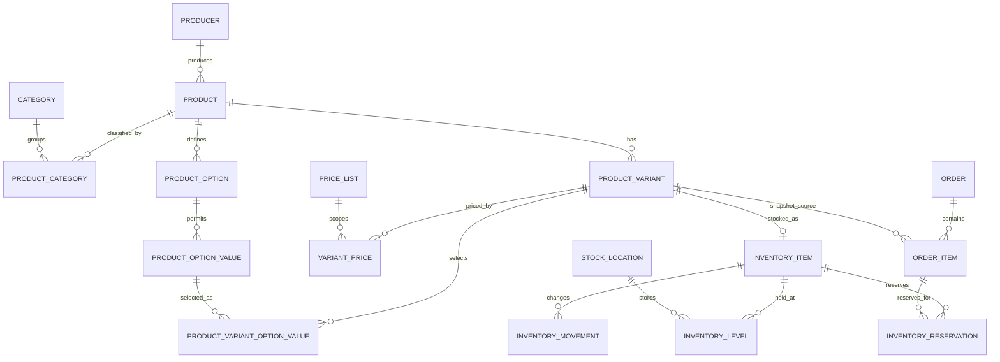

# Decision log and 3NF ERD: Product - Variant - Price - Inventory

**Project:** Thanh Hoa Digital Commerce Platform  
**Status:** Approved first-schema decision - migration generated for review only and not applied  
**Date:** 2026-07-16  
**Scope:** Catalog, sellable variants, prices, and inventory only. The proposed schema deliberately excludes seller self-service and marketplace settlement.

## 1. Research basis

| Reference | Observed design | Relevance to Thanh Hoa |
|---|---|---|
| Medusa Product and Pricing modules | A ProductVariant is linked to a separate PriceSet; prices, price lists, currencies, rules, and quantity tiers belong to the pricing domain rather than Product. | Confirms the boundary: sellable variant is not the same as product information, and price must not be duplicated on Product. |
| Medusa Inventory module | Inventory management is optional per variant. A tracked item has levels by stock location and reservation records; stocked, reserved, and incoming quantities are distinct. | Supports a staged inventory decision: availability-only first, or quantity control with reservation when real stock is approved. |
| Vendure catalog | Customer cart items represent ProductVariant, not Product. Variant owns SKU and links to one or more price and stock-level records. | Directly matches the required Product - Variant - Price - Inventory separation. |
| Vendure pricing and channels | Prices can differ by sales channel and currency; promotions are adjustments rather than destructive changes to base prices. | Multi-channel/multi-currency is useful as a future reference, but is out of scope for the single platform storefront MVP. |

Primary sources:

- https://docs.medusajs.com/resources/commerce-modules/product/links-to-other-modules
- https://docs.medusajs.com/resources/commerce-modules/inventory/concepts
- https://docs.medusajs.com/resources/commerce-modules/pricing/concepts
- https://docs.vendure.io/current/core/core-concepts/products
- https://docs.vendure.io/current/core/core-concepts/pricing

## 2. Comparison and decision log

| ID | Proposed decision | Research evidence | Fit for Thanh Hoa | Status / approval needed |
|---|---|---|---|---|
| PVI-01 | `Product` is public catalog information; `ProductVariant` is the sellable SKU. Cart and order line items reference a variant. | Both Medusa and Vendure use the variant as the purchasable stock/price boundary. | Required. The specification already requires a distinction between product and sale specification. | Proposed - approve as core model. |
| PVI-02 | Store product options and option values in normalized tables; do not store selectable attributes as a comma-separated field or arbitrary JSON. | Vendure models variant options separately; both platforms make variant the chosen purchasable item. | Required for weight, package, flavour, size, or future product-specific specifications. | Proposed - approve as core model. |
| PVI-03 | Store base/effective prices in `VariantPrice`, not in `Product` or `ProductVariant`. `OrderItem` stores immutable price snapshots. | Medusa isolates pricing; Vendure has `ProductVariantPrice`, and its order flow preserves the calculated transactional price. | Required to preserve historic orders when the current price changes. | Proposed - approve as core model. |
| PVI-04 | MVP pricing is one public sales channel and VND. Multi-currency, customer-specific rules, regional price rules, and channel-specific prices are deferred. | Medusa PriceSet/PriceList and Vendure Channel pricing solve multi-region and marketplace requirements. | Not needed before a second storefront, region/currency pricing, or vendor-controlled pricing exists. | Proposed scope boundary. |
| PVI-05 | Promotions are separate price adjustments (`Promotion` / `Coupon` / `OrderDiscount`), never overwrites of a product's base price. | Vendure applies promotion adjustments after base-price selection. | Required for auditability and correct reporting. | Proposed - approve with promotion scope. |
| PVI-06 | Inventory is optional per variant: `NotTracked`, `Tracked`, or `Preorder`. The first schema approves tracked inventory from day one; `NotTracked` remains available for services/non-stock variants. | Medusa disables inventory management by default and treats the variant as in stock; Vendure supports configurable tracking. | The project needs actual quantity control and checkout safety without introducing marketplace ownership. | **Approved for the first schema.** |
| PVI-07 | Use Item -> Location -> Level plus Reservation and append-only Movement. Available quantity is `stocked - reserved`; reservations expire or are consumed/released by order lifecycle. | Medusa explicitly separates stocked, reserved, incoming, and reservation records. | Prevents overselling and supports platform-controlled locations. | **Approved implementation assumption.** Checkout reservation TTL, release trigger, and allocation policy remain application-level business rules. |
| PVI-08 | Do not add `SalesChannel`, `Seller`, `VendorOrder`, `Commission`, `Payout`, or seller-specific price/inventory ownership now. | Vendure channels and Medusa sales channels are useful for multi-store/multi-vendor operations. | Explicitly outside the current project scope. The platform team operates catalog and orders centrally. | Confirmed by current specification. |
| PVI-09 | Keep `Producer` independent from `User`. A future `ProducerUserMembership` is added only with the approved producer portal. | Marketplace platforms need channel/seller ownership; current system does not. | Avoids prematurely granting producers ownership of products/orders. | Proposed scope boundary. |

## 3. Proposed relational model (3NF)

### 3.1 Catalog and variant tables

| Table | Key columns and rules |
|---|---|
| `Tbl_Producer` | `Id`, public name, verified/public status. No seller-user ownership in MVP. |
| `Tbl_Category` | `Id`, `ParentId` nullable FK to Category, name, slug, display status. A cycle check belongs in application/domain validation. |
| `Tbl_Product` | `Id`, `ProducerId` FK, name, slug, public description, selling status, publication timestamps. Product has no SKU, quantity, or authoritative price. |
| `Tbl_ProductCategory` | `ProductId`, `CategoryId`, `IsPrimary`; unique active `(ProductId, CategoryId)` and one active primary category per product. |
| `Tbl_ProductOption` | `Id`, `ProductId`, code/name, display order; e.g. `WEIGHT`, `PACKAGING`. |
| `Tbl_ProductOptionValue` | `Id`, `ProductOptionId`, display value/order; e.g. `500g`, `1kg`. Unique active `(ProductOptionId, Value)`. |
| `Tbl_ProductVariant` | `Id`, `ProductId`, SKU, display name, selling status, `InventoryMode`, `AllowBackorder`. A variant is the only item that may enter cart/order. |
| `Tbl_ProductVariantOptionValue` | `ProductVariantId`, `ProductOptionValueId`; unique active pair. Application validation ensures every selected option belongs to the variant's Product. |

### 3.2 Price tables

| Table | Key columns and rules |
|---|---|
| `Tbl_PriceList` | Optional future campaign/contract price group: code, name, status, `StartsAt`, `EndsAt`. It is not needed for one fixed public price. |
| `Tbl_VariantPrice` | `ProductVariantId`, optional `PriceListId`, `CurrencyCode`, `Amount`, `MinQuantity`, `EffectiveFrom`, `EffectiveTo`, `PriceType`. A default public VND price has `PriceListId = NULL`, `MinQuantity = 1`. |
| `Tbl_OrderItem` | `OrderId`, `ProductVariantId` nullable/retained reference, plus immutable `ProductNameSnapshot`, `SkuSnapshot`, `VariantNameSnapshot`, `UnitPriceSnapshot`, `Quantity`, `DiscountSnapshot`, and line totals. Snapshot columns are an intentional historical-record exception, not a current-catalog source. |

Database rules proposed for `VariantPrice`:

- `Amount >= 0`, `MinQuantity >= 1`, and `EffectiveTo > EffectiveFrom` when an end is provided.
- PostgreSQL exclusion constraint prevents overlapping active periods for the same `(ProductVariantId, CurrencyCode, PriceType, PriceListId, MinQuantity)`; use `tstzrange` and `btree_gist` only after migration approval.
- Price selection is deterministic: active price list price first, then active default public price; promotion is recorded separately on the order.

### 3.3 Approved tracked-inventory tables

These tables are part of the first schema. The migration creates the persistence structures only; allocation, reservation expiry, and lifecycle transition behavior remain future CQRS/application work.

| Table | Key columns and rules |
|---|---|
| `Tbl_StockLocation` | Platform-controlled location code/name, address reference, active status. Begin with one `MAIN` location if real stock is centralized. |
| `Tbl_InventoryItem` | One tracked item per `ProductVariantId` (unique active FK); `RequiresShipping`. |
| `Tbl_InventoryLevel` | `InventoryItemId`, `StockLocationId`, `StockedQuantity`, `ReservedQuantity`, `IncomingQuantity`; unique active `(InventoryItemId, StockLocationId)`. `StockedQuantity >= ReservedQuantity >= 0`. |
| `Tbl_InventoryReservation` | `InventoryItemId`, `StockLocationId`, `OrderItemId`, quantity, state, expiry, released/consumed timestamps. A reservation prevents concurrent checkout from selling the same units. |
| `Tbl_InventoryMovement` | Append-only ledger: `InventoryItemId`, `StockLocationId`, signed quantity delta, movement type, `OrderItemId` nullable, reason, actor and timestamp. |

`InventoryLevel` is the transactionally maintained operational balance; `InventoryMovement` remains the traceable source of quantity changes. The balance is not exposed as an unconstrained editable field.

## 4. Explicit MVP exclusions

- Marketplace seller accounts, seller dashboards, commissions, payouts, settlements, seller-specific orders, and vendor tax reporting.
- Multiple sales channels, currency conversion, region/channel price selection, and customer-segment price rules.
- Multi-warehouse allocation policy and automated stock routing (the schema supports multiple locations, but the initial operational policy may begin with one `MAIN` location).
- Arbitrary JSON attributes, polymorphic `EntityType/EntityId` links for core catalog data, and comma-separated identifier lists.

## 5. PostgreSQL and existing repository alignment

- Continue the repository convention: UUID primary key, `BaseEntity` audit fields, soft delete, and `ConcurrencyStamp`.
- Use `numeric(18,2)` for VND amounts unless the project formally standardizes a different money representation. Never use `float` for money.
- Use `timestamp with time zone` for publication, price validity, reservation expiry, and audit timestamps.
- Apply partial unique indexes with `WHERE "IsDeleted" = false` to SKU, slug, and junction-table business keys, matching the existing User/Role configuration style.
- Add indexes only for known access paths: `(ProductId)` on variants; `(ProductVariantId, EffectiveFrom)` on prices; `(InventoryItemId, StockLocationId)` on levels; `(OrderItemId, State)` on reservations.
- Vietnamese product search is a separate approved performance task. PostgreSQL `pg_trgm` can provide indexed similarity/`ILIKE` search, but its extension and indexes must be introduced through an approved migration.

## 6. Remaining business rules recorded as migration assumptions

1. Tracked quantity is approved; the checkout flow must still choose whether reservation begins at checkout submission, order confirmation, or payment confirmation, and define its expiry/release trigger.
2. Backorder/preorder eligibility and customer-facing disclosure remain per-variant application rules.
3. The first public storefront uses VND; seasonal, quantity, and B2B prices are structurally supported but their selection priority remains a future pricing rule.
4. The schema supports many platform-controlled stock locations, while the first operation may start with one `MAIN` location; allocation policy is not defined by this migration.
5. `RequiresShipping` supports physical and non-physical variants; pickup/service fulfilment behavior is future application scope.

## 7. Next implementation handoff after approval

1. Review and approve the generated persistence migration before controlled application.
2. Implement catalog, price selection, and immutable order-price snapshots through CQRS/API tasks.
3. Implement inventory reservations, allocation, and availability validation in the checkout application flow.
4. Confirm the remaining business assumptions above before exposing any public commerce API.
