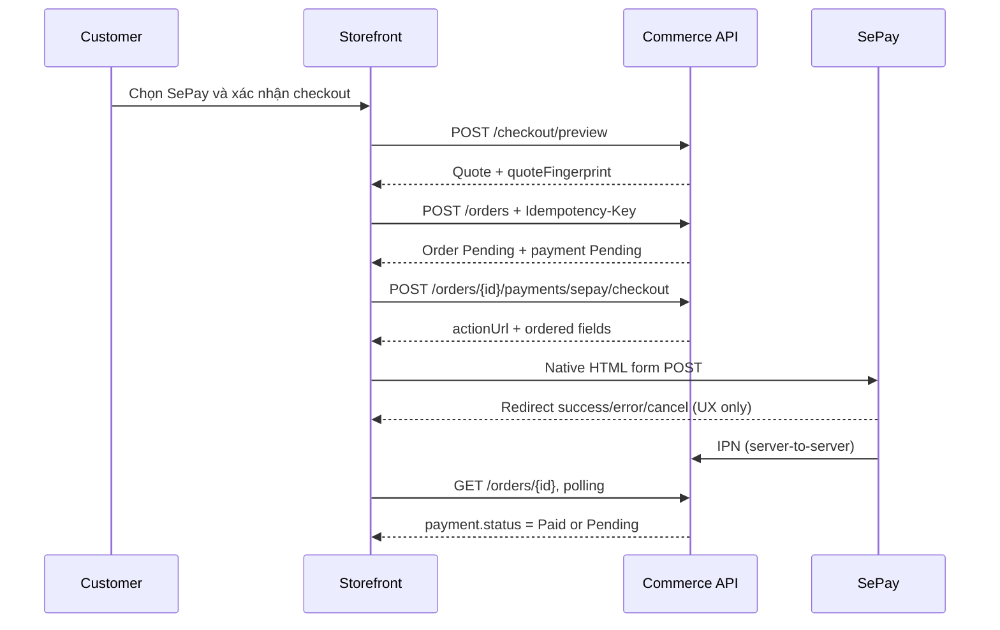

# Hướng dẫn FE map SePay Hosted Checkout

**Phạm vi:** Storefront Thanh Hoa Commerce, API `v1`, luồng Cart -> Preview -> Create Order -> Hosted Checkout -> IPN-confirmed Order Status.  
**Nguồn sự thật:** source backend hiện tại. SePay vẫn đang tắt mặc định; chỉ dùng guide này sau khi môi trường Sandbox/Production đã được bật và qua gate vận hành.

## 1. Nguyên tắc bắt buộc

1. FE chỉ gửi lựa chọn mua hàng, địa chỉ, phương thức `SePay`, quote fingerprint và idempotency key. Không gửi hoặc tính lại số tiền thanh toán.
2. FE **không** ký form, không gọi SePay REST API, không gửi `X-Secret-Key`, không gọi IPN endpoint.
3. `success`, `error`, `cancel` redirect từ SePay **không** đồng nghĩa thanh toán thành công. Chỉ `GET /orders/{id}` với `payment.status === "Paid"` mới là kết quả thành công trên UI.
4. Giữ `fields` đúng thứ tự server trả về. Dùng native HTML form `POST`; không đổi thứ tự, không serialise lại thành object, không thêm/bớt field.
5. Mọi request tới backend cần duy trì cookie: `credentials: "include"`. Mutation cần thêm `X-CSRF-TOKEN`.

## 2. Thiết kế flow storefront



### UI state machine

| UI state | Điều kiện vào | Hành động UI | Điều kiện thoát |
| --- | --- | --- | --- |
| `editing` | Có cart/địa chỉ | Cho chọn `SePay`; validate client cơ bản | Người dùng bấm tiếp tục |
| `quoting` | Gửi preview | Khoá nút submit, hiển thị tổng tiền server trả về | `quoteReady` hoặc lỗi |
| `quoteReady` | Preview 200 | Hiển thị totals + chấp nhận đặt hàng | Người dùng xác nhận |
| `creatingOrder` | Gửi create order | Khoá double-click; giữ nguyên idempotency key | Có order ID hoặc lỗi |
| `openingSePay` | Order SePay Pending | Gọi checkout form endpoint | Native form submit hoặc lỗi |
| `awaitingIpn` | Redirect trở về / timeout từ provider | Hiển thị “Đang chờ xác nhận”; poll order | `Paid`, terminal local status, hoặc timeout UI |
| `paid` | `payment.status === "Paid"` | Receipt/success UI | Kết thúc |
| `notConfirmed` | Hết polling, redirect error/cancel, hoặc payment chưa paid | Nêu rõ chưa xác nhận; cho refresh/detail/cancel theo policy | Paid hoặc người dùng rời trang |

## 3. Bootstrap session, guest cookie và CSRF

### 3.1 Lấy CSRF trước mutation

```http
GET /api/v1/security/csrf
```

```json
{
  "success": true,
  "data": { "token": "<request-token>" },
  "message": "Success",
  "timestamp": "2026-08-08T...Z"
}
```

Lưu `data.token` trong memory ứng dụng (không localStorage). Backend set cookie `__Host-ecom_csrf`; request mutation gửi header `X-CSRF-TOKEN: <token>`.

### 3.2 Giữ owner context

- Guest: cart mutation hoặc cart read ban đầu phải tạo/giữ cookie HttpOnly `__Host-ecom_cart`.
- User đăng nhập: giữ session/JWT theo flow auth hiện có.
- Không xoá cookie cart trong lúc checkout/polling; nếu mất context, API sẽ trả `401` hoặc `404` để không làm lộ order của người khác.

Base fetch wrapper:

```ts
type ApiResponse<T> = {
  success: boolean;
  data?: T;
  message?: string;
  errorCode?: string;
  validationErrors?: Record<string, string[]>;
  details?: string;
  timestamp: string;
};

async function commerceFetch<T>(path: string, init: RequestInit = {}) {
  const response = await fetch(`/api/v1${path}`, {
    ...init,
    credentials: "include",
    headers: { "Content-Type": "application/json", ...init.headers }
  });
  return { response, body: await response.json() as ApiResponse<T> };
}
```

Với `POST`, `PATCH`, `DELETE`, thêm `X-CSRF-TOKEN`. Không thêm header này khi submit native form sang domain SePay.

## 4. API map theo flow mua hàng

Mọi response backend có envelope `ApiResponse<T>`. Enum được serialise thành string, ví dụ `"SePay"`, `"Pending"`, `"Paid"`.

### A. Preview checkout

```http
POST /api/v1/checkout/preview
X-CSRF-TOKEN: <csrf-token>
Content-Type: application/json
```

```json
{
  "cartItemIds": ["11111111-1111-1111-1111-111111111111"],
  "recipientName": "Nguyen Van A",
  "recipientPhone": "0900000000",
  "shippingAddress": "Phuong Lam Son, Thanh Hoa",
  "administrativeAreaId": "22222222-2222-2222-2222-222222222222",
  "customerEmail": "a@example.test",
  "paymentMethod": "SePay",
  "shippingMethodCode": "standard"
}
```

`200.data`:

```json
{
  "lines": [{
    "cartItemId": "11111111-1111-1111-1111-111111111111",
    "productVariantId": "33333333-3333-3333-3333-333333333333",
    "productName": "San pham",
    "variantName": "Mac dinh",
    "sku": "SKU-001",
    "quantity": 2,
    "unitPrice": 50000,
    "lineTotal": 100000
  }],
  "subtotalAmount": 100000,
  "shippingAmount": 30000,
  "grandTotalAmount": 130000,
  "quoteFingerprint": "64-char-server-fingerprint"
}
```

FE phải render amount từ response này, lưu nguyên `quoteFingerprint`, và invalidate preview nếu customer đổi cart, recipient, shipping method hoặc payment method.

### B. Tạo Order với idempotency

```http
POST /api/v1/orders
X-CSRF-TOKEN: <csrf-token>
Idempotency-Key: <uuid-mới-cho-lần-xác-nhận-này>
Content-Type: application/json
```

Body dùng lại preview input, thêm `quoteFingerprint`:

```json
{
  "cartItemIds": ["11111111-1111-1111-1111-111111111111"],
  "recipientName": "Nguyen Van A",
  "recipientPhone": "0900000000",
  "shippingAddress": "Phuong Lam Son, Thanh Hoa",
  "administrativeAreaId": "22222222-2222-2222-2222-222222222222",
  "customerEmail": "a@example.test",
  "paymentMethod": "SePay",
  "quoteFingerprint": "64-char-server-fingerprint",
  "shippingMethodCode": "standard"
}
```

`200.data`:

```json
{
  "id": "44444444-4444-4444-4444-444444444444",
  "orderNumber": "ORD-...",
  "status": "Pending",
  "paymentStatus": "Pending",
  "grandTotalAmount": 130000,
  "placedAt": "2026-08-08T...Z"
}
```

Quy tắc FE:

- Sinh idempotency key một lần khi bấm “Đặt hàng”; disable nút ngay lập tức.
- Nếu timeout/network error, retry **cùng body và cùng key**; không sinh order mới.
- Nếu người dùng sửa input/cart, bỏ key cũ, preview lại, rồi mới sinh key mới.
- Sau `200`, lưu `orderId` vào route/state trước khi gọi SePay checkout.

### C. Lấy form SePay đã ký

```http
POST /api/v1/orders/{orderId}/payments/sepay/checkout
X-CSRF-TOKEN: <csrf-token>
```

Không có body. `200.data`:

```json
{
  "orderId": "44444444-4444-4444-4444-444444444444",
  "actionUrl": "https://pay-sandbox.sepay.vn/v1/checkout/init",
  "method": "POST",
  "fields": [
    { "name": "order_amount", "value": "130000.00" },
    { "name": "merchant", "value": "..." },
    { "name": "currency", "value": "VND" },
    { "name": "operation", "value": "PURCHASE" },
    { "name": "order_description", "value": "..." },
    { "name": "order_invoice_number", "value": "SP-..." },
    { "name": "customer_id", "value": "..." },
    { "name": "success_url", "value": "..." },
    { "name": "error_url", "value": "..." },
    { "name": "cancel_url", "value": "..." },
    { "name": "signature", "value": "..." }
  ]
}
```

`customer_id` là optional, vì vậy FE không được hard-code số field. `signature` luôn được server tính; FE coi tất cả field là opaque.

Native form implementation:

```ts
type SePayCheckout = {
  orderId: string;
  actionUrl: string;
  method: "POST";
  fields: Array<{ name: string; value: string }>;
};

function submitSePay(checkout: SePayCheckout): void {
  const form = document.createElement("form");
  form.method = checkout.method;
  form.action = checkout.actionUrl;
  form.style.display = "none";

  for (const field of checkout.fields) {
    const input = document.createElement("input");
    input.type = "hidden";
    input.name = field.name;
    input.value = field.value;
    form.appendChild(input);
  }

  document.body.appendChild(form);
  form.submit();
}
```

Không dùng `fetch`/XHR cho `actionUrl` SePay. Không sort `fields`, không biến thành `Record<string,string>`, không log response vì chứa signature/merchant metadata.

### D. Đọc trạng thái Order sau redirect hoặc polling

```http
GET /api/v1/orders/{orderId}
```

`200.data` rút gọn:

```json
{
  "id": "44444444-4444-4444-4444-444444444444",
  "orderNumber": "ORD-...",
  "status": "Pending",
  "grandTotalAmount": 130000,
  "currencyCode": "VND",
  "payment": {
    "method": "SePay",
    "status": "Paid",
    "amount": 130000,
    "dueAt": "2026-08-08T...Z",
    "paidAt": "2026-08-08T...Z"
  }
}
```

Ownership is enforced for user and guest. API trả `404` khi ID không thuộc owner; FE không suy đoán liệu order có tồn tại hay không.

### E. Danh sách Order và huỷ Order (optional)

- `GET /api/v1/orders`: dùng màn lịch sử; mỗi row có `paymentStatus`.
- `POST /api/v1/orders/{orderId}/cancel` với CSRF và body `{ "reason": "..." }`: chỉ hiện CTA khi payment chưa `Paid`.
- Không tự gọi cancel khi SePay redirect `cancel`/`error`; payment có thể vẫn được IPN xác nhận muộn.

## 5. Redirect và polling policy

Route success/error/cancel phải nhận `orderId` từ pathname/state của storefront, không tin query `payment` để set paid.

1. On mount: gọi `GET /orders/{orderId}` ngay.
2. Nếu `payment.status === "Paid"`: chuyển UI `paid`, dừng polling.
3. Nếu chưa paid: poll 2 giây/lần trong 30 giây, sau đó 5 giây/lần tối đa thêm 90 giây.
4. Hết thời gian: dừng polling, hiện “Thanh toán chưa được xác nhận. Vui lòng làm mới để kiểm tra lại.” và nút refresh detail.
5. Không tự tạo lại order hay tự submit form lại sau redirect. Nếu cần retry checkout, user chủ động bấm “Mở lại trang thanh toán” và FE gọi lại checkout endpoint trên cùng `orderId` sau khi detail vẫn cho thấy SePay `Pending`.
6. `TRANSACTION_VOID` là provider event phía server; customer UI không suy diễn event này từ redirect. Nếu local payment chưa `Paid`, tiếp tục hiển thị trạng thái server và để backoffice xử lý reconciliation.

## 6. Error-handling matrix

| HTTP | `errorCode` thường gặp | FE xử lý |
| --- | --- | --- |
| 400 | `BAD_REQUEST` | Hiển thị `validationErrors` theo field; nếu CSRF lỗi, gọi lại `/security/csrf` rồi cho user submit lại. |
| 401 | `UNAUTHORIZED` | Owner context đã mất; khôi phục login/cookie, không retry mù. |
| 404 | `NOT_FOUND` | Order không thuộc current owner, không phải SePay, hoặc không tồn tại; chuyển lịch sử order/cart an toàn. |
| 409 | `ALREADY_EXISTS` | Create: retry cùng idempotency key nếu request chưa biết kết quả; quote changed/mismatch: preview lại và yêu cầu xác nhận totals mới. |
| 422 | `UNPROCESSABLE_ENTITY` | SePay feature chưa bật, payment expired/terminal, order không còn pending, hoặc không thể cancel; gọi order detail rồi render trạng thái server. |
| 429 | `TOO_MANY_REQUESTS` | Disable action, đọc `Retry-After` nếu có, backoff; không spam checkout endpoint. |
| 5xx/network | — | Với create order retry cùng idempotency key; với checkout/detail ưu tiên refresh detail trước, sau đó cho retry có chủ đích. |

Không render `message` backend như thông báo kỹ thuật duy nhất; map sang UX copy theo context nhưng giữ `errorCode` để telemetry.

## 7. Mapping component đề xuất

| Component | State/API | Trách nhiệm |
| --- | --- | --- |
| `CheckoutReview` | Preview | Hiển thị quote server-owned và nút xác nhận. |
| `PlaceOrderButton` | Create Order | Quản lý idempotency key, disable double-submit, điều hướng `orderId`. |
| `SePayRedirector` | Checkout form | Gọi checkout, dựng native form, submit không biến đổi field. |
| `PaymentResultPage` | GET order + polling | Chỉ hiển thị paid khi server trả `Paid`; xử lý redirect neutral. |
| `OrderDetail` | GET order | Hiển thị method/status/due/paid time từ server. |
| `OrderHistory` | GET orders | Badge theo `paymentStatus`; không hiển thị provider reference. |

## 8. Acceptance checklist FE

- [ ] Có `credentials: include` cho Commerce API.
- [ ] Lấy và gửi CSRF token cho preview/create/checkout/cancel.
- [ ] `paymentMethod: "SePay"`; không dùng `Gateway`.
- [ ] Quote fingerprint đi từ preview sang create không bị sửa.
- [ ] Idempotency key được giữ nguyên khi retry create cùng request.
- [ ] Ordered checkout fields được native POST nguyên vẹn.
- [ ] Không gọi IPN hoặc đưa secret/signature vào analytics/log/client storage.
- [ ] Redirect không set paid; detail polling quyết định UI.
- [ ] Xử lý 400/401/404/409/422/429/5xx theo matrix.
- [ ] Test Sandbox: paid, redirect cancel/error, duplicate callback, chậm IPN và refresh trang giữa chừng.

## 9. Các API không dành cho storefront

`POST /api/v1/payments/sepay/ipn` là server-to-server, anonymous nhưng được bảo vệ bằng `X-Secret-Key`; FE tuyệt đối không gọi endpoint này. `GET /api/v1/management/payments/sepay/reconciliation` chỉ dành cho staff có `payments.verify`, không đưa vào customer UI.
