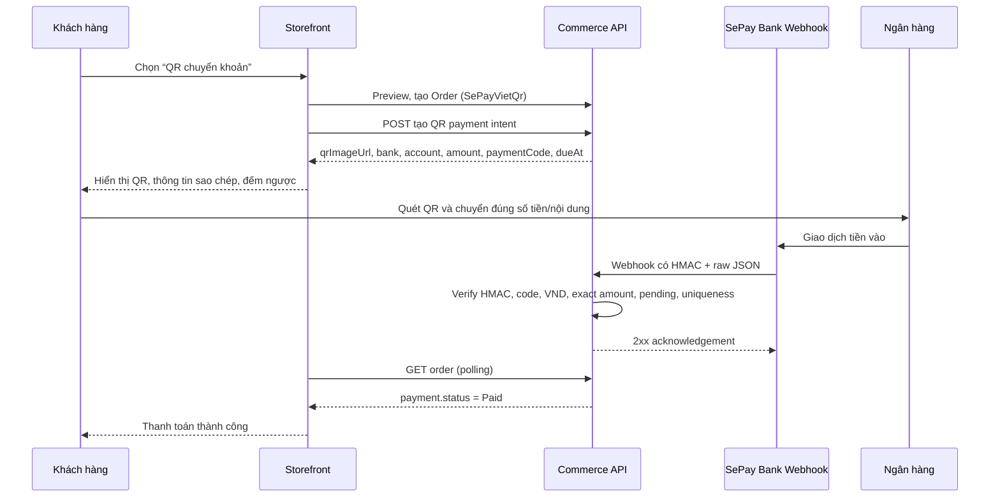

# Kế hoạch SePay VietQR nhúng trong trang thanh toán

## 1. Mục tiêu và quyết định đề xuất

Mục tiêu là hiển thị QR chuyển khoản ngay tại trang `/orders/{orderId}` của storefront: khách quét QR, SePay gửi **Bank Webhook** khi tiền vào, backend xác minh và cập nhật `Payment` sang `Paid`. Không redirect sang Hosted Checkout.

**Đề xuất V1:** VietQR động dùng **VA BIDV hiện có** + một mã thanh toán ngẫu nhiên theo từng đơn + SePay Bank Webhook dùng HMAC-SHA256. Không tạo VA mới theo từng đơn ở V1.

Lý do: tài khoản BIDV hiện cấu hình trên SePay chỉ hỗ trợ VA. VietQR động vẫn đáp ứng UX cần QR, số tiền, nội dung và polling; V2 chỉ cân nhắc API tạo VA mới theo từng đơn nếu có nhu cầu tách tuyệt đối từng khách/đơn.



## 2. Phân tích source hiện tại

| Phần | Hiện có | Không dùng được trực tiếp cho VietQR nhúng |
| --- | --- | --- |
| `PaymentMethod.SePay` | Hosted Checkout, form ký HMAC và redirect tới `pay.sepay.vn` | Không phải QR image/QR URL trên trang web |
| `POST /orders/{id}/payments/sepay/checkout` | Trả `actionUrl` và ordered fields | Không trả bank account, payment code hay QR URL |
| `POST /payments/sepay/ipn` | Đọc JSON IPN của Payment Gateway, xác thực `X-Secret-Key` | Không phải payload/auth của Bank Webhook |
| `PaymentGatewayAttempt` | Liên kết invoice Payment Gateway | Không nên ép dùng cho ngân hàng webhook có schema khác |
| `Payment.MarkPaid` + `PaymentTransaction` | Domain transition an toàn, transaction và unique provider reference | Phải tái sử dụng |
| `GET /orders/{id}` | Owner-scoped, có `payment.status`, `dueAt`, `paidAt` | Dùng để FE polling |

Kết luận: đây là một payment rail mới. Không thay `SePay` Hosted Checkout bằng QR; hai rail có thể cùng tồn tại. Đề xuất thêm payment method rõ nghĩa `SePayVietQr` thay vì lạm dụng `BankTransfer` (hiện `BankTransfer` là flow xác nhận thủ công/AwaitingConfirmation).

## 3. Điều kiện trên SePay trước khi code

1. Liên kết tài khoản ngân hàng Live trong sản phẩm **SePay Bank/Webhooks**, không chỉ kích hoạt Payment Gateway.
2. Vào `Tích hợp → Webhooks → Thêm webhook`:
   - URL: `https://<public-api>/api/v1/payments/sepay-bank/webhook`.
   - Loại sự kiện: **Tiền vào**.
   - Chọn đúng tài khoản thụ hưởng.
   - Bật “Bỏ qua giao dịch không có mã”.
   - Cấu hình prefix mã thanh toán đã có trên tài khoản là `DH`.
   - Content type: `application/json`.
   - Bật tự động retry.
   - Bảo mật: **HMAC-SHA256**, không dùng No auth hay API Key cho Production.
3. Lưu Webhook Secret chỉ vào Azure App Settings/secret store. Secret chỉ hiện đầy đủ một lần.
4. Dùng chức năng “Gửi thử” của SePay để kiểm tra endpoint; không coi payload thử (transaction id thường là mock) là giao dịch thật.
5. Tài khoản BIDV đang chọn báo chỉ hỗ trợ VA: cấu hình endpoint V1 với đúng VA hiện dùng, không chọn tài khoản chính. Chỉ chuyển sang VA-per-order khi đã có quyền SePay API v2 và yêu cầu nghiệp vụ tách VA từng đơn.

Tài liệu chính thức: [Tạo QR và form thanh toán](https://developer.sepay.vn/vi/sepay-webhooks/tao-qr-va-form-thanh-toan), [Tạo Webhook](https://developer.sepay.vn/vi/sepay-webhooks/tao-webhook), [HMAC-SHA256](https://developer.sepay.vn/vi/sepay-webhooks/xac-thuc), [quy tắc VietQR theo ngân hàng](https://developer.sepay.vn/vi/tien-ich-khac/tao-qr-code).

## 4. Thiết kế backend cần thực hiện

### 4.1 Domain và persistence

- Thêm `PaymentMethod.SePayVietQr`; giữ nguyên `SePay` cho Hosted Checkout.
- Tạo aggregate/entity `PaymentBankQrAttempt` (hoặc tên tương đương), không tái sử dụng `PaymentGatewayAttempt`:
  - `PaymentId`, provider=`sepay-bank`, `PaymentCode`, `ExpectedAmount`, `CurrencyCode`, `ExpiresAt`, trạng thái, bank-account public identifier, external transaction id/reference và timestamps.
  - Unique: `(Provider, PaymentCode)`, `(Provider, ExternalTransactionId)` khi id có mặt, `(PaymentId, Provider)`.
- Tạo append-only audit `PaymentBankWebhookNotification` chỉ lưu trường normalized cần đối soát; không lưu raw body, account number, customer info, source IP hay secret.
- Migration forward-only; check expected amount > 0; FK `PaymentId`; index polling/reconciliation.

### 4.2 Cấu hình riêng

Không dùng `SePay:MerchantSecretKey`, `SePay:IpnSecretKey` của Payment Gateway cho Bank Webhook. Tạo section riêng, ví dụ:

```text
SePayBankQr__Enabled
SePayBankQr__BankCode
SePayBankQr__VirtualAccountNumber
SePayBankQr__AccountHolder
SePayBankQr__PaymentCodePrefix=DH
SePayBankQr__WebhookHmacSecret
SePayBankQr__QrTemplate=compact
```

`AccountNumber` và HMAC secret chỉ trong secret store/App Settings, không commit. `BankCode` phải là code SePay/VietQR xác nhận cho tài khoản đã liên kết.

### 4.3 Public storefront contracts (đề xuất)

1. `POST /api/v1/orders`
   - Existing body dùng `paymentMethod: "SePayVietQr"`.
   - Existing server-side price, quote fingerprint, idempotency và inventory reservation được giữ nguyên.
2. `POST /api/v1/orders/{orderId}/payments/sepay-vietqr`
   - CSRF + owner scope + rate limit.
   - Không có body.
   - Response: `orderId`, `qrImageUrl`, `bankName`, `accountNumber`, `accountHolder`, `amount`, `currencyCode`, `paymentCode`, `expiresAt`.
   - Backend tạo QR URL từ dữ liệu server-owned theo format SePay `https://vietqr.app/img?acc=...&bank=...&amount=...&des=...`; FE coi URL là opaque.
3. `GET /api/v1/orders/{orderId}`
   - Giữ route và owner scope hiện có; FE poll `payment.status`, `dueAt`, `paidAt`.
4. `POST /api/v1/payments/sepay-bank/webhook`
   - Anonymous, JSON-only, request size/rate limited, server-to-server only; không public cho FE.
   - Nhận raw body trước deserialize để xác minh `X-SePay-Timestamp` và `X-SePay-Signature` theo canonical `{timestamp}.{rawBody}`.

### 4.4 Webhook acceptance rule

Chỉ gọi `Payment.MarkPaid` trong một UnitOfWork khi mọi điều kiện đều đúng:

1. HMAC đúng bằng fixed-time comparison; timestamp trong cửa sổ replay đã chốt (đề xuất ±5 phút).
2. Giao dịch là tiền **vào**.
3. Mã payment được SePay extract khớp chính xác attempt; prefix đúng.
4. Currency VND và số tiền chuyển khoản **bằng chính xác** `ExpectedAmount` (không dùng `>=`).
5. Payment/attempt vẫn Pending và chưa hết hạn.
6. Provider transaction id/reference chưa được dùng.

Sai số tiền, thiếu mã, trùng id, late payment hoặc trạng thái terminal: ghi reconciliation/audit, trả acknowledgement theo policy retry, không tự mark paid/refund/cancel. Không gọi SePay/external services trong transaction.

## 5. Thiết kế FE

- Màn checkout: radio `QR chuyển khoản SePay` khác `SePay Hosted Checkout`.
- Sau create order, gọi endpoint QR intent một lần và render `qrImageUrl` qua ``; hiển thị số tiền, bank, account, owner, payment code và nút copy.
- Đồng hồ lấy từ `expiresAt` server, không hard-code 10/15/30 phút. Source hiện tại tạo `Payment.DueAt` 30 phút; nếu muốn 10 phút cần approval đổi rule backend và reservation expiry.
- Poll `GET /orders/{id}` mỗi 3 giây khi tab visible. `Paid` mới hiển thị success; redirect/query/client QR scan không là bằng chứng thanh toán.
- Hết hạn: dừng poll, hiển thị `Chưa xác nhận`; không tự tạo đơn mới, không tự gia hạn QR. CTA “Tạo thanh toán mới” phải gọi API mới theo policy backend.
- Không bao giờ đặt webhook secret, API token, bank account config, hay logic quyết định paid ở FE.

## 6. Kế hoạch triển khai theo pha

| Pha | Deliverable | Gate hoàn thành |
| --- | --- | --- |
| 0. Quyết định | Xác nhận tài khoản ngân hàng SePay, dynamic QR hay VA, prefix `DH`, TTL | Owner phê duyệt public API/schema/config changes |
| 1. SePay Live setup | Bank account + HMAC Webhook + test delivery | Endpoint HTTPS và HMAC delivery evidence |
| 2. Backend domain | Enum/attempt/audit/options/EF migration | Build, model diff, reviewed idempotent SQL |
| 3. Backend API | QR intent + raw-body HMAC webhook + reconciliation | API/domain/security tests passed |
| 4. PostgreSQL | Apply migration, duplicate/race/constraint/rollback tests | Approved non-production DB proof |
| 5. FE | QR payment page, copy controls, timer, polling and error states | Browser tests including refresh/cancel/late webhook |
| 6. Live pilot | Small real transactions, alerting/reconciliation | Exact match paid, mismatch/duplicate/late evidenced |

## 7. Test matrix tối thiểu

- QR response uses server amount/code; client cannot replace either.
- HMAC valid, invalid, stale timestamp, altered raw body and malformed JSON.
- Correct incoming transaction marks exactly one Payment paid.
- Duplicate webhook/concurrent deliveries produce one PaymentTransaction.
- Wrong code, wrong account, currency or amount are reconciliation only.
- Transaction after `dueAt` is reconciliation only.
- Guest and authenticated owners can only poll their own order.
- Browser refresh/return from banking app continues from `GET /orders/{id}`.
- Production CORS/cookie decision is validated on `market-prototype.vercel.app`; direct cross-origin `SameSite=Lax` guest flow is not assumed to work.

## 8. Không làm trong V1

- Không call SePay API từ FE.
- Không dùng Merchant Secret/IPN Secret Payment Gateway cho Bank Webhook.
- Không auto-refund/cancel payment khi webhook mismatch/late.
- Không trust redirect, QR scan event, query string or frontend total.
- Không dùng VA per order cho đến khi ngân hàng, token API và lifecycle VA được chốt.

## 9. Blueprint triển khai backend theo source hiện tại

Phần này là thứ tự code bắt buộc. Không gộp với `ProcessSePayIpnCommand`: endpoint đó đọc Payment Gateway IPN với `X-Secret-Key`, còn Bank Webhook dùng raw body + HMAC headers khác.

### Bước 1 — Options, DI và rate limit

**Files mới/chỉnh sửa**

- `Core/Ecom.Application/Common/Configuration/SePayBankQrOptions.cs`.
- `Infrastructure/Ecom.Infrastructure/Security/SePayBankQrOptionsValidator.cs`.
- `Infrastructure/Ecom.Infrastructure/DependencyInjection.cs` để bind options và đăng ký service.
- `Core/Ecom.Application/Common/Configuration/CommerceRateLimitOptions.cs` và `Presentation/Ecom.API/Extensions/ServiceExtensions.cs` thêm policy `PaymentBankWebhook`.
- `Presentation/Ecom.API/appsettings.json` chỉ thêm skeleton không có secret.

**Contract options V1**

```text
Enabled
BankCode=BIDV
VirtualAccountNumber
AccountHolder
PaymentCodePrefix=DH
WebhookHmacSecret
WebhookUrl
QrTemplate=compact
```

Validator fail-fast khi enabled mà thiếu VA, bank code, prefix, HMAC secret hoặc webhook URL HTTPS. Prefix phải là `DH` đã cấu hình trong SePay và mã runtime phải bắt đầu đúng prefix.

### Bước 2 — Domain và migration

**Files chỉnh sửa:** `Core/Ecom.Domain/Enums/Commerce/CommerceEnums.cs`, `Payment.cs`, `RefundPaymentCommand.cs`, `ApplicationDbContext.cs`.

1. Thêm `PaymentMethod.SePayVietQr` và đưa vào `Payment.RequiresPrepayment()`.
2. `Payment.Create` phải khởi tạo method mới là `Pending` với `DueAt` như SePay Hosted Checkout; không dùng `AwaitingConfirmation` của `BankTransfer`.
3. Tạo `PaymentBankQrAttempt` với `PaymentId`, `Provider`, `PaymentCode`, `ExpectedAmount`, `CurrencyCode`, `VirtualAccountFingerprint`, `ExpiresAt`, status, external transaction id/reference và timestamps.
4. Tạo `PaymentBankWebhookNotification` append-only, lưu normalized provider transaction/code/amount/disposition/failure reason; tuyệt đối không lưu raw JSON, full VA, account holder, content giao dịch hay HMAC headers.
5. Mỗi entity một EF configuration file. Migration mới phải có unique `(Provider, PaymentCode)`, `(PaymentId, Provider)` và partial unique `(Provider, ExternalTransactionId)`; check amount > 0, FK restrict và index status/expiry.

Không sửa migration `AddSePayHostedCheckoutIpnAudit` đã áp dụng. Tạo migration forward-only mới và review SQL idempotent trước khi apply.

### Bước 3 — Tạo QR intent owner-scoped

**Files mới:**

- `Core/Ecom.Application/Features/Commerce/Payments/Commands/CreateSePayVietQr/` (request, validator, handler, DTO).
- `Infrastructure/Ecom.Infrastructure/Services/SePayBankQrService.cs`.
- Mở rộng `Core/Ecom.Application/Common/Interfaces/ICommerceCheckoutServices.cs` hoặc tạo interface chuyên biệt `ISePayBankQrService`.
- `Presentation/Ecom.API/Controllers/V1/OrdersController.cs`.

**Route mới**

```http
POST /api/v1/orders/{orderId}/payments/sepay-vietqr
```

Route dùng CSRF, `PaymentCheckout` rate policy hoặc policy QR riêng, và giữ rule owner-scoped của checkout hiện có. Handler phải lock theo trật tự order → payment, kiểm tra `PaymentMethod.SePayVietQr`, `Pending`, `DueAt > now`; tạo/reuse một active attempt và sinh code không đoán được, ví dụ `DH` + random uppercase bytes. Không lấy total/code từ FE.

Response chỉ gồm dữ liệu FE cần render:

```json
{
  "orderId": "...",
  "qrImageUrl": "https://vietqr.app/img?...",
  "bankCode": "BIDV",
  "virtualAccountDisplay": "...",
  "accountHolder": "...",
  "amount": 130000,
  "currencyCode": "VND",
  "paymentCode": "DH...",
  "expiresAt": "..."
}
```

`qrImageUrl` phải được backend tạo từ VA/config + expected amount + payment code với URL encoding. FE không ghép QR URL hay thay amount/code. TTL UI lấy `expiresAt`; giữ 30 phút hiện có cho đến khi có approval đổi lifecycle reservation/payment.

### Bước 4 — Bank Webhook HMAC raw-body

**Files mới:**

- `Presentation/Ecom.API/Controllers/V1/SePayBankWebhooksController.cs`.
- `Core/Ecom.Application/Features/Commerce/Payments/Commands/ProcessSePayBankWebhook/`.
- Service HMAC và payload normalizer trong Infrastructure/Application boundary.

**Route mới**

```http
POST /api/v1/payments/sepay-bank/webhook
```

Controller là anonymous, `application/json`, 16 KB (hoặc limit đã xác minh payload), rate limited. Controller phải `EnableBuffering`, lấy **raw UTF-8 body** trước deserialize, đọc `X-SePay-Signature` và `X-SePay-Timestamp`, rồi gửi raw body/headers vào command. Không bind `[FromBody]` trước khi xác minh.

Handler thực hiện:

1. Verify timestamp trong cửa sổ ±5 phút và HMAC SHA-256 của chuỗi `{timestamp}.{rawBody}` bằng fixed-time comparison.
2. Deserialize thành các field Bank Webhook cần thiết: provider transaction id, reference, transfer type, amount, payment code và occurred time.
3. Chấp nhận chỉ `transferType=in`, code bắt đầu `DH`, VND (nếu provider gửi currency), exact amount bằng `ExpectedAmount`, attempt/payment/order còn Pending và chưa hết hạn.
4. Lock attempt trước, rồi order → payment theo cùng thứ tự `ProcessSePayIpnCommand` để tránh race/lock inversion.
5. Unique provider transaction; duplicate cùng payment ghi notification `Duplicate` và acknowledge, collision với payment khác ghi reconciliation.
6. Mismatch, code không có, sai tiền, sai VA, invalid HMAC, late/void/terminal state không gọi `MarkPaid`. HMAC invalid trả 401; valid-but-unmatched được audit/reconcile và trả acknowledgement theo retry policy.
7. Chỉ successful match tạo `PaymentTransaction`, `Payment.MarkPaid`, update attempt và insert accepted notification trong một `UnitOfWork` commit.

### Bước 5 — Backoffice/reconciliation và expiry

- Mở rộng reconciliation read model hoặc tạo query riêng cho `sepay-bank`; quyền vẫn là `payments.verify`.
- Không dùng `VerifyBankTransferCommand` để nhận webhook tự động: route đó yêu cầu staff và lẽ ra chỉ phục vụ manual flow.
- Rà soát `ExpireReservationsCommand`: `SePayVietQr` phải đi cùng due/expiry rule hiện có; payment muộn thành reconciliation, không tự nhận paid.

### Bước 6 — Tests bắt buộc

1. **Domain:** new method starts Pending/requires prepayment; exact amount only; paid/late/reconcile behavior.
2. **Service:** stable QR URL encoding, code prefix/randomness, HMAC valid/invalid/stale/altered-body vectors.
3. **API:** owner/guest isolation, CSRF QR intent, secret never returned, malformed/oversize webhook, invalid signature 401, valid payment, wrong amount/code/VA, duplicate, late and transaction collision.
4. **PostgreSQL:** migration apply/rollback, unique code/reference constraints and two concurrent deliveries result in one `PaymentTransaction`.
5. **Sandbox/Live controlled:** SePay “Gửi thử” only tests parsing/delivery; a real small incoming payment proves QR → webhook → local Paid.

### Bước 7 — Deploy order

1. Add new non-secret skeleton config to source; secret/VA only in Azure App Settings.
2. Build and run unit/API tests; generate/review migration SQL and apply to approved database.
3. Deploy Azure code, then check the new URL does not return 404.
4. Add Azure settings: `SePayBankQr__Enabled`, `__BankCode`, `__VirtualAccountNumber`, `__AccountHolder`, `__PaymentCodePrefix`, `__WebhookHmacSecret`, `__WebhookUrl`, `__QrTemplate`.
5. Restart App Service, create/enable SePay Webhook with `DH` filter/HMAC/retry, run provider “Gửi thử”, then controlled real payment.
6. Only after backend proof, FE adds the payment option and QR page defined in `SEPAY-FRONTEND-INTEGRATION-GUIDE.md`.
