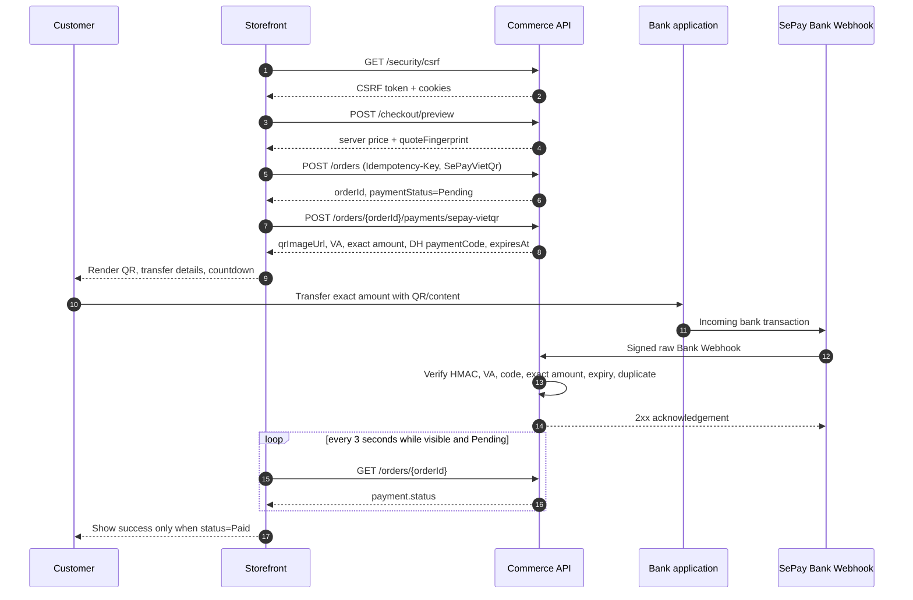
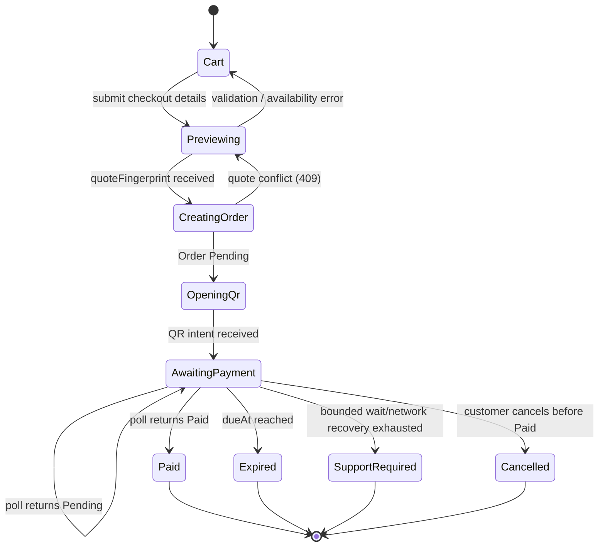

# SePay VietQR - Frontend API Integration Guide

> Contract source: `Ecom.API` v1 controllers and Application DTOs, verified against the deployed Swagger on 2026-08-09. This guide covers the **in-page VietQR** rail (`PaymentMethod = SePayVietQr`). It does not replace the existing SePay Hosted Checkout redirect rail.

## 1. Outcome and boundaries

The storefront creates an Order using server-owned totals, requests a QR intent for that Order, renders the returned QR image, and polls the owner-scoped Order detail. Only a signed SePay **Bank Webhook** can change the payment to `Paid`.



The frontend **must never** call either provider callback endpoint:

```text
POST /api/v1/payments/sepay-bank/webhook   # SePay Bank -> API only
POST /api/v1/payments/sepay/ipn            # Hosted Checkout provider -> API only
```

The frontend must not calculate a final price, assemble a VietQR URL, accept a bank-app return as proof of payment, or place webhook/HMAC credentials in client code.

## 2. Transport contract

### 2.1 Base URL and envelope

Production API base URL:

```text
https://ecom-d-backend-api-hvdgfcg0b9dqcxhm.southeastasia-01.azurewebsites.net/api/v1
```

All controller responses use this JSON envelope. ASP.NET JSON uses camel-case names and enum strings such as `SePayVietQr`, `Pending`, and `Paid`.

```ts
type ApiResponse<T> = {
  success: boolean;
  data: T | null;
  message: string | null;
  errorCode: string | null;
  validationErrors: Record<string, string[]> | null;
  details: string | null;
  timestamp: string;
};
```

### 2.2 Cookies and CSRF

All customer mutations below require the customer/guest cookies and this header:

```http
X-CSRF-TOKEN: <token from GET /security/csrf>
```

Use `credentials: "include"` for every Commerce request. Fetch a new token on application boot, after a `400` CSRF failure, and after the browser session is reset.

```ts
const API = "https://ecom-d-backend-api-hvdgfcg0b9dqcxhm.southeastasia-01.azurewebsites.net/api/v1";

async function getCsrfToken(): Promise<string> {
  const response = await fetch(`${API}/security/csrf`, { credentials: "include" });
  const body = (await response.json()) as ApiResponse<{ token: string }>;
  if (!response.ok || !body.success || !body.data?.token) throw new Error("Unable to obtain CSRF token");
  return body.data.token;
}

async function api<T>(path: string, init: RequestInit = {}): Promise<ApiResponse<T>> {
  const response = await fetch(`${API}${path}`, {
    credentials: "include",
    headers: { "Content-Type": "application/json", ...init.headers },
    ...init
  });
  return response.json() as Promise<ApiResponse<T>>;
}
```

> Important production gate: the current antiforgery cookie uses `SameSite=Lax`. A browser calling the Azure API directly from a different Vercel site can lose guest/session cookies. Use a same-site BFF/rewrite or prove the final CORS/cookie policy in the target browser before release; do not treat a successful Swagger request as proof of the cross-site storefront flow.

## 3. API map and ownership

| Step | API | FE calls? | Requires CSRF | Purpose |
| --- | --- | --- | --- | --- |
| 0 | `GET /security/csrf` | Yes | No | Receive CSRF token and antiforgery cookie. |
| 1 | `GET /cart` | Yes | No | Restore the active customer/guest cart. |
| 2 | `POST /cart/items` | Yes | Yes | Add selected `productVariantId`. Creates guest ownership when needed. |
| 3 | `PATCH /cart/items/{cartItemId}` | Yes | Yes | Change quantity. |
| 4 | `DELETE /cart/items/{cartItemId}` | Yes | Yes | Remove a cart row. |
| 5 | `POST /checkout/preview` | Yes | Yes | Obtain server-owned totals and `quoteFingerprint`. |
| 6 | `POST /orders` | Yes | Yes | Reserve inventory and create Order/Payment. |
| 7 | `POST /orders/{orderId}/payments/sepay-vietqr` | Yes | Yes | Obtain a server-created QR intent. |
| 8 | `GET /orders/{orderId}` | Yes | No | Poll the authoritative payment state. |
| 9 | `POST /orders/{orderId}/cancel` | Optional | Yes | Cancel only while payment is not paid. |
| Provider | `POST /payments/sepay-bank/webhook` | **No** | N/A | Signed server-to-server Bank Webhook. |

`GET /orders` is available for order history. Every order read and payment intent is owner-scoped: a customer or guest receives `404` for an order that it does not own. Do not infer whether another order exists from that response.

## 4. Request and response contracts

### 4.1 Get CSRF token

```http
GET /api/v1/security/csrf
```

Success:

```json
{
  "success": true,
  "data": { "token": "<opaque csrf token>" },
  "message": "Success",
  "errorCode": null,
  "validationErrors": null,
  "details": null,
  "timestamp": "2026-08-09T...Z"
}
```

Store the token in memory only. Do not put it in an analytics event or URL.

### 4.2 Cart

Restore the current cart:

```http
GET /api/v1/cart
```

For a customer/guest with no cart, success data is the explicit empty representation:

```json
{ "id": null, "status": null, "items": [] }
```

Add an item:

```http
POST /api/v1/cart/items
X-CSRF-TOKEN: <token>
Content-Type: application/json

{
  "productVariantId": "11111111-1111-1111-1111-111111111111",
  "quantity": 1
}
```

`quantity` is an integer from `1` to `999`. The selected Product Variant must be active and its Product published.

Cart success data, returned by get/add/change/remove:

```json
{
  "id": "22222222-2222-2222-2222-222222222222",
  "status": "Active",
  "items": [
    {
      "id": "33333333-3333-3333-3333-333333333333",
      "productVariantId": "11111111-1111-1111-1111-111111111111",
      "quantity": 1
    }
  ]
}
```

Change quantity:

```http
PATCH /api/v1/cart/items/33333333-3333-3333-3333-333333333333
X-CSRF-TOKEN: <token>

{ "quantity": 2 }
```

Remove:

```http
DELETE /api/v1/cart/items/33333333-3333-3333-3333-333333333333
X-CSRF-TOKEN: <token>
```

The cart DTO deliberately does not contain display price or stock. Render catalog information from its appropriate catalog API/state, but treat the checkout preview as the authority for purchase price.

### 4.3 Preview checkout

```http
POST /api/v1/checkout/preview
X-CSRF-TOKEN: <token>
Content-Type: application/json

{
  "cartItemIds": ["33333333-3333-3333-3333-333333333333"],
  "recipientName": "Nguyen Van A",
  "recipientPhone": "0900000000",
  "shippingAddress": "Thanh Hoa, Viet Nam",
  "administrativeAreaId": null,
  "customerEmail": "customer@example.com",
  "paymentMethod": "SePayVietQr",
  "shippingMethodCode": "standard"
}
```

`shippingMethodCode` supports only `standard`. `paymentMethod` for this guide must be exactly `SePayVietQr`; do not use legacy `Gateway`.

Success `data`:

```json
{
  "lines": [
    {
      "cartItemId": "33333333-3333-3333-3333-333333333333",
      "productVariantId": "11111111-1111-1111-1111-111111111111",
      "productName": "Example product",
      "variantName": "Default",
      "sku": "EXAMPLE-001",
      "quantity": 1,
      "unitPrice": 100000,
      "lineTotal": 100000
    }
  ],
  "subtotalAmount": 100000,
  "shippingAmount": 30000,
  "grandTotalAmount": 130000,
  "quoteFingerprint": "<64-character SHA-256 fingerprint>"
}
```

Keep the complete preview request and its `quoteFingerprint` unchanged until order creation. Do not edit totals in the browser.

### 4.4 Create an Order

Generate one UUID per logical checkout attempt. Reuse the **same** key only when retrying the exact same request after a network uncertainty. Never reuse it for a changed cart, recipient, or payment method.

```http
POST /api/v1/orders
Idempotency-Key: 44444444-4444-4444-4444-444444444444
X-CSRF-TOKEN: <token>
Content-Type: application/json

{
  "cartItemIds": ["33333333-3333-3333-3333-333333333333"],
  "recipientName": "Nguyen Van A",
  "recipientPhone": "0900000000",
  "shippingAddress": "Thanh Hoa, Viet Nam",
  "administrativeAreaId": null,
  "customerEmail": "customer@example.com",
  "paymentMethod": "SePayVietQr",
  "quoteFingerprint": "<the exact preview value>",
  "idempotencyKey": "44444444-4444-4444-4444-444444444444",
  "shippingMethodCode": "standard"
}
```

The header is required and is authoritative; send the matching body value too because it is part of the current request DTO.

Success `data`:

```json
{
  "id": "55555555-5555-5555-5555-555555555555",
  "orderNumber": "ORD-...",
  "status": "Pending",
  "paymentStatus": "Pending",
  "grandTotalAmount": 130000,
  "placedAt": "2026-08-09T...Z"
}
```

On `409 ALREADY_EXISTS`, refresh/preview again for a quote mismatch. Only retry automatically when the same idempotency key and identical payload are being recovered.

### 4.5 Create/reopen a VietQR intent

```http
POST /api/v1/orders/55555555-5555-5555-5555-555555555555/payments/sepay-vietqr
X-CSRF-TOKEN: <token>
Content-Type: application/json
```

There is no request body. This call requires that the current owner has an Order with `payment.method = SePayVietQr`, `payment.status = Pending`, and a future due time.

Success `data`:

```json
{
  "orderId": "55555555-5555-5555-5555-555555555555",
  "qrImageUrl": "https://vietqr.app/img?...",
  "bankCode": "BIDV",
  "virtualAccountDisplay": "<VA returned by API>",
  "accountHolder": "<account holder returned by API>",
  "amount": 130000,
  "currencyCode": "VND",
  "paymentCode": "DH<server-generated-random-code>",
  "expiresAt": "2026-08-09T...Z"
}
```

Render `qrImageUrl` directly as an image and use every other returned value for the copyable manual-transfer fallback. These fields are server-owned and opaque: FE must not modify `amount`, construct another QR URL, or generate a `DH` code.

Repeated calls while the attempt remains valid reuse the same active attempt/payment code. Calls after `Paid`, expiry, or reconciliation return `422`.

### 4.6 Read an Order and poll status

```http
GET /api/v1/orders/55555555-5555-5555-5555-555555555555
```

Relevant success `data` fields:

```json
{
  "id": "55555555-5555-5555-5555-555555555555",
  "orderNumber": "ORD-...",
  "status": "Pending",
  "grandTotalAmount": 130000,
  "currencyCode": "VND",
  "placedAt": "2026-08-09T...Z",
  "recipientName": "Nguyen Van A",
  "recipientPhone": "0900000000",
  "shippingAddress": "Thanh Hoa, Viet Nam",
  "items": [],
  "payment": {
    "method": "SePayVietQr",
    "status": "Pending",
    "amount": 130000,
    "dueAt": "2026-08-09T...Z",
    "paidAt": null
  },
  "shipment": null,
  "timeline": []
}
```

The only success condition is:

```ts
detail.payment.method === "SePayVietQr" && detail.payment.status === "Paid"
```

Poll once on page mount, then every 3 seconds only while the page is visible and the payment is `Pending`. Stop when it becomes `Paid`, when `dueAt <= now`, when the user leaves the page, or after a bounded waiting window. A refresh must resume by fetching this endpoint; never create another order merely because the QR screen was refreshed.

### 4.7 Cancel an unpaid order

```http
POST /api/v1/orders/55555555-5555-5555-5555-555555555555/cancel
X-CSRF-TOKEN: <token>
Content-Type: application/json

{ "reason": "Customer cancelled before paying" }
```

`reason` is required and at most 500 characters. A paid payment returns `422`; do not show this CTA when the latest order detail says `payment.status = Paid`. Do not automatically cancel due to a bank-app close/back event.

### 4.8 Order history

```http
GET /api/v1/orders
```

Success `data` is an owner-scoped, newest-first array:

```json
[
  {
    "id": "55555555-5555-5555-5555-555555555555",
    "orderNumber": "ORD-...",
    "status": "Pending",
    "paymentStatus": "Pending",
    "grandTotalAmount": 130000,
    "placedAt": "2026-08-09T...Z"
  }
]
```

Use this API for history badges and navigation only. Open the Order detail API before rendering payment instructions or deciding whether an order is paid.

## 5. UI state graph



| UI state | Server evidence | Required UI behavior |
| --- | --- | --- |
| `Previewing` | No order yet | Show server totals only. |
| `CreatingOrder` | POST in flight | Disable duplicate submit; retain idempotency key. |
| `AwaitingPayment` | QR intent returned and Order payment is `Pending` | Show QR, amount, VA, holder, code, countdown, and polling. |
| `Paid` | `GET /orders/{id}` returns `payment.status = Paid` | Stop polling and show success. |
| `Expired` | `payment.dueAt` has passed while still not paid | Stop polling; refresh detail/manual support CTA; do not fabricate a new QR. |
| `SupportRequired` | FE's bounded polling window/network recovery is exhausted while the latest Order is still not `Paid` | Show a neutral support/refresh CTA. The public Order DTO does not expose webhook reconciliation state, so FE must not infer it from bank UI. |

## 6. TypeScript reference implementation

```ts
type VietQrIntent = {
  orderId: string;
  qrImageUrl: string;
  bankCode: string;
  virtualAccountDisplay: string;
  accountHolder: string;
  amount: number;
  currencyCode: "VND";
  paymentCode: string;
  expiresAt: string;
};

async function createVietQr(orderId: string, csrfToken: string) {
  const result = await api<VietQrIntent>(`/orders/${orderId}/payments/sepay-vietqr`, {
    method: "POST",
    headers: { "X-CSRF-TOKEN": csrfToken }
  });
  if (!result.success || !result.data) throw result;
  return result.data;
}

function startPaymentPolling(orderId: string, onPaid: () => void, onExpired: () => void) {
  let timer: number | undefined;
  const tick = async () => {
    if (document.visibilityState !== "visible") return;
    const result = await api<{ payment: { status: string; dueAt: string | null } }>(`/orders/${orderId}`);
    if (!result.success || !result.data) return;
    if (result.data.payment.status === "Paid") { stop(); onPaid(); return; }
    if (result.data.payment.dueAt && Date.parse(result.data.payment.dueAt) <= Date.now()) { stop(); onExpired(); }
  };
  const stop = () => { if (timer) window.clearInterval(timer); timer = undefined; };
  timer = window.setInterval(tick, 3000);
  void tick();
  return stop;
}
```

In React, call the returned `stop` function from effect cleanup. Do not poll when hidden; call `tick` again on `visibilitychange` when the tab becomes visible.

## 7. Provider-only Bank Webhook reference

This section exists to explain why customer UI waits for polling. It is not a browser API.

```http
POST /api/v1/payments/sepay-bank/webhook
Content-Type: application/json
X-SePay-Timestamp: <Unix seconds>
X-SePay-Signature: sha256=<HMAC-SHA256 of timestamp.rawBody>
```

The configured SePay service sends a JSON bank-transfer event with fields such as `id`, `transactionDate`, `accountNumber`, `code`, `transferType`, `transferAmount`, and `referenceCode`. The API accepts only an authenticated incoming transfer whose payment code maps to an active attempt, virtual account matches, amount matches exactly, and Order/Payment is still pending and unexpired. A success acknowledgement is an `ApiResponse` with `success: true`; it does not expose provider credentials or payment internals to the customer.

Invalid HMAC returns `401`. Malformed but authenticated input returns `422`. Mismatch, late payment, or duplicate callbacks are recorded for reconciliation/idempotency and never allow FE to mark the order paid.

## 8. Error handling matrix

| HTTP | `errorCode` | Typical cause | FE action |
| --- | --- | --- | --- |
| 400 | `BAD_REQUEST` | Invalid DTO, field validation, stale/missing CSRF | Render `validationErrors`; refresh CSRF then allow a deliberate retry. |
| 401 | `UNAUTHORIZED` | Guest/login ownership cookie is missing or expired | Restore customer context; do not retry invisibly. |
| 403 | `FORBIDDEN` | Policy-protected route without permission | Hide staff-only UI; not expected for customer QR flow. |
| 404 | `NOT_FOUND` | Order/cart item does not exist for the current owner, or payment method differs | Return to cart/order history; do not disclose details. |
| 409 | `ALREADY_EXISTS` | Idempotency key payload mismatch or checkout quote changed | Preview again; keep the same key only for an identical retry. |
| 422 | `UNPROCESSABLE_ENTITY` | QR feature disabled, payment expired/terminal, unavailable item, paid cancellation | Fetch Order detail and render its server state. |
| 429 | `TOO_MANY_REQUESTS` | Rate limit | Disable CTA, honor `Retry-After` if available, back off. |
| 5xx/network | N/A | Service/network failure | For order creation, retry only with the same idempotency key; for QR/detail, refresh order detail before offering retry. |

## 9. FE delivery checklist

- [ ] Use `SePayVietQr` consistently in preview and create-order requests.
- [ ] Fetch CSRF and send `X-CSRF-TOKEN` for every mutation.
- [ ] Send `credentials: include`; prove guest cookies work in the real Vercel/Azure browser topology.
- [ ] Persist the preview fingerprint and idempotency key only for the current checkout attempt.
- [ ] Render only `qrImageUrl`, `amount`, VA, holder, and `paymentCode` returned from the QR intent.
- [ ] Copy code/amount/account exactly; never generate a QR URL on the client.
- [ ] Poll owner-scoped Order detail and show success only on `Paid`.
- [ ] Handle refresh, hidden tabs, expiry, duplicate order submission, and network recovery.
- [ ] Do not call IPN/webhook endpoints or expose HMAC/merchant secrets.
- [ ] Run a small real production transfer after Azure settings, migration, deployment, SePay HMAC webhook, and CORS/cookie checks are complete.
