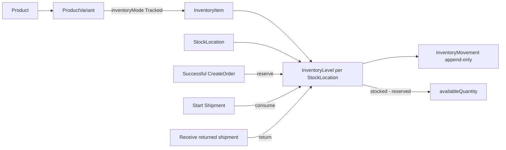

# Product, Variant & Inventory V1 — FE Agent Guide

> **Contract source:** current source snapshot 2026-08-21.  
> **Audience:** Backoffice FE, QA, and API-client agents.  
> **Scope:** Catalog Product/Variant hand-off to management Inventory. This guide complements, and supersedes the inventory-availability notes in the older Catalog creation guides.

## 1. Outcome and non-negotiable boundary

A Product does not own a SKU, price, or quantity. A sellable `ProductVariant` owns the SKU and inventory policy; a tracked variant can have one `InventoryItem`, with an `InventoryLevel` for each physical `StockLocation`.



Consequences for FE:

- Creating a Product or Variant **does not** create or add stock.
- `POST /management/inventory/levels` creates the missing InventoryItem/level, intentionally with all balances at `0`.
- The initial quantity is added only by `POST /management/inventory/levels/adjustments` with a positive `quantityDelta` and a mandatory reason.
- `availableQuantity` is server-derived: `stockedQuantity - reservedQuantity`. Never submit, locally persist as an editable value, or use a client calculation as the authority.
- Quantity is per **variant + stock location**, not a Product scalar. A Product list row can expose an aggregate summary only; use Inventory Levels for an operational per-variant/per-location balance.

## 2. Global transport, response, and authorization

Base URL: `/api/v1`. All examples below show the `data` inside the standard API envelope.

```ts
type ApiResponse<T> = {
  success: boolean;
  data: T;
  message: string;
  errorCode: string | null;
  validationErrors: Record<string, string[]> | null;
  details: unknown | null;
  timestamp: string;
};
```

All management calls need a valid staff session and `Authorization: Bearer <access-token>`. Inventory mutations are explicitly protected by anti-forgery validation: first call `GET /api/v1/security/csrf`, then include its `data.token` as `X-CSRF-TOKEN` with `credentials: "include"`.

```ts
async function managementApi<T>(path: string, init: RequestInit = {}) {
  const response = await fetch(`/api/v1${path}`, {
    credentials: "include",
    headers: {
      Accept: "application/json",
      "Content-Type": "application/json",
      Authorization: `Bearer ${accessToken}`,
      ...init.headers
    },
    ...init
  });
  return response.json() as Promise<ApiResponse<T>>;
}
```

The current Catalog controller does not declare anti-forgery validation on its Product mutations, while Inventory mutations do. A shared management client may send a valid CSRF header for every write, but FE must treat it as mandatory for Inventory and must not invent a backend failure rule for Catalog based on a missing header.

| Capability | Required policy |
| --- | --- |
| Read Product detail | `catalog.products.read` |
| Read Product list (including aggregate `inventory`) | `catalog.products.read` **and** `inventory.read` |
| Create Product | `catalog.products.create` |
| Update Product, Variant, price | `catalog.products.update` |
| Read locations, levels, movements | `inventory.read` |
| Initialize level and adjust stock | `inventory.adjust` |
| Create/update stock location | `inventory.locations.manage` |

UI permissions only control visibility. `401`, `403`, `404`, `409`, and `422` returned by the API remain authoritative.

## 3. API graph: create a tracked product and enter initial stock

```mermaid
sequenceDiagram
  actor Staff
  participant FE as Backoffice FE
  participant C as Catalog API
  participant I as Inventory API

  Staff->>FE: Create product data
  FE->>C: POST /catalog/products
  C-->>FE: product id + concurrencyStamp
  Staff->>FE: Create tracked variant
  FE->>C: POST /catalog/products/{id}/variants
  C-->>FE: variantId + renewed Product stamp
  opt No active stock location
    FE->>I: POST /management/inventory/locations
    I-->>FE: location id
  end
  FE->>I: POST /management/inventory/levels
  I-->>FE: inventoryItemId; stocked/reserved/available = 0
  Staff->>FE: Enter initial quantity and reason
  FE->>I: POST /management/inventory/levels/adjustments
  I-->>FE: Adjust movement with positive quantityDelta
  FE->>I: GET /management/inventory/levels
  I-->>FE: authoritative balances
```

### FE state flow

```text
Product Draft
  -> Variant created with inventoryMode=Tracked
  -> Select active StockLocation
  -> Initialize inventory level (only once per variant/location)
  -> Input initial quantity (> 0) + audit reason
  -> Adjust stock (+quantity)
  -> Refetch level and movement ledger

NotTracked | Preorder
  -> No inventory-level action; do not show a fake quantity field.
```

## 4. Catalog hand-off contract

### 4.1 Create Product

```http
POST /api/v1/catalog/products
Authorization: Bearer <access-token>
```

```json
{
  "producerId": "producer-uuid",
  "name": "Mật ong hoa rừng",
  "slug": "mat-ong-hoa-rung",
  "shortDescription": "500 g",
  "description": "...",
  "usageInstructions": null,
  "storageInstructions": null,
  "warningText": null,
  "metaTitle": null,
  "metaDescription": null,
  "brandName": "HTX Núi"
}
```

Success `data`:

```json
{
  "id": "product-uuid",
  "slug": "mat-ong-hoa-rung",
  "status": "Draft",
  "concurrencyStamp": "product-stamp-1"
}
```

There is no `quantity`, `stockedQuantity`, or `inventoryItemId` in this request or response.

### 4.2 Create tracked Variant

```http
POST /api/v1/catalog/products/{productId}/variants
Authorization: Bearer <access-token>
```

```json
{
  "concurrencyStamp": "product-stamp-1",
  "sku": "HONEY-500G",
  "name": "Hũ 500 g",
  "inventoryMode": "Tracked",
  "allowBackorder": false,
  "barcode": null,
  "weightGrams": 500,
  "displayOrder": 0
}
```

```json
{
  "variantId": "variant-uuid",
  "productId": "product-uuid",
  "concurrencyStamp": "product-stamp-2"
}
```

`inventoryMode` is exactly `Tracked`, `NotTracked`, or `Preorder`. Only `Tracked` can initialize a level. Preserve the returned Product `concurrencyStamp` for the next Catalog mutation. The SKU is supplied on creation and is not an update field.

## 5. Inventory API reference

### 5.1 Stock locations

Read locations:

```http
GET /api/v1/management/inventory/locations?isActive=true
```

Create a location when no selectable active location exists:

```http
POST /api/v1/management/inventory/locations
X-CSRF-TOKEN: <csrf-token>

{
  "code": "MAIN",
  "name": "Kho chính",
  "administrativeAreaId": null,
  "addressLine": "Thanh Hóa"
}
```

```ts
type StockLocation = {
  id: string;
  code: string;
  name: string;
  administrativeAreaId: string | null;
  addressLine: string | null;
  isActive: boolean;
  concurrencyStamp: string;
};
```

Update uses `PUT /management/inventory/locations/{stockLocationId}` with `concurrencyStamp`, `name`, `administrativeAreaId`, `addressLine`, and `isActive`. Reuse the returned `concurrencyStamp`; do not blindly retry a `409` stale version.

### 5.2 Initialize level — creates zero balance, not stock

```http
POST /api/v1/management/inventory/levels
X-CSRF-TOKEN: <csrf-token>

{
  "productVariantId": "variant-uuid",
  "stockLocationId": "location-uuid",
  "requiresShipping": true
}
```

```ts
type InventoryLevel = {
  inventoryItemId: string;
  productVariantId: string;
  sku: string;
  productName: string;
  variantName: string;
  stockLocationId: string;
  stockLocationCode: string;
  stockedQuantity: number;
  reservedQuantity: number;
  incomingQuantity: number;
  availableQuantity: number;
};
```

The first successful response is expected to contain `0` for every quantity. It is correct, not a failed creation. Backend creates the `InventoryItem` only if it does not already exist and creates the requested `InventoryLevel`.

```json
{
  "success": true,
  "data": {
    "inventoryItemId": "item-uuid",
    "productVariantId": "variant-uuid",
    "sku": "HONEY-500G",
    "productName": "Mật ong hoa rừng",
    "variantName": "Hũ 500 g",
    "stockLocationId": "location-uuid",
    "stockLocationCode": "MAIN",
    "stockedQuantity": 0,
    "reservedQuantity": 0,
    "incomingQuantity": 0,
    "availableQuantity": 0
  },
  "message": "Success",
  "errorCode": null,
  "validationErrors": null,
  "details": null,
  "timestamp": "2026-08-21T10:00:00Z"
}
```

Constraints:

- Variant must exist, not be `Discontinued`, and have `inventoryMode = Tracked`; otherwise expect `422`.
- Location must exist and be active; otherwise expect `422`.
- The same `inventoryItemId + stockLocationId` cannot be initialized twice; expect `409`.

### 5.3 Add initial stock or adjust stock

```http
POST /api/v1/management/inventory/levels/adjustments
X-CSRF-TOKEN: <csrf-token>

{
  "inventoryItemId": "item-uuid-from-level-response",
  "stockLocationId": "location-uuid",
  "quantityDelta": 100,
  "reason": "Nhập tồn ban đầu cho SKU HONEY-500G"
}
```

Success `data` is an immutable ledger entry:

```ts
type InventoryMovement = {
  id: string;
  inventoryItemId: string;
  stockLocationId: string;
  orderItemId: string | null;
  movementType: "Adjust" | "Allocate" | "Release" | "Ship" | "Return" | "Receive";
  quantityDelta: number;
  reason: string | null;
  occurredAt: string;
};
```

```json
{
  "success": true,
  "data": {
    "id": "movement-uuid",
    "inventoryItemId": "item-uuid",
    "stockLocationId": "location-uuid",
    "orderItemId": null,
    "movementType": "Adjust",
    "quantityDelta": 100,
    "reason": "Nhập tồn ban đầu cho SKU HONEY-500G",
    "occurredAt": "2026-08-21T10:00:00Z"
  },
  "message": "Success",
  "errorCode": null,
  "validationErrors": null,
  "details": null,
  "timestamp": "2026-08-21T10:00:00Z"
}
```

Rules:

- A positive delta adds stock. A negative delta reduces stock.
- Delta cannot be `0`, must be between `-1000000` and `1000000`, and `reason` is required/max 1,000 characters.
- A negative adjustment cannot make `stockedQuantity` lower than `reservedQuantity`; backend locks the level before validating it.
- This endpoint returns a movement, not the new balance. Refetch levels before rendering the final value.
- Do not add an edit form for a historical movement. The movement ledger is append-only; a correction is a new adjustment.

### 5.4 Read balances and movement history

```http
GET /api/v1/management/inventory/levels?q=HONEY-500G&stockLocationId={uuid}&page=1&pageSize=20
GET /api/v1/management/inventory/movements?inventoryItemId={uuid}&stockLocationId={uuid}&movementType=Adjust&fromUtc=2026-08-01T00:00:00Z&toUtc=2026-08-31T23:59:59Z&page=1&pageSize=50
```

Levels support `q`, `stockLocationId`, `page` (>= 1), and `pageSize` (1–100). Movements support `inventoryItemId`, `stockLocationId`, `movementType`, `fromUtc`, `toUtc`, `page`, and `pageSize` (1–100); dates are UTC and `fromUtc <= toUtc`.

Both paged responses use:

```ts
type PaginatedList<T> = {
  items: T[];
  pageNumber: number;
  pageSize: number;
  totalCount: number;
  totalPages: number;
  hasPreviousPage: boolean;
  hasNextPage: boolean;
};
```

## 6. FE implementation pattern

Use a separate inventory feature/store from the Catalog editor. The editor owns the Product `concurrencyStamp`; Inventory owns balance query state and never mutates the Catalog stamp.

```ts
async function initializeAndStockVariant(input: {
  productVariantId: string;
  stockLocationId: string;
  initialQuantity: number;
  reason: string;
}) {
  const level = await managementApi<InventoryLevel>("/management/inventory/levels", {
    method: "POST",
    headers: { "X-CSRF-TOKEN": await getCsrfToken() },
    body: JSON.stringify({
      productVariantId: input.productVariantId,
      stockLocationId: input.stockLocationId,
      requiresShipping: true
    })
  });
  if (!level.success) return level;

  if (input.initialQuantity <= 0) return level; // level exists at zero; let UI request a valid stock input.

  const movement = await managementApi<InventoryMovement>("/management/inventory/levels/adjustments", {
    method: "POST",
    headers: { "X-CSRF-TOKEN": await getCsrfToken() },
    body: JSON.stringify({
      inventoryItemId: level.data.inventoryItemId,
      stockLocationId: input.stockLocationId,
      quantityDelta: input.initialQuantity,
      reason: input.reason
    })
  });
  if (movement.success) {
    await Promise.all([invalidateInventoryLevels(), invalidateInventoryMovements()]);
  }
  return movement;
}
```

For retry after a network failure, **do not automatically retry** either mutation: initialization can already have succeeded and then return `409`; an adjustment could already have been persisted and a second request would duplicate stock. Refresh levels/movements first and ask staff to decide the next correction if the result is unknown.

Suggested query keys:

```ts
["catalog-product", productId]
["inventory-locations", { isActive }]
["inventory-levels", { q, stockLocationId, page, pageSize }]
["inventory-movements", { inventoryItemId, stockLocationId, movementType, fromUtc, toUtc, page, pageSize }]
```

After create/update location invalidate locations. After initialize/adjust invalidate levels and movements. If the Catalog table displays its aggregate `inventory`, also invalidate/refetch the affected catalog list.

## 7. UI rules, status and error mapping

| Situation | FE behavior |
| --- | --- |
| Variant is `Tracked` and no level exists | Show “Khởi tạo tồn kho” and a required active-location selector. |
| New level returns zero | Show “Đã khởi tạo, chưa có tồn”; offer separate “Nhập tồn ban đầu” form. |
| Variant is `NotTracked`/`Preorder` | Hide stock adjustment controls; do not show `0` as real tracked stock. |
| `409` on initialize | Reload levels. If the matching variant/location now exists, enter adjustment flow; never submit initialize repeatedly. |
| `422` on adjustment | Keep typed quantity/reason, show backend message, then reload level because reservation/balance may have changed. |
| `401`/`403` | Preserve non-sensitive form input; redirect/notify and hide unavailable action. |
| Unknown timeout | Disable duplicate submit, fetch levels/movements, and do not blindly resend the command. |

Never show product availability as a locally calculated product total. Display the latest `availableQuantity` returned by the server, labelled by location when relevant. `allowBackorder` is a Variant policy; it is not permission to submit a negative stock balance.

## 8. Order interaction and movement semantics

The inventory UI can display the following server-produced movement history but does not create them through a generic stock API:

| Movement | Server operation |
| --- | --- |
| `Adjust` | Manual management adjustment API in this guide. |
| `Allocate` / `Release` | Order reservation and cancellation/expiry flows. |
| `Ship` | Management start-shipment flow; consumes reserved stock. |
| `Return` | `POST /management/orders/{orderId}/shipment/receive-return`, not a payment refund. |
| `Receive` | Domain operation exists, but no standalone management receive endpoint is exposed in this V1 contract. |

Refund does not automatically restore stock. Only the returned-shipment flow creates a `Return` movement after physical receipt. Do not add a generic “refund and restock” button.

## 9. Manual FE acceptance checklist

- [ ] Product creation request contains no quantity field.
- [ ] Tracked Variant is created before inventory setup; non-tracked/preorder variants never call the level API.
- [ ] A valid active location is selected/created before level initialization.
- [ ] Initial level response is rendered as zero, then a positive adjustment creates an `Adjust` movement.
- [ ] Level list is refetched and shows server values, not a locally incremented balance.
- [ ] Duplicate initialization resolves through reload after `409` and does not create duplicate inventory state.
- [ ] Adjustment UI rejects zero locally, requires a reason, and maps server `422` without blind retry.
- [ ] Location update uses the latest `concurrencyStamp` and handles conflict via reload.
- [ ] Every inventory write sends bearer authorization, CSRF header, and credentials.
- [ ] No frontend code writes to PostgreSQL, fabricates an inventory item ID, or exposes/edit historical movement rows.

## 10. Source-of-truth references

- `Presentation/Ecom.API/Controllers/V1/CatalogProductsController.cs`
- `Presentation/Ecom.API/Controllers/V1/ManagementInventoryController.cs`
- `Core/Ecom.Application/Features/Commerce/Inventory/Commands/InitializeInventoryLevel/InitializeInventoryLevelCommand.cs`
- `Core/Ecom.Application/Features/Commerce/Inventory/Commands/AdjustInventoryLevel/AdjustInventoryLevelCommand.cs`
- `Core/Ecom.Application/Features/Commerce/Inventory/Queries/GetManagementInventoryLevels/GetManagementInventoryLevelsQuery.cs`
- `Core/Ecom.Domain/Entities/Commerce/Inventory/InventoryLevel.cs`
