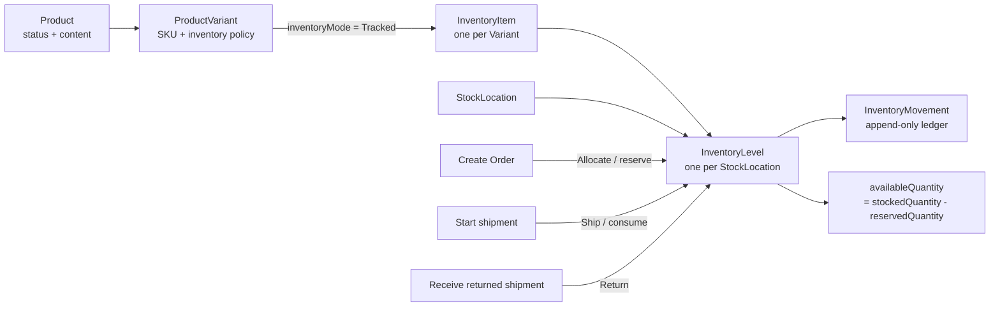
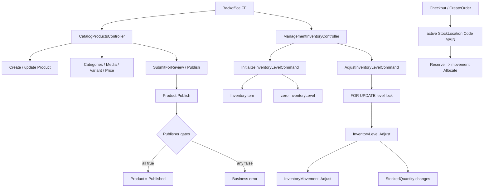
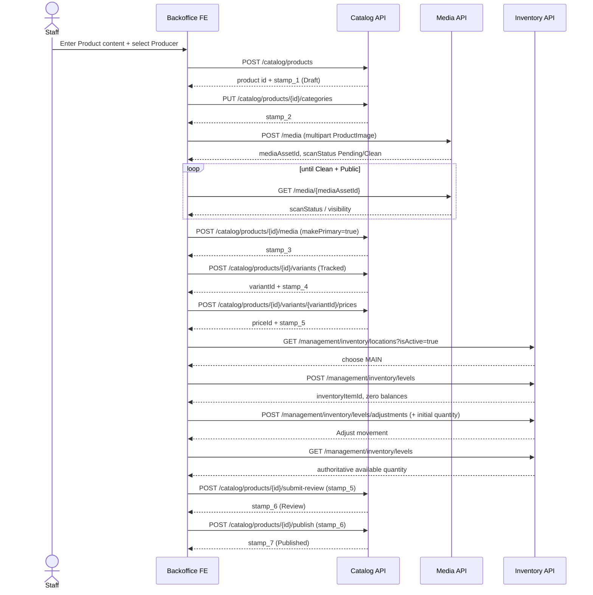
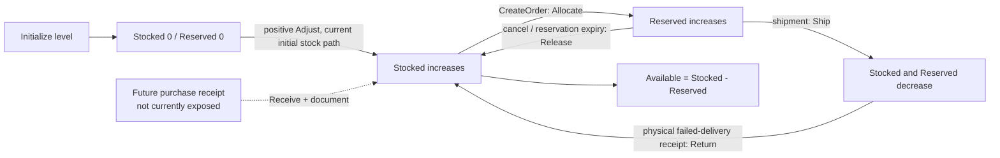
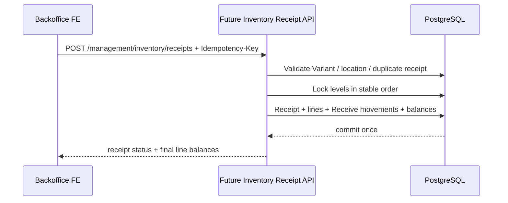

# Product Publish & Initial Inventory — FE Integration Guide

> **Contract source:** source snapshot inspected 2026-08-22.
> **Audience:** Backoffice FE, QA, and API-client developers.
> **Outcome:** create one sellable Product, publish it correctly, then make a tracked Variant sellable by entering its initial stock at the online fulfillment location.
> **Boundary:** this document separates APIs available now from the future `ReceiveInventory`/purchase-receipt capability. Do not call or mock a future endpoint as if it were live.

## 1. Executive contract

There is no `product.quantity`, `product.sku`, or product-level stock write. The unit that is sold and stocked is a `ProductVariant`.



The server is the balance authority:

```text
availableQuantity = stockedQuantity - reservedQuantity
```

FE may render this value, but must not submit `availableQuantity`, persist it as editable local state, or increment it optimistically after a write. Reload the relevant inventory level and movement ledger after every accepted mutation.

## 2. States, identifiers, and terms FE must not mix

| Concept | Server owner | FE mapping rule |
| --- | --- | --- |
| Product | `Product` | Holds content, Producer, public lifecycle, categories and media. No stock/SKU field. |
| Variant | `ProductVariant` | Sellable SKU. Each stock row must point to `productVariantId`, never only `productId`. |
| Inventory item | `InventoryItem` | Created on first level initialization for a tracked Variant. Use its `id` as `inventoryItemId` for adjustment/history. |
| Inventory level | `InventoryLevel` | Balance for **one inventory item + one stock location**. |
| Stock location | `StockLocation` | Physical location. Checkout currently allocates only an active location whose `code` is exactly `MAIN`. |
| Stocked | `stockedQuantity` | Physically usable quantity currently in that level. |
| Reserved | `reservedQuantity` | Quantity allocated to pending orders; not available for another order. |
| Available | `availableQuantity` | Server projection: stocked minus reserved. |
| Incoming | `incomingQuantity` | Read-only field in current APIs; no purchase-order/receipt workflow currently updates it. |
| Product version | `concurrencyStamp` | Latest Product stamp, required by each subsequent Catalog mutation. It is unrelated to inventory balances. |

`inventoryMode` is an enum string: `Tracked`, `NotTracked`, or `Preorder`.

- Only `Tracked` may initialize an inventory level.
- `NotTracked` and `Preorder` must not display a fake zero stock form.
- `allowBackorder` is stored on Variant but is **not currently applied by checkout availability logic**. A tracked Variant is still rejected when MAIN stock is insufficient; do not present this flag as a live oversell capability.

## 3. Transport, envelope, session, and retries

Base path: `/api/v1`. Unless explicitly stated otherwise, successful controller responses are HTTP `200` with this envelope:

```ts
type ApiResponse<T> = {
  success: boolean;
  data: T | null;
  message: string | null;
  errorCode: string | null;
  validationErrors: Record<string, string[]> | null;
  details: string | null;
  timestamp: string; // UTC ISO timestamp
};
```

The upload endpoint returns `201` on success; its body uses the same envelope. Paged data is:

```ts
type PaginatedList<T> = {
  items: T[];
  pageNumber: number;
  pageSize: number;
  totalCount: number;
  totalPages: number;
  hasPreviousPage: boolean;
  hasNextPage: boolean;
};
```

Management calls require a bearer token with the policy shown below. Inventory and order/checkout writes require anti-forgery protection. Fetch the token before the first protected write and include the returned token and browser credentials.

```http
GET /api/v1/security/csrf
```

```ts
const csrf = await fetch("/api/v1/security/csrf", {
  credentials: "include"
}).then(r => r.json() as Promise<ApiResponse<{ token: string }>>);

const headers = {
  Authorization: `Bearer ${accessToken}`,
  "Content-Type": "application/json",
  "X-CSRF-TOKEN": csrf.data!.token
};
```

Catalog Product mutations do not currently declare anti-forgery validation in their controller. It is safe for a shared client to send a valid token on all writes, but it is **mandatory** for Inventory writes.

| HTTP | Meaning | FE response |
| --- | --- | --- |
| `400` | Request validation, invalid media/CSRF, or malformed request. | Keep inputs; map `validationErrors` by field. |
| `401` | Not authenticated. | Renew/redirect session; do not retry silently. |
| `403` | Missing policy. | Hide blocked action; retain unsaved local input only. |
| `404` | Product/Variant/location/item absent. | Refetch canonical detail; do not construct IDs locally. |
| `409` | Duplicate business key or stale `concurrencyStamp`. | Reload canonical resource and require a deliberate user retry. |
| `422` | Business condition failed, e.g. non-tracked/discontinued Variant or insufficient stock. | Show server message and refetch affected state. |
| timeout/network failure | Commit state unknown. | Disable duplicate submit; refetch before offering correction. |

There is **no idempotency key on initialize/adjust inventory**. Never automatically replay either request after an unknown failure. `POST /orders` is different: it requires an `Idempotency-Key` header.

## 4. Roles and required support data

| Task | Endpoint | Required policy |
| --- | --- | --- |
| Read Product / category / producer choices | `GET /catalog/...` | `catalog.products.read`; `catalog.categories.read`; producer picker currently requires `catalog.products.create` |
| Create Product | `POST /catalog/products` | `catalog.products.create` |
| Edit Product, category, media attachment, variant, price | `/catalog/products/...` | `catalog.products.update` |
| Submit review / publish | `/catalog/products/{id}/submit-review`, `/publish` | `catalog.products.publish` |
| Upload/read media | `/media` | `media.upload`, `media.read` |
| Read inventory / locations | `/management/inventory/...` | `inventory.read` |
| Initialize / adjust stock | `/management/inventory/levels...` | `inventory.adjust` |
| Create/update location | `/management/inventory/locations...` | `inventory.locations.manage` |

Before opening the Product wizard, load the staff-visible Producer and Category pickers. Before initial stock, load active stock locations:

```http
GET /api/v1/catalog/producers?page=1&pageSize=100
GET /api/v1/catalog/categories?status=Published&page=1&pageSize=100
GET /api/v1/management/inventory/locations?isActive=true
```

For online sales, the location selector must visibly identify `code = "MAIN"`. Current checkout ignores stock in other locations. If no active `MAIN` location exists, the operator must create/fix it under the location-management permission before representing the product as in-stock online.

## 5. Code graph and operating sequence

### 5.1 Source code graph



### 5.2 API flow — recommended path to the final outcome



**Why stock is configured before Publish in this guide:** source does not make inventory a Publish gate, so it is technically possible to publish at zero stock. The recommended backoffice sequence avoids a publicly visible tracked Variant that checkout immediately rejects as out of stock. The actual Publish gate is Producer + primary published category + clean/public primary media + active Variant + effective price.

Every Catalog response supplying `concurrencyStamp` replaces the old Product stamp. Catalog mutations must be serialized; do not send a price and a media/category/variant mutation concurrently with the same stamp.

## 6. API reference: Product lifecycle

All JSON below is the contents of request body. Wrap each displayed success object inside `ApiResponse<T>.data` when consuming the response.

### 6.1 Create Product

```http
POST /api/v1/catalog/products
Authorization: Bearer <token>
Content-Type: application/json
```

```json
{
  "producerId": "11111111-1111-1111-1111-111111111111",
  "name": "Mật ong hoa rừng",
  "slug": "mat-ong-hoa-rung",
  "shortDescription": "Hũ 500 g",
  "description": "Mô tả đầy đủ",
  "usageInstructions": null,
  "storageInstructions": "Để nơi khô ráo",
  "warningText": null,
  "metaTitle": null,
  "metaDescription": null,
  "brandName": "HTX Núi"
}
```

Success `data`:

```json
{
  "id": "product-uuid",
  "slug": "mat-ong-hoa-rung",
  "status": "Draft",
  "concurrencyStamp": "stamp-1"
}
```

Do not add a quantity, SKU, price, category, or media ID to this request. Those are separate APIs.

### 6.2 Read canonical Product detail

```http
GET /api/v1/catalog/products/{productId}
```

The response is the canonical wizard payload. Important fields:

```ts
type CatalogProductDetail = {
  id: string;
  producerId: string;
  name: string;
  slug: string;
  status: "Draft" | "Review" | "Published" | "Paused" | "Discontinued";
  publishedAt: string | null;
  unpublishedAt: string | null;
  concurrencyStamp: string;
  categories: Array<{ id: string; name: string; slug: string; isPrimary: boolean; displayOrder: number }>;
  media: Array<{
    mediaAssetId: string; originalFileName: string; contentType: string;
    mediaType: "Image" | "Video" | "Document";
    visibility: "Public" | "Internal" | "Restricted";
    scanStatus: "Pending" | "Clean" | "Rejected" | "Failed";
    displayOrder: number; isPrimary: boolean; caption: string | null;
  }>;
  variants: Array<{
    id: string; sku: string; name: string;
    status: "Active" | "Paused" | "Discontinued";
    inventoryMode: "Tracked" | "NotTracked" | "Preorder";
    allowBackorder: boolean; barcode: string | null;
    weightGrams: number | null; displayOrder: number;
  }>;
  pricePeriods: Array<{
    id: string; productVariantId: string; amount: number; currencyCode: string;
    priceType: "Public" | "Sale" | "B2B"; minQuantity: number;
    effectiveFrom: string; effectiveTo: string | null; priceListId: string | null;
  }>;
  brandName: string | null;
};
```

Map `media[].mediaAssetId` to media endpoints, `variants[].id` to inventory initialization, and `pricePeriods[].productVariantId` back to its Variant. Never infer those IDs from list order or SKU text.

### 6.3 Replace categories

```http
PUT /api/v1/catalog/products/{productId}/categories
```

```json
{
  "concurrencyStamp": "stamp-1",
  "categories": [
    { "categoryId": "category-uuid", "isPrimary": true }
  ]
}
```

There must be at least one category, no duplicate ID, and exactly one `isPrimary: true`. For Publish, the primary category itself must have status `Published`. Success returns `ProductManagementResult` (`id`, `slug`, `status`, `concurrencyStamp`). Replace the stamp immediately.

### 6.4 Upload, poll, and attach primary media

Upload is multipart, not JSON:

```http
POST /api/v1/media
Authorization: Bearer <token>
Content-Type: multipart/form-data

file=<binary image>; intent=ProductImage; altText=Mật ong hoa rừng
```

Upload success `201` / `data`:

```json
{
  "id": "media-asset-uuid",
  "originalFileName": "honey.jpg",
  "contentType": "image/jpeg",
  "sizeBytes": 184320,
  "mediaType": "Image",
  "visibility": "Restricted",
  "scanStatus": "Pending",
  "intendedVisibility": "Public"
}
```

Poll metadata; never manufacture a public URL or attach a pending asset as primary:

```http
GET /api/v1/media/{mediaAssetId}
```

Only proceed when the response has both `scanStatus: "Clean"` and `visibility: "Public"`. If `scanStatus: "Failed"`, staff can use the supported retry endpoint after the failure is shown:

```http
POST /api/v1/media/{mediaAssetId}/retry-scan
X-CSRF-TOKEN: <csrf>
```

Attach the clean public asset:

```http
POST /api/v1/catalog/products/{productId}/media

{
  "concurrencyStamp": "stamp-2",
  "mediaAssetId": "media-asset-uuid",
  "displayOrder": 0,
  "makePrimary": true,
  "caption": "Ảnh sản phẩm"
}
```

This returns a renewed `ProductManagementResult`. The Product cannot publish without a primary media link whose asset is both Clean and Public.

### 6.5 Create tracked Variant

```http
POST /api/v1/catalog/products/{productId}/variants
```

```json
{
  "concurrencyStamp": "stamp-3",
  "sku": "HONEY-500G",
  "name": "Hũ 500 g",
  "inventoryMode": "Tracked",
  "allowBackorder": false,
  "barcode": null,
  "weightGrams": 500,
  "displayOrder": 0
}
```

Success `data`:

```json
{
  "variantId": "variant-uuid",
  "productId": "product-uuid",
  "concurrencyStamp": "stamp-4"
}
```

The SKU is globally unique and has no update field. Changing a Variant policy after inventory exists is rejected if `inventoryMode` differs. Creating/updating Variant content for a Published Product returns the Product to `Review`, so re-read the returned status and stamp before further mutations.

### 6.6 Create effective sell price

```http
POST /api/v1/catalog/products/{productId}/variants/{variantId}/prices
```

```json
{
  "concurrencyStamp": "stamp-4",
  "amount": 180000,
  "priceType": "Public",
  "effectiveFrom": "2026-08-22T00:00:00Z",
  "effectiveTo": null,
  "priceListId": null,
  "currencyCode": "VND",
  "minQuantity": 1
}
```

Success `data`:

```json
{
  "variantPriceId": "price-uuid",
  "productId": "product-uuid",
  "concurrencyStamp": "stamp-5"
}
```

Price times are UTC. `effectiveTo` must be later than `effectiveFrom`; `currencyCode` is three characters; `minQuantity >= 1`. Publish requires at least one effective price for an active Variant at the server’s current time, so do not set `effectiveFrom` in the future when intending to publish now.

### 6.7 Submit for review and publish

```http
POST /api/v1/catalog/products/{productId}/submit-review

{ "concurrencyStamp": "stamp-5" }
```

Expected success `data`:

```json
{
  "id": "product-uuid",
  "slug": "mat-ong-hoa-rung",
  "status": "Review",
  "concurrencyStamp": "stamp-6"
}
```

```http
POST /api/v1/catalog/products/{productId}/publish

{ "concurrencyStamp": "stamp-6" }
```

Expected final success `data` has `status: "Published"` and a new stamp. The backend verifies:

1. Producer is `Published` and verified.
2. A primary Product category is `Published`.
3. A primary Product media asset is `Clean` and `Public`.
4. At least one active Variant exists.
5. At least one active Variant has an effective price.

Inventory is not a Publish gate in current source. After final success, re-fetch `GET /catalog/products/{productId}` and the selected inventory level to render authoritative status and stock.

## 7. API reference: initial inventory available now

### 7.1 Read or create stock location

```http
GET /api/v1/management/inventory/locations?isActive=true
```

Location item:

```ts
type StockLocation = {
  id: string;
  code: string;
  name: string;
  administrativeAreaId: string | null;
  addressLine: string | null;
  isActive: boolean;
  concurrencyStamp: string;
};
```

Create only for users with `inventory.locations.manage`:

```http
POST /api/v1/management/inventory/locations
X-CSRF-TOKEN: <csrf>

{
  "code": "MAIN",
  "name": "Kho bán online",
  "administrativeAreaId": null,
  "addressLine": "Thanh Hóa"
}
```

`code` is unique. Treat `MAIN` as a controlled business configuration: creating another active location does not make it an online fulfillment location.

### 7.2 Initialize the zero-balance level

```http
POST /api/v1/management/inventory/levels
X-CSRF-TOKEN: <csrf>

{
  "productVariantId": "variant-uuid",
  "stockLocationId": "main-location-uuid",
  "requiresShipping": true
}
```

Success `data`:

```json
{
  "inventoryItemId": "inventory-item-uuid",
  "productVariantId": "variant-uuid",
  "sku": "HONEY-500G",
  "productName": "Mật ong hoa rừng",
  "variantName": "Hũ 500 g",
  "stockLocationId": "main-location-uuid",
  "stockLocationCode": "MAIN",
  "stockedQuantity": 0,
  "reservedQuantity": 0,
  "incomingQuantity": 0,
  "availableQuantity": 0
}
```

This endpoint creates the `InventoryItem` if absent and creates one level at zero. A zero response is correct. It does **not** enter stock. A second request for the same item/location returns `409`; reload levels and reuse the existing `inventoryItemId` rather than retrying initialization.

### 7.3 Current initial-stock workaround: positive adjustment

```http
POST /api/v1/management/inventory/levels/adjustments
X-CSRF-TOKEN: <csrf>

{
  "inventoryItemId": "inventory-item-uuid",
  "stockLocationId": "main-location-uuid",
  "quantityDelta": 100,
  "reason": "Nhập tồn ban đầu cho SKU HONEY-500G"
}
```

Success `data` is a ledger entry, **not** the final level:

```json
{
  "id": "movement-uuid",
  "inventoryItemId": "inventory-item-uuid",
  "stockLocationId": "main-location-uuid",
  "orderItemId": null,
  "movementType": "Adjust",
  "quantityDelta": 100,
  "reason": "Nhập tồn ban đầu cho SKU HONEY-500G",
  "occurredAt": "2026-08-22T10:00:00Z"
}
```

Rules enforced by the current command:

- `quantityDelta` is non-zero and between `-1000000` and `1000000`.
- `reason` is required and at most 1,000 characters.
- The server locks the exact level before applying the change.
- A negative adjustment cannot leave `stockedQuantity < reservedQuantity`.
- Historical movements are immutable. A correction is a new adjustment, never an edit/delete of a movement.

Immediately fetch the authoritative level:

```http
GET /api/v1/management/inventory/levels?stockLocationId={main-location-uuid}&q=HONEY-500G&page=1&pageSize=20
GET /api/v1/management/inventory/movements?inventoryItemId={inventory-item-uuid}&stockLocationId={main-location-uuid}&page=1&pageSize=50
```

Inventory level mapping:

```ts
type InventoryLevel = {
  inventoryItemId: string;
  productVariantId: string;
  sku: string;
  productName: string;
  variantName: string;
  stockLocationId: string;
  stockLocationCode: string;
  stockedQuantity: number;
  reservedQuantity: number;
  incomingQuantity: number;
  availableQuantity: number;
};

type InventoryMovement = {
  id: string;
  inventoryItemId: string;
  stockLocationId: string;
  orderItemId: string | null;
  movementType: "Receive" | "Allocate" | "Release" | "Adjust" | "Ship" | "Return";
  quantityDelta: number;
  reason: string | null;
  occurredAt: string;
};
```

## 8. Product list, detail, and inventory display mapping

The management Product list is an aggregate display only:

```http
GET /api/v1/catalog/products?page=1&pageSize=20&q=HONEY
```

It requires both `catalog.products.read` and `inventory.read`. Its `inventory` is summed across all Variant levels and locations:

```ts
type CatalogProductListItem = {
  id: string;
  producerId: string;
  name: string;
  slug: string;
  status: string;
  primaryCategory: { id: string; name: string; slug: string; isPrimary: boolean; displayOrder: number } | null;
  price: { fromAmount: number | null; currencyCode: string | null; hasEffectivePrice: boolean };
  inventory: {
    stockedQuantity: number;
    reservedQuantity: number;
    availableQuantity: number;
    incomingQuantity: number;
    isTracked: boolean;
  };
  primaryMedia: unknown | null;
  brandName: string | null;
};
```

Do not use list-level `inventory.availableQuantity` to decide whether a particular SKU can be sold: it combines variants and locations. Use `GET /management/inventory/levels` for an operational Variant + location screen. Current checkout additionally limits its allocation to `MAIN`.

## 9. API graph: stock lifecycle and checkout context



`Receive` exists as a domain movement type, but the only current physical receipt endpoint is a returned-shipment flow under management orders. It is not a general supplier receiving API. Refund does not automatically restock.

## 10. Target capability: real supplier receipt (not yet an API contract)

The current positive `Adjust` path is safe enough for controlled opening balances but weak for recurring purchasing: it has no idempotency key, receipt number, supplier, purchase reference, approval, attachment, or batch atomicity.

The desired future flow is deliberately shown as **roadmap**, not an endpoint FE may call today:



Proposed request shape for approval only:

```json
{
  "receiptNumber": "PN-20260822-0001",
  "stockLocationId": "main-location-uuid",
  "receivedAt": "2026-08-22T10:00:00Z",
  "supplierName": "HTX Núi",
  "externalReference": "PO-001",
  "note": "Nhập hàng đợt 1",
  "lines": [
    { "productVariantId": "variant-uuid", "quantity": 100 }
  ]
}
```

Required BE acceptance before FE implementation:

1. A unique receipt/document number and idempotency record.
2. One transaction for header, lines, `Receive` movements and level balances.
3. Exact duplicate-key replay semantics and a deterministic response for an in-progress request.
4. Explicit policy for initializing a missing tracked level at the receipt location.
5. Separate permission/reason codes for receipt versus stock correction.
6. PostgreSQL integration tests for duplicate request, concurrent receipt/checkout, rollback, and MAIN fulfillment.

Until this is approved and implemented, label the UI action **“Điều chỉnh tồn ban đầu”**, not **“Phiếu nhập hàng”**.

## 11. FE state model and mutation rules

```ts
type ProductEditorState = {
  productId: string | null;
  productStamp: string | null;
  productStatus: "Draft" | "Review" | "Published" | "Paused" | "Discontinued" | null;
  variantsById: Record<string, CatalogProductDetail["variants"][number]>;
};

type InventoryState = {
  locations: StockLocation[];
  levels: InventoryLevel[];
  movements: InventoryMovement[];
};
```

- Keep Catalog and Inventory stores separate. An inventory mutation never renews `productStamp`.
- Immediately overwrite `productStamp` from every successful Catalog mutation. Sequence Catalog calls through one queue/mutex.
- On Product `409`, discard neither user input nor server data: refetch canonical detail, show the conflict, then require staff to reapply intentionally.
- On level initialization `409`, refetch levels and locate the exact `(productVariantId, stockLocationId)` row. Then use its `inventoryItemId` for any adjustment.
- On adjustment `422`, retain reason/input for correction but reload level because another order may have reserved stock.
- Do not auto-retry timeout for initialize or adjustment. Query first; a committed adjustment replay would duplicate quantity.
- Disable Publish while media is pending/failed, there is no primary category, no active Variant, no currently effective price, or the Product is not `Review`. This mirrors source gates and avoids a known failing request.

Suggested cache invalidations:

```ts
["catalog-product", productId]                 // after any Catalog mutation
["catalog-products", filters]                  // after Catalog mutation/status change
["inventory-locations", { isActive: true }]    // after location mutation
["inventory-levels", { stockLocationId, q }]   // after initialize / adjustment
["inventory-movements", { inventoryItemId, stockLocationId }] // after adjustment
```

## 12. End-to-end FE acceptance checklist

- [ ] Product request carries no quantity/SKU/price fields.
- [ ] Category replacement sends exactly one primary category; its status is Published.
- [ ] Uploaded image is polled until `Clean + Public`; only then is it attached as primary.
- [ ] Variant creation maps `variantId` separately from `productId`; SKU is globally unique.
- [ ] Price maps `PriceType: Public`, valid UTC effective window, `VND`, and `minQuantity: 1` for normal storefront sale.
- [ ] Each Catalog success replaces the current `concurrencyStamp`; no concurrent writes reuse an old stamp.
- [ ] Tracked Variant uses an active `MAIN` level. Initialize first, then use positive `Adjust` for the current opening-balance path.
- [ ] FE refetches level/movement after adjustment and displays server `availableQuantity`.
- [ ] Product enters `Review` before Publish and Publish success is checked as `status: Published`.
- [ ] Storefront/checkout readiness is verified against the active MAIN level, not a Product aggregate or arbitrary secondary location.
- [ ] No client assumes `allowBackorder` currently permits oversell.
- [ ] No client calls `/management/inventory/receipts`; it does not exist in current V1 source.

## 13. Source-of-truth files

- `Presentation/Ecom.API/Controllers/V1/CatalogProductsController.cs`
- `Presentation/Ecom.API/Controllers/V1/MediaController.cs`
- `Presentation/Ecom.API/Controllers/V1/ManagementInventoryController.cs`
- `Core/Ecom.Application/Features/Catalog/Commands/ChangeProductLifecycle/PublishProduct/PublishProductCommand.cs`
- `Core/Ecom.Application/Features/Catalog/Products/Services/CatalogProductMutationService.cs`
- `Core/Ecom.Application/Features/Commerce/Inventory/Commands/InitializeInventoryLevel/InitializeInventoryLevelCommand.cs`
- `Core/Ecom.Application/Features/Commerce/Inventory/Commands/AdjustInventoryLevel/AdjustInventoryLevelCommand.cs`
- `Core/Ecom.Application/Common/Services/CheckoutPricingService.cs`
- `Infrastructure/Ecom.Infrastructure/Services/InventoryReservationStore.cs`
- `Core/Ecom.Domain/Entities/Commerce/Catalog/Product.cs`
- `Core/Ecom.Domain/Entities/Commerce/Inventory/InventoryLevel.cs`
