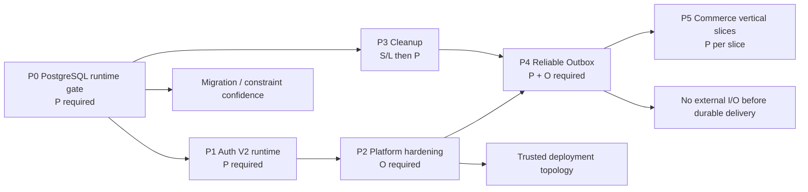

# Kế hoạch thực thi production baseline trước feature Commerce

**Ngày:** 2026-08-02
**Loại công việc:** chương trình hardening theo phase P0-P5; không phải một feature đơn lẻ.
**Nguồn sự thật:** source/worktree hiện tại, `AGENTS.md`, test hiện có và tracker. Kế hoạch không dùng Docker/Testcontainers.

## 1. Mục tiêu, ranh giới và nguyên tắc quyết định

Mục tiêu là tạo một baseline có thể chứng minh được trước khi mở Cart/Checkout/Order: mutation có transaction ownership rõ ràng, data model được chạy thật trên PostgreSQL riêng, Auth V2 không để lại state sai khi fail, platform không tin request header/origin tuỳ tiện, side effect có delivery bền vững, và feature Commerce được xây theo lát dọc.

Đây **không** là uỷ quyền để thay đổi ngay public API, Auth/permission, migration/snapshot/DbContext, dependency, runtime configuration, secrets hay deployment. Mỗi work package chạm các vùng đó có approval gate riêng. Không ghi secret vào source, issue, log hay báo cáo; không apply migration trong môi trường này.

### Bằng chứng và trạng thái yêu cầu

| Mức | Ý nghĩa | Không được thay thế bằng |
| --- | --- | --- |
| S | Source/diff đã được trace đầy đủ. | Một kế hoạch hoặc tracker. |
| L | Build/test local pass. | PostgreSQL, staging, production. |
| P | Test PostgreSQL cô lập chạy không skip. | EF InMemory hoặc DB development dùng chung. |
| O | Staging topology/monitoring/smoke được xác nhận. | Local appsettings. |

Một phase chỉ đóng khi đạt đúng mức evidence nêu ở exit criteria; không đánh dấu từ intention.

## 2. Graph thực thi và dependency



`P3` có thể được chia batch song song sau P0 nếu không chạm cùng contract/schema; `P5` không bắt đầu write flow trước P4. Catalog read-only/CQRS maintenance có thể tiếp tục, nhưng không được trộn vào changeset của chương trình này.

## 3. Baseline source đã đối chiếu

| Boundary | Source hiện hữu | Ý nghĩa cho kế hoạch |
| --- | --- | --- |
| Transaction | `UnitOfWorkBehavior` mở/rollback transaction cho `ITransactionalRequest`; legacy attribute vẫn được hỗ trợ. | Mutation mới đi qua marker; handler không tự Save/transaction. |
| Catalog | Public `/products`, `/categories`; Catalog backoffice routes; CQRS Catalog đã tách use case. | G2 là baseline giữ nguyên, không mở lại grouped handler. |
| PostgreSQL tests | `PostgreSqlFixture`, `PostgreSqlTestDatabaseGuard`, migration/constraint/UoW/Catalog API tests. | Có harness, nhưng runner chưa có `ECOM_TEST_POSTGRES` và `ECOM_TEST_ALLOW_RESET`; 16 tests đang skip. |
| Auth V2 | Password login coordinator gọi `RecordFailedPasswordLoginCommand` hoặc `CompletePasswordLoginCommand`; refresh/logout/session đã có source. | Cần P evidence và session/policy invalidation fixes trước claims production. |
| Platform | `Program.cs` dùng forwarded headers không allowlist proxy/network, HTTPS redirect tắt, CORS policy, health/metrics routes. | Cần quyết định topology trước source/config change. |
| Outbox | `OutboxMessage`, EF config và conversion interceptor chỉ attach khi `Outbox:Enabled`. | Chưa thấy processor/lease/retry/dispatch; flag chưa được bật production. |
| Commerce Domain | Cart, Order, Payment, Shipment, InventoryReservation, lifecycle/history aggregate tồn tại. | Không phải tạo lại Domain; cần Application/API orchestration và relational proof. |

## 4. P0 — PostgreSQL runtime gate (bắt buộc đầu tiên)

### Mục tiêu

Biến test PostgreSQL từ `skip` thành evidence P có thể tái lập mà không dùng Docker và không đụng database phát triển/staging/production.

### Scope source và hạ tầng

- Giữ `Tests/Ecom.IntegrationTests/PostgreSql/PostgreSqlTestDatabaseGuard.cs`, `PostgreSqlFixture.cs`, `[PostgreSqlFact]` là guard bắt buộc.
- Chạy các nhóm: BaseRepository, UnitOfWork, migration/VariantPrice/ProductMedia constraint và Catalog API authorization.
- Cấu hình ở secret store/CI runner, **không** trong `appsettings*.json` hay source:
  - `ECOM_TEST_POSTGRES` trỏ database test-only; tên database phải khớp guard `_test`/`_tests`.
  - `ECOM_TEST_ALLOW_RESET=true` chỉ trên runner ephemeral/dedicated.
- Runner có quyền tối thiểu để tạo/drop **schema test được fixture sinh ra**, không có quyền tới database production.

### Work packages theo thứ tự

| ID | Công việc | File/phạm vi | Acceptance |
| --- | --- | --- | --- |
| P0.1 | Xác nhận DB target độc lập, TLS policy (Azure nếu dùng), network access và least privilege. | Hạ tầng/secret runner; không commit connection string. | Review chứng minh target không phải DefaultConnection/production. |
| P0.2 | Dry-run guard: chạy một PostgreSQL fact và xác nhận fixture tạo schema `ecom_it_<guid>` riêng. | Test runner và `PostgreSqlFixture`. | Không reset database ngoài target; cleanup schema sau test. |
| P0.3 | Chạy toàn bộ integration suite, phân loại mọi failure theo migration/constraint/UoW/API authz. | `Tests/Ecom.IntegrationTests`. | 0 PostgreSQL skip, 0 failure hoặc issue source cụ thể. |
| P0.4 | Chạy model-drift check và review SQL idempotent nếu có migration mới trong dirty worktree. | EF tool, migration/snapshot read-only review. | `has-pending-model-changes` sạch; không apply migration. |
| P0.5 | Chỉ sau P evidence: cập nhật tracker B10.1; tạo kế hoạch B2.7 CI runner chuyên dụng. | Documentation/tracker. | Exact command, date, result, target class được lưu; không chứa secret. |

### Commands và evidence bắt buộc

```powershell
dotnet test Tests/Ecom.IntegrationTests/Ecom.IntegrationTests.csproj --no-restore
dotnet ef migrations has-pending-model-changes --no-build --project Infrastructure/Ecom.Infrastructure/Ecom.Infrastructure.csproj --startup-project Presentation/Ecom.API/Ecom.API.csproj --context ApplicationDbContext
git diff --check
```

Nếu test fail, sửa tại boundary thật: migration/configuration cho schema, `UnitOfWorkBehavior`/UnitOfWork cho rollback, handler/policy fixture cho HTTP 401/403. Không được nới guard, bỏ `[PostgreSqlFact]`, hoặc chuyển claim quan hệ sang EF InMemory để “qua gate”.

### Approval/input cần có

Người sở hữu hạ tầng cung cấp runner/secret và xác nhận database test-only. Đây là external state, không thể tự tạo bằng source. Không cần Docker. Không apply migration.

### Exit criteria

P0 đóng khi full integration suite không skip PostgreSQL, Catalog API 200/401/403 envelope tests pass, migration/price/media/UoW concurrency assertions pass và evidence không lộ connection string.

## 5. P1 — Auth V2 runtime security

### Mục tiêu

Chứng minh session/token/authentication state nhất quán trên PostgreSQL và không để role/policy change giữ token đặc quyền cũ.

### Source boundary chính

- HTTP: `Presentation/Ecom.API/Controllers/AuthV2Controller.cs` và V2 route exposed gồm register, verify, password login, refresh, `me`, logout/logout-all/session delete.
- Application: `Features/AuthV2/Login/PasswordLoginCommand.cs`, `RecordFailedPasswordLoginCommand.cs`, `CompletePasswordLoginCommand.cs`, Refresh, Logout và PasswordManagement.
- Persistence/security: `User`, `PasswordCredential`, `UserSession`, `SessionRefreshToken`, `SecurityEvent`, `AuthenticationSessionEngine`, `SessionRefreshService`.
- Authorization: `Permissions.GetAll` → PolicySeeder/RoleSeeder → snapshot → JWT `policy` claim → `PermissionAuthorizationHandler`.

### Phân rã thực hiện

| ID | Thay đổi/kiểm tra | Scope chính | Test P tối thiểu |
| --- | --- | --- | --- |
| P1.1 | Contract inventory: freeze route/status/error/token shape hiện có; xác định V1 OTP compatibility không đổi. | Controller + `ApiResponse`/`TResult`. | API contract snapshot cho enabled/disabled V2 flag. |
| P1.2 | Password failed path: generic failure, rate limit failure mode, failed counter/lockout và `LoginFailed` audit commit độc lập. | `PasswordLoginCommand` + failed command. | Invalid password increments/audits; valid user success không lộ account existence; lockout boundary. |
| P1.3 | Password success atomicity: `RecordSuccess`, session, refresh family/token, security event là một transaction. | Complete command + session engine + UoW. | Inject/arrange session create failure: credential success/audit/session/token đều rollback; success persists exactly once. |
| P1.4 | Refresh rotation/replay: concurrent/reused refresh token claim, family/session revocation, security stamp `me`. | `SessionRefreshService`, `RefreshSessionCommand`. | Parallel refresh: one valid outcome; replay revokes correct family/session; no duplicate active token. |
| P1.5 | Logout and privileged mutation invalidation. | Logout handlers; `UpdateUserRole`, `AdjustRolePolicy`. | Logout-all and role/policy adjustment revoke V2 session + refresh family, rotate stamp and create redacted `SecurityEvent`. |
| P1.6 | Production dependency checks. | rate limit/Redis, feature flags, password settings. | Dependency unavailable fails closed; Development OTP/token bypass rejected in non-Development. |

### Decisions before any source edit

- Role/policy revocation changes Auth/authorization semantics and requires explicit approval.
- Email/provider/outbox, browser BFF/cookie/CSRF, Google/Passkey/QR/staff onboarding are out of P1 unless separately approved.
- Password token values, refresh tokens, hashes, verification secrets, identifiers and raw IP/user agent data never appear in assertion failure output, logs or reports.

### Exit criteria

P1 needs S+L+P for password, refresh/replay, logout and role/policy invalidation. Redis multi-instance/provider email/browser behavior remains explicitly unproven until its own scope/O evidence.

## 6. P2 — Platform hardening and API contract freeze

### Mục tiêu

Đưa `Program.cs` từ local assumptions sang topology-aware production configuration mà không phá deployment HTTP-only hiện tại hoặc lộ operational surfaces.

### Decision record bắt buộc trước code

Hạ tầng xác nhận bằng văn bản: ingress/proxy IP/network, nơi TLS terminate, public origins từng environment, identity của health/metrics scraper, Swagger exposure policy, authentication của internal endpoints và host/path base. Không có đầu vào này thì P2 chỉ dừng ở analysis/test plan.

### Work packages

| ID | Scope | Source dự kiến | Acceptance |
| --- | --- | --- | --- |
| P2.1 | Forwarded-header trust boundary | `Program.cs`, typed options/validator nếu cần. | Chỉ trust `KnownProxies`/`KnownNetworks` đã chốt; spoofed X-Forwarded-* ngoài boundary không đổi scheme/client identity. |
| P2.2 | TLS policy | `Program.cs`, environment config. | HTTPS redirect/HSTS chỉ bật đúng nơi ingress contract yêu cầu; HTTP-only internal deployment có explicit safe exception. |
| P2.3 | CORS allowlist | CORS options/config and validation. | Chỉ origin/method/header đã quyết định; preflight, credentials và no-origin requests có integration test. |
| P2.4 | Health/metrics surface | `Program.cs`, health response writer/route mapping. | Liveness minimal; readiness detail và Prometheus giới hạn theo network/auth policy; smoke in staging. |
| P2.5 | Swagger and error contract | Swagger option + middleware/`ErrorCodes`. | Swagger non-development requires explicit opt-in; errors no stacktrace/secret; concurrency maps stable code/status. |
| P2.6 | Observability and rate limit safety | logging/redaction, request timeout/rate-limit config. | Correlation works; no token/PII/raw upload/connection string in logs; dependency failure mode documented. |

### Constraints

- `ProxyAuthorizationMiddleware` route bypass không được xem là proxy trust mechanism.
- `UseHttpsRedirection` đang tắt; không bật chỉ vì checklist khi topology chưa chốt.
- CORS, health route and `ErrorCodes` thay đổi public contract/configuration: cần approval trước implementation.

### Exit criteria

P2 đóng khi có approved configuration contract, automated API/security checks và O evidence ở staging. Build local không đủ.

## 7. P3 — Clean Architecture and persistence debt reduction

### Mục tiêu

Giảm debt có thể làm Commerce write flow khó kiểm chứng, theo batch nhỏ và không đổi contract không cần thiết.

### Work packages và thứ tự an toàn

| ID | Scope source | Thay đổi dự kiến | Gate |
| --- | --- | --- | --- |
| P3.1 | `BaseRepository`, `IUnitOfWork`, consumers | Inventory repository reads; thêm `CancellationToken` theo overload-compatible batch. | Compile consumers, focused tests, P repository test. |
| P3.2 | Repository list/query helpers | Inventory string sorting và reflection projection; thay bằng typed whitelist/query DTO theo consumer. | No unbounded sort/property access; API regression tests. |
| P3.3 | `BaseController` và V1 controllers | Migrate bounded controller groups từ `BaseController.Mediator` service locator sang explicit `ISender` injection. | No route/model/error behavior change; controller tests. |
| P3.4 | `BaseEntity`, `AuditableEntityInterceptor`, aggregates | Đóng public audit/soft-delete/concurrency mutation qua domain/interceptor methods. | Existing EF mapping/migration unchanged unless approval; concurrency P test. |
| P3.5 | Legacy UoW consumers | Per use case: request marker, remove direct save/transaction, test then deprecate legacy helper. | Required transaction test matrix, no nested owner regression. |

### Test matrix mỗi mutation batch

1. Query không mở transaction.
2. Success commit một lần.
3. Handled `TResult` failure rollback và clear tracker.
4. Exception/cancellation/concurrency rollback.
5. Nested transactional request không commit/rollback owner bên ngoài.

P3 không tự sửa schema. Nếu entity encapsulation buộc EF mapping/schema thay đổi, tách sang work package migration có approval thay vì trộn vào cleanup.

### Exit criteria

Không còn consumer mới của legacy helper; batch đã inventory có tests L/P; public route/DTO unchanged hoặc có approved versioned contract.

## 8. P4 — Reliable Outbox

### Mục tiêu

Biến foundation hiện tại (`OutboxMessage`, configuration, `ConvertDomainEventsToOutboxInterceptor`) thành at-least-once delivery có thể vận hành, trước khi Payment/Shipment/notification dựa vào side effect.

### P4.0 — Quyết định kiến trúc bắt buộc

Chốt bằng approval: destination transport/provider, semantics at-least-once, event contract/versioning, payload privacy, lease ownership, retry/backoff limits, poison/dead-letter handling, retention/cleanup, ordering expectations, observability and alert owner. Dependency mới hoặc cloud service mới không được thêm trước quyết định này.

### Work packages

| ID | Scope | Acceptance |
| --- | --- | --- |
| P4.1 | Review OutboxMessage state/config/index and model migration impact; design aggregate event serialization/version envelope. | SQL and migration review approved; no hand-edit snapshot; P0 green first. |
| P4.2 | Atomic capture: interceptor writes events in the same DbContext transaction; event clearing semantics are safe on retry. | P test proves aggregate write + outbox write commit/rollback together. |
| P4.3 | Processor: scoped hosted worker, claim/lease with concurrent instances, dispatcher abstraction and idempotent consumer contract. | Two workers cannot process the same leased message simultaneously. |
| P4.4 | Retry/delivery: attempts, next attempt, exponential backoff/jitter, final poison path and redacted last error. | Crash/restart, transient failure, permanent failure and duplicate delivery tests. |
| P4.5 | Operational controls: metrics, tracing/correlation, manual replay/reconciliation access policy, retention job. | Staging dashboards/alerts and bounded recovery runbook. |

### Constraints

- No external HTTP/email/payment/shipping/search call while `UnitOfWorkBehavior` transaction is open.
- `Outbox:Enabled` remains disabled outside a scoped P/O validated environment.
- `LastError` and payload must not expose tokens, credentials, payment data or private customer fields.

### Exit criteria

P4 requires S+L+P for atomicity/claim/retry/idempotency and O for worker deployment, monitoring and recovery. Only then can a Commerce feature publish external work.

## 9. P5 — Commerce vertical slices

### Preconditions

P0-P4 gates are closed for the relevant boundary. Public API, guest-cookie, permission, migration and payment contract approvals are recorded per slice. Domain entities already exist; handlers must use their methods, never set state property-by-property.

### P5.0 — Contract and migration inventory

Before coding routes, produce one approved contract for each slice: endpoint/version, request/response/error code, caller (anonymous/user/staff), owner check, idempotency semantics, state transition, tables/indexes/constraint impact and telemetry events. No feature starts from frontend payload alone.

### P5.1 — Cart (user and guest)

**Source anchors:** `Ordering/Cart.cs`, CartItem/configuration, current-user abstraction, public API conventions.

- Queries: active cart/detail and price/availability display DTOs are no-tracking.
- Commands: get/create ownership, add/update/remove line, merge guest cart on authenticated transition, expire/convert.
- Guest token: opaque Secure HttpOnly cookie; persist only token hash; never return/store raw token in DB/log.
- Guards: owner XOR (`UserId` vs guest hash), active cart uniqueness, product variant active/sellable validation, quantity constraints.
- Tests: guest/user isolation, token rotation/merge rules, duplicate active-cart race, concurrent line updates, authorization and response envelope.

**Exit:** P for cart ownership/uniqueness/concurrency; no reservation at add-to-cart.

### P5.2 — Checkout preview

**Source anchors:** effective price resolver, `VariantPrice`, Cart, inventory read model.

- Server resolves active Sale then Public VND price, current eligibility and stock preview; client totals are ignored.
- Output includes re-priced lines and explicit unavailable/changed-price facts, not a promise to reserve stock.
- Tests cover price interval boundary/overlap, paused variant, price change after cart update and no tracking leakage.

**Exit:** price and availability recomputation proven on P; preview remains read-only/non-transactional.

### P5.3 — CreateOrder (highest-risk write slice)

**Source anchors:** `Order`, `OrderItem`, `Payment`, `InventoryLevel`, `InventoryReservation`, `InventoryMovement`, `Cart` and future idempotency persistence.

- Command requires `Idempotency-Key`; store key hash plus caller scope/fingerprint/status/resource/result/expiry. Same key+same fingerprint returns original result; mismatched fingerprint is conflict.
- One `ITransactionalRequest`: resolve idempotency, reload cart/current prices/MAIN inventory, lock/claim stock safely, reserve for 30 minutes, create immutable item snapshots/order/payment/reservation/movement, convert cart, persist idempotency result, commit once.
- Expected concurrency conflict returns a stable error; never blindly retry inside handler.
- No payment/email/shipment call inside transaction; emit domain event only for P4 Outbox.

**Tests:** multi-write rollback at each failure point, parallel checkout no oversell, idempotency duplicate/mismatch/retry, expired cart/reservation, current-price mismatch, order totals and history integrity.

**Exit:** full P transaction/concurrency suite; reviewed migration/index SQL and staging plan before any apply.

### P5.4 — Order lifecycle

- Staff/customer read DTOs separate; owner/staff policy guards.
- Commands drive `Order` aggregate transition/history only through allowed states; cancellation/release reservation uses one deliberate transactional use case.
- Append-only histories/audit are not soft-deleted by application.
- Tests: forbidden transitions, concurrent state change, customer ownership, reservation release exactly once.

### P5.5 — Payment MVP

- Scope is locked MVP only: COD and manual bank transfer; no third-party gateway unless a new approved provider phase opens.
- `Payment`/`PaymentTransaction` state transition and proof-media safety; staff verification authorization/audit.
- If gateway later opens: provider signature verification, replay idempotency, raw callback retention/privacy and outbox result propagation become their own approved scope.

### P5.6 — Shipment and notification

- `Shipment` transition/history and staff authorization; derive fulfillment from immutable order items.
- Notification/search/email shipment work is dispatched via P4 Outbox, never inline.
- Tests: shipment/order transition compatibility, duplicate dispatch safety, customer output minimization.

### P5.7 — TradeInquiry

- Reuse existing TradeInquiry domain/media attachment invariants; define public/customer/staff ownership policy before route.
- Add one command/query per use case, attachment parent XOR persistence test, anti-spam/rate limit, audit and outbox notification only after P4.

### P5 final acceptance

No oversell, no client-controlled financial values, idempotent order/payment behavior, no price overlap, complete rollback, owner/policy enforcement, useful indexes, P tests and approved staging migration/smoke evidence.

## 10. Change-control and execution cadence

1. Establish a clean review boundary from the existing dirty worktree using `BACKEND-MODERNIZATION-CHANGESET-INVENTORY.md`; do not stage unrelated files.
2. One P work package per changeset. Never combine migration, Auth contract, platform config and feature behavior in one review.
3. For each package: source trace → decision/approval → smallest implementation → narrow test → full relevant test → update tracker only from evidence.
4. Record exact command/result and classify it S/L/P/O. A blocked/skipped check stays open.
5. Re-run `dotnet build Ecom.sln --no-restore`, relevant `dotnet test`, `dotnet ef migrations has-pending-model-changes ...`, and `git diff --check` proportional to risk.

## 11. Immediate next action

The only unblocked next action is **P0.1**: provide or approve a dedicated external PostgreSQL test runner secret and least-privilege account. Once available, run P0.2-P0.4 before changing Auth, `Program.cs`, Outbox, migration, or Commerce API source.
