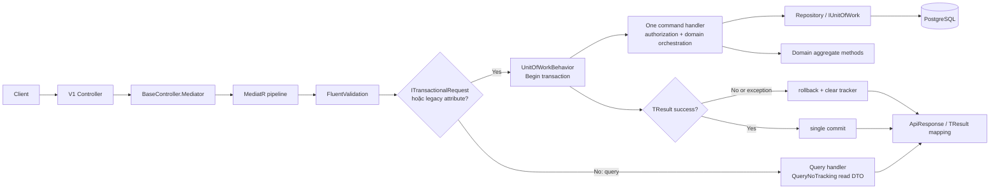
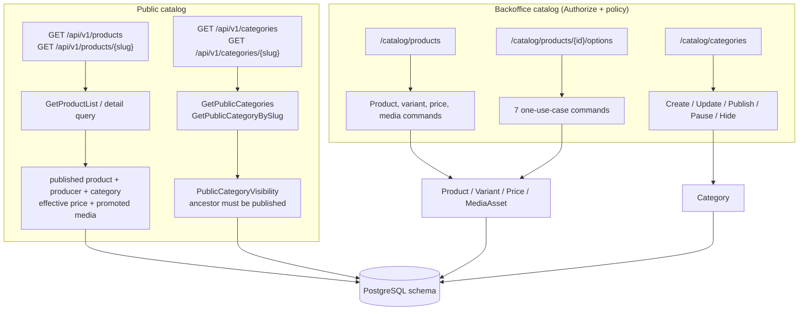
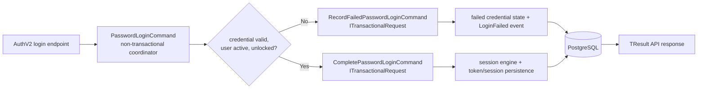
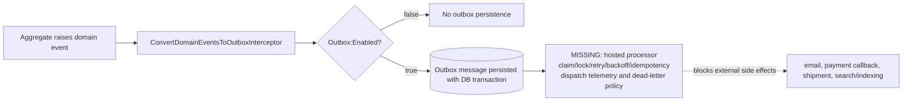
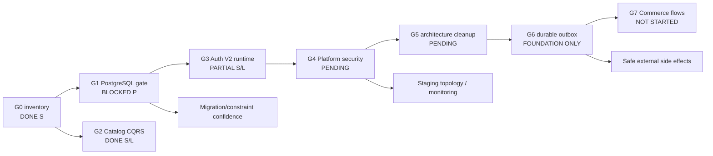

# Báo cáo đối chiếu phase và code graph production-readiness

**Ngày đánh giá:** 2026-08-02
**Phạm vi:** source hiện tại, worktree chưa commit, tracker modernization và kết quả kiểm thử local gần nhất. Đây là báo cáo source-first; không suy diễn rằng build hoặc unit test thay thế được bằng chứng PostgreSQL, staging, hoặc production.

## Kết luận điều hành

Nền tảng Catalog, CQRS và Unit of Work đang đi đúng hướng. Tracker hiện có **34/70 mục hoàn thành (49%)**; nếu chỉ nhìn nhóm nền tảng đã được đưa vào tracker (B0-B4, B8), con số là **34/40 (85%)**, nhưng không phải 85% production-ready. Điểm chặn trước khi mở rộng nghiệp vụ là thiếu bằng chứng chạy thật với PostgreSQL, sau đó là Auth V2 runtime, hardening platform, hoàn thiện Outbox và Commerce flow.

Không nên bắt đầu Checkout/Order/Payment trên nhánh source hiện tại. Có thể tiếp tục Catalog nhỏ, độc lập và không thay đổi schema trong khi thực hiện G1, nhưng mọi tính năng tạo trạng thái liên-aggregate hoặc side effect bên ngoài phải chờ G1-G6.

### Quy ước bằng chứng

| Ký hiệu | Ý nghĩa |
| --- | --- |
| S | Có source và cấu trúc đã được đọc/đối chiếu. |
| L | Đã build hoặc test local; không chứng minh PostgreSQL/production. |
| P | Đã chạy trên PostgreSQL độc lập với reset guard an toàn. |
| O | Đã được xác nhận ở staging/operational configuration. |

## Đối chiếu các phase đã qua

| Graph | Mục tiêu | Tình trạng hiện tại | Bằng chứng | Điều kiện đóng |
| --- | --- | --- | --- | --- |
| G0 | Bảo vệ worktree và phân loại thay đổi | Hoàn tất về mặt inventory; ranh giới stage/commit cố ý để mở | S | Giữ manifest là nguồn phân loại; tạo changeset review riêng khi người sở hữu quyết định commit. |
| G1 | PostgreSQL runtime gate và Catalog API acceptance | Test fixture, guard, migration/constraint/API authorization tests đã có; chưa chạy được ở máy hiện tại | S, L; **không P** | Cấp runner DB riêng, `ECOM_TEST_POSTGRES`, `ECOM_TEST_ALLOW_RESET=true`; chạy toàn bộ PostgreSQL suite không skip. |
| G2 | Catalog CQRS một use case/một handler | Hoàn tất: Product Options, Categories, Product Media và public category query đã tách | S, L | Duy trì architecture test; không thêm grouped handler mới. |
| G3 | Auth V2 transaction, session, refresh/runtime security | Password login đã chia nhánh failed-audit và successful session qua transactional commands; runtime acceptance chưa có | S, L; **không P** | Chạy PostgreSQL test cho login/session/refresh/logout/rotation và kiểm tra rollback thực. |
| G4 | Platform security và API contracts | Chưa bắt đầu đầy đủ | S | Chốt topology proxy/CORS/HTTPS, health/metrics exposure, error/concurrency contract. |
| G5 | Repository/BaseEntity/Clean Architecture cleanup | Chưa bắt đầu batch tương thích | S | Xử lý cancellation, sort/projection legacy, controller mediator injection, entity encapsulation. |
| G6 | Outbox reliability | Có interceptor có điều kiện; không có processor/dispatch reliability | S | Atomic persistence + worker + retry/idempotency + telemetry + P/O test. |
| G7 | Cart → checkout → order → payment/shipment/inquiry | Chưa có application/API feature flow tương ứng | S | Chỉ bắt đầu sau khi nền tảng G1-G6 đạt gate phù hợp. |

> Các mục B2/B3 được tracker ghi hoàn thành phản ánh implementation/historical evidence, không phải bằng chứng PostgreSQL được tái lập trong môi trường hiện tại. Hiện `ECOM_TEST_POSTGRES` và `ECOM_TEST_ALLOW_RESET` không được cấu hình, vì vậy mọi `[PostgreSqlFact]` đều skip.

## Code graph hiện tại

### 1. Request, CQRS và transaction boundary

`UnitOfWorkBehavior` mở transaction khi request thực hiện `ITransactionalRequest`, rollback với `TResult` failure/exception và dọn change tracker. Đây là cơ chế chuẩn cho mutation mới; legacy attribute vẫn còn là debt cần gom batch (B3.7).

### 2. Catalog public và backoffice

G2 đã loại các grouped handler ở Catalog. Tests kiến trúc hiện buộc Catalog không còn dùng file handler gộp; hai baseline grouped handler còn lại nằm ngoài Catalog (Auth password management và demo QR login), nên không phải lý do mở lại G2.

### 3. Auth V2 login boundary

Mục tiêu của tách lệnh là failed-login audit được commit độc lập, còn session/token success failure phải rollback atomically. Cấu trúc đã có, nhưng chưa thể chứng nhận hành vi thật trên PostgreSQL hoặc token/session runtime trước G3.

### 4. Domain events và Outbox gap

Interceptor chỉ được gắn DbContext khi cấu hình `Outbox:Enabled`. Không thấy worker/processor phát bản tin. Vì vậy chưa được phép dựa vào Outbox cho payment, shipping, notification hay bất kỳ side effect production nào.

### 5. Các dependency phase và điểm chặn

## Lộ trình khuyến nghị trước feature mới

### P0 — Đóng G1: runtime database acceptance (đầu tiên)

1. Cấp một PostgreSQL **test-only** ngoài Docker, database tên hậu tố `_test`/`_tests`, runner least-privilege, TLS nếu Azure.
2. Cấu hình secret của runner, không đưa connection string vào source/chat: `ECOM_TEST_POSTGRES` và `ECOM_TEST_ALLOW_RESET=true`.
3. Chạy `dotnet test Ecom.sln --no-restore`; mục tiêu không còn skip PostgreSQL tests, không migration/constraint/authz failure.
4. Chạy `dotnet ef migrations has-pending-model-changes ...`; chỉ review migration sinh ra nếu có. Không apply migration vào staging/production trong bước này.
5. Đóng B10.1 khi sáu API acceptance test và migration/constraint tests đạt P; sau đó tạo B2.7 runner riêng trước CI thường xuyên.

**Gate:** kết quả test đã lưu, database cô lập, không skip, migration drift sạch. Nếu fail, sửa đúng tầng (mapping, constraint, transaction hoặc authorization), không bypass fixture guard.

### P1 — Đóng G3: Auth V2 runtime security

1. Thêm PostgreSQL integration tests cho password success/failure, session create failure rollback, refresh rotation/reuse, logout/revocation và concurrency.
2. Kiểm tra permission/policy seed và API 401/403 theo token thật của test host.
3. Rà soát hashing, expiration, device/session limit, audit event và tránh log token/raw PII.

**Gate:** token/session state, failed attempt audit và rollback có P evidence. Auth change là public/security boundary: chốt contract trước khi sửa route/claim/permission.

### P2 — G4: platform hardening và contract freeze

Quyết định cùng hạ tầng deployment trước khi chỉnh source:

- allowlist `KnownProxies`/`KnownNetworks` cho forwarded headers;
- HTTPS redirect/HSTS theo topology ingress thực tế;
- CORS allowlist theo origin production, không mở rộng mặc định;
- bảo vệ hoặc tách health readiness/detail và Prometheus scrape endpoint;
- chỉ bật Swagger bằng cấu hình môi trường rõ ràng;
- chuẩn hoá `ApiResponse`, Problem/error mapping và một error code cho concurrency.

**Gate:** staging smoke test sau topology thật; không dùng local `appsettings` làm bằng chứng.

### P3 — G5: giảm debt trước khi Commerce write flow tăng nhanh

1. B1.6 thêm cancellation token cho repository reads theo compatibility batch.
2. B1.7 inventory consumer rồi loại string sort/reflection projection.
3. B6.2 thay service-locator `BaseController.Mediator` bằng injected `ISender` theo bounded batch; B6.5 thêm concurrency error contract.
4. B7.1 encapsulate audit/soft-delete/concurrency fields qua domain methods; không thực hiện property-by-property mutation trong handler.
5. B3.7 deprecate legacy transaction helpers sau khi inventory và migration consumer hoàn tất.

**Gate:** architecture/unit tests không tăng exception baseline; PostgreSQL concurrency test đạt P.

### P4 — G6: hoàn chỉnh reliable outbox

1. Finalize Outbox entity/migration sau approval và schema review.
2. Persist domain event atomically cùng aggregate mutation; thêm hosted processor có claim/lease, retry/backoff, idempotency, poison/dead-letter policy.
3. Dispatch sau commit, never external I/O trong DB transaction.
4. Metrics/log correlation không chứa secrets/PII; test duplicate delivery, crash/restart, retry, ordering policy.

**Gate:** P cho atomicity/retry và O trên staging monitoring. Không kích hoạt `Outbox:Enabled` production trước gate này.

### P5 — G7: phát triển commerce theo lát dọc, không làm dàn trải

Thứ tự thực hiện: **Cart → price/stock preview → CreateOrder idempotent → order state machine → payment callback → shipment → notification/outbox → TradeInquiry**.

Mỗi lát dọc phải có: request/validator/handler riêng, aggregate methods, server-side recomputation price/stock/discount, PostgreSQL constraint/concurrency tests, API authorization contract, và outbox cho side effect. Migration hoặc public API mới vẫn cần approval riêng theo AGENTS.md.

## Rủi ro hiện hữu cần quản trị

| Rủi ro | Tác động | Hành động ưu tiên |
| --- | --- | --- |
| PostgreSQL suite skip | Có thể che migration, schema, constraint, concurrency và authorization host lỗi | P0 chạy database test độc lập. |
| Dirty worktree lớn, có delete/add song song | Dễ tạo commit trộn refactor, schema và user work | Giữ inventory; review theo changeset, không stage hàng loạt. |
| HTTPS redirect đang tắt; forwarded header thiếu trusted proxy; health/metrics route exposure cần topology | Spoofing header hoặc lộ operational surface tuỳ deployment | P2 với input hạ tầng/staging. |
| Outbox chưa có delivery worker | Mất/lặp side effect khi có payment, email, shipment | P4 trước các flow external. |
| Chưa có Commerce application/API write flow | Không có nền tảng production để “nối” checkout vào | P5 sau gates nền tảng. |

## Trạng thái kiểm thử tại thời điểm đánh giá

Kết quả local gần nhất đã có: build solution không lỗi/cảnh báo; Domain **36/36 pass**; Integration **50 pass, 16 skipped, 0 fail**. Sáu skip mới là Catalog API PostgreSQL acceptance; phần còn lại là PostgreSQL tests hiện hữu. `git diff --check` không có lỗi whitespace (chỉ thông báo khác line ending). Đây là L, không phải P hay O.

## Quy tắc bắt buộc cho feature tương lai

1. Không đưa handler gộp trở lại Catalog; một use case/một handler/validator.
2. Mutation mới dùng `ITransactionalRequest`; handler không tự commit/transaction.
3. Query tách DTO public/management và default no-tracking.
4. Không tin price, stock, discount, payment result hoặc order total do client gửi.
5. Không gọi payment/shipping/email/search trong transaction; dùng outbox sau G6.
6. Không apply migration khi chưa có approval, SQL review, P evidence và staging plan.
7. Mọi claim “production ready” cần đồng thời S + L + P + O cho phạm vi liên quan.
