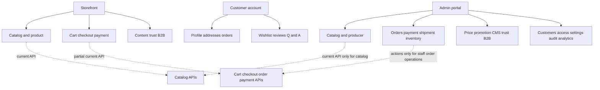

# Báo cáo Entity, CSDL và bản đồ trang FE Commerce

**Ngày chụp mã nguồn:** 2026-08-09

**Phạm vi:** `ApplicationDbContext`, entity/configuration Commerce, migration, controller, CQRS hiện có.
**Mục tiêu:** giúp FE thiết kế sitemap và backlog đúng theo năng lực BE hiện tại, đồng thời biết chính xác những màn hình nào phải chờ hợp đồng API.

> Đây là đánh giá từ mã nguồn trong working tree hiện tại, không phải kết quả truy vấn một PostgreSQL đang chạy. Vì vậy, “có trong model EF/migration” không đồng nghĩa đã được áp dụng vào mọi môi trường. Working tree đang có thay đổi SePay chưa commit, bao gồm hai entity audit và migration mới; chúng được ghi nhận là **mã nguồn hiện hữu nhưng chưa có bằng chứng runtime/deployment**.

## 1. Kết luận điều hành

Hệ thống có **mô hình dữ liệu rộng hơn đáng kể so với bề mặt API hiện tại**. `ApplicationDbContext` hiện khai báo 97 `DbSet`: 14 bảng Identity/Security, 82 bảng Commerce được persist, và 1 Outbox. Nhóm entity Commerce có 82 EF configuration tương ứng; `ProductCategoryAssignment` chỉ là `record` chuyển dữ liệu, không phải bảng.

Điểm mạnh là lõi giao dịch đã được thiết kế tốt: audit/soft-delete/concurrency dùng chung, quan hệ Product–Variant–Price–Inventory rõ ràng, snapshot lịch sử đơn hàng, ràng buộc PostgreSQL cho số tiền/tồn kho/chủ sở hữu giỏ, idempotency CreateOrder, và audit SePay. Điểm yếu chính là **khoảng trống vận hành**: phần lớn Producer, kho, khuyến mãi, CMS, Trust, B2B, notification, reporting và cả đọc đơn hàng cho nhân viên chưa có controller/query dành cho FE.

Vì vậy FE cần phân thành ba lớp:

| Nhãn | Ý nghĩa triển khai |
| --- | --- |
| **A – Có thể làm ngay** | Có read/write API đúng đối tượng sử dụng; FE vẫn phải xử lý quyền, lỗi và trạng thái. |
| **B – Có API nhưng chưa đủ để thành màn hình độc lập** | Có một phần thao tác/đọc; chỉ dùng như flow nhúng hoặc cần BE bổ sung read model. |
| **C – Entity/CSDL mới có, chưa có API nghiệp vụ** | Chỉ đưa vào backlog/feature flag; không tạo trang CRUD gọi trực tiếp DB. |

Sitemap hoàn chỉnh nên được tổ chức theo **nghiệp vụ** thay vì một trang cho mỗi table. Một Product Editor chứa General/Categories/Options/Variants/Prices/Media/Review; một Order Operations chứa đơn, thanh toán và giao hàng; một Trust Center gộp chứng nhận, truy xuất và kiểm duyệt nội dung tin cậy.

## 2. Nền tảng dữ liệu dùng chung

Mọi Commerce entity persist đều kế thừa cấu hình nền:

- Tên bảng mặc định là `Tbl_<EntityName>`, UUID `Id` do ứng dụng cấp, cùng `No` identity tăng dần.
- Có `CreatedAt/By`, `UpdatedAt/By`, `DeletedAt/By`, `IsDeleted` và `ConcurrencyStamp` (EF concurrency token).
- Mọi query EF mặc định lọc `IsDeleted = false`; các unique business key thường là partial unique index trên dòng chưa xóa.
- Tiền tệ dùng VND, decimal money/quantity có precision tập trung; enum được lưu dạng chuỗi. Lịch sử giao dịch không nên bị xóa bằng UI.

Hệ quả cho FE:

1. Không tự giả định “Delete” là hard delete. Với catalog/producer/CMS, UI nên dùng từ **Ẩn / Ngừng kinh doanh / Ngưng hoạt động** theo lifecycle.
2. Những form management có `concurrencyStamp` phải chỉ gửi version mới nhất. Khi nhận HTTP 409, refetch detail, hiển thị chênh lệch và yêu cầu người dùng áp dụng lại thay đổi; không tự replay body cũ.
3. Không render một table admin trực tiếp từ entity hoặc tự suy ra quan hệ từ tên cột. FE chỉ dùng DTO/read API đã được phân quyền.

## 3. Bản đồ entity và quan hệ CSDL hiện tại

| Miền | Entity/bảng chính | Quan hệ và ý nghĩa | Mức API FE hiện tại |
| --- | --- | --- | --- |
| Identity & security | `User`, `Role`, `Permission`, `Policy`, `RolePolicy`, `UserPolicy`, `JwtRefreshToken`, `OtpToken`, `VerificationChallenge`, `UserSession`, `SessionRefreshToken`, `PasswordCredential`, `SecurityEvent`, `UserDeviceToken` | Tài khoản, đăng nhập OTP/password, role-policy và session/refresh-token. | **A/B**: auth, user list/CRUD, roles và policy có endpoint; password V2 bị feature flag. |
| Customer & địa chỉ | `CustomerProfile`, `CustomerAddress`, `AdministrativeArea` | User có profile/địa chỉ; một địa chỉ mặc định active cho một User; area dùng ở địa chỉ/đơn hàng. | **A** cho profile auth và Address CRUD; chưa có API quản trị CRM/area. |
| Producer & điểm bán | `Producer`, `ProducerContact`, `ProductionFacility`, `PointOfSale`, `PointOfSaleProduct` | Producer là chủ thể của Product; facility/POS có area, tọa độ; POS–Product là junction. | **C**: không có controller/query quản lý hay public producer/POS. |
| Catalog | `Category`, `Product`, `ProductCategory`, `ProductSlugHistory`, `ProductOption`, `ProductOptionValue`, `ProductVariant`, `ProductVariantOptionValue`, `MediaAsset`, `ProductMedia` | Category là cây; Product–Category nhiều-nhiều với đúng một primary active; Product có variant/options/media; slug history phục vụ redirect về sau. | **A** cho public catalog và management Product/Category/options; media chỉ là flow nhúng. |
| Giá & khuyến mãi | `PriceList`, `VariantPrice`, `Promotion`, `Coupon`, `CouponProduct`, `CouponCategory`, `CouponRedemption` | Giá thuộc Variant, có loại/khung hiệu lực/min quantity/price list; promotion/coupon có target product/category và lịch sử đổi mã. | **B**: chỉ có tạo `VariantPrice` qua Product Editor. PriceList/Promotion/Coupon chưa có API nghiệp vụ. |
| Kho & reservation | `StockLocation`, `InventoryItem`, `InventoryLevel`, `InventoryReservation`, `InventoryMovement` | Variant có inventory item; level theo location; reservation/movement là lịch sử. CreateOrder lock/reserve ở location `MAIN`. | **B/C**: được dùng nội bộ khi checkout, có command expire reservation; không có màn hình/query kho. |
| Cart, Order, payment, shipment | `Cart`, `CartItem`, `IdempotencyRecord`, `Order`, `OrderItem`, `OrderDiscount`, `OrderNote`, `OrderStatusHistory`, `Payment`, `PaymentTransaction`, `PaymentGatewayAttempt`, `PaymentGatewayNotification`, `Shipment`, `ShipmentItem`, `ShipmentHistory` | Cart có User **xor** guest-token-hash. Order là snapshot immutable; payment và shipment là root độc lập theo Order; gateway attempt/notification là audit. | **A** cho customer/guest cart–checkout–order; **B** cho staff vì management hiện chỉ có action, thiếu list/detail staff. |
| Trust & engagement | `Certification`, `CertificationEvidence`, `ProductCertification`, `ProducerCertification`, `FacilityCertification`, `TraceProfile`, `TraceLot`, `TraceEvent`, `TraceEventEvidence`, `Wishlist`, `WishlistItem`, `ProductReview`, `ProductReviewMedia`, `ProductQuestion`, `ProductAnswer`, `NewsletterSubscription` | Chứng nhận gắn Product/Producer/Facility; trace profile/lot/event/evidence; wishlist/review/Q&A/newsletter là engagement. | **C**: chưa có controller/feature cho FE. |
| CMS & SEO | `Page`, `PageSection`, `PageSectionProduct`, `Article`, `ArticleCategory`, `ArticleCategoryMap`, `Campaign`, `Banner`, `NavigationItem`, `SeoRedirect` | Trang động gồm section và product pin; article/category; campaign/banner/navigation/redirect. | **C**: chưa có CMS/public content endpoint. |
| B2B | `TradeInquiry`, `TradeInquiryItem`, `TradeInquiryStatusHistory`, `PartnerApplication`, `InquiryAttachment` | Lead B2B, line item product/variant tuỳ chọn, trạng thái và file đính kèm. Không phải multi-vendor order. | **C**: chưa có controller/feature. |
| Vận hành, hệ thống & insight | `Notification`, `UserNotification`, `AuditLog`, `SystemSetting`, `VisitorSession`, `AnalyticsEvent`, `OutboxMessage` | Inbox thông báo, audit không thể xóa, cấu hình, tracking session/event và outbox post-commit. | **C**: chưa có read model/trang quản trị; outbox không phải UI CRUD. |

### 3.1. Quan hệ quan trọng phải phản ánh trên UI

| Cụm dữ liệu | Quy tắc CSDL/nghiệp vụ | Tác động thiết kế FE |
| --- | --- | --- |
| Product | `Producer -> Product`; `Product -> Variant`; Product–Category và Product–Media là junction có tối đa một primary active. | Product Editor không có “Save all”. Lưu tuần tự từng tab/command và thay `concurrencyStamp` từ mọi response. |
| Category | Parent tự tham chiếu, xóa bị restrict; slug unique active. Publish đòi mọi ancestor Published; pause/hide bị chặn nếu có category con hoặc Product Published phụ thuộc. | Dùng tree picker; chặn chọn chính nó/descendant. Hiện source chưa chặn rõ Published category đổi sang parent Draft/Paused trong `Update`, nên FE phải chặn trước và BE nên vá invariant. |
| Giá | `VariantPrice` có amount/min-quantity/time-window; source có migration PostgreSQL cho overlap. | Hiển thị timeline giá; không cho client tính giá checkout. Hiện chưa có API sửa/kết thúc price period, PriceList hay promotion. |
| Cart | Owner là `UserId XOR GuestTokenHash`; unique cart active theo owner, item unique theo `(CartId, ProductVariantId)`. | Luôn giữ cookie guest và `credentials: include`; không lưu guest token thô vào localStorage. Add cùng variant tăng quantity. |
| Order | Có owner snapshot user/guest; total bắt buộc `subtotal - discount + shipping`; item/số tiền/tên/SKU là snapshot. | UI lịch sử đơn hàng phải dùng DTO order, không truy vấn catalog để viết lại lịch sử. Không sửa line/total từ client. |
| Kho | Level có `stocked >= reserved >= 0`; reservation/movement quantity guard; reservation có expiry. | Admin kho cần ledger read-only và action có lý do, không phải input “đặt tồn kho” tuỳ ý. Checkout chỉ báo kết quả quote/availability từ server. |
| Payment/SePay | Một payment theo order; transaction và gateway notification là audit; SePay attempt unique theo invoice/payment/provider và notification có dedupe. | Không hiển thị hoặc cho sửa secret, chữ ký, raw IPN. Return/success URL chỉ là UX; trạng thái thanh toán lấy lại từ order/API sau IPN. |

### 3.2. State machine cần hiển thị thay vì nút hành động tự do

| Đối tượng | Luồng hiện có | Quy tắc FE |
| --- | --- | --- |
| Product | `Draft -> Review -> Published -> Paused`; `Discontinued` terminal | Publish cần Producer Published+Verified, Category primary Published, primary media `Clean + Public`, variant active và effective price. Dùng checklist trước Publish. |
| ProductVariant | `Active <-> Paused -> Discontinued` | Không cho hồi phục variant discontinued. |
| Category | `Draft -> Published -> Paused`; `Hidden` terminal | Hide không có restore endpoint. |
| Cart | `Active -> Converted | Expired` | Cart terminal không được sửa. |
| Order | `Pending -> Confirmed/Cancelled -> Preparing -> Shipping -> Completed`; có nhánh DeliveryFailed quay lại Shipping hoặc Cancelled | Customer chỉ được cancel trong điều kiện handler cho phép; staff action phải dựa trên trạng thái trả về từ BE. |
| Payment | Pending/AwaitingConfirmation có thể Paid/Failed/Cancelled; `Paid -> Refunded` | Không đặt Paid từ redirect hoặc checkbox admin. Bank verify/refund là quyền riêng. |
| Shipment | `Pending -> Ready -> Shipping -> Delivered`; Shipping có thể DeliveryFailed; DeliveryFailed có thể Shipping/Cancelled | Tách timeline shipment khỏi payment/order. |
| Trade inquiry | `New -> Assigned -> InProgress -> Quoted -> Won/Lost/Closed` | Là CRM B2B tương lai, không phải đơn bán lẻ. |

## 4. Đánh giá kiến trúc CSDL hiện tại

### Điểm tốt

- **Đúng hướng transaction history:** OrderItem, OrderStatusHistory, PaymentTransaction, InventoryMovement/Reservation và shipment history tách khỏi dữ liệu catalog thay đổi theo thời gian.
- **Guard ở DB tốt hơn CRUD thuần:** unique partial cho primary category/media/default address/cart active; check owner XOR, non-negative money, total formula, quantity và cân bằng tồn.
- **Đúng hướng bảo vệ checkout:** server tạo quote, kiểm tra fingerprint, dùng `Idempotency-Key`, lock tồn PostgreSQL và một UnitOfWork transaction. FE không được tin giá/stock/discount/total do client gửi.
- **Có biên giới security rõ:** soft delete, concurrency stamp, cookie guest hash, policy theo hành động catalog/order/payment/shipment/media.
- **SePay được model hoá thành audit cố định:** attempt và notification riêng giúp kiểm tra duplicate/mismatch/reconciliation thay vì coi redirect trình duyệt là bằng chứng trả tiền.

### Rủi ro/gap cần đưa vào kế hoạch

1. **Schema-rich, API-poor.** Hơn một nửa entity chưa có controller/query. Sinh màn CRUD FE trước API sẽ tạo mock/localStorage và lệch nghiệp vụ.
2. **Không có chứng cứ DB runtime trong báo cáo này.** Migration files tồn tại không chứng minh đã apply/rollback ở test, staging hoặc production. Các test PostgreSQL về constraint, race, rollback, price overlap và media/outbox vẫn phải tách riêng khỏi build unit test.
3. **Product onboarding chưa khép kín.** `CreateProductCommand` bắt buộc `ProducerId`, nhưng không có producer lookup/management API. FE không nên dùng GUID hard-code hoặc lấy producer public không chắc được publish/verified.
4. **Cart read DTO quá mỏng để hiển thị cart bền vững.** `GET /cart` chỉ trả `CartItemId`, `ProductVariantId`, `Quantity`; không có product slug/name/image/variant price/subtotal. Sau reload, FE không có public query theo variant ID để dựng lại dòng cart. Cần BE enrich `CartDto` hoặc thêm batch variant lookup server-owned trước khi phát hành trang Cart hoàn chỉnh.
5. **Order staff chưa dựng được màn vận hành.** `ManagementOrdersController` chỉ có POST transition; `GET /orders` và `GET /orders/{id}` bị owner-scoped cho customer/guest. Cần management list/detail riêng, không tái sử dụng customer endpoint bằng quyền admin.
6. **Price/promotion chưa vận hành được.** Có entity nhưng không có PriceList/Promotion/Coupon read/write, cũng chưa có sửa/kết thúc VariantPrice. Không nên hiển thị mã giảm giá ở checkout công khai.
7. **Media là flow, chưa là thư viện.** Có upload, đọc metadata theo ID, delete và attach vào Product; chưa có list/search/poll queue/media reuse policy cho một Media Library độc lập.
8. **Một number of logical UI pages là internal/audit-only.** `IdempotencyRecord`, `PaymentGatewayNotification`, `PaymentTransaction`, `InventoryMovement`, `AuditLog`, `OutboxMessage` cần read-only/filter/redaction, không có nút CRUD đại trà.

## 5. Trang FE có thể triển khai ngay theo BE hiện tại

### 5.1. Storefront và tài khoản khách hàng

| Trang đề xuất | API hiện có | Nhãn | Nội dung FE và giới hạn |
| --- | --- | --- | --- |
| `/` – Home catalog tối thiểu | `GET /api/v1/products`, `GET /api/v1/categories` | **A/B** | Có thể dựng shelf/search/category bằng data Catalog. Banner, campaign, section, navigation động chưa có API nên dùng layout tĩnh/config tạm, không gọi là CMS hoàn chỉnh. |
| `/products` – Listing/Search | `GET /api/v1/products?q&categorySlug&producerId&minPrice&maxPrice&sort&page&pageSize` | **A** | Sort hợp lệ: `newest`, `name-asc`, `price-asc`, `price-desc`; page size 1–50. Card chỉ dùng `primaryMedia`, `producer`, `primaryCategory`, `fromPrice`; không tự tạo rating, sold count, stock hay discount. |
| `/categories/:slug` – Landing category | `GET /api/v1/categories/{slug}` + product list `categorySlug` | **A** | Category detail chỉ là metadata; danh sách hàng phải lấy từ Products API. |
| `/products/:slug` – Product detail | `GET /api/v1/products/{slug}` | **A** | Chọn variant từ `variants[]`; giá mua là `variant.price`, còn `fromPrice` chỉ dùng list. Có media, hướng dẫn dùng/bảo quản/cảnh báo, producer summary nhưng chưa có review, Q&A, trace, stock, promotion/shipping estimate. |
| `/cart` | `GET /cart`, POST/PATCH/DELETE `/cart/items`, POST `/cart/merge-guest` | **B** | Có flow write đúng; **chưa đủ data render** vì DTO cart thiếu snapshot product. Chỉ release sau khi BE enrich cart hoặc FE có contract variant lookup. Mutations cần CSRF, cookies và rate-limit handling. |
| `/checkout` | `POST /checkout/preview`, `POST /orders` | **A** sau khi cart gap được xử lý | Gửi recipient/address/payment/shipping method, hiển thị quote server trả về, lưu `quoteFingerprint`, tạo `Idempotency-Key` mới cho một intent. Không gửi/ghi nhận total tự tính. Hiện chỉ `standard` shipping. |
| `/orders/:id/payment` hoặc bước payment của order success | `POST /orders/{id}/payments/sepay/checkout`, `GET /orders/{id}` | **A/B** | Với SePay, submit **native form** theo `actionUrl`, `method`, `fields` server trả về; không ký lại/chỉnh field. Sau neutral redirect, poll `GET /orders/{id}` đến payment status; IPN là authority. Chỉ bật khi config/migration/Sandbox đã được chứng minh. |
| `/account/orders`, `/account/orders/:id` | `GET /orders`, `GET /orders/{id}`, POST cancel | **A** | Chạy cho user và guest sở hữu cookie; detail có items snapshot, payment, shipment, timeline. Không lộ provider reference/staff identity. |
| `/login`, `/verify-otp`, `/account/profile` | V1: send/verify OTP, `GET /auth/me`, profile update, refresh/logout | **A** | V1 là contract điện thoại-first hiện dùng. Bảo mật token/cookie theo contract; không log token. |
| `/account/addresses` | `GET/POST/PUT/DELETE /customer/addresses`, POST default | **A** | Địa chỉ account; chọn default. Checkout vẫn phải submit snapshot recipient/address cho quote/order. |
| Password/session pages | `/api/v2/auth/*`, session revoke | **B** | Chỉ render/bật khi `PasswordAuthenticationV2` enabled; hiện source có feature flag. |

### 5.2. Backoffice có thể làm ngay

| Trang đề xuất | API hiện có | Nhãn | Cách tổ chức đúng |
| --- | --- | --- | --- |
| `/admin/catalog/products` | `GET /catalog/products` | **A** | List/filter status, mở editor. RBAC: `catalog.products.read`. |
| `/admin/catalog/products/new` | `POST /catalog/products` | **B** | Tạo Draft được, nhưng dropdown Producer chưa có lookup API. Chỉ hoàn chỉnh khi BE bổ sung producer read endpoint hoặc có flow seed được duyệt. |
| `/admin/catalog/products/:id` | Product detail + category/media/variant/price/lifecycle endpoints; options endpoint | **A** (trừ Producer lookup/price edit) | Một Editor nhiều tab: General, Categories, Options, Variants, Prices, Media, Review/Publish. Serialize mutation, cập nhật stamp sau từng response, refetch/reapply khi 409. Không làm “Save all Product”. |
| `/admin/catalog/categories` | list/tree/create/update/publish/pause/hide | **A** | Tree + list/search; parent picker an toàn; hide terminal. Chặn FE việc re-parent category Published dưới parent chưa Published. |
| `/admin/catalog/categories/:id` | `GET /catalog/categories/{id}` + command | **A** | Có thể là drawer/detail thay vì page riêng; vẫn nên có deep link phục vụ thao tác tree. |
| Media trong Product Editor | `POST /media`, `GET /media/{id}`, DELETE; attach product media | **B** | Upload rồi poll metadata bằng ID đến `Clean + Public`, sau đó attach/set primary. Không có Media Library list. |
| `/admin/access/users` | `GET /auth/users`, user create/update/delete, assign role | **A** | List có search/page và có thể filter `userId`; không có staff activity/CRM history. |
| `/admin/access/roles` và `/admin/access/roles/:id/policies` | role CRUD; Identity policy queries/adjust | **A/B** | Chỉ SystemAdmin. Xác nhận route `IdentityController` thực tế trong API smoke trước khi khóa FE client, vì controller đang kế thừa route token từ `BaseController`. |
| `/admin/payments/sepay/reconciliation` | `GET /management/payments/sepay/reconciliation` | **B** | Chỉ hiển thị tối đa 100 notification `NeedsReconciliation`. Không có action resolve/retry/refund trong endpoint này; dùng read-only triage. |

## 6. Sitemap/backlog tương lai để quản trị đủ một e-commerce

Những trang dưới đây là **mục tiêu nghiệp vụ**, không phải cam kết rằng endpoint đã tồn tại. Nhóm nhỏ được gộp để tránh UI phân mảnh và để bảo toàn quyền/transaction ở server.

| Nhóm/backoffice route đề xuất | Các page hoặc tab nên gộp | Entity sở hữu | API BE phải có trước khi FE production-ready | Trạng thái |
| --- | --- | --- | --- | --- |
| `/admin/dashboard` | KPI doanh thu/đơn/payment, cảnh báo tồn, queue cần xử lý | Order, Payment, Inventory, Analytics | Summary read model theo quyền/thời gian; deep-link filter, timezone/currency semantics | **C** |
| `/admin/catalog/products`, `categories`, `media` | Product Editor, category tree, upload flow | Catalog, Media, VariantPrice | Hoàn thiện Producer lookup, cart-facing variant projection, update/end price và media list nếu tách thư viện | **A/B** |
| `/admin/producers` | Producer list/detail, contacts, facilities, point of sale, product assortment, verify/publish | Producer, ProducerContact, ProductionFacility, PointOfSale, PointOfSaleProduct | Paged list/detail, create/update, verification/public lifecycle, lookup cho Product Editor, map/geocode policy | **C – ưu tiên cao** |
| `/admin/inventory` | Stock locations; item/variant stock; level; receive/adjust; reservation/movement ledger | StockLocation, InventoryItem, InventoryLevel, InventoryReservation, InventoryMovement | Stock read model, reasoned command, permission per action, atomic concurrency error, ledger/filter/export | **C – ưu tiên cao** |
| `/admin/orders` | Queue, order detail, notes, status timeline, customer/contact snapshot; action bar | Order, Item, Discount, Note, StatusHistory | Staff-scoped paged list/detail, filters/status/search, allowed actions/revision, order note command; never reuse customer read API | **B – ưu tiên cao** |
| `/admin/payments` | Payment queue/detail, manual bank-transfer proof/verify, refund, SePay reconciliation/audit | Payment, Transaction, GatewayAttempt, GatewayNotification | Management list/detail, transaction audit redaction, reconciliation resolve workflow, refund reason/result; provider data read-only | **B/C – ưu tiên cao** |
| `/admin/fulfillment` | Prepare/ship/delivery-failed, carrier/tracking, shipment timeline and packing list | Shipment, ShipmentItem, ShipmentHistory | Staff shipment list/detail and action availability; existing action POST alone không đủ dựng queue | **B** |
| `/admin/pricing` | Price lists, variant price calendar, scheduled sale, conflict view | PriceList, VariantPrice | List/detail/upsert/end price, overlap error response, effective-price preview/permission | **C** |
| `/admin/promotions` | Promotion campaigns, coupon CRUD, target product/category, redemption report | Promotion, Coupon, CouponProduct, CouponCategory, CouponRedemption | Eligibility engine, atomic redemption, checkout integration, read models/limits/timezone | **C** |
| `/admin/customers` | Customer profile, address/order summary, consent, customer service notes | User, CustomerProfile, CustomerAddress, Order, NewsletterSubscription | PII-safe CRM list/detail, staff permission/audit/export policy; not raw Identity tables | **C** |
| `/admin/content` | Pages/sections/product shelves; articles/categories; banners/campaigns; navigation; SEO redirect | Page, PageSection, PageSectionProduct, Article*, Banner, Campaign, NavigationItem, SeoRedirect | Draft/publish/schedule, ordering, preview, public render API, redirect validation, media reuse | **C** |
| `/admin/trust` | Certification catalogue/evidence; product/producer/facility assignment; trace profile/lot/event/evidence | Certification*, Trace* | Verification/review workflow, documents/media policy, public projection, immutable evidence/audit | **C** |
| `/admin/engagement` | Review moderation, Q&A, newsletters, wishlist insights | ProductReview*, ProductQuestion/Answer, Newsletter*, Wishlist* | Submission/moderation, anti-spam/ownership, publish state, unsubscribe/consent and analytics | **C** |
| `/admin/b2b` | Trade inquiry inbox/detail/quote workflow; partner applications; attachments | TradeInquiry*, PartnerApplication, InquiryAttachment | Public submit endpoint, staff queue/detail, assignment/status transition, attachment virus/visibility controls | **C** |
| `/admin/access` | Users, roles, policies, security sessions/events | Identity/Security entities | Hoàn thiện session/security event read/revoke contract và audit policy changes | **A/B** |
| `/admin/system` | System settings, notification templates/inbox, audit log, outbox operations health | SystemSetting, Notification*, AuditLog, OutboxMessage | Separate admin-safe read/update APIs, secret redaction, immutable audit, retry/ops action with approval | **C** |
| `/admin/analytics` | Funnel, acquisition, conversion, product/content performance, consent-aware exports | VisitorSession, AnalyticsEvent | Aggregated query model, retention/consent, timezone/filter and no direct raw event browsing by default | **C** |

### Storefront và customer features cần có khi các API trên hoàn thiện

| Route nhóm đề xuất | Mục đích | Entity/API phụ thuộc |
| --- | --- | --- |
| `/`, `/sale`, `/campaign/:slug`, navigation động | Home CMS, banner, shelf theo section/campaign | Page/Section/Product, Campaign, Banner, NavigationItem |
| `/producers/:slug`, `/stores` | Story/producer profile, facility/POS/map, sản phẩm theo producer | Producer, ProductionFacility, PointOfSale, Product |
| `/promotions`, coupon tại checkout | Khám phá sale và áp mã đúng điều kiện | Promotion, Coupon, redemption/checkout eligibility |
| `/products/:slug/reviews`, `/questions`, `/wishlist` | Tin cậy/engagement sau mua | Review, Q&A, Wishlist |
| `/trace/:code`, certificate blocks ở product | Lot/event/evidence và chứng nhận được publish | Trace*, Certification* |
| `/blog`, `/pages/:slug`, `/contact` | Nội dung SEO/tĩnh có quản lý | Article*, Page*, Navigation/SEO redirect |
| `/trade-inquiry`, `/become-a-partner` | B2B lead và đăng ký partner | TradeInquiry*, PartnerApplication, attachment |
| `/account/security`, `/account/notifications`, `/newsletter` | Session/password, inbox và consent | Auth V2/session, Notification, NewsletterSubscription |

## 7. Hợp đồng FE bắt buộc cho các flow hiện có

### 7.1. Product Editor

1. Tạo Product Draft với Producer đã được BE trả về hợp lệ.
2. Lưu General, thay `concurrencyStamp` theo response.
3. Thay Category (ít nhất một và đúng một primary), sau đó lấy stamp mới.
4. Tạo Options/Values, Variants và gán option values; tạo các period price.
5. Upload image, poll metadata tới `Clean + Public`, attach, order và chọn primary.
6. Submit review, rồi Publish khi checklist server-side đạt.

Mọi mutation Product/Category đều phải được serialize theo entity. HTTP 409 trong source hiện được biểu diễn qua conflict `ALREADY_EXISTS` cho stamp cũ; UI hiển thị “dữ liệu đã thay đổi”, refetch detail, sau đó người dùng chủ động merge/reapply.

### 7.2. Cart, checkout và order

- Client mutation phải kèm cookie/CSRF đúng cấu hình server. Không chuyển guest cart token sang URL/localStorage.
- Trình tự: lấy cart hợp lệ -> chọn cart item -> `POST /checkout/preview` -> render quote -> `POST /orders` với `quoteFingerprint` và header `Idempotency-Key` -> đọc order result.
- `Idempotency-Key` chỉ gắn với một checkout intent; nếu cùng key nhưng body khác, server trả conflict. Không retry mù sau 409/timeout mà không đọc lại trạng thái order.
- Giá, phí ship, discount, stock và total chỉ render từ preview/order server. Không có API coupon/shipping khác `standard` ở current source.
- Customer/guest có quyền đọc order sở hữu; guest phải còn cookie tương ứng. Không dùng order number như bằng chứng sở hữu.

### 7.3. SePay

- Chỉ mở form khi order trả về payment method SePay và endpoint checkout thành công.
- Render hidden fields theo đúng thứ tự server trả về và native POST tới `actionUrl`; không build checksum/signature ở browser.
- Trang return/cancel không đánh dấu Paid. Chuyển vào trang trung lập, poll `GET /orders/{id}` đến trạng thái cuối/thời hạn và hiển thị hỗ trợ khi pending quá lâu.
- Không gọi IPN/reconciliation từ FE, không log signature/secret/raw provider payload.
- Feature phải giữ cờ tắt cho tới khi có migration PostgreSQL, public HTTPS IPN, credential Sandbox và E2E reconciliation được kiểm chứng.

## 8. Thứ tự thực hiện đề nghị

### P0 – FE có thể bắt đầu ngay

1. Storefront catalog: home tối thiểu, listing/search, category landing, product detail.
2. Auth V1, profile, address book, order history/detail/cancel.
3. Backoffice Catalog: product list/editor, category tree/editor, media flow nhúng, users/roles/policies.
4. SePay return/poll UI và reconciliation read-only chỉ sau khi cờ runtime được bật có kiểm soát.

### P0.5 – BE phải bổ sung trước khi claim “mua hàng/nhập sản phẩm vận hành trọn vẹn”

1. Enriched Cart DTO hoặc batch variant projection cho cart reload.
2. Producer management + published/verified producer lookup cho Product Editor.
3. Staff Order list/detail cùng allowed actions; staff payment/shipment list/detail.
4. API cập nhật/kết thúc VariantPrice và read model PriceList; không cho quản trị giá bằng thao tác DB.
5. Xác nhận PostgreSQL integration: reservation/oversell, idempotency replay/race, rollback, price-overlap, migration apply/rollback, media lifecycle/outbox.

### P1/P2 – Mở rộng theo value stream

1. Kho + order operations/payment/shipment trước, vì đây là vòng đời sau checkout.
2. Producer, pricing/promotion trước CMS/marketing, vì Product Publish và checkout phụ thuộc dữ liệu này.
3. CMS/SEO, Trust/trace, review/Q&A/wishlist/newsletter để hoàn chỉnh storefront tin cậy và tăng chuyển đổi.
4. B2B, analytics, system/ops sau khi xác định owner, consent, retention, permission và reporting metric.

## 9. Nguyên tắc để FE không lệch BE

- Không coi tồn tại entity là authorization tạo CRUD. Mỗi new page cần một read model/API policy cụ thể.
- Không đưa PII, refresh token, guest token hash, raw IPN, secret/config hoặc audit payload vào state/log/analytics trình duyệt.
- Dùng feature-first modules: `catalog-products`, `catalog-categories`, `cart`, `checkout`, `orders`, `access`, `media`; sau này tách `producer`, `inventory`, `cms`, `trust`, `b2b`, `operations`. Mỗi module tự sở hữu DTO, query key, permission guard và UI.
- UI chỉ hiện action có permission và trạng thái hợp lệ; server vẫn là authority cuối cùng. Với action bất đồng bộ/side effect, success toast không thay thế refetch trạng thái.
- Chỉ mở trang có **A** cho production; **B** cần ghi chú UX/fallback rõ; **C** nên để menu disabled/feature-flag hoặc chưa hiện, thay vì shell rỗng.

## 10. Bằng chứng nguồn đã đối chiếu

- `Infrastructure/Ecom.Infrastructure/Persistence/Database/ApplicationDbContext.cs`: tập `DbSet` hiện tại.
- `Infrastructure/Ecom.Infrastructure/Persistence/Database/Configurations/Base/BaseEntityConfiguration.cs` và `.../Commerce/`: convention, soft delete, concurrency, index/check/FK.
- `Core/Ecom.Domain/Entities/Commerce/`: các entity nghiệp vụ; `Core/Ecom.Domain/Enums/Commerce/CommerceEnums.cs`: state enum.
- `Presentation/Ecom.API/Controllers/V1/`: surface API Commerce/Catalog/Media/SePay/management hiện có.
- `Core/Ecom.Application/Features/Catalog` và `.../Features/Commerce`: DTO, handler, validation và limitation của cart/checkout/order.
- `Infrastructure/Ecom.Infrastructure/Migrations/`: chuỗi migration hiện diện, bao gồm `20260807165319_AddSePayHostedCheckoutIpnAudit` trong working tree.
