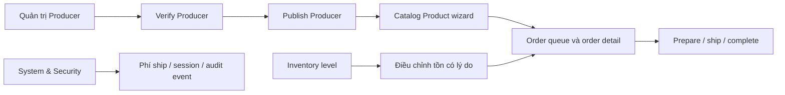

# Hướng dẫn FE: map API Backoffice P0 — Core Commerce

> **Phạm vi:** `backend-api`, source snapshot 2026-08-17.  
> **Đối tượng:** Backoffice FE, QA và Product Owner.  
> **Mục tiêu:** Map các API P0 đã có cho Producer, Order, Inventory, Settings và Security; không suy diễn các API trong roadmap nhưng chưa được implement.  
> **Tài liệu liên quan:** [Kế hoạch P0](../P0-CORE-COMMERCE-BACKEND-IMPLEMENTATION-PLAN.md) là roadmap/acceptance; [Catalog Product guide](catalog/CATALOG-PRODUCT-CREATION-FLOW-FE-GUIDE.md) mô tả wizard Product. Guide này là contract FE cho phần P0 hiện có.

## 1. Quy trình sơ lược và API graph

### 1.1 Boundary nghiệp vụ

```text
Producer workspace
  Producer -- verified + published --> Catalog producer picker --> Create Product Draft
  ├─ ProducerContact
  └─ ProductionFacility

Order operations
  Management order list/detail --> internal note
  └─ existing lifecycle actions: confirm/cancel/payment/shipment

Inventory operations
  ProductVariant --> InventoryItem --> InventoryLevel --> InventoryMovement (append-only)
                    StockLocation ───────┘

System operations
  checkout shipping fee / AuditLog read / UserSession read+revoke / SecurityEvent read
```

`Product` vẫn dùng producer picker công khai cho backoffice:

```http
GET /api/v1/catalog/producers?q=&page=1&pageSize=20
```

Picker này chỉ trả Producer `publicStatus=Published` **và** `isVerified=true`. Nếu chưa có Producer hợp lệ, FE mở Producer workspace, hoàn tất verify/publish rồi tải lại picker; không truyền tay UUID chưa hợp lệ vào wizard Product.

### 1.2 Flow vận hành khuyến nghị



### 1.3 Quy tắc chung cho FE

- Base URL là `/api/v1`; mọi route trong guide cần user đã authenticated và policy tương ứng. Policy claim chỉ để ẩn/hiện CTA, backend mới là authority.
- Mutation management dùng `Content-Type: application/json`, anti-forgery token trong header `X-CSRF-TOKEN` và chịu rate limit. Lấy token qua `GET /api/v1/security/csrf`; browser phải giữ cookie `__Host-ecom_csrf` đi kèm request.
- Response dùng envelope chuẩn:

```json
{
  "success": true,
  "data": {},
  "message": "Success",
  "errorCode": null,
  "validationErrors": null,
  "details": null,
  "timestamp": "2026-08-17T00:00:00Z"
}
```

- List phân trang trả `items`, `pageNumber`, `pageSize`, `totalCount`, `totalPages`, `hasPreviousPage`, `hasNextPage` trong `data`.
- `concurrencyStamp` là UUID optimistic-concurrency. Sau khi root Producer hoặc StockLocation mutation thành công, thay stamp trong FE state bằng stamp response. Stale stamp/code duplicate hiện map thành `409` (`ALREADY_EXISTS`); không retry mù.
- `422` là state/rule nghiệp vụ không thỏa; hiển thị `message`/`validationErrors` tại form. `401` đăng nhập lại, `403` ẩn CTA + thông báo không đủ quyền, `404` reload danh sách/đối tượng cha.

### 1.4 Permissions P0

| Khu vực | Policy |
| --- | --- |
| Producer read/create/update/publish/verify | `producers.read`, `producers.create`, `producers.update`, `producers.publish`, `producers.verify` |
| Order management/read note | `orders.manage` |
| Payment verify/refund | `payments.verify`, `payments.refund` |
| Shipment operations | `shipments.manage` |
| Inventory | `inventory.read`, `inventory.adjust`, `inventory.locations.manage` |
| System/security | `settings.read`, `settings.update`, `audit.read`, `security.sessions.read`, `security.sessions.revoke`, `security.events.read` |

## 2. Hướng dẫn map API chi tiết cho từng phần

### 2.1 Producer & Production Facility

#### A. Page danh sách Producer

```http
GET /api/v1/management/producers?q=mat-ong&publicStatus=Published&isVerified=true&page=1&pageSize=20
```

Query hỗ trợ `q`, `publicStatus`, `isVerified`, `page`, `pageSize` (1–100). `q` tìm theo code/name ở phía server. Mỗi item có `id`, `code`, `name`, `legalName`, `publicStatus`, `isVerified`, `verifiedAt`, `facilityCount`, `productCount`, `concurrencyStamp`, `createdAt`, `updatedAt`.

FE nên hiển thị hai facts độc lập `publicStatus` và `isVerified`; không tạo status `Suspended` phía client. CTA:

- Draft/Verified: **Verify** chỉ cho policy `producers.verify`; **Publish** chỉ cho `producers.publish` và chỉ thành công sau verify.
- Published: dùng cho Catalog picker.
- Hide: yêu cầu reason và bị chặn nếu còn Product Published phụ thuộc Producer.

#### B. Tạo và sửa Producer

```http
POST /api/v1/management/producers
```

```json
{
  "code": "PROD-ORG-001",
  "name": "Hợp tác xã Mật ong Núi",
  "legalName": "HTX Mật ong Núi",
  "description": "Nguồn mật ong địa phương",
  "websiteUrl": "https://example.vn"
}
```

`code` required/max 50/unique; `name` required/max 300; `legalName` max 300; `description` max 10,000; `websiteUrl` absolute URL/max 500. Response tối thiểu:

```json
{ "id": "uuid", "publicStatus": "Draft", "isVerified": false, "concurrencyStamp": "uuid" }
```

```http
PUT /api/v1/management/producers/{producerId}
```

Body dùng lại fields create và thêm `concurrencyStamp`. Path `producerId` là authoritative; không gửi trust vào ID trong body.

#### C. Detail, verify, publish, hide

```http
GET  /api/v1/management/producers/{producerId}
POST /api/v1/management/producers/{producerId}/verify
POST /api/v1/management/producers/{producerId}/publish
POST /api/v1/management/producers/{producerId}/hide
```

Verify/publish body:

```json
{ "concurrencyStamp": "uuid-moi-nhat" }
```

Hide body:

```json
{ "concurrencyStamp": "uuid-moi-nhat", "reason": "Ngừng hợp tác" }
```

Detail trả `contacts` và `facilities`, bao gồm dữ liệu private cho staff có permission. Không dùng DTO detail này ở storefront. Sau **mỗi** child mutation thành công, gọi lại detail hoặc cập nhật root stamp từ response/reload detail trước mutation tiếp theo.

#### D. Contacts và facilities

```http
POST /api/v1/management/producers/{producerId}/contacts
PUT  /api/v1/management/producers/{producerId}/contacts/{contactId}
POST /api/v1/management/producers/{producerId}/facilities
```

Contact request:

```json
{
  "producerConcurrencyStamp": "uuid-moi-nhat",
  "contactType": "Phone",
  "contactValue": "0900000000",
  "contactName": "Nguyễn A",
  "isPublic": false,
  "displayOrder": 0
}
```

Facility request:

```json
{
  "producerConcurrencyStamp": "uuid-moi-nhat",
  "administrativeAreaId": "uuid-hoac-null",
  "name": "Trang trại Sơn La",
  "addressLine": "Bản X, xã Y",
  "latitude": 21.327,
  "longitude": 103.914,
  "description": "Khu vực khai thác"
}
```

Contact value required/max 512, name max 256, `displayOrder >= 0`. Facility name required/max 256, address max 1,000, description max 4,000, latitude `[-90,90]`, longitude `[-180,180]`; supplied `administrativeAreaId` phải tồn tại. Hiện chỉ có create facility, **chưa có** update/hide facility API: FE không render CTA đó như một flow live.

### 2.2 Management Orders

#### A. Danh sách và chi tiết

```http
GET /api/v1/management/orders?q=ORD-2026&status=Pending&paymentStatus=AwaitingConfirmation&fromUtc=2026-08-01T00:00:00Z&toUtc=2026-08-31T23:59:59Z&page=1&pageSize=20
GET /api/v1/management/orders/{orderId}
```

Filter hiện có: `q` (order number/recipient name/phone), `status`, `paymentStatus`, `fromUtc`, `toUtc`, `page`, `pageSize`. `fromUtc <= toUtc`; pageSize 1–100. Chưa có filter `paymentMethod`, `shipmentStatus`, `carrier`, sort hoặc endpoint timeline riêng.

Detail trả immutable order item snapshot, recipient/customer snapshot, payment, shipment, notes và timeline gồm `order`/`shipment`. Timeline chưa gộp `PaymentTransaction` thành event riêng; FE hiển thị payment current state từ `payment` và không tự suy diễn lịch sử thanh toán.

#### B. Ghi chú nội bộ

```http
POST /api/v1/management/orders/{orderId}/notes
```

```json
{ "content": "Khách xác nhận nhận hàng giờ hành chính." }
```

`content` required/max 4,000. Backend force `noteType=Internal`, `isVisibleToCustomer=false`; không dùng API này cho note khách hàng và không gửi `isVisibleToCustomer` từ FE.

#### C. Lifecycle actions đã có

| Thao tác | Route | Body |
| --- | --- | --- |
| Confirm | `POST /management/orders/{id}/confirm` | none |
| Cancel | `POST /management/orders/{id}/cancel` | `{ "reason": "..." }` |
| Verify bank transfer | `POST /management/orders/{id}/payment/verify-bank-transfer` | `{ "providerReference": "..." }` |
| Refund | `POST /management/orders/{id}/payment/refund` | theo command refund hiện hữu |
| Prepare shipment | `POST /management/orders/{id}/shipment/prepare` | none |
| Start shipment | `POST /management/orders/{id}/shipment/start` | `{ "carrierName": "...", "trackingCode": "..." }` |
| Complete shipment | `POST /management/orders/{id}/shipment/complete` | none |
| Delivery failed | `POST /management/orders/{id}/shipment/delivery-failed` | body reason theo command hiện hữu |

Không có generic `PUT /orders/{id}/status`, không sửa amount/quantity/address từ FE. CTA phải dựa trên state current trả về và xử lý `422` như transition không hợp lệ; backend lock order/payment/shipment/inventory là authority cuối.

### 2.3 Inventory & Stock

#### A. Đọc levels, locations, movements

```http
GET /api/v1/management/inventory/levels?q=SKU-001&stockLocationId={uuid}&page=1&pageSize=20
GET /api/v1/management/inventory/locations?isActive=true
GET /api/v1/management/inventory/movements?inventoryItemId={uuid}&stockLocationId={uuid}&movementType=Adjust&fromUtc=2026-08-01T00:00:00Z&page=1&pageSize=50
```

Level trả `stockedQuantity`, `reservedQuantity`, `incomingQuantity`, `availableQuantity`, cùng SKU/product/variant/location. FE map `onHand = stockedQuantity`; `availableQuantity` chỉ đọc từ server, không tự gửi hay tự tính để mutation.

Location list hiện là mảng không phân trang, chỉ filter `isActive`. Level chỉ filter `q`, `stockLocationId`, page. Movement filter `inventoryItemId`, `stockLocationId`, `movementType`, `fromUtc`, `toUtc`, page; dates phải UTC và `fromUtc <= toUtc`.

#### B. Location và inventory level khởi tạo

```http
POST /api/v1/management/inventory/locations
PUT  /api/v1/management/inventory/locations/{stockLocationId}
POST /api/v1/management/inventory/levels
```

Tạo location:

```json
{ "code": "MAIN", "name": "Kho chính", "administrativeAreaId": null, "addressLine": "Hà Nội" }
```

Sửa location cần `concurrencyStamp`, `name`, `administrativeAreaId`, `addressLine`, `isActive`. Code không sửa được. Khi `isActive=false`, FE phải dừng tạo level/adjust tại location đó.

Khởi tạo level rỗng:

```json
{ "productVariantId": "uuid", "stockLocationId": "uuid", "requiresShipping": true }
```

Nếu InventoryItem chưa có thì backend tạo nó; nếu level item+location đã tồn tại trả `409`. API này **không** nhập số tồn ban đầu.

#### C. Điều chỉnh tồn

```http
POST /api/v1/management/inventory/levels/adjustments
```

```json
{
  "inventoryItemId": "uuid-tu-level-response",
  "stockLocationId": "uuid",
  "quantityDelta": 25,
  "reason": "Kiểm kê đầu kỳ"
}
```

`quantityDelta` khác 0, từ `-1,000,000` đến `1,000,000`; reason required/max 1,000. Server lock row, cập nhật level và tạo đúng một `InventoryMovement` type `Adjust` trong cùng transaction. Điều chỉnh âm bị chặn nếu làm `stockedQuantity < reservedQuantity`; FE hiển thị lỗi `422`, không tách thành hai request hoặc tự ghi movement.

Không có P0 API receive/transfer/return/delete movement. `InventoryMovement` là ledger append-only; không render edit/delete.

### 2.4 Settings, audit và security

#### A. Typed checkout shipping setting

```http
GET /api/v1/management/settings
PUT /api/v1/management/settings
```

GET khi chưa có row trả:

```json
{ "standardFeeVnd": 0, "exists": false, "concurrencyStamp": null }
```

PUT create lần đầu:

```json
{ "standardFeeVnd": 30000, "concurrencyStamp": null }
```

PUT update sau đó phải gửi stamp mới nhất:

```json
{ "standardFeeVnd": 35000, "concurrencyStamp": "uuid-moi-nhat" }
```

Giá trị hợp lệ `0..10,000,000` VND. Đây là API typed duy nhất hiện tại, map tới key nội bộ `checkout.shipping.standardFeeVnd`; FE **không** gửi key, `isPublic`, `description`, raw JSON, OTP bypass, credential, payment/webhook secret hoặc connection string.

#### B. Audit, sessions và security events

```http
GET  /api/v1/management/audit-logs?actorUserId={uuid}&entityName=Producer&page=1&pageSize=50
GET  /api/v1/management/security/sessions?userId={uuid}&isRevoked=false&page=1&pageSize=50
POST /api/v1/management/security/sessions/{sessionId}/revoke
GET  /api/v1/management/security/events?userId={uuid}&riskLevel=High&success=false&page=1&pageSize=50
```

Revoke request:

```json
{ "reason": "Thiết bị không còn được cấp quyền" }
```

Reason required/max 256. Session response không lộ refresh token, security stamp, raw IP fingerprint hay event metadata. Revoke session sẽ revoke các refresh token thuộc đúng session đó; không dùng endpoint này để logout-all user.

Audit log projection chỉ có `id`, actor, action, entity, entityId, correlationId, occurredAt — không có raw before/after/IP. **Điểm quan trọng:** hiện chưa có audit writer tự động cho mọi P0 mutation, vì vậy AuditLog có thể rỗng/thiếu sự kiện dù mutation thành công. FE hiển thị đây là read-only operational view, không dùng làm order timeline hoặc bằng chứng duy nhất của action.

## 3. Checklist FE: API map đủ chưa?

### 3.1 Checklist implementation bắt buộc

- [ ] HTTP client luôn unwrap envelope `data` và hiển thị `validationErrors` theo field.
- [ ] Trước mutation management, lấy/refresh CSRF token và gửi header `X-CSRF-TOKEN`.
- [ ] Pagination map đúng `items`, `pageNumber`, `totalCount`; không giả định `data` là array.
- [ ] State Producer/StockLocation lưu `concurrencyStamp`; disable submit khi không có stamp ở màn hình update.
- [ ] Product wizard chỉ dùng Producer Picker Published+Verified; sau publish Producer phải refetch picker.
- [ ] Order page dùng management route, không tái dùng customer-owned `/orders` để xem toàn bộ đơn.
- [ ] Internal note không có toggle public/customer visible.
- [ ] Inventory chỉ submit `quantityDelta` và `reason`; không gửi on-hand/available/reserved/movementType.
- [ ] Location inactive bị disable trong picker initialize/adjust.
- [ ] Settings form chỉ chứa `standardFeeVnd`; không tạo generic configuration editor.
- [ ] Session table không render token/stamp; revoke luôn yêu cầu confirm + reason.

### 3.2 Những capability P0 roadmap nhưng **chưa có API live**

| Không map như đã có | Thay thế hiện tại / hành động FE |
| --- | --- |
| Update/hide facility; deactivate contact | Chỉ create facility và create/update contact. Ẩn CTA chưa có route. |
| Order `allowedActions`, payment timeline riêng, `GET /orders/{id}/timeline` | Dùng status/payment/shipment trong detail; lifecycle failure do backend trả. |
| Filter order theo payment method/shipment/carrier; sort allow-list | Chỉ map filters trong section 2.2A. |
| Inventory receive, transfer, return, generic receipt | Không render. P0 chỉ initialize level và adjustment. |
| Location deactivation reason/active-reservation guard chuyên biệt | Update `isActive`; không giả định route `/deactivate`. |
| Typed groups store-profile/payment-methods/notification-policy | Chưa live; chỉ shipping fee typed. |
| Audit coverage cho mọi P0 mutation | Chưa live; audit page không phải source-of-truth. |

## 4. Lưu ý khi map API và flow UI

### 4.1 Error handling

| HTTP/error code | Ý nghĩa FE | Hành động |
| --- | --- | --- |
| 400 / `BAD_REQUEST` | JSON bind hoặc FluentValidation lỗi | Highlight fields từ `validationErrors`; không retry. |
| 401 / `UNAUTHORIZED` | Thiếu/hết auth | Refresh/login theo auth flow. |
| 403 / `FORBIDDEN` | Không có policy | Ẩn CTA sau lần refetch claims; giữ response diagnostic cho QA. |
| 404 / `NOT_FOUND` | Entity/path/child scope không tồn tại | Quay list, refetch parent; không đổi path ID. |
| 409 / `ALREADY_EXISTS` | Code duplicate hoặc stale concurrency stamp | Refetch detail/list và yêu cầu user resolve conflict. |
| 422 / `UNPROCESSABLE_ENTITY` | Lifecycle, inactive location, insufficient stock hoặc business guard | Giữ form, hiển thị message; không tự thay state local. |

### 4.2 UI state và refresh strategy

1. **Producer:** Sau create vào detail bằng `id`; sau contact/facility/lifecycle mutation refetch detail để lấy root stamp và state mới. Khi `publicStatus=Published && isVerified=true`, invalidate Catalog producer picker cache.
2. **Order:** Sau action mutation refetch detail và list page. Không optimistic-update shipment/order status vì action có lock, payment/reservation side-effect.
3. **Inventory:** Sau initialize/adjust invalidate level list, movement list và selected variant summary. Decimal phải giữ dạng string/decimal-safe trong client, không làm tròn bằng binary float.
4. **Settings/session:** Sau PUT settings dùng response stamp. Sau revoke, refetch session list; không kết luận audit/event mới sẽ xuất hiện vì audit write chưa hoàn chỉnh.

### 4.3 QA acceptance tối thiểu

1. Tạo Producer → verify → publish → thấy trong `/catalog/producers`; hide bị `422` khi còn Product Published.
2. Staff có `orders.manage` thấy management list/detail; khách hàng không dùng được route management; internal note không xuất hiện ở customer order API.
3. Tạo MAIN location → initialize level → positive adjustment có one movement; negative adjustment thấp hơn reserved bị `422`.
4. PUT shipping fee lần đầu dùng stamp `null`; PUT lần hai dùng stamp response; stale stamp bị `409`.
5. Revoke session làm refresh token của session đó không còn dùng được; response session/event không lộ secret/token/IP raw.

### 4.4 Runtime and rollout boundary

- Build thành công không chứng minh PostgreSQL lock/constraint, CSRF cookie behavior hoặc BFF proxy. QA integration cần `ECOM_TEST_POSTGRES` và staging smoke riêng.
- Không cần migration chỉ vì FE map controller. Chỉ tạo migration sau khi review query profile/index và có approval.
- Các warning/feature chưa live trong section 3.2 phải được giữ trên feature flag/hidden menu cho tới khi backend có contract và test tương ứng.
