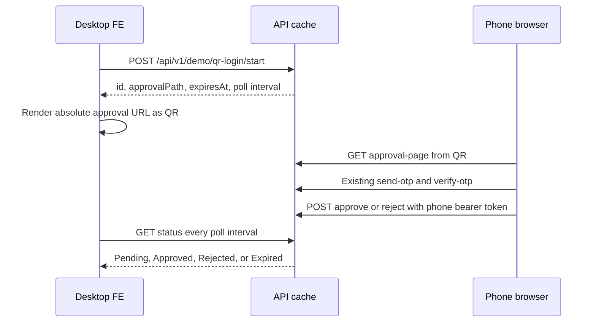

# QR Demo Confirmation - FE Integration and Test Guide

## 1. Scope

This guide describes the Development-only QR demo flow implemented in the API.
It is a cross-device **confirmation demo**, not a production browser-login implementation.

- The desktop page receives only `Pending`, `Approved`, `Rejected`, or `Expired`.
- The phone completes the existing OTP login flow and confirms or rejects the request.
- The desktop never receives the phone access token, refresh token, user ID, or a new authenticated session.
- There is no QR database table or migration. State is cache-only and expires automatically.

Do not market this as production QR login. A production flow needs a browser BFF cookie,
server-side persistent state, atomic consume, replay protection, and PostgreSQL concurrency tests.

## 2. Prerequisites

1. Restart the API after pulling/building the demo feature.
2. Run it with `ASPNETCORE_ENVIRONMENT=Development`.
3. Use the test database only. `DemoQrLogin.Enabled` is enabled only by
   `Presentation/Ecom.API/appsettings.Development.json`; the default configuration remains disabled.
4. The phone must reach the API origin. A QR containing `localhost` works only on the desktop itself.
   For a real phone on the same Wi-Fi, use the desktop LAN IP or a reachable Development host.
5. The desktop FE origin must be allowed by the API CORS policy. Local `http://localhost:5173`
   is already listed; add a different FE origin only through approved runtime configuration.

The current Development OTP configuration accepts the configured test mode without an SMS provider.
Do not display, commit, or log the test verification code or returned login tokens.

## 3. Demo flow



The QR payload is only a public approval URL. It must not contain OTP values, bearer tokens,
refresh tokens, user data, or a desktop session credential.

## 4. API contract

All API responses use the existing `ApiResponse<T>` envelope.

### 4.1 Start a desktop demo

`POST /api/v1/demo/qr-login/start`

- Authentication: none
- Request body: none
- Rate limit: 10 requests per IP per 5 minutes

Example response:

```json
{
  "success": true,
  "data": {
    "id": "<demo-id>",
    "approvalPath": "/api/v1/demo/qr-login/<demo-id>/approval-page",
    "expiresAt": "<UTC timestamp>",
    "pollIntervalMilliseconds": 1500
  }
}
```

`approvalPath` is relative to the **API origin**, not to the desktop FE origin.
Construct the QR content as:

```text
{API_ORIGIN}{approvalPath}
```

For example, if the API is reachable at `http://<LAN-IP>:<PORT>`, the QR must use that same
reachable origin. Do not use the desktop's frontend host unless it proxies the approval route.

### 4.2 Poll status from the desktop

`GET /api/v1/demo/qr-login/{id}/status`

- Authentication: none
- Rate limit: 120 requests per IP per minute
- Poll with the `pollIntervalMilliseconds` returned by `start`; do not poll aggressively.

Example response while awaiting the phone:

```json
{
  "success": true,
  "data": {
    "status": "Pending",
    "expiresAt": "<UTC timestamp>"
  }
}
```

Terminal statuses are `Approved`, `Rejected`, and `Expired`. Stop polling on a terminal status.
The status response deliberately contains no identity or credential data.

### 4.3 Phone approval page

`GET /api/v1/demo/qr-login/{id}/approval-page`

This is the page opened by the QR. It is already supplied by the API for the demo, so the FE
does not need to implement a mobile application or a second approval screen.

The page calls the existing OTP endpoints, then presents **Approve** and **Reject** buttons.
It keeps the resulting bearer token in page memory only long enough to send the decision.

### 4.4 Custom phone UI only (optional)

Use these only if replacing the supplied approval page:

`POST /api/v1/demo/qr-login/{id}/approve`

`POST /api/v1/demo/qr-login/{id}/reject`

Required header:

```http
Authorization: Bearer <access-token-from-existing-OTP-login>
```

The approving user must be authenticated and `Active`. Both endpoints return a conflict when
the request has already been completed, and return `Expired` when the cache entry is gone.
The desktop must never call these endpoints and must never receive the phone token.

## 5. Desktop FE mapping example

Use the API base URL from configuration. Do not derive it from `window.location.origin` when
the frontend and API are hosted separately.

```ts
type ApiResponse<T> = {
  success: boolean;
  data?: T;
  message?: string;
  errorCode?: string;
};

type StartResult = {
  id: string;
  approvalPath: string;
  expiresAt: string;
  pollIntervalMilliseconds: number;
};

type StatusResult = {
  status: "Pending" | "Approved" | "Rejected" | "Expired";
  expiresAt: string | null;
};

const apiOrigin = import.meta.env.VITE_API_ORIGIN.replace(/\/$/, "");

export async function startQrDemo() {
  const response = await fetch(`${apiOrigin}/api/v1/demo/qr-login/start`, {
    method: "POST"
  });
  const body = (await response.json()) as ApiResponse<StartResult>;
  if (!response.ok || !body.success || !body.data) {
    throw new Error(body.message ?? "Could not start QR demo.");
  }

  const approvalUrl = new URL(body.data.approvalPath, apiOrigin).toString();
  return { ...body.data, approvalUrl };
}

export function pollQrDemo(id: string, everyMs: number, onStatus: (status: StatusResult) => void) {
  const timer = window.setInterval(async () => {
    const response = await fetch(`${apiOrigin}/api/v1/demo/qr-login/${id}/status`);
    const body = (await response.json()) as ApiResponse<StatusResult>;
    if (!response.ok || !body.success || !body.data) return;

    onStatus(body.data);
    if (body.data.status !== "Pending") window.clearInterval(timer);
  }, everyMs);

  return () => window.clearInterval(timer);
}
```

Pass `approvalUrl` to the QR component/library already selected by the frontend. The API does
not generate a QR bitmap and no new QR package was added to the backend.

Suggested desktop UI states:

| API status | FE message | Action |
|---|---|---|
| `Pending` | Scan the QR with a phone | Continue polling |
| `Approved` | QR demo confirmation succeeded | Stop polling; show demo success only |
| `Rejected` | The phone rejected the request | Stop polling; allow creating a new QR |
| `Expired` | QR expired | Stop polling; create a new QR |

## 6. Practical test checklist

1. Restart the Development API and open Swagger or the desktop FE.
2. Start a demo request and confirm the returned `approvalPath` and expiry.
3. Build an absolute, phone-reachable `approvalUrl`, then render it as a QR code.
4. Scan it from a phone. The supplied approval page should show the OTP form.
5. Complete OTP verification using the configured test account through the phone page.
6. Select **Approve**. The desktop should switch from `Pending` to `Approved` within the
   configured poll interval.
7. Repeat with **Reject** and then with an expired QR.
8. Confirm that desktop network logs contain only demo status data, not an access token,
   refresh token, OTP value, or user profile data.

For a terminal-only start/status smoke test, use placeholders rather than committing test
credentials:

```powershell
$apiOrigin = "http://<reachable-api-host>:<port>"
$start = Invoke-RestMethod -Method Post -Uri "$apiOrigin/api/v1/demo/qr-login/start"
$approvalUrl = "$apiOrigin$($start.data.approvalPath)"
Invoke-RestMethod -Uri "$apiOrigin/api/v1/demo/qr-login/$($start.data.id)/status"
```

Open `$approvalUrl` on the phone or encode it with the desktop FE QR component.

## 7. Error map

| HTTP status | Meaning | FE action |
|---|---|---|
| `401` | Phone approval has no valid authenticated user | Send the phone through OTP verification again |
| `404` | Demo disabled or wrong route | Confirm Development environment and API version/path |
| `409` | Request was already approved/rejected or temporarily busy | Read status and create a new QR if terminal |
| `429` | Demo rate limit reached | Respect `Retry-After`, then retry later |
| `503` | Demo cache unavailable | Tell the user to retry; do not fall back to token transfer |

## 8. Demo-only boundaries

- The cache state has a short TTL and is lost after an API restart.
- Development cache is appropriate only for a single demo API instance.
- Do not enable `DemoQrLogin` outside Development.
- Do not reuse this contract as authentication for checkout, administration, or protected APIs.
- A future production QR login is a separate feature and must not make the desktop treat
  `Approved` as an authenticated session.
