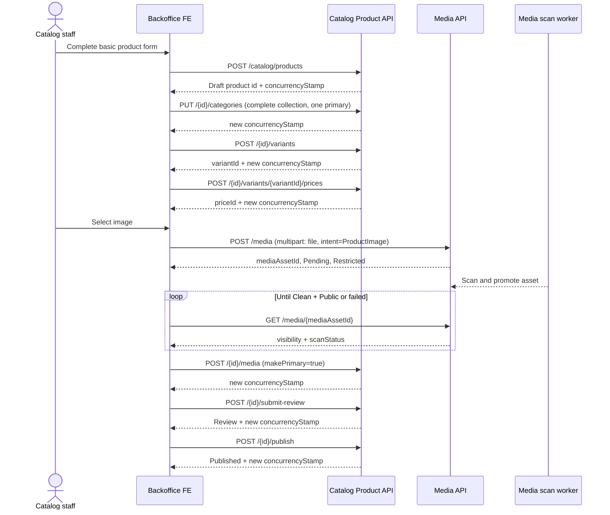
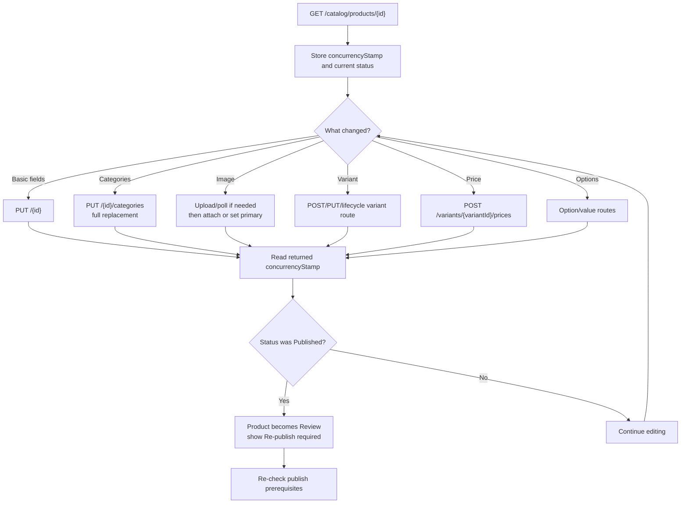
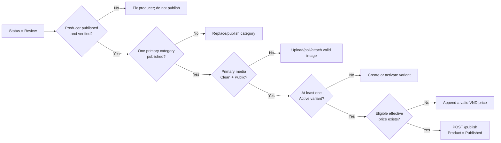
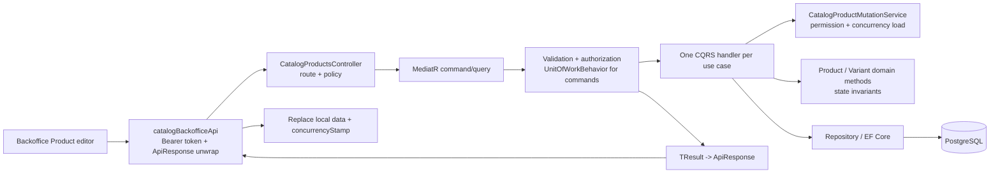

# Catalog Product API and FE Workflow Guide

**Contract version:** current V1 source, verified 2026-08-07.
**Base URL:** `/api/v1`.
**Audience:** storefront FE, backoffice FE, and AI agents generating API clients.

Use deployed backend HTTPS only. Never connect FE directly to PostgreSQL, storage keys, or `dotnet ef`.

## 1. Global contract

### Headers

- All calls: `Accept: application/json`.
- JSON writes: `Content-Type: application/json`.
- Backoffice: `Authorization: Bearer <accessToken>`.
- Storefront `/products` and `/categories`: anonymous.

### Response envelope

```json
{
  "success": true,
  "data": {},
  "message": "Success",
  "errorCode": null,
  "validationErrors": null,
  "details": null,
  "timestamp": "2026-07-26T10:00:00Z"
}
```

| HTTP | FE action |
| --- | --- |
| `400` | Render `validationErrors`; do not retry automatically. |
| `401` | Refresh/login through the Auth client. |
| `403` | Hide the action and show access denied. |
| `404` | Render not found; storefront must not reveal admin state. |
| `409` | Duplicate slug/SKU or stale version: reload detail and let staff reapply changes. |
| `422` | Business rule failed. `message` is a stable domain code, for example `PRODUCT_PUBLISH_REQUIREMENTS_MISSING`. |
| `500` | Unexpected failure; show generic error. |

Paginated `data` has `items`, `pageNumber`, `totalPages`, `totalCount`, `pageSize`, `hasPreviousPage`, and `hasNextPage`.

## 2. Choose the API boundary

| Use case | Route family | Token | Do not use for |
| --- | --- | --- | --- |
| Customer grid/search | `/products` | No | Draft/review products or management editing |
| Customer product page | `/products/{slug}` | No | Lookup by product UUID |
| Public category menu | `/categories` | No | Category administration |
| Staff management | `/catalog/products` | Yes + Catalog policy | Public page rendering |

## 3. Storefront read APIs

### `GET /products`

Purpose: product grid, search, filter, and paging. Only public-eligible Products are returned: Product is `Published`, Producer is published and verified, primary category is published, active variant/effective price exist, and media URLs are clean/public.

| Query | Type | Notes |
| --- | --- | --- |
| `q` | string, max 200 | Searches name and short description. |
| `categorySlug` | string | Matches **every direct ProductCategory mapping**, not only the primary category. |
| `producerId` | UUID | One producer. |
| `minPrice`, `maxPrice` | decimal | Product effective `fromPrice`. |
| `sort` | string | `newest`, `name-asc`, `price-asc`, `price-desc`. |
| `page`, `pageSize` | int | Page starts at 1; page size is 1..50. |

```http
GET /api/v1/products?q=mat%20ong&categorySlug=dac-san&minPrice=100000&sort=price-asc&page=1&pageSize=12
```

`data.items[]` shape:

```json
{
  "id": "uuid",
  "slug": "mat-ong-rung",
  "name": "Mật ong rừng",
  "shortDescription": "...",
  "producer": { "id": "uuid", "code": "HTX-01", "name": "...", "description": null, "websiteUrl": null },
  "primaryCategory": { "id": "uuid", "name": "Đặc sản", "slug": "dac-san", "isPrimary": true, "displayOrder": 1 },
  "primaryMedia": { "mediaAssetId": "uuid", "url": "https://...", "contentType": "image/webp", "altText": null, "caption": null, "displayOrder": 0, "isPrimary": true },
  "fromPrice": 120000,
  "currencyCode": "VND",
  "publishedAt": "2026-07-26T10:00:00Z"
}
```

`primaryMedia` can be `null`; use an FE placeholder. `fromPrice` is display-only, never a checkout quote.

### `GET /products/{slug}`

Purpose: canonical public detail/SEO page. Use the slug from the list or browser URL.

```http
GET /api/v1/products/mat-ong-rung
```

`data` contains Product content/SEO, Producer, all public categories, clean/public gallery media, and only active variants with an effective price. Each variant contains `id`, `sku`, `name`, `price`, `currencyCode`, `priceType`, `weightGrams`, and selected option values.

### `GET /categories`

Purpose: public navigation. Returns a flat published collection: `id`, `parentId`, `name`, `slug`, `description`, `displayOrder`. FE may build a tree locally.

## 4. Backoffice access and concurrency

| Policy | Capability |
| --- | --- |
| `catalog.products.read` | List/detail |
| `catalog.products.create` | Create draft |
| `catalog.products.update` | Details, categories, media, variants, prices, options |
| `catalog.products.publish` | Submit review, publish, pause |
| `catalog.products.discontinue` | Soft discontinue |

Every Product mutation except create requires the latest `concurrencyStamp`.

1. Fetch `GET /catalog/products/{id}`.
2. Send `data.concurrencyStamp` with exactly one mutation.
3. Replace local state with the returned stamp.
4. On `409`, refetch detail; never replay a stale payload automatically.

## 5. Backoffice read APIs

### `GET /catalog/products`

Purpose: management table across all Product statuses.

| Query | Type |
| --- | --- |
| `q` | Name/slug text, max 300 |
| `status` | `Draft`, `Review`, `Published`, `Paused`, `Discontinued` |
| `producerId`, `categoryId` | UUID |
| `sku` | Variant SKU contains search, max 100 |
| `minPrice`, `maxPrice` | Effective Product price range |
| `createdFrom`, `createdTo`, `updatedFrom`, `updatedTo` | UTC ISO-8601 date/time |
| `hasActiveVariant`, `hasEffectivePrice`, `hasPrimaryMedia` | boolean |
| `page`, `pageSize` | 1-based; 1..50 |

Example:

```http
GET /api/v1/catalog/products?status=Review&categoryId=uuid&hasEffectivePrice=true&page=1&pageSize=20
```

Each current list item contains `id`, `producerId`, `name`, `slug`, `status`, `createdAt`, `updatedAt`, and `primaryCategory`. Fetch detail for edit data; do not issue one detail call per grid row unless the user opens it.

### `GET /catalog/products/{productId}`

Purpose: source of truth for a staff edit page.

`data` includes Product fields, `status`, `publishedAt`, `unpublishedAt`, `concurrencyStamp`, categories, media metadata, variants, and all price periods. It deliberately does not expose a storage key or a private-media URL.

## 6. Product create and update

### `POST /catalog/products`

Creates a `Draft`; policy `catalog.products.create`.

```json
{
  "producerId": "uuid",
  "name": "Mật ong rừng",
  "slug": "mat-ong-rung",
  "shortDescription": "...",
  "description": "...",
  "usageInstructions": null,
  "storageInstructions": null,
  "warningText": null,
  "metaTitle": "...",
  "metaDescription": "..."
}
```

Success `data`: `{ "id": "uuid", "slug": "...", "status": "Draft", "concurrencyStamp": "uuid" }`.

### `PUT /catalog/products/{productId}`

Policy `catalog.products.update`. Send the same editable fields plus `concurrencyStamp`; path ID is authoritative.

**Published rule:** any successful public-content mutation, including this update, moves `Published -> Review`. Storefront stops returning the Product until staff publishes it again.

## 7. Child management APIs

All routes below use `/api/v1/catalog/products/{productId}`, require `catalog.products.update`, and require `concurrencyStamp`.

### Categories: replace all

`PUT /{productId}/categories`

```json
{
  "concurrencyStamp": "uuid",
  "categories": [
    { "categoryId": "uuid-primary", "isPrimary": true },
    { "categoryId": "uuid-secondary", "isPrimary": false }
  ]
}
```

Send every retained category. IDs are unique and exactly one must be primary.

### Media: attach existing trusted asset only

| Method | Path suffix | Request body |
| --- | --- | --- |
| `POST` | `/media` | `concurrencyStamp`, `mediaAssetId`, `displayOrder`, `makePrimary`, `caption` |
| `PATCH` | `/media/{mediaAssetId}` | `concurrencyStamp`, `displayOrder`, `caption` |
| `POST` | `/media/{mediaAssetId}/primary` | `concurrencyStamp` |
| `DELETE` | `/media/{mediaAssetId}` | `concurrencyStamp` |

```json
{ "concurrencyStamp": "uuid", "mediaAssetId": "uuid", "displayOrder": 0, "makePrimary": true, "caption": "Mặt trước" }
```

Primary media must already be `Clean + Public`. Media upload belongs to the Media API: upload a `ProductImage`, then poll its metadata until the background scan promotes it to `Clean + Public`; only then attach/set it as primary. A formerly Published Product moves to Review after a successful media change.

### Variants

| Method | Path suffix | Meaning |
| --- | --- | --- |
| `POST` | `/variants` | Create variant |
| `PUT` | `/variants/{variantId}` | Update non-SKU fields |
| `POST` | `/variants/{variantId}/pause` | Pause |
| `POST` | `/variants/{variantId}/activate` | Activate |
| `POST` | `/variants/{variantId}/discontinue` | Terminal state |

Create body:

```json
{
  "concurrencyStamp": "uuid",
  "sku": "HONEY-500G",
  "name": "Hũ 500g",
  "inventoryMode": "Tracked",
  "allowBackorder": false,
  "barcode": null,
  "weightGrams": 500,
  "displayOrder": 0
}
```

`inventoryMode` is `NotTracked`, `Tracked`, or `Preorder`. A Product/Variant change from Published moves the Product to Review.

### Prices: append-only

`POST /{productId}/variants/{variantId}/prices`

```json
{
  "concurrencyStamp": "uuid",
  "amount": 120000,
  "priceType": "Public",
  "effectiveFrom": "2026-07-26T00:00:00Z",
  "effectiveTo": null,
  "priceListId": null,
  "currencyCode": "VND",
  "minQuantity": 1
}
```

There is no update/delete price route. `effectiveTo` must be later than `effectiveFrom`; PostgreSQL rejects overlapping same-type periods. Storefront uses eligible VND `Sale` then `Public` prices with `minQuantity: 1`.

### Options and variant option values

| Method | Path suffix |
| --- | --- |
| `GET` | `/options` |
| `POST` | `/options` |
| `PUT`, `DELETE` | `/options/{optionId}` |
| `POST` | `/options/{optionId}/values` |
| `PUT`, `DELETE` | `/options/{optionId}/values/{valueId}` |
| `PUT` | `/variants/{variantId}/option-values` |

Option create body: `{ "concurrencyStamp": "uuid", "code": "SIZE", "name": "Kích thước", "displayOrder": 0 }`.

Value create body: `{ "concurrencyStamp": "uuid", "value": "500g", "displayOrder": 0 }`.

Replace variant values body: `{ "concurrencyStamp": "uuid", "optionValueIds": ["uuid"] }`. It replaces the full selected-value set; one value per option is allowed.

## 8. Lifecycle and delete

All bodies: `{ "concurrencyStamp": "uuid" }`.

| Method | Path suffix | Transition |
| --- | --- | --- |
| `POST` | `/submit-review` | Draft/Paused -> Review |
| `POST` | `/publish` | Review -> Published |
| `POST` | `/pause` | Published -> Paused |
| `POST` | `/discontinue` | Terminal soft discontinue |
| `DELETE` | `/{productId}` | Alias for soft discontinue; not hard delete |

Publish requires published+verified Producer, published primary category, clean/public primary media, active variant, and effective eligible price.

## 9. FE workflows

### Storefront

1. Fetch `/categories`.
2. Fetch `/products` with filters/paging.
3. Navigate by `slug`; fetch `/products/{slug}`.
4. Use `variant.id` only for a future cart contract; cart is not part of this slice.

### Backoffice

1. Create Draft and retain its ID/stamp.
2. Replace categories, attach trusted primary media, create variants/options, assign option values, and append price.
3. Submit review then publish.
4. After every mutation replace the local concurrency stamp.
5. If editing a Published Product, show a warning: save will move it to Review and it must be published again.

## 10. AI agent guardrails

- Generate separate `catalogPublicApi` and `catalogBackofficeApi` clients.
- UUIDs are opaque strings; public URLs use slug, management URLs use UUID.
- Money is a JSON number; render VND locally but never trust client totals.
- Do not log bearer tokens, storage keys, or private price history in public telemetry.
- If an endpoint is absent from this guide, request a backend contract instead of guessing.
- Explicitly unavailable: a manual media scan/promote endpoint, hard delete/restore, inventory availability, promotion, cart, checkout, payment, shipment, rating and traceability.

## 11. Category API

### Public category navigation

| Method | URL | Purpose |
| --- | --- | --- |
| `GET` | `/api/v1/categories` | Published category navigation list |
| `GET` | `/api/v1/categories/{slug}` | One published category for a landing page |

Public category fields are `id`, `parentId`, `name`, `slug`, `description`, and `displayOrder`. A category is visible only when it and every ancestor are `Published`. To load storefront products, use `GET /api/v1/products?categorySlug={slug}`; do not invent a `/categories/{id}/products` request.

### Category management

All management endpoints require the corresponding `catalog.categories.*` policy. Mutations return a new `concurrencyStamp`; send that stamp in the next mutation and refetch after HTTP `409`.

| Method | URL | Purpose |
| --- | --- | --- |
| `GET` | `/api/v1/catalog/categories` | Filtered/paged management list |
| `GET` | `/api/v1/catalog/categories/tree` | Full hierarchy for a parent picker |
| `GET` | `/api/v1/catalog/categories/{id}` | Management detail |
| `POST` | `/api/v1/catalog/categories` | Create Draft category |
| `PUT` | `/api/v1/catalog/categories/{id}` | Update category |
| `POST` | `/api/v1/catalog/categories/{id}/publish` | Publish Draft or Paused category |
| `POST` | `/api/v1/catalog/categories/{id}/pause` | Publish -> Paused |
| `DELETE` | `/api/v1/catalog/categories/{id}` | Soft hide; never hard delete |

Create body:

```json
{
  "parentId": null,
  "name": "Mật ong",
  "slug": "mat-ong",
  "description": "Sản phẩm mật ong địa phương",
  "displayOrder": 10
}
```

Update body adds `categoryId` and `concurrencyStamp`; the `{id}` in the URL always overrides `categoryId` from JSON. Lifecycle bodies contain only `{ "concurrencyStamp": "uuid" }`.

Management list supports `q`, `status`, `parentId`, `hasChildren`, `hasProducts`, `hasPublishedProducts`, `sort` (`displayOrder`, `name`, `createdAt`, `updatedAt`), `page`, and `pageSize`. Each item includes its parent summary, child/product counts, timestamps, status and stamp.

`422` means a Category lifecycle rule blocked the action: publish requires all ancestors Published; pause/hide is blocked while a child Category is Published or a Published Product uses this Category as primary. These are operational actions for an admin, not retryable client errors.

## 12. FE product editor: data map and mutation protocol

Treat `GET /catalog/products/{id}` as the editor source of truth. Keep one local editor object and replace its `concurrencyStamp` after **every** successful Product mutation.

```ts
type ProductEditorState = {
  product: CatalogProductManagementDto;
  concurrencyStamp: string;
  upload?: { mediaAssetId: string; visibility: string; scanStatus: string };
  saving: boolean;
};
```

| FE screen/model | Backend source | Write route | FE rule |
| --- | --- | --- | --- |
| Basic information and SEO | Product detail root fields | `POST /catalog/products`, then `PUT /catalog/products/{id}` | Do not send `id`, `status`, timestamps, or `producerId` on update. |
| Category picker | `GET /catalog/categories/tree` | `PUT /catalog/products/{id}/categories` | Send the complete selected collection; exactly one `isPrimary=true`. |
| Image uploader | `POST /media`, `GET /media/{id}` | `POST /catalog/products/{id}/media` | Upload/scan first. Only attach when `visibility=Public` and `scanStatus=Clean`. |
| Image gallery | `product.media[]` | media PATCH/primary/DELETE routes | Never remove the primary image of an already Published product. |
| Variant editor | `product.variants[]` | variant create/update/lifecycle routes | SKU is supplied at create and is not an update field. |
| Price editor | `product.pricePeriods[]` | `POST .../prices` | Price periods are append-only. Never edit a historic price client-side. |
| Option editor | `GET .../options` | option/value/replace-value routes | Replacing a variant's option values sends its full final set. |
| Approval panel | Product status plus prerequisite facts below | submit-review/publish routes | Enable Publish only when all prerequisites are visibly satisfied. |

### Shared write helper

All Product writes use the same sequence. This prevents stale tabs from overwriting each other.

```text
GET management detail
  -> copy data.concurrencyStamp into request body
  -> send exactly one mutation
  -> replace local concurrencyStamp with response.data.concurrencyStamp
  -> refetch detail when the mutation changes a child collection or on 409
```

For `409`, discard the pending automatic retry. Refetch detail, show a conflict banner, let the editor compare/reapply the intended change, then submit with the new stamp.

## 13. Detailed create, update, and approval workflow

### A. Create a publishable product

`ProducerId` must already identify a published, verified producer. Category options must come from the management category tree; do not create a category inline as a side effect of product creation.



Minimal create request:

```json
{
  "producerId": "producer-uuid",
  "name": "Mật ong rừng",
  "slug": "mat-ong-rung",
  "shortDescription": "Mật ong tự nhiên.",
  "description": "...",
  "usageInstructions": null,
  "storageInstructions": null,
  "warningText": null,
  "metaTitle": "Mật ong rừng",
  "metaDescription": "..."
}
```

Media upload is `multipart/form-data`, not JSON:

```text
POST /api/v1/media
Authorization: Bearer <token with media.upload>
file: <image file>
intent: ProductImage
altText: Mặt trước mật ong rừng
```

The upload response initially has `visibility=Restricted` and `scanStatus=Pending`. Do not attach it yet. On `Failed` or `Rejected`, show `scanFailureReason` and require another upload; FE must not attempt to set it public itself.

### B. Update an existing product



Do not batch several writes using one stamp. For example: attach media -> save returned stamp -> create variant -> save returned stamp -> append price. A multiple-tab editor must resolve each `409` with a fresh detail fetch.

### C. Publish/approval checklist

There is no separate `approve` resource in V1. The user holding `catalog.products.publish` performs the approval by calling Publish.



An eligible effective price is `VND`, `minQuantity=1`, `priceType=Sale` or `Public`, within its effective date window, and linked to an Active PriceList when `priceListId` is present. `Sale` wins before `Public` for the same variant. B2B-only or future/expired prices do not satisfy publication.

Current V1 returns `422` with `PRODUCT_PUBLISH_REQUIREMENTS_MISSING` when the prerequisite check fails. Before calling Publish, use management detail plus `GET /media/{mediaAssetId}` to render the checklist. There is currently no dedicated publish-readiness endpoint; do not infer readiness from the public product list.

## 14. Codegraph: FE request to persisted state



**Responsibility map**

| Layer | FE-relevant responsibility |
| --- | --- |
| Controller | Binds route/body, enforces endpoint policy, sends one MediatR request. |
| Validator | Rejects malformed IDs, strings, ranges, dates, duplicate category/value IDs. |
| Handler/service | Checks database facts: ownership, existence, current stamp, asset readiness, producer/category/price facts. |
| Domain | Enforces lifecycle and aggregate invariants such as one primary category/media and permitted status transition. |
| Unit of Work | Commits a successful command once; a business failure/exception rolls back. |
| FE | Holds the latest stamp, displays state/readiness, resolves 409 explicitly, and never computes a trusted price or status locally. |

## 15. Recommended FE API module split

```text
catalogPublicApi
  listProducts(filters)              GET /products
  getProductBySlug(slug)             GET /products/{slug}
  listCategories()                   GET /categories

catalogBackofficeApi
  listProducts(filters)              GET /catalog/products
  getProduct(id)                     GET /catalog/products/{id}
  createProduct(input)               POST /catalog/products
  updateProduct(id, input, stamp)    PUT /catalog/products/{id}
  replaceCategories(id, values, stamp)
  create/update/manage variants, prices, options, media
  submitReview(id, stamp)
  publish(id, stamp)

mediaApi
  uploadProductImage(formData)       POST /media
  getMetadata(id)                    GET /media/{id}
```

Keep public and backoffice cache keys separate. On a successful Publish or Pause, invalidate both the management product and the affected public product list/detail/category query keys. Do not expose backoffice DTOs, stamps, scan errors, or price history through storefront state.
