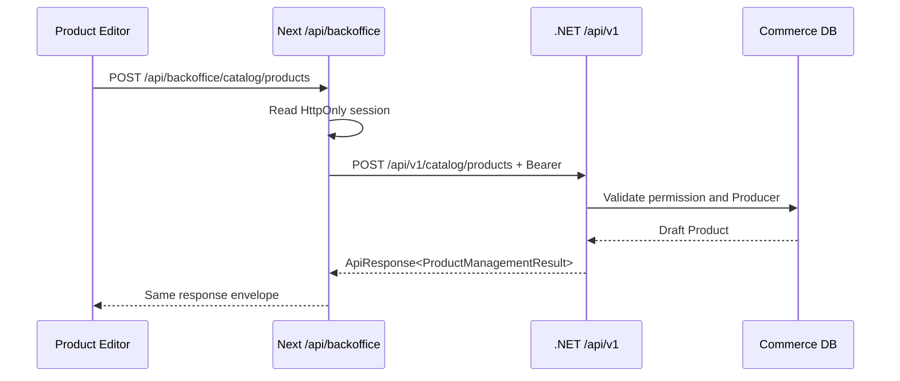
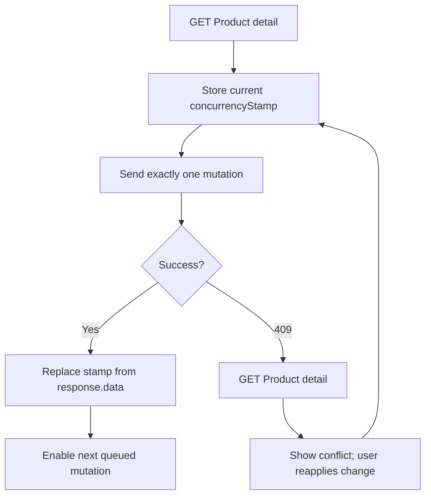
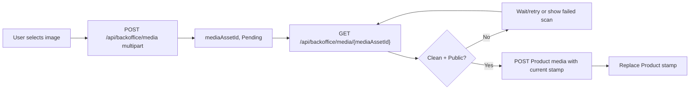
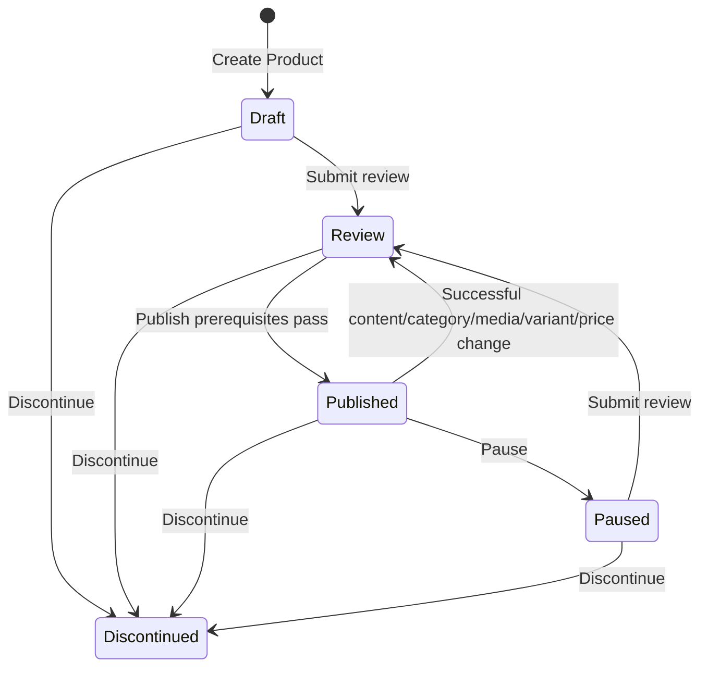
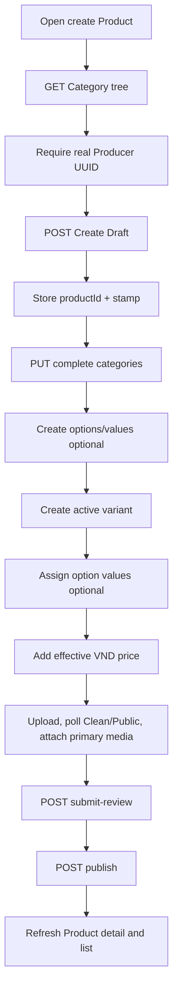

# Catalog Product Backoffice FE API Guide

**Contract source:** current `Ecom.API` V1 controllers, Catalog commands/validators, and the MarketPro BFF source.  
**Scope:** Product create, update, discontinue, lifecycle, category, variant, price, option, and product-media flows.  
**Non-goal:** This document does not invent a Producer lookup, stock, media-library, price edit/delete, or image-URL API where source has no contract.

## 1. Endpoint boundary

Browser code must call the same-origin MarketPro BFF, not the .NET host directly:

```text
Browser:  /api/backoffice/catalog/products
Next BFF: /catalog/products
.NET API: {API_BASE_URL}/catalog/products
          where API_BASE_URL already ends in /api/v1
```

For local development the intended environment value is:

```text
API_BASE_URL=http://localhost:5000/api/v1
NEXT_PUBLIC_API_BASE_URL=http://localhost:5000/api/v1
```

The BFF forwards the request body and Content-Type, reads the encrypted server-side session, and injects the Bearer token. Frontend components must not read or persist access/refresh tokens.



`/api/backoffice/catalog/products` is a BFF route. A 404 returned by `localhost:3000` with a Next HTML/error body means the Next route was not registered at runtime; it is not proof that `.NET` lacks `POST /api/v1/catalog/products`.

## 2. Common request and response rules

All management calls require an authenticated session. The BFF maps a missing session to:

```json
{ "success": false, "message": "Unauthorized", "errorCode": "UNAUTHORIZED" }
```

For JSON mutations send:

```http
Content-Type: application/json
Accept: application/json
```

Every normal API result has this envelope:

```json
{
  "success": true,
  "data": {},
  "message": "Success",
  "errorCode": null,
  "validationErrors": null,
  "details": null,
  "timestamp": "2026-08-09T00:00:00Z"
}
```

| HTTP | Meaning for FE | Required UI behavior |
| --- | --- | --- |
| 400 | Request/field validation failure | Keep form state and render `validationErrors`. |
| 401 | No valid BFF session, or backend token cannot be refreshed | Route to login/session recovery. |
| 403 | Session user lacks the route policy | Do not render the action for known permissions; show access denied for deep links. |
| 404 | Product, category, media, variant, price list, or Producer is absent | Stop this operation; do not fabricate an ID. |
| 409 | Stale `concurrencyStamp` or duplicate unique value | Refetch Product detail and require a conscious reapply. Never retry the same mutation automatically. |
| 422 | Domain/lifecycle rule blocks the request | Display the API message and refresh detail if the operation can have changed elsewhere. |
| 5xx/network | Transport/server failure | Preserve unsaved form data; reload detail before offering a retry. |

## 3. Policies

| Capability | Required policy |
| --- | --- |
| Read Product list/detail/options | `catalog.products.read` |
| Create Product | `catalog.products.create` |
| Update Product, categories, variants, options, prices, product media | `catalog.products.update` |
| Submit review, publish, pause Product | `catalog.products.publish` |
| Discontinue Product | `catalog.products.discontinue` |
| Read Category tree/detail/list | `catalog.categories.read` |
| Upload media | `media.upload` |
| Poll media metadata | `media.read` |

## 4. Read APIs and required values

### 4.1 Product table

```http
GET /api/backoffice/catalog/products?status=Draft&page=1&pageSize=20
```

Use this before navigation and after each successful mutation. Supported filters are `q`, `status`, `producerId`, `categoryId`, `sku`, `minPrice`, `maxPrice`, `createdFrom`, `createdTo`, `updatedFrom`, `updatedTo`, `hasActiveVariant`, `hasEffectivePrice`, `hasPrimaryMedia`, `page`, and `pageSize`.

Response `data` is a page with `items`, `pageNumber`, `totalPages`, `totalCount`, `pageSize`, `hasPreviousPage`, and `hasNextPage`. A list row contains `id`, `producerId`, `name`, `slug`, `status`, `createdAt`, `updatedAt`, and `primaryCategory` only. It does **not** contain a concurrency stamp or the data needed for editing.

### 4.2 Product editor source of truth

```http
GET /api/backoffice/catalog/products/{productId}
```

Use on editor open, immediately after a 409, and after a child mutation when local state is insufficient. The response contains the editable root fields plus:

```json
{
  "id": "uuid",
  "producerId": "uuid",
  "name": "Mật Ong Hoa Tràm",
  "slug": "mat-ong-hoa-tram",
  "status": "Draft",
  "concurrencyStamp": "uuid",
  "categories": [],
  "media": [],
  "variants": [],
  "pricePeriods": []
}
```

Store `data.concurrencyStamp` in the Product editor state. It is required by every Product mutation after create.

### 4.3 Category values

```http
GET /api/backoffice/catalog/categories/tree
```

Fetch when opening the create/edit page. It supplies category `id`, hierarchy, status, and labels for the category picker. FE must send IDs only; it must not use a category name or slug in Product mutations.

### 4.4 Option values

```http
GET /api/backoffice/catalog/products/{productId}/options
```

Fetch after product detail or lazily when the Options tab opens. Product detail does not embed option definitions or their value IDs.

### 4.5 Media metadata polling

```http
GET /api/backoffice/media/{mediaAssetId}
```

After upload, poll this endpoint until `scanStatus` is `Clean` and `visibility` is `Public`. Only then enable Attach or Set Primary. The management product DTO has metadata but no image URL; do not infer a storage URL.

### 4.6 Producer limitation

There is no supported Producer list/detail endpoint in this contract. Create Product accepts an existing `producerId`, but FE cannot obtain one from mock data or PostgreSQL. A sample UUID such as `3fa85f64-5717-4562-b3fc-2c963f66afa6` is not a valid production choice unless it exists in the same Commerce database.

## 5. Create Product Draft

### Request

```http
POST /api/backoffice/catalog/products
Content-Type: application/json
```

```json
{
  "producerId": "<existing Producer UUID>",
  "name": "Mật Ong Hoa Tràm",
  "slug": "mat-ong-hoa-tram",
  "shortDescription": null,
  "description": "Mật ong hoa tràm Quang Vinh, đạt chuẩn OCOP.",
  "usageInstructions": null,
  "storageInstructions": null,
  "warningText": null,
  "metaTitle": null,
  "metaDescription": null
}
```

Required fields: `producerId`, `name` (max 300), and `slug` (max 350). All other fields are nullable. The API verifies that Producer exists and that the slug is unique.

### Success response

```json
{
  "success": true,
  "data": {
    "id": "product-uuid",
    "slug": "mat-ong-hoa-tram",
    "status": "Draft",
    "concurrencyStamp": "first-stamp-uuid"
  }
}
```

FE must persist `id` and `concurrencyStamp`, then continue with categories, options, variants, prices, and media. Create does not create any of those child records.

## 6. Concurrency protocol

All Product child writes mutate the parent Product version. Treat them as a single serial queue per `productId`.



Product-level success result:

```json
{
  "id": "product-uuid",
  "slug": "mat-ong-hoa-tram",
  "status": "Draft",
  "concurrencyStamp": "new-stamp-uuid"
}
```

Variant creation returns `{ "variantId", "productId", "concurrencyStamp" }`; price creation returns `{ "variantPriceId", "productId", "concurrencyStamp" }`. In both cases replace the Product stamp immediately.

## 7. Update Product root fields

```http
PUT /api/backoffice/catalog/products/{productId}
Content-Type: application/json
```

```json
{
  "concurrencyStamp": "current-stamp-uuid",
  "name": "Mật Ong Hoa Tràm OCOP",
  "slug": "mat-ong-hoa-tram",
  "shortDescription": "Mật ong tự nhiên",
  "description": "...",
  "usageInstructions": null,
  "storageInstructions": null,
  "warningText": null,
  "metaTitle": null,
  "metaDescription": null
}
```

The path `productId` is authoritative; do not include `id`, `producerId`, `status`, or timestamps in this update body. A successful content mutation of a Published Product moves it back to `Review`.

## 8. Replace Product categories

```http
PUT /api/backoffice/catalog/products/{productId}/categories
Content-Type: application/json
```

```json
{
  "concurrencyStamp": "current-stamp-uuid",
  "categories": [
    { "categoryId": "category-uuid-1", "isPrimary": true },
    { "categoryId": "category-uuid-2", "isPrimary": false }
  ]
}
```

This is a full replacement, not an add operation. Send a non-empty unique collection and exactly one `isPrimary: true`. FE must fetch the Category tree first and must use actual IDs.

## 9. Options and variant-option values

### Create option

```http
POST /api/backoffice/catalog/products/{productId}/options
```

```json
{ "concurrencyStamp": "current-stamp-uuid", "code": "size", "name": "Dung tích", "displayOrder": 0 }
```

### Create option value

```http
POST /api/backoffice/catalog/products/{productId}/options/{optionId}/values
```

```json
{ "concurrencyStamp": "current-stamp-uuid", "value": "500ml", "displayOrder": 0 }
```

### Update/delete option or value

```text
PUT    /api/backoffice/catalog/products/{productId}/options/{optionId}
DELETE /api/backoffice/catalog/products/{productId}/options/{optionId}
PUT    /api/backoffice/catalog/products/{productId}/options/{optionId}/values/{valueId}
DELETE /api/backoffice/catalog/products/{productId}/options/{optionId}/values/{valueId}
```

Update bodies contain the same editable fields plus `concurrencyStamp`; delete bodies contain `{ "concurrencyStamp": "..." }`.

### Replace a variant's option values

```http
PUT /api/backoffice/catalog/products/{productId}/variants/{variantId}/option-values
```

```json
{
  "concurrencyStamp": "current-stamp-uuid",
  "optionValueIds": ["option-value-uuid-1", "option-value-uuid-2"]
}
```

This replaces the entire variant mapping. Fetch options first; all value IDs must be distinct and belong to this Product.

## 10. Variants and prices

### Create variant

```http
POST /api/backoffice/catalog/products/{productId}/variants
```

```json
{
  "concurrencyStamp": "current-stamp-uuid",
  "sku": "MAT-ONG-500ML",
  "name": "Chai 500ml",
  "inventoryMode": "NotTracked",
  "allowBackorder": false,
  "barcode": null,
  "weightGrams": 700,
  "displayOrder": 0
}
```

`sku` must be unique and is supplied only at create. Do not invent inventory quantity: the management contract exposes only inventory mode and backorder policy.

### Update variant

```http
PUT /api/backoffice/catalog/products/{productId}/variants/{variantId}
```

```json
{
  "concurrencyStamp": "current-stamp-uuid",
  "name": "Chai 500ml",
  "barcode": null,
  "weightGrams": 700,
  "displayOrder": 0,
  "inventoryMode": "NotTracked",
  "allowBackorder": false
}
```

### Variant lifecycle

```text
POST /api/backoffice/catalog/products/{productId}/variants/{variantId}/activate
POST /api/backoffice/catalog/products/{productId}/variants/{variantId}/pause
POST /api/backoffice/catalog/products/{productId}/variants/{variantId}/discontinue
```

All three bodies are `{ "concurrencyStamp": "current-stamp-uuid" }`.

### Add a price period

```http
POST /api/backoffice/catalog/products/{productId}/variants/{variantId}/prices
```

```json
{
  "concurrencyStamp": "current-stamp-uuid",
  "amount": 180000,
  "priceType": "Public",
  "effectiveFrom": "2026-08-09T00:00:00Z",
  "effectiveTo": null,
  "priceListId": null,
  "currencyCode": "VND",
  "minQuantity": 1
}
```

Price periods are append-only in the current contract. There is no price update/delete endpoint. `effectiveTo`, if present, must be after `effectiveFrom`; `minQuantity` is at least 1.

## 11. Media flow



### Upload

```http
POST /api/backoffice/media
Content-Type: multipart/form-data
```

Form fields:

```text
file=<image file>
intent=ProductImage
altText=<optional text>
```

The size limit is 10 MB. Upload returns metadata including `id`, `visibility`, `scanStatus`, and intended visibility. Do not attach a Pending, Failed, Restricted, or non-image asset.

### Attach

```http
POST /api/backoffice/catalog/products/{productId}/media
```

```json
{
  "concurrencyStamp": "current-stamp-uuid",
  "mediaAssetId": "clean-public-media-uuid",
  "displayOrder": 0,
  "makePrimary": true,
  "caption": "Mặt trước sản phẩm"
}
```

### Reorder/caption, primary, remove

```text
PATCH  /api/backoffice/catalog/products/{productId}/media/{mediaAssetId}
POST   /api/backoffice/catalog/products/{productId}/media/{mediaAssetId}/primary
DELETE /api/backoffice/catalog/products/{productId}/media/{mediaAssetId}
```

PATCH body:

```json
{ "concurrencyStamp": "current-stamp-uuid", "displayOrder": 1, "caption": "..." }
```

Set-primary and remove bodies each contain `{ "concurrencyStamp": "current-stamp-uuid" }`. These actions remove/alter only the ProductMedia association; they do not delete the MediaAsset itself.

## 12. Product lifecycle and Delete meaning



### Submit for review

```http
POST /api/backoffice/catalog/products/{productId}/submit-review
```

```json
{ "concurrencyStamp": "current-stamp-uuid" }
```

### Publish

```http
POST /api/backoffice/catalog/products/{productId}/publish
```

```json
{ "concurrencyStamp": "current-stamp-uuid" }
```

The server is authoritative and requires: a published verified Producer, a published primary Category, clean/public primary Media, one active Variant, and at least one effective eligible price. No readiness endpoint exists; FE may show its checklist but must use the publish response as the decision.

### Pause

```http
POST /api/backoffice/catalog/products/{productId}/pause
```

```json
{ "concurrencyStamp": "current-stamp-uuid" }
```

### Discontinue / delete

```http
POST   /api/backoffice/catalog/products/{productId}/discontinue
DELETE /api/backoffice/catalog/products/{productId}
```

Both use:

```json
{ "concurrencyStamp": "current-stamp-uuid" }
```

`DELETE` does not physically erase the Product. Both routes execute the `DiscontinueProduct` lifecycle command. `Discontinued` is terminal, so UI must call this action “Discontinue” or “Ngừng kinh doanh”, not claim permanent deletion.

## 13. End-to-end UI orchestration



For an existing Product, begin with `GET Product detail`, queue one mutation at a time using its stamp, replace the stamp from every success, and refetch on 409. After every successful mutation invalidate/refetch the Product list and Product detail; do not rely on a manual optimistic patch for lifecycle or child collection state.

## 14. FE acceptance checklist

- [ ] Runtime registers `src/app/api/backoffice/catalog/[[...path]]/route.js`; a request without session receives BFF JSON 401, not Next 404.
- [ ] All browser Catalog requests use `/api/backoffice/...`; no component sends a Bearer token.
- [ ] Create uses a Producer UUID that actually exists in the target Commerce database; no mock Producer is selectable.
- [ ] Category replacement sends the entire collection and exactly one primary item.
- [ ] Per-Product mutation queue always uses and replaces the latest `concurrencyStamp`.
- [ ] A 409 refetches detail and never automatically resubmits stale data.
- [ ] Media attach/primary controls wait for `Clean` + `Public` metadata.
- [ ] A Published Product displays that subsequent content changes return it to Review.
- [ ] Delete UI is labelled discontinue and explains it is terminal.
- [ ] Publish is enabled only as UI guidance; server publish result remains authoritative.

## 15. Verification boundary

This guide describes live source contracts only. It does not prove that a chosen Producer exists, policies are assigned to a deployed user, the BFF runtime is running the inspected checkout, media scanning is healthy, or migrations/storage are provisioned.
