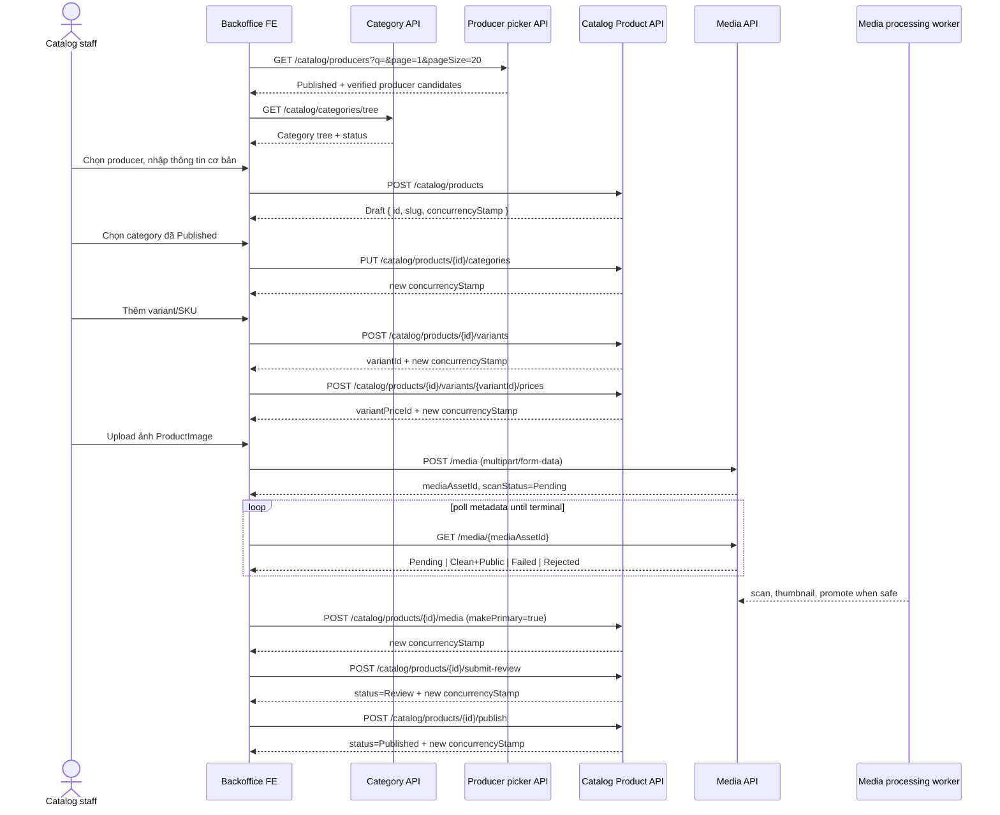

# Hướng dẫn FE: Flow tạo, hoàn thiện và xuất bản Catalog Product

> **Phạm vi:** `Source_Ecom/backend-api`, Catalog V1 source snapshot ngày 2026-08-17.
> **Đối tượng:** Backoffice FE, QA, Product Owner và Backend implementer.
> **Mục tiêu:** Tạo một Product mới từ nội dung cơ bản, category đã được chấp nhận/publish, ảnh đã scan, variant, giá đến Submit review và Publish.
> **Nguồn contract:** `CatalogProductsController`, `CatalogCategoriesController`, `CatalogProductOptionsController`, `CatalogProducersController`, `MediaController` và các command/handler/aggregate Catalog. Đây là guide cho **backoffice**, không phải storefront.

## 1. Quy trình sơ lược và API graph

### 1.1 Ranh giới nghiệp vụ và dữ liệu

```text
Producer (đã Published + Verified) ──> Product (Draft/Review/Published/Paused)
                                         ├─ ProductCategory ──> Category (primary phải Published)
                                         ├─ ProductMedia ────> MediaAsset (primary phải Clean + Public)
                                         └─ ProductVariant ─> VariantPrice (giá bán có hiệu lực)
                                                                    └─ PriceList (optional)

ProductOption ──> ProductOptionValue ──> ProductVariantOptionValue
  (chỉ dùng khi Product có nhiều lựa chọn như size/màu/quy cách)
```

Điểm quan trọng:

- `Product` **không** lưu SKU, tồn kho hoặc giá bán trực tiếp.
- SKU thuộc `ProductVariant`; giá vật lý thuộc `Tbl_VariantPrice`, liên kết tới `ProductVariant`.
- Product chỉ có thể Publish khi có producer hợp lệ, category chính, media chính, variant active và giá hiệu lực.
- Tất cả mutation Product, trừ create, phải gửi `concurrencyStamp` mới nhất.
- `ProducerId` chỉ nhận khi tạo Product; API V1 hiện không có đổi producer sau khi tạo.

### 1.2 State machine

```text
Create Product
     │
     ▼
   Draft ── submit-review ──> Review ── publish ──> Published ── pause ──> Paused
     ▲                           │                         │                    │
     └───────────────────────────┴─────────────────────────┴─ content mutation ┘
                                      (Product đang Published sẽ quay về Review)

Any non-discontinued state ── discontinue ──> Discontinued (terminal)
```

`Publish` không phải thao tác tự sửa thiếu dữ liệu. Nếu bất kỳ prerequisite nào thiếu, backend trả lỗi nghiệp vụ và Product ở `Review`; FE phải hiển thị checklist lỗi, không tự retry.

### 1.3 API graph hoàn chỉnh cho một Product tối thiểu có thể publish



### 1.4 Thứ tự thực thi FE khuyến nghị

| Bước | Mục tiêu | API quyết định | Điều kiện chuyển bước |
| --- | --- | --- | --- |
| 0 | Kiểm tra quyền và lookup data | Producer picker, category tree | Có policy cần thiết; producer/category được chọn hợp lệ. |
| 1 | Tạo Draft | `POST /catalog/products` | Nhận `id` và `concurrencyStamp`. |
| 2 | Hoàn thiện content/SEO | `PUT /catalog/products/{id}` nếu cần | Dùng stamp mới trả về. |
| 3 | Chọn/đổi toàn bộ category | `PUT /categories` | Có ít nhất 1 category, đúng 1 primary. |
| 4 | Tạo option (optional) | `/options` APIs | Chỉ khi cần phân biệt các variant. |
| 5 | Tạo variant active | `POST /variants` | Có ít nhất 1 variant active, SKU duy nhất. |
| 6 | Gán option values (optional) | `PUT /variants/{variantId}/option-values` | Mỗi option tối đa một value trên một variant. |
| 7 | Thêm giá | `POST /prices` | Có ít nhất 1 effective price eligible trên variant active. |
| 8 | Upload/scan/gắn primary media | Media API rồi Product media API | Asset primary là `visibility=Public`, `scanStatus=Clean`. |
| 9 | Submit review | `POST /submit-review` | Draft hoặc Paused chuyển thành Review. |
| 10 | Publish | `POST /publish` | Tất cả prerequisite server-side đều đạt. |

## 2. Hướng dẫn map API chi tiết cho từng phần

### 2.1 Contract chung, auth và response

**Base URL:** `/api/v1`. Mọi backoffice endpoint cần `Authorization: Bearer <accessToken>`; JSON mutation dùng `Content-Type: application/json`; upload dùng `multipart/form-data`.

Envelope chuẩn:

```json
{
  "success": true,
  "data": {},
  "message": "Success",
  "errorCode": null,
  "validationErrors": null,
  "details": null,
  "timestamp": "2026-08-17T03:31:45Z"
}
```

| Policy | Cho phép |
| --- | --- |
| `catalog.products.read` | List/detail Product và options. |
| `catalog.products.create` | Tạo Draft; đọc producer picker. |
| `catalog.products.update` | Sửa Product, category mapping, media, variant, price, option/value. |
| `catalog.products.publish` | Submit review, publish, pause. |
| `catalog.products.discontinue` | Discontinue Product. |
| `catalog.categories.read/create/update/publish/deactivate` | Category management theo từng action. |
| `media.upload/read/delete` | Upload, poll metadata/retry scan, delete asset tương ứng. |

Mỗi mutation Product thành công trả stamp mới trong `data.concurrencyStamp`. FE phải thay ngay stamp trong state trước request tiếp theo.

### 2.2 Bước 0 — chọn producer và chuẩn bị category được chấp nhận

#### A. Producer picker

```http
GET /api/v1/catalog/producers?q=mat-ong&page=1&pageSize=20
```

Chỉ producer có `publicStatus=Published` và `isVerified=true` được trả về. Đây là **picker**, không phải API tạo/sửa producer. Không có producer hợp lệ thì dừng wizard và chuyển staff sang quy trình quản trị Producer; không truyền UUID tự nhập từ FE.

#### B. Lấy category để chọn

```http
GET /api/v1/catalog/categories/tree
```

Tree trả `id`, `name`, `slug`, `status`, `displayOrder`, `children`. Picker phải:

1. Hiển thị toàn bộ tree cho staff có quyền đọc, nhưng disable/đánh dấu các Category chưa `Published` khi chọn **primary** cho Product chuẩn bị publish.
2. Cho phép chọn nhiều category, song có đúng một `isPrimary=true`.
3. Không tạo category ngầm trong wizard Product. Nếu chưa có category, mở flow Category management độc lập dưới đây.

#### C. Tạo/cập nhật và chấp nhận Category khi chưa tồn tại

| Action | Endpoint | Body tối thiểu | Rule nghiệp vụ |
| --- | --- | --- | --- |
| Create | `POST /catalog/categories` | `parentId`, `name`, `slug`, `description`, `displayOrder` | Tạo `Draft`; slug unique; parent không Hidden và không tạo cycle. |
| Update | `PUT /catalog/categories/{categoryId}` | Body create + `concurrencyStamp` | Path ID là authoritative; không đổi parent khiến tree cycle. |
| Accept/publish | `POST /catalog/categories/{categoryId}/publish` | `{ "concurrencyStamp": "uuid" }` | Category và tất cả ancestor phải Published. |
| Pause | `POST /catalog/categories/{categoryId}/pause` | stamp | Bị chặn nếu còn child Published hoặc Product Published đang dùng nó làm primary. |
| Hide | `DELETE /catalog/categories/{categoryId}` | stamp | Cùng guard như pause; không hard delete. |

Ví dụ tạo category root:

```json
{
  "parentId": null,
  "name": "Mật ong",
  "slug": "mat-ong",
  "description": "Sản phẩm mật ong địa phương",
  "displayOrder": 10
}
```

**Kết luận chọn category:** Product có thể gắn một category Draft/Paused trong lúc soạn Draft, nhưng Publish Product chỉ thành công khi **primary category** đã `Published`. Do đó checklist FE phải báo “category chính chưa được chấp nhận/publish” trước khi gọi Publish.

### 2.3 Bước 1 — tạo Product Draft và nội dung cơ bản

```http
POST /api/v1/catalog/products
```

```json
{
  "producerId": "8c958c48-8c9e-4444-9335-000000000001",
  "name": "Mật ong rừng 500g",
  "slug": "mat-ong-rung-500g",
  "shortDescription": "Mật ong tự nhiên.",
  "description": "Nội dung mô tả đầy đủ.",
  "usageInstructions": "Dùng trực tiếp hoặc pha nước ấm.",
  "storageInstructions": "Bảo quản nơi khô ráo.",
  "warningText": "Không dùng cho trẻ dưới 12 tháng.",
  "metaTitle": "Mật ong rừng 500g",
  "metaDescription": "Mô tả SEO ngắn."
}
```

Response `data`:

```json
{
  "id": "product-uuid",
  "slug": "mat-ong-rung-500g",
  "status": "Draft",
  "concurrencyStamp": "stamp-1"
}
```

`name`, `slug`, `producerId` là bắt buộc. Slug trùng trả conflict (`409` theo mapping hiện tại). Chỉ tạo thành công khi producer ID tồn tại; điều kiện Published + Verified được backend kiểm tra lại lúc Publish.

Sửa content/SEO:

```http
PUT /api/v1/catalog/products/{productId}
```

```json
{
  "concurrencyStamp": "stamp-1",
  "name": "Mật ong rừng 500g",
  "slug": "mat-ong-rung-500g",
  "shortDescription": "Mật ong tự nhiên.",
  "description": "Nội dung mô tả đầy đủ.",
  "usageInstructions": "Dùng trực tiếp hoặc pha nước ấm.",
  "storageInstructions": "Bảo quản nơi khô ráo.",
  "warningText": "Không dùng cho trẻ dưới 12 tháng.",
  "metaTitle": "Mật ong rừng 500g",
  "metaDescription": "Mô tả SEO ngắn."
}
```

Không gửi `id`, `status`, timestamp hoặc `producerId` vào update body. Nếu Product đang `Published`, mọi content mutation thành công sẽ chuyển Product về `Review` và storefront không nên coi nó vẫn publish cho đến khi publish lại.

### 2.4 Bước 2 — map và thay thế toàn bộ category của Product

```http
PUT /api/v1/catalog/products/{productId}/categories
```

```json
{
  "concurrencyStamp": "stamp-2",
  "categories": [
    { "categoryId": "category-primary-uuid", "isPrimary": true },
    { "categoryId": "category-secondary-uuid", "isPrimary": false }
  ]
}
```

Đây là **replace-all**, không phải add-delta: body phải gồm toàn bộ category muốn giữ. Validator/aggregate yêu cầu collection không rỗng, mỗi ID unique và chính xác một primary. Sau success, nhận `stamp-3`; refetch `GET /catalog/products/{productId}` nếu UI cần render lại relation đầy đủ.

### 2.5 Bước 3 — option/value (chỉ khi Product có nhiều quy cách)

Một Product đơn variant không cần Option API. Với size, màu, khối lượng... dùng sequence:

| Mục đích | Route | Body quan trọng |
| --- | --- | --- |
| List option | `GET /catalog/products/{productId}/options` | — |
| Create option | `POST .../options` | `concurrencyStamp`, `code`, `name`, `displayOrder` |
| Create value | `POST .../options/{optionId}/values` | `concurrencyStamp`, `value`, `displayOrder` |
| Sửa/xoá option/value | `PUT`/`DELETE` route theo ID | always send stamp |
| Gán values cho variant | `PUT /catalog/products/{productId}/variants/{variantId}/option-values` | `concurrencyStamp`, `optionValueIds` |

Ví dụ:

```json
{ "concurrencyStamp": "stamp-3", "code": "WEIGHT", "name": "Khối lượng", "displayOrder": 0 }
```

```json
{ "concurrencyStamp": "stamp-4", "value": "500g", "displayOrder": 0 }
```

```json
{ "concurrencyStamp": "stamp-5", "optionValueIds": ["weight-500g-value-uuid"] }
```

`optionValueIds` thay thế toàn bộ tập value của variant. Một variant chỉ chọn tối đa một value cho mỗi option. Không thể xoá option/value đang được variant dùng; UI phải show usage conflict thay vì tự xoá mapping.

### 2.6 Bước 4 — tạo variant

```http
POST /api/v1/catalog/products/{productId}/variants
```

```json
{
  "concurrencyStamp": "stamp-5",
  "sku": "HONEY-500G",
  "name": "Hũ 500g",
  "inventoryMode": "Tracked",
  "allowBackorder": false,
  "barcode": null,
  "weightGrams": 500,
  "displayOrder": 0
}
```

Response có `variantId`, `productId`, `concurrencyStamp`. SKU là unique trong source hiện tại và **immutable**: `PUT /variants/{variantId}` không có field `sku`. `weightGrams`, nếu gửi, phải lớn hơn 0; `displayOrder >= 0`.

`inventoryMode` hiện hỗ trợ `NotTracked`, `Tracked`, `Preorder`. Việc tạo/sửa Variant không tự tạo inventory balance; module quản trị kho là phạm vi riêng.

### 2.7 Bước 5 — thêm giá tiền cho variant

```http
POST /api/v1/catalog/products/{productId}/variants/{variantId}/prices
```

```json
{
  "concurrencyStamp": "stamp-6",
  "amount": 120000,
  "priceType": "Public",
  "effectiveFrom": "2026-08-17T00:00:00Z",
  "effectiveTo": null,
  "priceListId": null,
  "currencyCode": "VND",
  "minQuantity": 1
}
```

| Field | Rule hiện có | Quy tắc FE |
| --- | --- | --- |
| `amount` | `>= 0` | Gửi number JSON, không gửi formatted `120.000 đ`. |
| `currencyCode` | exactly 3 characters | Dùng `VND` cho public eligibility hiện tại. |
| `minQuantity` | `>= 1` | Giá storefront thông thường phải là `1`. |
| `effectiveFrom` | bắt buộc, UTC | Dùng ISO-8601 `Z`; không gửi local time không offset. |
| `effectiveTo` | null hoặc `> effectiveFrom` | Đóng một period cũ bằng period mới hợp lệ; không có edit/delete price API. |
| `priceListId` | optional nhưng phải tồn tại nếu có | V1 không có PriceList management UI/API trong flow này. |
| `priceType` | enum price | Public effective pricing ưu tiên `Sale`, sau đó `Public`; không dùng `B2B` để publish storefront. |

Price là **append-only API**. Không giả lập update/delete bằng chỉnh record cũ ở FE hoặc gọi DB. PostgreSQL constraint được thiết kế để từ chối period overlap cùng scope; xử lý conflict bằng thay đổi time window/price plan có chủ đích.

### 2.8 Bước 6 — upload, scan và gắn ảnh Product

#### A. Upload file

```text
POST /api/v1/media
Authorization: Bearer <token with media.upload>
Content-Type: multipart/form-data

file: <JPEG | PNG | WebP, maximum request size 10 MiB>
intent: ProductImage
altText: Mặt trước sản phẩm Mật ong rừng 500g
```

V1 chỉ nhận `intent=ProductImage`; Product image chỉ nhận JPEG, PNG hoặc WebP. Upload response trả `id`, metadata, `visibility`, `scanStatus`, `intendedVisibility`. Không dùng storage key hay URL tự dựng ở FE.

#### B. Poll scan status

```http
GET /api/v1/media/{mediaAssetId}
```

Response metadata có `visibility`, `targetVisibility`, `scanStatus`, `scanFailureCode`, `scanFailureReason`, `canRetryScan`, `nextScanAttemptAt`.

| Status | FE xử lý |
| --- | --- |
| `Pending` | Giữ ảnh ở trạng thái processing; poll theo `nextScanAttemptAt` nếu có, hoặc backoff. Không attach primary. |
| `Clean` + `Public` | Asset đủ điều kiện attach; có thể đặt primary. |
| `Failed` + `canRetryScan=true` | Hiện lý do; staff có quyền gọi `POST /media/{id}/retry-scan`, rồi poll lại. |
| `Rejected` hoặc Failed không retry | Không attach; chọn upload khác. |

`POST /media/{id}/retry-scan` chỉ hợp lệ cho status `Failed`, không phải nút “bypass scan”. Không có endpoint cho FE tự MarkClean/promote Public.

#### C. Attach và chọn primary media

```http
POST /api/v1/catalog/products/{productId}/media
```

```json
{
  "concurrencyStamp": "stamp-7",
  "mediaAssetId": "clean-public-media-uuid",
  "displayOrder": 0,
  "makePrimary": true,
  "caption": "Mặt trước sản phẩm"
}
```

Thao tác gallery:

| Action | Endpoint | Body |
| --- | --- | --- |
| Đổi caption/thứ tự | `PATCH /catalog/products/{id}/media/{mediaAssetId}` | `concurrencyStamp`, `displayOrder`, `caption` |
| Đặt primary | `POST /catalog/products/{id}/media/{mediaAssetId}/primary` | `concurrencyStamp` |
| Gỡ link ProductMedia | `DELETE /catalog/products/{id}/media/{mediaAssetId}` | `concurrencyStamp` |

Primary luôn phải `Clean + Public`. Không thể gỡ primary media của Product `Published`; phải đặt một primary hợp lệ khác trước. `DELETE` ở đây chỉ gỡ association ProductMedia, không đồng nghĩa xóa asset toàn cục.

### 2.9 Bước 7 — review và publish

```http
POST /api/v1/catalog/products/{productId}/submit-review
POST /api/v1/catalog/products/{productId}/publish
```

Cả hai body:

```json
{ "concurrencyStamp": "latest-stamp" }
```

| Action | Transition hợp lệ | Permission | Backend kiểm tra |
| --- | --- | --- | --- |
| Submit review | `Draft` hoặc `Paused` → `Review` | `catalog.products.publish` | State transition. |
| Publish | `Review` → `Published` | `catalog.products.publish` | Producer Published+Verified; primary Category Published; primary Media Clean+Public; ít nhất 1 Variant Active; ít nhất 1 effective eligible price. |
| Pause | `Published` → `Paused` | `catalog.products.publish` | State transition. |
| Discontinue | any nonterminal → `Discontinued` | `catalog.products.discontinue` | Terminal; không còn mutation. |

Sau mỗi action, refetch `GET /api/v1/catalog/products/{productId}` để đồng bộ status, child collections và stamp. Product detail management là source of truth của editor:

```http
GET /api/v1/catalog/products/{productId}
```

Nó trả root content, `status`, timestamps, `concurrencyStamp`, categories, media metadata, variants và `pricePeriods`. Không trả private media URL/storage key.

## 3. Checklist API: map đã đủ chưa?

### 3.1 Checklist tối thiểu để FE hoàn thành happy path

| Item cần map | Endpoint/read model | FE lưu gì | Done khi |
| --- | --- | --- | --- |
| Quyền backoffice | JWT policy claims + 403 handling | capability theo policy | Không render action không có quyền; server vẫn chặn. |
| Producer | `GET /catalog/producers` | `producerId` | Picker chỉ cho Published + Verified. |
| Category picker | `GET /catalog/categories/tree` | `categoryId`, `isPrimary` | Primary Category Published trước Publish. |
| Tạo Product | `POST /catalog/products` | `productId`, first stamp | Product `Draft` được tạo. |
| Editor source of truth | `GET /catalog/products/{id}` | full detail + latest stamp | Load/reload sau mutation/409. |
| Content/SEO | `PUT /catalog/products/{id}` | new stamp | Field validation/render error mapped. |
| Category mapping | `PUT /{id}/categories` | new stamp | Full collection, exactly one primary. |
| Variant | `POST /variants` | `variantId`, new stamp | Có active variant. |
| Price | `POST /variants/{variantId}/prices` | price ID, new stamp | Effective public/sale VND price, qty 1. |
| Media upload | `POST /media` | `mediaAssetId`, scan metadata | Upload accepted; no direct storage access. |
| Scan polling | `GET /media/{id}` | status/retry reason | `Clean + Public` before attach primary. |
| Product media | `POST /media` association | new stamp | Có exactly one intended primary. |
| Submit/Publish | lifecycle endpoints | new stamp + status | Product reaches Published. |

### 3.2 Publish readiness checklist cho UI

FE nên render “Publish readiness” từ product detail và lookup, nhưng đây chỉ là pre-check UX. Backend Publish là authority cuối cùng.

| Điều kiện | FE check | Backend check khi Publish | Nếu thiếu |
| --- | --- | --- | --- |
| Product ở `Review` | `data.status === "Review"` | Yes | Hiện nút Submit review nếu Draft/Paused; không gọi Publish. |
| Producer hợp lệ | picker record Published + Verified | Yes, query lại Producer | Link tới lỗi producer/không tự sửa ID. |
| Category chính | categories có 1 primary | Yes | Bắt buộc replace categories. |
| Category chính Published | tree/detail status | Yes | Publish category hoặc chọn category khác. |
| Ảnh chính | media có 1 primary | Yes | Upload/poll/attach hoặc đổi primary. |
| Ảnh an toàn public | `visibility=Public && scanStatus=Clean` | Yes | Chờ scan/retry/thay asset. |
| Variant active | variants có `status=Active` | Yes | Tạo/activate variant. |
| Giá hiệu lực | pricePeriods có price candidate | Yes qua effective price resolver | Append price eligible; xử lý window/PriceList. |
| Stamp mới | local stamp tồn tại | Yes | Reload detail rồi thao tác lại. |

### 3.3 API có sẵn nhưng optional hoặc giới hạn

| Nhu cầu | API/source có | Hạn chế phải thể hiện trong FE |
| --- | --- | --- |
| Product option/value | CRUD option/value và replace variant values | Chỉ cho model nhiều variant; xóa bị chặn khi value đang được dùng. |
| Variant lifecycle | pause/activate/discontinue variant | Không thể sửa hoặc thêm giá cho Variant Discontinued. |
| Product list | `GET /catalog/products` management list | Dùng list cho table; không fetch detail cho từng row. |
| Category acceptance | CRUD + publish/pause/hide Category | Parent chain/Pubished dependent guard có thể trả `422`. |
| Media retry | `POST /media/{id}/retry-scan` | Chỉ Failed; rate-limited/anti-forgery configured server-side. |

### 3.4 Khoảng trống: không được giả định đã có API

| Nhu cầu FE hay nhầm | Trạng thái hiện tại | Cách xử lý đúng |
| --- | --- | --- |
| Tạo/sửa/verify Producer ngay trong Product editor | Chỉ có picker read API. | Đưa về workspace Producer khi backend bổ sung contract; không mock POST producer. |
| Media Library list/search/reuse toàn hệ thống | Không có list/library API. | Upload mới hoặc dùng asset ID trong product detail; đề xuất backend API trước khi xây library. |
| Chỉnh/sửa/xóa một VariantPrice đã tạo | Price API append-only. | Tạo period mới hợp lệ; không viết PATCH/DELETE giả định. |
| PriceList management | Entity tồn tại nhưng Catalog V1 chưa có management API. | Chỉ gửi `priceListId` khi system đã cung cấp ID hợp lệ. |
| Tồn kho thực tế/stock quantity | Product/Variant create chỉ nhận inventory policy. | Không hiển thị/sửa stock trong editor Catalog; dùng module Inventory khi contract có. |
| Preview public giống storefront ngay sau Publish | Public behavior/API runtime chưa là proof trong guide này. | Gọi public `GET /products/{slug}` ở môi trường được phê duyệt để smoke test; không dùng management DTO. |
| Hard delete/restore Product | `DELETE /catalog/products/{id}` là alias Discontinue. | Cảnh báo terminal, không gọi là delete vật lý. |
| Đổi Producer của Product | Update command không có `producerId`. | Quyết định producer trước create; nếu cần đổi, mở yêu cầu backend/use case có audit. |

### 3.5 Checklist QA tối thiểu

- [ ] User thiếu `catalog.products.create` nhận `403` và Create CTA không hiện.
- [ ] Tạo Product trùng slug nhận conflict, form giữ dữ liệu để staff đổi slug.
- [ ] Replace category với 0 hoặc 2 primary bị validation error; collection cũ không bị FE overwrite giả.
- [ ] Category primary Paused/Draft làm Publish fail; publish category hoặc chọn category Published mới khắc phục.
- [ ] Upload asset Pending không thể trở thành primary; only Clean + Public attach primary thành công.
- [ ] Asset Failed chỉ retry khi `canRetryScan=true`; không có bypass scan.
- [ ] SKU trùng bị reject; SKU không hiện editable sau create.
- [ ] Giá `effectiveTo <= effectiveFrom`, currency không 3 ký tự, min quantity 0 bị validation error.
- [ ] Giá overlap/không eligible làm Publish fail; FE không tự chọn price history tùy tiện.
- [ ] Mỗi mutation nhận stamp mới; mutation bằng stamp cũ nhận `409`, refetch detail và manual reapply.
- [ ] Sửa Product đang Published chuyển về Review; publish lại mới được xem là complete.
- [ ] Discontinue Product không có action edit/publish tiếp theo.

## 4. Lưu ý khi map API và quy trình cần có theo từng vấn đề

### 4.1 Điều phối editor và optimistic concurrency

Không cho các tab Basic, Category, Media, Variant, Price gửi song song với cùng một stamp. Dùng một mutation queue theo `productId`:

```text
GET detail
  -> giữ concurrencyStamp hiện tại
  -> gửi đúng một mutation
  -> thay stamp bằng response.data.concurrencyStamp
  -> refetch detail khi child collection thay đổi
  -> gọi mutation tiếp theo
```

Nếu HTTP `409`: dừng queue, refetch Product detail, hiển thị banner “dữ liệu đã đổi bởi người khác”, cho staff compare/reapply thủ công. Không blind-retry payload cũ vì category là replace-all và có thể vô tình xoá relation người khác vừa thêm.

### 4.2 Quy trình category acceptance và ảnh hưởng Product

Category là taxonomy có lifecycle độc lập, không phải một string tag trong form Product.

1. Catalog admin tạo/sửa Category ở Draft.
2. Nếu Category có parent, publish toàn bộ ancestor trước.
3. Catalog admin publish Category; đây là “chấp nhận” category để dùng primary cho Product public.
4. Product editor chọn category qua tree và gửi complete mapping.
5. Khi Category đang là primary của Product Published, không pause/hide nó trước khi move/unpublish Product liên quan.

Điều này tránh storefront có Product Published nhưng taxonomy public đã bị rút. FE cần modal impact khi admin pause/hide Category dựa trên `productCount`/`publishedProductCount` từ management list.

### 4.3 Quy trình ảnh: upload không đồng nghĩa public image

Upload thành công chỉ chứng minh file đi vào quarantine/processing. Asset còn phải scan, tạo thumbnail và được promote. Vì vậy:

- Không dùng preview URL từ storage key hoặc coi Pending là an toàn để attach primary.
- Preview local browser có thể dùng object URL tạm thời, nhưng không coi đó là asset server public.
- Persist `mediaAssetId` và poll metadata; render lý do scan failure an toàn cho staff.
- Gỡ media khỏi Product không tự xoá MediaAsset; delete asset chỉ sau khi backend có usage/impact check.

### 4.4 Quy trình giá: factual history thay vì overwrite

Một Variant có nhiều `VariantPrice` period. Staff cần chọn rõ loại giá, currency, minimum quantity và time window. Để giá storefront thông thường có hiệu lực, dùng VND, min quantity `1`, time window chứa UTC now và loại giá eligible (`Sale` được ưu tiên trước `Public`).

Không lấy `fromPrice` của public list làm dữ liệu sửa giá. Đó là display aggregation. Price editor backoffice phải dùng `pricePeriods` trong `GET /catalog/products/{id}` và submit command append-only.

### 4.5 Options, variants và SKU

Option mô tả dimension dùng chung của Product; Variant là SKU có thể bán; value mapping chọn đúng một giá trị cho từng option. Một flow tốt:

```text
Option WEIGHT -> values 250g, 500g
  -> Variant HONEY-250G maps 250g, price 70,000
  -> Variant HONEY-500G maps 500g, price 120,000
```

Không dùng `Product.name` làm SKU; không chỉnh SKU sau create. Với Product chỉ có một SKU, tạo một default variant (ví dụ “Tiêu chuẩn”) vẫn là điều kiện publish vì giá luôn phải gắn Variant.

### 4.6 Publish, re-review và trách nhiệm role

- Người có `catalog.products.create` có thể tạo Draft, nhưng không mặc nhiên có quyền update/publish.
- Tách vai trò tác giả và approver bằng policy assignment nếu nghiệp vụ yêu cầu; V1 API không tự áp dụng four-eyes approval.
- Submit review chỉ đổi state; Publish re-check persisted facts trong DB, không tin checklist FE.
- Mutation content/category/media/variant/price vào Product Published đưa Product về Review. FE phải hiện warning trước Save: “Sản phẩm sẽ tạm rời trạng thái Published và cần xuất bản lại.”
- `Discontinued` là terminal. CTA phải là destructive confirmation, nói rõ đây là soft discontinue chứ không xóa lịch sử.

### 4.7 Mapping lỗi, telemetry và bảo mật

| Response | Hành vi FE |
| --- | --- |
| `400` | Render `validationErrors` tại field; không auto retry. |
| `401` | Đi theo Auth client refresh/login; không log token. |
| `403` | Hide/disable action theo policy và hiển thị access denied nếu user deep-link. |
| `404` | Product/category/media không tồn tại hoặc không thuộc scope; reload list/close editor. |
| `409` | Slug/SKU duplicate hoặc stale stamp; refetch và manual resolve. |
| `422` | Business/lifecycle rule: publish prerequisite, category ancestor/dependent, media/price issue. Hiện message + action khắc phục. |
| `500` | Generic error + correlation/trace ID nếu API cung cấp; không render raw exception. |

Không log Bearer token, `StorageKey`, private media URL, raw upload file hoặc dữ liệu giá lịch sử vào browser telemetry. FE chỉ gọi backend HTTPS; không kết nối PostgreSQL/Azure Blob trực tiếp.

### 4.8 Bằng chứng source và giới hạn xác nhận

Các contract trên được đối chiếu từ:

- `Presentation/Ecom.API/Controllers/V1/CatalogProductsController.cs`
- `Presentation/Ecom.API/Controllers/V1/CatalogCategoriesController.cs`
- `Presentation/Ecom.API/Controllers/V1/CatalogProductOptionsController.cs`
- `Presentation/Ecom.API/Controllers/V1/CatalogProducersController.cs`
- `Presentation/Ecom.API/Controllers/V1/MediaController.cs`
- `Core/Ecom.Application/Features/Catalog/**` và `Core/Ecom.Domain/Entities/Commerce/Catalog/**`
- `Core/Ecom.Domain/Entities/Commerce/Pricing/VariantPrice.cs`

Đây là **source-backed contract**. PostgreSQL/API authorization runtime coverage cho Catalog vẫn cần môi trường test PostgreSQL chuyên dụng trước khi gọi flow này là staging/production-proven. Không có migration, API hoặc database nào được thay đổi khi tạo tài liệu này.
