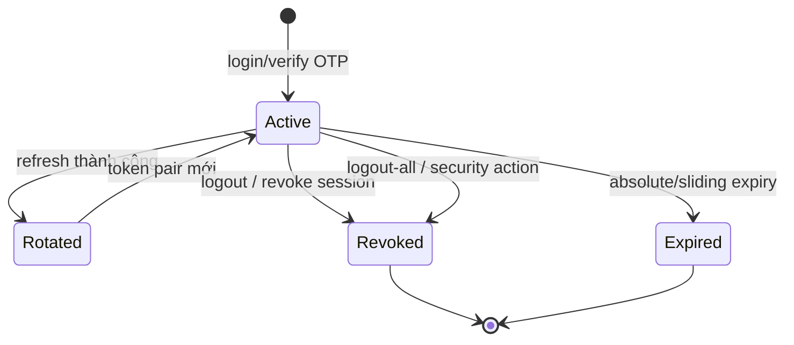

# Authentication, Session và Authorization

## Mục tiêu và boundary

Authentication xác định người dùng, cấp/rotate/revoke session; authorization quyết định policy cho từng action. Dự án có OTP V1 để tương thích phone-first và Password V2 cho password/session hiện đại. Client phải chọn một flow cho một phiên, không trộn refresh token V1/V2.

## Actor và trạng thái

- Anonymous: register/login/send/verify OTP, password login/recovery, refresh theo contract.
- Authenticated customer/staff: `me`, profile, password change/setup, session revoke.
- Admin/privileged staff: user/role/policy management theo permission.
- User/session có trạng thái active/revoked/expired; refresh rotation làm token cũ không còn là nguồn retry vô hạn.

## OTP V1

| Action | Request chính | Kết quả/behavior |
| --- | --- | --- |
| `POST /api/v1/auth/send-otp` | `phoneNumber`, optional `loginSource` | expiry, resend time, pending/status; OTP code chỉ có thể lộ ở Development được kiểm soát |
| `POST /api/v1/auth/verify-otp` | `phoneNumber`, `otpCode` | user identity, access/refresh/session, role/policies và profile-completion facts |
| `POST /api/v1/auth/register` | `phoneNumber` | compatibility registration; không phải flow password |
| `PATCH /api/v1/auth/profile/basic` | `fullName` | profile state mới |
| `POST /complete-profile`, `PATCH /profile` | full name/email/address/avatar tùy contract | hoàn thiện/cập nhật hồ sơ |
| `POST /refresh-token` | V1 refresh token | token pair mới hoặc failure |
| `POST /logout` | refresh/session facts | revoke đúng scope |

OTP phải có expiry, rate limit, attempt control và không được ghi log. Controlled test bypass chỉ dành environment cho phép, có key/expiry và không phải behavior production.

## Password V2

| Route | Mục đích | Ghi chú |
| --- | --- | --- |
| `POST /api/v2/auth/register` | tạo password account | validation password và identity uniqueness; accepted response |
| `POST /api/v2/auth/login/password` | tạo session | response timing/rate-limit tránh enumeration |
| `POST /api/v2/auth/email/verify/confirm` | xác nhận email | protected one-purpose token |
| `POST /api/v2/auth/password/forgot` | phát recovery flow | response không xác nhận account có tồn tại hay không |
| `POST /api/v2/auth/password/reset` | đổi password bằng protected token | token one-purpose/expiry |
| `POST /api/v2/auth/password/change` | đổi khi đã login | Bearer + CSRF; cần current password theo contract |
| `POST /api/v2/auth/password/setup` | thêm password cho identity hiện có | Bearer + CSRF |
| `POST /api/v2/auth/refresh` | rotate refresh session | không reuse token cũ |
| `GET /api/v2/auth/me` | principal/session summary | không trả secret/token raw ngoài contract |

## Session lifecycle

V1 có `POST /api/v1/auth/logout`. Password/session V2 có `POST /api/v2/auth/logout`, `logout-all` và `DELETE /api/v2/auth/sessions/{sessionId}`. Management có read/revoke session riêng cho staff có `security.sessions.*`. Không đổi version hoặc trộn request body giữa hai flow.

## Authorization model

Backend policy là authority. Role là nhóm quyền; permission/policy gắn vào action như `catalog.products.read`, `orders.manage`, `inventory.adjust`. FE có thể ẩn CTA từ claims nhưng không được coi đó là security control. 401 nghĩa authentication thiếu/hết hạn; 403 nghĩa đã xác thực nhưng thiếu policy.

Legacy admin endpoints hỗ trợ user/role CRUD và user-role assignment. Identity policy endpoints đọc policy, policy theo role và điều chỉnh role-policy. Thay đổi role/policy là protected operation, cần audit/security review và không tự retry.

## Demo QR

`/api/v1/demo/qr-login/start`, `/{id}/status`, `/{id}/approve`, `/{id}/reject`, `/{id}/approval-page` mô phỏng cross-device confirmation. Đây là demo boundary; không dùng nó làm production passkey/OIDC/QR login nếu chưa có contract và security validation riêng.

## Error và security UX

- 400: field validation; không hiển thị internal exception.
- 401: refresh đúng flow một lần hoặc yêu cầu login.
- 403: thiếu quyền; không retry bằng token khác tùy tiện.
- 429: tôn trọng `Retry-After`, khóa nút trong countdown.
- 502/503: dependency unavailable; không diễn giải là sai password/OTP.
- Không log password, OTP, JWT, refresh token, cookie, session secret, recovery token hoặc PII.

## Provenance tùy chọn

Controllers Auth/AuthV2/AuthSessions/DemoQrLogin/Identity; AuthenticationSessionEngine; Infrastructure Security; Auth integration tests.
