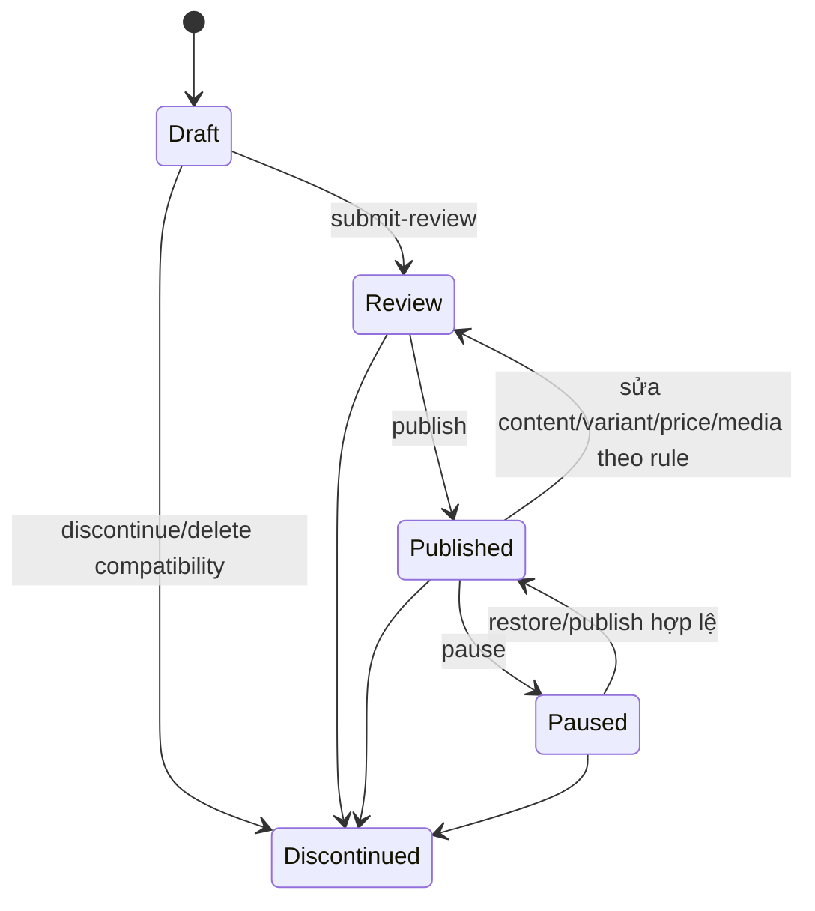

# Catalog, Product Variant, Price và Inventory

## Mục tiêu nghiệp vụ

Catalog biến thông tin Producer thành sản phẩm có thể duyệt và mua. Product chịu trách nhiệm nội dung/SEO/lifecycle; ProductVariant chịu trách nhiệm quy cách/SKU; VariantPrice chịu trách nhiệm giá; Inventory chịu trách nhiệm availability. Tách các khái niệm này giúp đổi nội dung/giá/tồn mà không phá lịch sử giao dịch.

## Ownership và trạng thái

- `Product` thuộc `Producer`; trạng thái: `Draft → Review → Published`, có thể `Paused` hoặc `Discontinued`.
- `ProductVariant` là đơn vị bán hàng (không dùng `ProductId` thay cho variant); trạng thái `Active`, `Paused`, `Discontinued`.
- Giá nằm ở `VariantPrice` (có thời hạn, `PriceType`, `PriceListId` tùy chọn, `MinQuantity`). Giá hiệu lực được server resolve.
- `InventoryItem` gắn variant; `InventoryLevel` là số lượng tại `StockLocation`; movement: `Receive`, `Allocate`, `Release`, `Adjust`, `Ship`, `Return`.
- `ProductOption` / `ProductOptionValue` và `ProductVariantOptionValue` biểu diễn quy cách. `MediaAsset` là asset độc lập; `ProductMedia` là liên kết vào product.

## Route hiện có

| Boundary | Route | Quyền/ghi chú |
| --- | --- | --- |
| Public read | `GET /api/v1/products`, `GET /api/v1/products/{slug}` | chỉ storefront read model |
| Public categories | `GET /api/v1/categories`, `GET /api/v1/categories/{slug}` | điều hướng public |
| Catalog read | `GET /api/v1/catalog/products`, `GET /api/v1/catalog/products/{id}` | `CatalogProducts.Read` |
| Product mutation | `POST /catalog/products`; `PUT /catalog/products/{id}`; `PUT /catalog/products/{id}/categories` | Create/Update policy tương ứng |
| Variant/price | `POST|PUT /catalog/products/{id}/variants...`; lifecycle; `POST .../prices` | `CatalogProducts.Update` |
| Option/value | `/catalog/products/{id}/options` và variant `option-values` | `CatalogProducts.Update` |
| Product lifecycle | `submit-review`, `publish`, `pause`, `discontinue`, `restore`, `DELETE` | policy theo controller |
| Categories admin | `/catalog/categories` + `tree`, lifecycle | Catalog category policies |
| Inventory management | `/management/inventory/{levels,movements,locations}` | policy `Inventory.*`; mutation cần CSRF |

Route đầy đủ và policy thực tế: `Presentation/Ecom.API/Controllers/V1/CatalogProductsController.cs`, `CatalogProductOptionsController.cs`, `CatalogCategoriesController.cs`, `ManagementInventoryController.cs`.

## Public storefront contract

`GET /api/v1/products` hỗ trợ `q`, `categorySlug`, `producerId`, `minPrice`, `maxPrice`, `sort`, `page`, `pageSize`. Sort: `newest`, `name-asc`, `price-asc`, `price-desc`. Chỉ Product public-visible được trả; price/media có thể null nếu không có effective price hoặc asset public clean.

Public list item gồm `id`, `slug`, `name`, `shortDescription`, producer summary, primary category/media, `fromPrice`, `currencyCode`, `hasEffectivePrice`, `publishedAt`. Detail thêm description, usage/storage/warning, SEO, categories, media và purchasable variants. Variant public gồm `id`, `sku`, `name`, price/currency/type, optional weight và option values.

`GET /api/v1/categories` và `/{slug}` trả cây/summary public; category ẩn/paused không được dùng như public navigation. Public DTO không chứa concurrency stamp, price history, scan failure hoặc inventory operations. `/api/v1/catalog/producers` là picker backoffice, cần Bearer và `CatalogProducts.Create`; nó không phải anonymous public Producer endpoint.

## Product management contract

Tạo Draft:

```json
{
  "producerId": "uuid",
  "name": "Mật ong rừng",
  "slug": "mat-ong-rung",
  "shortDescription": "Mô tả ngắn",
  "description": "Nội dung đầy đủ",
  "usageInstructions": null,
  "storageInstructions": null,
  "warningText": null,
  "metaTitle": null,
  "metaDescription": null,
  "brandName": "Thương hiệu địa phương"
}
```

Update dùng cùng content fields và thêm `concurrencyStamp`. Replace categories gửi `{ concurrencyStamp, categories: [{ categoryId, isPrimary }] }`; category IDs phải unique và có đúng một primary. Kết quả mutation root tối thiểu có `id`, `slug`, `status`, `concurrencyStamp` mới.

Management detail chứa root fields, lifecycle dates/stamp, categories, media metadata, variants và price periods. List management hiện có product identity/status/timestamps/category và các display enrichment theo DTO hiện tại như brand, media, effective price/inventory khi query/policy cho phép; không thay management DTO bằng public DTO.

## Option, variant và price

```json
{
  "concurrencyStamp": "uuid",
  "sku": "HONEY-500G",
  "name": "Hũ 500g",
  "inventoryMode": "Tracked",
  "allowBackorder": false,
  "barcode": null,
  "weightGrams": 500,
  "displayOrder": 0
}
```

Option/value mô tả thuộc tính; variant mapping gửi toàn bộ `optionValueIds`. Không duplicate một option trong cùng variant. Price period append bằng `amount >= 0`, `currencyCode` 3 ký tự, `priceType` (`Public|Sale|B2B`), `minQuantity >= 1`, `effectiveFrom`, optional `effectiveTo > effectiveFrom`, optional `priceListId`.

Giá không overwrite trực tiếp. Effective price resolver chọn price hợp lệ tại thời điểm đọc; client không tự chọn một period đã hết hạn hoặc B2B để làm giá public.

## Product lifecycle



Publish readiness yêu cầu Producer public hợp lệ, primary category, primary media, active variant và effective price. Positive inventory **không phải** điều kiện publish; inventory setup là workflow vận hành riêng quyết định khả năng mua/fulfill. `POST .../discontinue` đổi Product sang `Discontinued`; `POST .../restore` phục hồi Product discontinued theo domain rule. `DELETE /catalog/products/{id}` là guarded soft-delete: bị chặn khi có active cart, positive/incoming/reserved inventory hoặc active reservation, rồi dọn catalog-owned dependents và soft-delete root. Không dùng nó để xóa lịch sử Order/Payment.

Variant lifecycle độc lập: Active ↔ Paused và → Discontinued. Discontinued không được dùng cho cart mới; SKU/relationship lịch sử vẫn phải bảo toàn.

## Category lifecycle

Category có `Draft`, `Published`, `Paused`, `Hidden`; hỗ trợ parent tree, display order, slug và concurrency. Create không cần stamp; update/publish/pause/hide cần latest stamp. Published child không được đặt dưới parent không public theo invariant hiện tại. Hide không phải hard delete.

## Workflow chuẩn: tạo sản phẩm có thể publish

1. Tạo Product Draft với `ProducerId`, name và slug.
2. Gắn category, option/value khi cần; tạo một hay nhiều variant.
3. Thêm `VariantPrice` hiệu lực cho variant. Không overwrite giá/history ở client.
4. Upload ảnh qua Media, chờ asset có trạng thái scan hợp lệ, rồi attach vào Product.
5. Khởi tạo `InventoryLevel` cho variant tracked tại stock location phù hợp; khởi tạo chỉ tạo level, không tự cấp tồn khả dụng ngoài giá trị command được server kiểm tra.
6. Submit review/publish khi invariant domain thỏa. Mọi chỉnh sửa content/price có thể đưa product published về review; luôn đọc response/concurrency stamp mới.

### Dữ liệu tồn kho ban đầu

Variant `Tracked` → tạo `InventoryItem`/`InventoryLevel` tại StockLocation bằng `/management/inventory/levels`. Initialize tạo level zero-balance; nhập số tồn bằng `/levels/adjustments` với `quantityDelta` và reason. `availableQuantity` do server tính từ stocked/reserved, không gửi từ client.

## Concurrency và lỗi cần xử lý

Catalog mutation dùng `ConcurrencyStamp` trong command phù hợp; sau mutation lấy stamp trả về làm nguồn tiếp theo. Khi `409`/conflict, reload product detail; không replay tự động body cũ. `404` variant là lỗi lookup variant thực, không thay bằng Product ID/SKU. `400/422` thường là validation hoặc invariant; hiển thị lỗi server thay vì đoán lại giá/tồn.

## Source map

- Entity: `Core/Ecom.Domain/Entities/Commerce/Catalog`, `.../Inventory`.
- Command/query: `Core/Ecom.Application/Features/Catalog` và `Features/Commerce/Inventory`.
- Persistence: `Infrastructure/Ecom.Infrastructure/Persistence/Database/Configurations/Commerce/Catalog` và `Inventory`.

Source map chỉ để provenance; toàn bộ contract cần cho Agent bên ngoài đã mô tả trong file này và [API catalog](../04-api/API-CATALOG.md).
