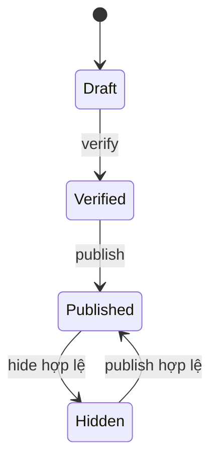

# Backoffice Management

## Mục tiêu

Backoffice là công cụ vận hành tập trung cho staff. Mỗi khu vực cần Bearer authentication và permission riêng; UI claims chỉ quyết định visibility, backend vẫn kiểm quyền. Mutation dùng CSRF, rate limit và optimistic concurrency ở aggregate có stamp.

## Boundary

Tất cả route management yêu cầu authenticate; từng action có policy cụ thể. Management mutations dùng `ValidateAntiForgeryToken` và `ManagementMutation` rate limit. Read route không cần CSRF. Permission matrix trong file này là contract cho Agent ngoài; role name phía client không thay thế policy.

## Nghiệp vụ và route

| Domain | Route nhóm | Fact quan trọng |
| --- | --- | --- |
| Producer | `/api/v1/management/producers` | CRUD, verify/publish/hide, contact/facility; policy `Producers.*` |
| Inventory | `/management/inventory` | level, movement, location, initialize/adjust; dùng variant + location và reload level/movement sau timeout |
| Orders | `/management/orders` | list/detail/analytics, confirm/cancel, verify/refund, shipment lifecycle, receive return, note |
| Dashboard | `GET /management/dashboard/overview` | cần `Orders.Read` |
| Settings/audit/security | `/management/settings`, `audit-logs`, `security/sessions`, `security/events` | settings có concurrency stamp; session revoke là mutation |
| Payment reconcile | `GET /management/payments/sepay/reconciliation` | cần `Payments.Verify` |

## Producer workspace

Producer có `PublicStatus` (`Draft`, `Verified`, `Published`, `Hidden`) và cờ `isVerified` độc lập. Product picker chỉ dùng producer `Published && isVerified=true`.

Create request gồm `code`, `name`, optional `legalName`, `description`, `websiteUrl`. Code unique/ổn định; update thêm latest `concurrencyStamp`. Verify/publish gửi stamp; hide gửi stamp + reason và bị chặn khi dependency published không cho phép.

Management detail gồm contacts và facilities. Contact có `contactType` (`Phone|Email|Zalo|Website`), value, name, public flag, order. Facility có name, optional administrative area/address/coordinates/description. Child mutation dùng `producerConcurrencyStamp`; sau mỗi child mutation phải lấy root stamp mới hoặc refetch detail. Hiện facility mới chỉ có create trong API live, không suy diễn update/delete.



## Inventory workspace

### Read models

Level list trả `inventoryItemId`, `productVariantId`, SKU/product/variant/location và `stockedQuantity`, `reservedQuantity`, `incomingQuantity`, `availableQuantity`. Movement list trả item/location/order item, movement type, delta, reason và timestamp. Location gồm code/name/address/active/stamp.

### Location

Create `{ code, name, administrativeAreaId?, addressLine? }`. Update `{ concurrencyStamp, name, administrativeAreaId?, addressLine?, isActive }`; code không đổi. Inactive location không được dùng cho operation mới.

### Initialize và adjust

Initialize `{ productVariantId, stockLocationId, requiresShipping }` tạo InventoryItem nếu cần và zero-balance level. Duplicate item-location trả conflict. Nó không nhập tồn ban đầu.

Adjust:

```json
{
  "inventoryItemId": "uuid",
  "stockLocationId": "uuid",
  "quantityDelta": 25,
  "reason": "Kiểm kê đầu kỳ"
}
```

Delta khác 0, positive/negative trong giới hạn validator. Backend lock level, cập nhật balance và append đúng một `Adjust` movement trong transaction. Negative delta không được làm stocked thấp hơn reserved. Movement không edit/delete.

## Order operations

`Orders.Manage` điều khiển confirm/cancel/note; `Payments.Verify` xác nhận chuyển khoản, `Payments.Refund` hoàn tiền; `Shipments.Manage` điều khiển prepare/start/complete/delivery-failed; `Inventory.Adjust` receive return. Các lệnh phải đi theo state hiện tại server trả về, không chuyển trạng thái bằng cách patch enum từ UI.

## Inventory operations

`POST /levels` là initialize, `POST /levels/adjustments` là movement điều chỉnh. Sau network timeout, lấy lại `levels` và `movements` trước khi gửi thêm command; không retry mù vì mutation có thể đã được commit. Giá/stock đều variant-based.

## Dashboard và analytics

`GET /management/dashboard/overview` nhận `from`, `to`, `granularity`, `topLimit` và trả snapshot về orders, catalog, producers, inventory, users cùng generated time. Handler yêu cầu đồng thời `Orders.Read`, `CatalogProducts.Read`, `Inventory.Read`, `Producers.Read` và `User.Read`; chỉ có một quyền là chưa đủ. `GET /management/orders/analytics/overview` trả KPI, time series, status breakdown, payment-method cash breakdown và top products. Khoảng thời gian/range được validator giới hạn; số liệu là server aggregation, UI không cộng lại từ page hiện tại.

## Settings

Typed setting live hiện chỉ là phí giao hàng chuẩn:

```json
{ "standardFeeVnd": 30000, "concurrencyStamp": null }
```

GET trả `standardFeeVnd`, `exists`, optional stamp. PUT lần đầu dùng null, lần sau dùng latest stamp; valid 0–10,000,000 VND. Không xây generic JSON/key editor và không expose OTP bypass, credential, payment secret hay connection string.

## Audit và security operations

- Audit list: actor, action, entity name/id, correlation và occurred time. Không phải order timeline và có thể chưa cover mọi mutation.
- Session list: user/client/device-safe facts, revoked/expiry; không lộ refresh token/security stamp/raw IP.
- Revoke session: `{ reason }`, permission `security.sessions.revoke`; revoke refresh tokens thuộc session.
- Security event list: event type, risk, success và safe metadata projection; không dùng response để fingerprint người dùng.

## Permission matrix

| Khu vực | Permissions |
| --- | --- |
| Producer | `producers.read/create/update/verify/publish` |
| Catalog | `catalog.products.*`, `catalog.categories.*` |
| Inventory | `inventory.read`, `inventory.adjust`, `inventory.locations.manage` |
| Orders | `orders.read`, `orders.manage` |
| Payment/Shipment | `payments.verify/refund`, `shipments.manage` |
| System | `settings.read/update`, `audit.read`, `security.sessions.read/revoke`, `security.events.read` |

## Error/retry

400 validation; 401 login/refresh; 403 missing policy; 404 entity/child scope; 409 duplicate code/stale stamp; 422 lifecycle/stock/dependency guard. Sau timeout của adjustment/order/payment action, reload authoritative read model trước khi quyết định gửi lại.

## Source map

`ManagementOrdersController.cs`, `ManagementInventoryController.cs`, `ManagementProducersController.cs`, `ManagementSystemController.cs`, `ManagementDashboardController.cs`, `ManagementSePayPaymentsController.cs`.

Source map là provenance tùy chọn, không bắt buộc để hiểu contract trên.
