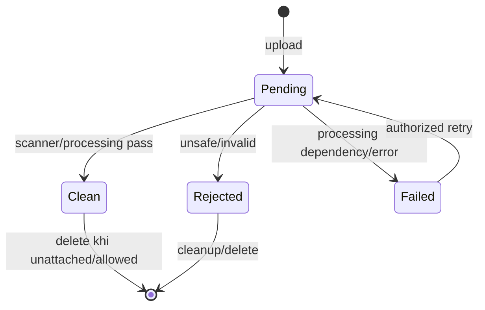

# Media upload và Product image

## Mục tiêu và trust boundary

Media tiếp nhận file không tin cậy, lưu metadata, scan/validate rồi mới cho phép dùng công khai. `MediaAsset` là file lifecycle; `ProductMedia` là quan hệ business. Upload thành công chỉ tạo asset Pending, không tự tạo URL public hoặc gắn Product.

## Contract hiện có

`POST /api/v1/media` yêu cầu auth, policy `Media.Upload`, multipart/form-data và giới hạn request 10 MiB. V1 chỉ chấp nhận `Intent = ProductImage`; file rỗng hoặc intent khác trả `400`. Thành công trả `201` cùng `MediaAssetResult`.

Multipart fields: `file`, `intent=ProductImage`, optional `altText`. Server kiểm size, extension/MIME/signature và policy. Không gửi base64/remote URL thay file. Response data gồm asset `id`, original name, content type, size, media type, visibility, scan status và intended visibility; không coi URL là sẵn có.

Các route metadata/retry/delete là `GET /media/{id}`, `POST /media/{id}/retry-scan`, `DELETE /media/{id}` với policy Media tương ứng. Retry scan cần CSRF. Upload thành công không đồng nghĩa asset đã được phép public hoặc đã gắn Product: phải đọc metadata/scan status, sau đó attach thông qua Catalog Product API.

Ownership áp dụng cho uploader hoặc privileged media manager theo contract. Delete asset đang được Product tham chiếu phải bị chặn (`MEDIA_IN_USE`/conflict semantics). Arbitrary GUID không cấp quyền đọc private metadata.

## Vòng đời đúng

Upload → `MediaAsset`/scan processing → kiểm tra metadata/status → attach ProductMedia → có thể đặt primary/reorder/caption/remove. Không dùng URL client tự cung cấp để coi là trusted asset.

`Clean + Public` mới đủ điều kiện làm public product image. Failed không đồng nghĩa infected; UI hiển thị retry/ops message. Rejected không được attach/publish. Worker/storage availability là runtime dependency riêng.

## Attach vào Product

1. Upload asset.
2. Poll `GET /media/{id}` đến terminal/usable state, không poll vô hạn.
3. `POST /catalog/products/{productId}/media` với product stamp, mediaAssetId, display order, primary flag và caption.
4. Dùng stamp trả về cho update caption/order, set primary hoặc remove.
5. Public product chỉ trả media có visibility/scan/url hợp lệ.

## Security và vận hành

- Không log raw bytes, base64, SAS URL, secret hoặc full private metadata.
- Storage key do server sinh; không tin filename làm path.
- Production object storage/private access policy phải được xác minh riêng.
- Scanner unavailable không được giả thành Clean trong production.
- Background worker phải idempotent; crash giữa storage và DB cần compensation/reconciliation.
- Storefront cần placeholder khi public URL null/403/404; build pass không chứng minh Blob anonymous/CDN retrieval.

## Source map

`Presentation/Ecom.API/Controllers/V1/MediaController.cs`, `Core/Ecom.Application/Common/Services/MediaUploadOrchestrator.cs`, `Infrastructure/Ecom.Infrastructure/Services/MediaProcessingWorker.cs`.
